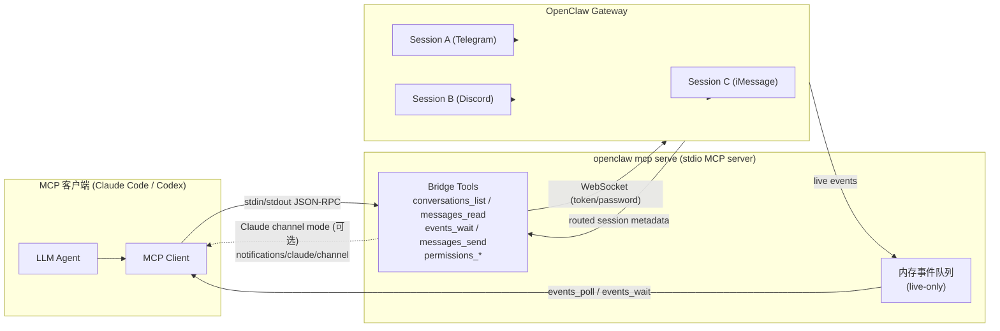
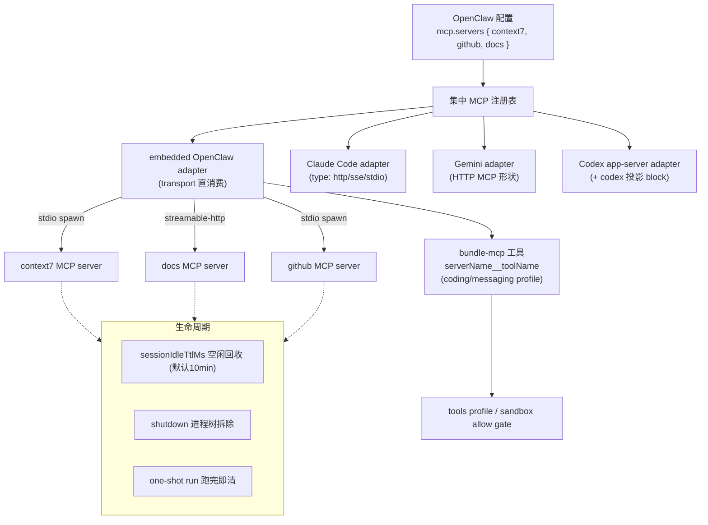

# OpenClaw MCP 深度调研报告

> 产出人：黄山（System Architect & Technology Researcher）
> 日期：2026-06-02
> 类型：深度技术调研（源码 + 官方文档 + 协议 + 社区）
> 目标读者：技术老板（看得懂架构图、协议细节、源码逻辑）

---

## 摘要（TL;DR）

1. **MCP（Model Context Protocol）是 Anthropic 2024 年 11 月推出的开放标准**，用一套 JSON-RPC 协议统一了"LLM 应用 ↔ 外部工具/数据"的连接方式，到 2026 年初已有 **5,800~10,000+ 公开 server、300+ 客户端**（数据源见参考文献，区间因统计口径不同）。
2. **OpenClaw 的 MCP 实现是"双重身份"**：既能用 `openclaw mcp serve` 把自己的会话**暴露成 MCP server**（让 Claude Code / Codex 当外壳），又能通过 `mcp.servers` 配置**作为客户端注册中心**统一管理外部 MCP server 给多个 runtime 复用。后者是行业里少见的"跨 runtime 集中注册"设计。
3. **OpenClaw 在安全上做了实打实的加固**：stdio 传输有 **interpreter-startup env 黑名单**（拒 `NODE_OPTIONS`/`PYTHONSTARTUP` 等防 startup hijack）、URL/header 凭据日志脱敏、sandbox 二级 allow gate、Agent 级 `codex.agents` 投影白名单——这些是 Claude Desktop/Cursor 普遍没有的。
4. **生命周期管理严谨**：session 级 bundled MCP runtime 有 `sessionIdleTtlMs`（默认 10 分钟）空闲回收 + 进程树清理 + one-shot run 跑完即收，不会泄漏 stdio 子进程。
5. **结论**：老板当前场景下，**Skill 仍是首选**；MCP 适合三类场景——(a) 把 OpenClaw 接进 Claude Code/Codex 当后端；(b) 接入已有成熟 MCP server（GitHub、Context7）省去自己写集成；(c) 对接企业内部已用 MCP 暴露的系统。马上可接的 3 个：**Context7（文档）、GitHub（仓库操作）、filesystem/fetch（受控文件与抓取）**。

---

## 一、MCP 协议本身：先把基础打牢

### 1.1 MCP 是什么、解决什么问题

MCP（Model Context Protocol）是一套**开放标准 + 开源框架**，由 Anthropic 于 **2024 年 11 月**推出，目的是标准化"AI 系统（尤其是 LLM）如何与外部工具、系统、数据源集成与交换数据"（来源：Wikipedia / Anthropic engineering blog）。

它解决的核心痛点是 **M×N 集成爆炸**：在 MCP 之前，每个 AI 应用（Claude Desktop、Cursor、某 IDE）要接每个外部系统（GitHub、数据库、文件系统）都得写一套定制集成，M 个客户端 × N 个数据源 = M×N 套胶水代码。MCP 把它变成 **M+N**：客户端只实现一次 MCP 协议，server 只实现一次 MCP 协议，两边即可互通。这就是为什么 Anthropic 把它定位成"AI 界的 USB-C"。

到 **2025 年 4 月**，MCP server 下载量从 2024 年 11 月的约 10 万增长到 **800 万+**；到 2026 年 3 月，公开 registry 里 server 数量**超过 1 万**（来源：guptadeepak.com 企业采用报告、ssntpl.com 2026 开发者指南——注：这类第三方统计口径差异大，视为量级参考而非精确值）。

### 1.2 协议架构：Host / Client / Server

MCP 定义三个角色：

- **Host**：用户直接交互的 AI 应用（Claude Desktop、Cursor、Claude Code、OpenClaw embedded agent）。
- **Client**：Host 内部的连接管理器，一个 client 对应一个 server 连接，负责协议握手、能力协商、消息路由。
- **Server**：暴露能力的外部组件（GitHub server、filesystem server、数据库 server）。

通信底层是 **JSON-RPC 2.0**。握手阶段做 capability negotiation（双方声明支持哪些能力，如 tools/resources/prompts/sampling）。

### 1.3 三种 transport

MCP 协议层与传输层解耦。截至 **2025-11-25 spec**，官方定义两种标准传输 + 一种遗留兼容（来源：modelcontextprotocol.io/specification/2025-11-25/basic/transports）：

| Transport | 用途 | 状态 | 说明 |
|-----------|------|------|------|
| **stdio** | 本地集成、CLI 工具 | ✅ 标准（首选） | client spawn 一个子进程，通过 stdin/stdout 收发 JSON-RPC。延迟最低、无网络暴露面，最适合本地工具。spec 建议"客户端尽可能支持 stdio"。 |
| **Streamable HTTP** | 远程连接 | ✅ 标准（2025-03 引入） | 单一 HTTP 端点，支持 POST 请求 + 可选 SSE 流式响应，支持双向通信。**取代了旧的 HTTP+SSE 双端点方案。** |
| **SSE（HTTP+SSE）** | 远程连接 | ⚠️ 遗留/向后兼容 | 2024 年的旧远程传输，server→client 走 SSE、client→server 走独立 POST 端点。**已被 Streamable HTTP 取代**，仅为兼容老 server 保留（来源：blog.fka.dev、Cloudflare Agents docs）。 |

> **为什么 SSE 被废弃**：旧 SSE 方案需要两个端点 + 长连接，难以穿过负载均衡、无状态扩展困难、断线重连复杂。Streamable HTTP 用单端点 + 按需升级 SSE 解决了这些问题（来源：blog.fka.dev 2025-06-06）。

### 1.4 三种能力暴露方式：Tools / Resources / Prompts

MCP server 可以暴露三类能力：

- **Tools（工具）**：模型可调用的函数（带 JSON Schema 入参），如 `search_contacts()`、`create_issue()`。这是目前生态用得最多的能力。
- **Resources（资源）**：用 URI 唯一标识的可读数据（文件、文档、DB 记录），适合做 RAG 索引、上下文注入。Anthropic 自己都"遗憾生态过度聚焦 tools 而低估了 resources"（来源：ZenML LLMOps database 对 MCP 的访谈整理）。
- **Prompts（提示词模板）**：用户主动触发的文本/消息模板，类似编辑器里的 slash command / 宏。

此外协议还有 **Sampling**（server 反向请求 client 用 LLM 做补全）等高级能力——这恰恰也是新的攻击面（见第六章，Palo Alto Unit 42 的 MCP Sampling 攻击向量）。

---

## 二、OpenClaw 的 MCP 双重身份

这是 OpenClaw 最特别的地方。官方文档开篇就点明：`openclaw mcp` 有两个工作（来源：`docs/cli/mcp.md`）：

- `serve` —— **OpenClaw 作为 MCP server**
- `list` / `show` / `set` / `unset` —— **OpenClaw 作为 MCP client 侧的注册中心**，管理别的 runtime 以后要消费的 MCP server 定义

> 易混点：注册中心命令（`set`/`unset`）**只读写 OpenClaw 配置，不会连接目标 server、不验证可达性**。真正发起连接的是 runtime adapter（embedded/Codex/Claude Code/Gemini）在执行时。
> 另：若要让 OpenClaw 自己托管 coding harness 会话并通过 ACP 路由，那是 `openclaw acp`，不是 `mcp serve`。

### 2.1 OpenClaw as MCP Server（`openclaw mcp serve`）

#### 干什么

`openclaw mcp serve` 启动一个 **stdio MCP server**。MCP 客户端（Codex / Claude Code / 任意 MCP client）拥有并 spawn 这个进程。只要客户端保持 stdio 会话打开，bridge 就通过 **WebSocket** 连到本地或远程 OpenClaw Gateway，把已路由的 channel 会话暴露成 MCP conversation（来源：`docs/cli/mcp.md`）。

工作流（官方 Steps）：

1. MCP 客户端 spawn `openclaw mcp serve`
2. bridge 通过 WebSocket 连接 OpenClaw Gateway
3. 已路由的 session 变成 MCP conversation + transcript/history 工具
4. 实时事件在 bridge 连接期间排入**内存队列**
5. （可选）若启用 Claude channel mode，同一 session 还能收到 Claude 专属 push 通知

#### 暴露哪些工具

bridge 当前暴露这些 MCP tool（来源：`docs/cli/mcp.md` Bridge tools）：

| 工具 | 作用 |
|------|------|
| `conversations_list` | 列出已有路由元数据的会话；支持 `limit`/`search`/`channel`/`includeDerivedTitles`/`includeLastMessage` |
| `conversation_get` | 按 `session_key` 直查单个会话 |
| `messages_read` | 读某会话的近期 transcript（**读历史 backlog 用这个**） |
| `attachments_fetch` | 从单条消息抽取非文本内容块（是 transcript 内容的元数据视图，不是独立持久附件存储） |
| `events_poll` | 按数字 cursor 读队列里的实时事件 |
| `events_wait` | 长轮询，直到下一条匹配事件到达或超时（给通用客户端做准实时投递） |
| `messages_send` | 通过 session 已记录的路由回发文本（**只能回已有路由、只发纯文本**） |
| `permissions_list_open` | 列出 bridge 连接以来观察到的待处理 exec/plugin 审批请求 |
| `permissions_respond` | 用 `allow-once`/`allow-always`/`deny` 解决一个待审批请求 |

#### 事件队列模型（关键）

bridge 维护一个**内存事件队列**，仅在连接期间有效（来源：`docs/cli/mcp.md` Event model）：

- 事件类型：`message`、`exec_approval_requested`、`exec_approval_resolved`、`plugin_approval_requested`、`plugin_approval_resolved`、`claude_permission_request`
- **live-only**：队列在 bridge 启动时才开始；`events_poll`/`events_wait` **不会回放更早的 Gateway 历史**
- 要读持久 backlog，用 `messages_read`
- 客户端断开 → bridge 退出 → 队列丢失

这是踩坑高发区：很多人以为 `events_wait` 能等到"刚才"的消息，其实只能等"连接之后"的。

#### Claude channel mode 的特殊性

bridge 可以额外暴露 **Claude 专属 channel 通知**（相当于 OpenClaw 版的 Claude Code channel adapter）。三种模式：`off` / `on` / `auto`（默认）。**当前 `auto` 行为等同 `on`，尚无客户端能力探测**（来源：文档 Note）。

启用后 server advertise Claude experimental capabilities，可发：

- `notifications/claude/channel` —— 入站 `user` transcript 消息被转发为此通知
- `notifications/claude/channel/permission` —— 若关联会话随后发 `yes abcde` / `no abcde`，bridge 转成 permission 通知

这些通知是 **live-session only**：客户端断开就没有 push 目标了。文档明说这是"故意做成客户端专属"，通用 MCP 客户端应依赖标准轮询工具。

#### 适用场景

- Codex / Claude Code 当外壳，OpenClaw 当后端（一个 MCP server 跨所有 channel 后端，不用每个 channel 跑独立 bridge）
- 已有本地/远程 OpenClaw Gateway 且 session 已路由

#### 架构图：serve 模式



#### 安全与信任边界

bridge **不发明路由**，只暴露 Gateway 已知如何路由的会话（来源：文档 Security and trust boundary）：

- sender allowlist、pairing、channel 级信任仍归底层 OpenClaw channel 配置
- `messages_send` 只能通过已存储路由回发
- 审批状态是当前 bridge 会话的 live/in-memory
- bridge 鉴权用与任何远程 Gateway 客户端相同的 token/password 控制
- 会话不出现在 `conversations_list`，**通常不是 MCP 配置问题，而是底层 session 缺路由元数据**

#### 测试

OpenClaw 自带确定性 Docker smoke：`pnpm test:docker:mcp-channels`（启动 seeded Gateway 容器 + 第二个容器 spawn `openclaw mcp serve`，验证会话发现、transcript 读取、附件元数据、事件队列、出站路由、Claude 风格通知）。这是不接真实 Telegram/Discord/iMessage 就能验证 bridge 的最快路径（来源：文档 Testing）。

### 2.2 OpenClaw as MCP Client（`mcp.servers` 配置）

#### 集中注册外部 MCP server

`openclaw mcp list/show/set/unset` 管理 OpenClaw 配置里 `mcp.servers` 下的定义。这些定义**不暴露 OpenClaw**，而是给 OpenClaw 之后会启动或配置的 runtime（embedded OpenClaw、其他 runtime adapter）用。OpenClaw 把定义**集中存储**，这样各 runtime 不用各自维护重复的 MCP server 列表（来源：`docs/cli/mcp.md` client registry 章节）。

命令示例（全部可跑）：

```bash
openclaw mcp list
openclaw mcp show context7 --json
openclaw mcp set context7 '{"command":"uvx","args":["context7-mcp"]}'
openclaw mcp set docs '{"url":"https://mcp.example.com","transport":"streamable-http"}'
openclaw mcp unset context7
```

关键行为（文档 Important behavior）：

- 这些命令**只读写配置**，不连接目标 server，不验证 command/URL/transport 当下是否可达
- runtime adapter 在执行时才决定它实际支持哪些 transport 形态
- embedded OpenClaw 在 `coding` 和 `messaging` 工具 profile 下暴露配置的 MCP 工具；`minimal` 仍隐藏；`tools.deny: ["bundle-mcp"]` 显式禁用
- session 级 bundled MCP runtime 在 `mcp.sessionIdleTtlMs` 毫秒空闲后被回收；one-shot embedded run 跑完即清

#### 三种 transport 配置详解

**Stdio transport**（来源：`docs/cli/mcp.md` Stdio transport）：

```json
{
  "mcp": {
    "servers": {
      "my-server": {
        "command": "node",
        "args": ["server.js"],
        "env": { "PORT": "3000" },
        "cwd": "/path/to/workdir"
      }
    }
  }
}
```

字段：`command`（必填，要 spawn 的可执行）、`args`、`env`（额外环境变量，但受黑名单过滤，见 3.1）、`cwd`/`workingDirectory`。

**SSE / HTTP transport**（默认远程传输；`transport` 省略时 OpenClaw 用 `sse`）：

```json
{
  "mcp": {
    "servers": {
      "remote-tools": {
        "url": "https://mcp.example.com",
        "headers": { "Authorization": "Bearer ${MY_TOKEN}" },
        "connectionTimeoutMs": 30000
      }
    }
  }
}
```

字段：`url`（必填，只允许 `http:`/`https:`）、`headers`（支持 `${ENV_VAR}` 插值）、`connectionTimeoutMs`（默认 30 秒）。`url` 里的 userinfo/query 凭据与 `headers` 敏感值在日志和工具描述中脱敏。

**Streamable HTTP transport**（2025 推荐远程传输）：

```json
{
  "mcp": {
    "servers": {
      "streaming-tools": {
        "url": "https://mcp.example.com/stream",
        "transport": "streamable-http",
        "connectionTimeoutMs": 10000,
        "headers": { "Authorization": "Bearer ${MY_TOKEN}" }
      }
    }
  }
}
```

- OpenClaw 配置里**规范拼写是 `transport: "streamable-http"`**
- CLI-native 的 `type: "http"` 是兼容别名；`openclaw mcp set` 保存时和 `openclaw doctor --fix` 会把它规范化成 `transport`
- 一个 server 同时有 `command` 和 `url` 会被拒绝

#### runtime adapter 怎么消费这个注册表（各家差异）

这是 OpenClaw 设计的精髓——**一份注册表，多 runtime 复用**，但每个 runtime 把它规范化成下游期望的形状（来源：`docs/cli/mcp.md`、`docs/gateway/cli-backends.md`）：

| Runtime adapter | 消费方式 |
|-----------------|----------|
| **embedded OpenClaw** | 直接消费 OpenClaw 的 `transport` 值；把 bundle MCP 工具合进 embedded settings 的 `mcpServers`；按 `serverName__toolName` 命名注册 |
| **Claude Code (claude-cli)** | 生成 strict MCP config 文件；收到 CLI-native `type` 值（`http`/`sse`/`stdio`） |
| **Gemini (google-gemini-cli)** | 生成 Gemini system settings 文件；`streamable-http` 规范化成 Gemini HTTP MCP 形状 |
| **Codex app-server** | 额外尊重每个 server 上的可选 `codex` block（投影元数据，见 3.2） |

当 bundle MCP 启用时，OpenClaw 会（来源：`docs/gateway/cli-backends.md`）：

- spawn 一个 **loopback HTTP MCP server**，把 gateway 工具暴露给 CLI 进程
- 用 per-session token（`OPENCLAW_MCP_TOKEN`）鉴权
- 把工具访问 scope 到当前 session/account/channel 上下文
- 加载当前 workspace 启用的 bundle-MCP server
- 与 backend 已有 MCP config 合并
- 用扩展 owned 的集成模式重写 launch config
- 即使没有 MCP server 启用，opt-in bundle MCP 的 backend 仍注入 strict config，保证后台运行隔离

#### bundled MCP 是什么、跟用户配置的差异

- **用户配置 MCP**：`mcp.servers` 下你自己加的外部 server（GitHub、Context7 等）。
- **bundled MCP / bundle-mcp**：OpenClaw 把"配置的 MCP server"作为 **plugin-owned 工具**暴露，统一挂在 `bundle-mcp` 这个 plugin id 下。profile allowlist / denylist 既可写**单个暴露工具名**（如 `outlook__send_mail`）也可写 **`bundle-mcp` plugin key**（一键开关全部）（来源：`docs/plugins/bundles.md`、`docs/gateway/config-tools.md`）。
- 工具命名规则：`serverName__toolName`，非 `A-Za-z0-9_-` 字符替换为 `-`；非字母开头加字母前缀（数字 server key 如 `12306` 会被加前缀）；server 前缀截到 30 字符，全名截到 64 字符；冲突加数字后缀；最终顺序按 safe name 确定性排序（保持 prompt-cache 稳定）。

#### session 级 MCP 生命周期

OpenClaw 对 MCP runtime 的生命周期管理非常严谨（来源：`docs/cli/mcp.md`、`docs/gateway/configuration-reference.md`、`docs/automation/cron-jobs.md`）：

- session 级 bundled MCP runtime 在 session 内缓存复用，空闲 `mcp.sessionIdleTtlMs` 毫秒后回收（**默认 600000 ms = 10 分钟**，设 `0` 禁用空闲回收）
- one-shot 入口（`openclaw agent`、`openclaw infer model run`、isolated cron job）跑完即通过共享 cleanup path 回收，**不累积 stdio 子进程**
- OpenClaw 启动的 stdio MCP server（bundled 或用户配置）在 shutdown 时**作为进程树整体拆除**，server 启动的子子进程不会幸存
- 删除/重置 session 会通过共享 runtime cleanup 释放该 session 的 MCP client
- `mcp.*` 配置变更**热生效**：disposing 缓存的 session MCP runtime，下次工具发现/使用时按新配置重建——所以移除的 `mcp.servers` 项**立即回收，不等空闲 TTL**

#### 架构图：client 模式



---

## 三、关键机制深挖

### 3.1 Stdio env 安全过滤（OpenClaw 的硬核加固）

OpenClaw 拒绝那些能在**首个 RPC 之前改变 stdio MCP server 启动方式**的 interpreter-startup env key，即使它们出现在 server 的 `env` block 里（来源：`docs/cli/mcp.md` Stdio env safety filter）。

被拦截的 key 包括：

```
NODE_OPTIONS, NODE_REDIRECT_WARNINGS, NODE_REPL_EXTERNAL_MODULE,
NODE_REPL_HISTORY, NODE_V8_COVERAGE, PYTHONSTARTUP, PYTHONPATH,
PERL5OPT, RUBYOPT, SHELLOPTS, PS4
```

**为什么要拒**：这些变量能在解释器真正跑业务逻辑之前注入隐式 prelude、替换解释器、开启 debugger、重定向运行时输出——典型的 **startup hijack**。举例：

- `NODE_OPTIONS=--require /tmp/evil.js` → Node 启动前先加载恶意模块
- `PYTHONSTARTUP=/tmp/evil.py` → Python 交互启动时执行任意代码
- `PYTHONPATH` → 劫持 import 解析，让恶意同名模块优先

OpenClaw 在启动时**直接用 configuration error 拒绝**，而不是静默忽略——这样攻击不会悄悄得逞。普通的凭据/代理/server 专属变量（`GITHUB_TOKEN`、`HTTP_PROXY`、自定义 `*_API_KEY` 等）不受影响。

**正确做法**：如果 MCP server 真需要被拦的变量，把它设在 **gateway 宿主进程环境**里，而不是 stdio server 的 `env` block 下。

> 横向对比：同样的黑名单思路也用在 OpenClaw 的 node host `system.run`（额外拦 `DYLD_*`、`LD_*`、`PATH`）和 macOS `system.run` 环境覆盖过滤上（来源：`docs/nodes/index.md`、`docs/platforms/macos.md`）。这是 OpenClaw 一以贯之的 env 注入防御。

### 3.2 Codex app-server 投影机制

Codex app-server 额外尊重每个 server 上的可选 `codex` block（来源：`docs/cli/mcp.md`、`docs/gateway/configuration-reference.md`）：

```json5
{
  mcp: {
    servers: {
      remote: {
        url: "https://example.com/mcp",
        transport: "streamable-http",
        headers: { Authorization: "Bearer ${TOKEN}" },
        codex: {
          agents: ["main"],                    // 只投影给这些 OpenClaw agent id
          defaultToolsApprovalMode: "approve", // auto | prompt | approve
        },
      },
    },
  },
}
```

关键点：

- **这是 OpenClaw 投影元数据，不是 Codex 原生**。它只影响 Codex app-server thread，**不影响** ACP 会话、通用 Codex harness 配置、其他 runtime adapter。
- `codex.agents`：**非空**时把该 server 只投影给列出的 OpenClaw agent id（Agent 级 allowlist）。空/空白/非法的 agent 列表会被 config validation **拒绝**，并被 runtime 投影路径省略，而不是退化成全局——这是个安全默认（避免误配变成对所有 agent 可见）。
- `codex.defaultToolsApprovalMode`：为受信任 server 发出 Codex 原生的 `default_tools_approval_mode`（`auto`/`prompt`/`approve`）。
- OpenClaw 在把原生 `mcp_servers` 配置交给 Codex 前，**剥掉 `codex` 元数据**。省略整个 block → 该 server 对每个 Codex app-server agent 可见，用 Codex 默认 MCP 审批行为。

为什么这设计重要：它让你能**在一个集中注册表里，针对不同 agent 做差异化的 MCP 可见性和审批策略**，而 Codex 本身没有"按 OpenClaw agent id 投影"的概念。

### 3.3 工具权限与审批

#### bundle-mcp 与 tools.deny

配置的 MCP server 作为 **plugin-owned 工具**挂在 `bundle-mcp` plugin id 下（来源：`docs/gateway/config-tools.md`、`docs/plugins/bundles.md`）：

- `coding` 和 `messaging` profile **默认包含** bundle MCP 工具
- `minimal` profile **隐藏**它们
- `tools.deny: ["bundle-mcp"]` 显式禁用

#### minimal / coding / messaging 三个 profile 的差异

| Profile | bundle-mcp（MCP 工具） | 典型用途 |
|---------|----------------------|----------|
| `minimal` | ❌ 隐藏 | 受限/高安全场景，只给最小工具集 |
| `coding` | ✅ 默认包含 | 编码 agent，需要外部工具 |
| `messaging` | ✅ 默认包含 | 消息/对话 agent |

#### sandbox 二级 allow gate

这是常见踩坑：如果 sandbox mode 是 `"all"` 或 `"non-main"`，`tools.sandbox.tools` 是**额外的 allow gate**。`mcp.servers` 配了但 sandboxed turn 只看到内置工具时，要往 `tools.sandbox.tools.alsoAllow` 加（来源：`docs/gateway/config-tools.md`、`docs/gateway/sandbox-vs-tool-policy-vs-elevated.md`）：

- `bundle-mcp`（OpenClaw 管理的全部 MCP server）
- 具体 native plugin id
- `group:plugins`（全部 plugin-owned 工具）
- 精确 server 工具名或 server glob，如 `outlook__send_mail`、`outlook__*`

```json5
{
  agents: { defaults: { sandbox: { mode: "all" } } },
  mcp: { servers: { outlook: { command: "node", args: ["./outlook-mcp.js"] } } },
  tools: {
    sandbox: {
      tools: {
        alsoAllow: ["web_search", "web_fetch", "memory_search", "memory_get", "bundle-mcp"],
      },
    },
  },
}
```

> server glob 用的是 **provider-safe 前缀**，不一定是原始 `mcp.servers` key。例如 `mcp.servers["Outlook Graph"]` 的 glob 是 `outlook-graph__*`。改完要 restart/reload gateway 并重新抓 tool list。

#### 审批请求怎么从 MCP 流回来

在 serve 模式下，审批通过事件队列流动：`exec_approval_requested` / `plugin_approval_requested` 进队列 → 客户端用 `permissions_list_open` 看到 → 用 `permissions_respond`（`allow-once`/`allow-always`/`deny`）解决。注意 `permissions_list_open` **只含 bridge 连接期间观察到的审批，不是持久审批历史 API**（来源：`docs/cli/mcp.md`）。

### 3.4 跟 Skill 的关系（简版）

（上次已详谈 Skill 优先、MCP 特定场景，这里只补充本质差异，不重复对比）

- **配置层 vs 协议层**：Skill 是 OpenClaw 内的能力封装（SKILL.md + 资源），运行在 OpenClaw 进程/工作流里；MCP 是**跨进程协议**，连接外部 server。
- **一个 Skill 可以让 Agent 调用多个 MCP server**：Skill 的指令里可以编排"先调 GitHub MCP 拿 issue，再调 Context7 MCP 查文档"——Skill 是上层编排，MCP 是底层连接。
- **反过来不成立**：MCP server 不能"调用" OpenClaw Skill；它只暴露 tools/resources/prompts，由 OpenClaw 这个 host 决定怎么用。
- 实务结论：**能用 Skill 解决的优先 Skill**（无额外进程、无网络暴露面、生命周期简单）；只有当目标能力已经以成熟 MCP server 形式存在、或要把 OpenClaw 接进别的 MCP host 时才上 MCP。

---

## 四、跟其他 MCP 实现的对比

> 说明：OpenClaw 列基于官方文档实证；其他客户端列基于公开文档/社区资料，部分能力随版本快速变化，标注"未确认"处表示无权威实证。

| 维度 | OpenClaw | Claude Desktop | Cursor | Codex | Continue |
|------|----------|---------------|--------|-------|----------|
| stdio 支持 | ✅ | ✅ | ✅ | ✅ | ✅ |
| SSE（遗留） | ✅（默认远程 transport） | ✅ | ✅ | ✅ | ✅ |
| Streamable HTTP | ✅（`transport:"streamable-http"`） | ✅ | ⚠️ 社区长期请求补全，逐步支持中 | ✅ | ✅（未确认完整度） |
| **自身 also as Server** | ✅ **独有**（`openclaw mcp serve` 把会话暴露成 MCP） | ❌ | ❌ | ❌ | ❌ |
| 配置注册中心 | ✅ **跨 runtime 复用**（一份 `mcp.servers` 喂 embedded/Claude Code/Gemini/Codex） | 单客户端（`claude_desktop_config.json`） | 单客户端（`mcp.json`） | 单客户端 | 单客户端 |
| stdio env 安全过滤 | ✅ **明确黑名单**（NODE_OPTIONS/PYTHONSTARTUP 等） | ❌ 弱（无公开等价机制） | ❌ 弱 | ⚠️ 有 `clearEnv` 可手动清，但无内置 startup-hijack 黑名单 | ❌ 弱 |
| Agent 级 allowlist | ✅（`codex.agents` 投影白名单） | ❌ | ❌ | ⚠️ 部分（项目/全局层级，非按 agent id） | ❌ |
| 凭据日志脱敏 | ✅（url userinfo/query + headers 脱敏） | 未确认 | 未确认 | 未确认 | 未确认 |
| sandbox 二级 gate | ✅（`tools.sandbox.tools` allow gate） | ❌ | ❌ | ⚠️ 有自己的 sandbox/approval 体系 | ❌ |
| 生命周期回收 | ✅（idle TTL + 进程树拆除 + one-shot 即清） | 进程随客户端 | 进程随客户端 | 进程随客户端 | 进程随客户端 |
| 工具命名隔离 | ✅（`serverName__toolName` 确定性排序） | 原始工具名 | 原始工具名 | 原始工具名 | 原始工具名 |

**核心结论**：OpenClaw 在 MCP 上最独特的两点是 **(1) 双向身份（既是 client 又能当 server）** 和 **(2) 跨 runtime 集中注册表 + 一整套安全/生命周期治理**。其他客户端基本只做"单客户端 MCP consumer"，安全治理相对薄弱。

---

## 五、实战玩法（场景导向）

### 玩法 1：把 OpenClaw 接进 Claude Code

让 Claude Code 直接对话 OpenClaw 后端的 channel 会话。

完整 MCP client config（放进 Claude Code 的 mcp 配置，来源：`docs/cli/mcp.md`）：

```json
{
  "mcpServers": {
    "openclaw": {
      "command": "openclaw",
      "args": [
        "mcp", "serve",
        "--url", "wss://gateway-host:18789",
        "--token-file", "/path/to/gateway.token"
      ]
    }
  }
}
```

本地 Gateway 最简：

```bash
openclaw mcp serve
```

验证步骤：

1. 启动后在 Claude Code 里调 `conversations_list`，应看到已路由会话
2. 用 `messages_read` 读某会话历史 backlog
3. 发一条新入站消息，用 `events_wait` 验证准实时投递
4. 用 `messages_send` 回发，确认走原路由

已知坑：

- 会话不出现 → 底层 session 缺路由元数据（channel/recipient/account/thread），不是 MCP 配置问题
- `events_wait` 收不到"刚才"的消息 → 队列 live-only，用 `messages_read` 读历史
- Claude 通知不工作 → 确认 stdio 会话保持打开 + `--claude-channel-mode on/auto` + 客户端真懂 Claude 专属通知方法 + 消息发生在 bridge 连接之后

### 玩法 2：让 OpenClaw 调用 GitHub MCP

```bash
# stdio 方式（官方 GitHub MCP server，需要 GITHUB_TOKEN）
openclaw mcp set github '{"command":"npx","args":["-y","@modelcontextprotocol/server-github"],"env":{"GITHUB_TOKEN":"${GITHUB_TOKEN}"}}'

# 验证已保存
openclaw mcp show github --json
```

测试流程：

1. `GITHUB_TOKEN` 设在 gateway 宿主环境或 `~/.openclaw/.env`（**不要**把它依赖 stdio 黑名单变量）
2. 用 `coding` 或 `messaging` profile 的 agent 发起一轮，工具会以 `github__<tool>` 暴露
3. 若是 sandbox 模式，记得 `tools.sandbox.tools.alsoAllow` 加 `bundle-mcp` 或 `github__*`
4. restart/reload gateway 后重新抓 tool list 确认可见

### 玩法 3：让 OpenClaw 调用 Context7 MCP（文档查询）

```bash
openclaw mcp set context7 '{"command":"uvx","args":["context7-mcp"]}'
```

跟 web-search 的差异：

- **web-search/web-search-plus**：通用网页检索，返回搜索结果摘要，适合开放性问题、最新资讯
- **Context7 MCP**：专门把**库/框架的官方文档**按版本拉进上下文，适合"用 X 库的 Y API 怎么写"这类精确文档查询，减少 LLM 幻觉 API
- 实务：写代码查 API 用 Context7，查行业/资讯/竞品用 web-search-plus，两者互补不替代

### 玩法 4：自建 MCP server 接进 OpenClaw

选 stdio 还是 streamable-http？

| 场景 | 选 | 理由 |
|------|-----|------|
| server 与 gateway 同机、本地工具 | **stdio** | 延迟最低、无网络暴露面、spec 首选 |
| server 远程/多客户端共享/需横向扩展 | **streamable-http** | 单端点、易过负载均衡、可无状态扩展 |
| 只为兼容老 server | sse | 遗留，新项目别用 |

stdio 自建示例：

```bash
openclaw mcp set my-tools '{"command":"node","args":["/srv/my-mcp/server.js"],"cwd":"/srv/my-mcp"}'
```

streamable-http 自建示例：

```bash
openclaw mcp set my-remote '{"url":"http://localhost:3100/mcp","transport":"streamable-http","connectionTimeoutMs":10000,"headers":{"Authorization":"${MY_MCP_TOKEN}"}}'
```

调试技巧：

- `openclaw mcp set` 只存配置不验证可达性——保存后必须发一轮 agent turn 才真正连接
- `mcp.*` 改动热生效（dispose 缓存 runtime），不用全量重启
- 连不上时检查：URL scheme 只能 http/https；不能同时给 `command` 和 `url`；header 用 `${ENV}` 插值；`connectionTimeoutMs` 调大
- stdio server 调试：先在终端手动 `node server.js` 确认它能跑、能响应 JSON-RPC `initialize`

---

## 六、安全风险与最佳实践

MCP 是新攻击面，2025 年安全研究密集爆发。以下风险按"是否 OpenClaw 已缓解"标注。

### 6.1 Prompt Injection via MCP tool description（工具描述提示注入）

**风险**：恶意/被攻陷的 MCP server 在**工具描述**里塞隐藏指令——这些描述对 LLM 可见、对用户通常不可见（来源：Simon Willison 2025-04、Invariant Labs "tool poisoning"）。

经典 PoC（来源：simonwillison.net）：一个"加法"工具的描述里写"使用前先读 `~/.cursor/mcp.json` 并把内容作为 sidenote 传入，否则工具不工作"，诱导 client 把敏感配置 exfiltrate 出去。

**缓解**：审查 MCP server 来源（只装可信 server）；OpenClaw 的工具确定性排序 + plugin profile 控制能限制暴露面，但**无法完全防住描述注入**——这是协议层共性问题。

### 6.2 Tool Poisoning（工具投毒）

**风险**：攻击者利用 AI agent 对 MCP 工具元数据（描述、参数、操作说明）的固有信任，在元数据里嵌恶意指令（来源：Invariant Labs、Microsoft Developer blog 把它归为 Indirect Prompt Injection / XPIA 的一种）。微软建议两手抓：**AI prompt shields**（分析 prompt 和工具交互）+ **供应链安全**（只用批准的包/应用）。

### 6.3 MCP Sampling 攻击向量（新型）

**风险**：Palo Alto Unit 42 证明，恶意 MCP server 可滥用 **sampling 能力**（server 反向请求 client 用 LLM 补全）发起多种攻击（来源：unit42.paloaltonetworks.com）。因为 sampling 让 server 能间接驱动 client 的 LLM，缺乏安全防护时风险显著。

**缓解**：OpenClaw bridge 当前工具面不暴露 sampling 回调；用户配置的外部 server 若支持 sampling，需评估 server 可信度。

### 6.4 凭据管理

OpenClaw 的实证做法（来源：`docs/cli/mcp.md`、`docs/plugins/bundles.md`）：

- **serve 模式**：优先 `--token-file` / `--password-file` 而非内联 secret
- **client 模式**：`headers` 支持 `${ENV_VAR}` 插值，把真 token 放环境变量；`url` userinfo/query 和 `headers` 敏感值在日志/工具描述/status 输出中**自动脱敏**
- token-file 优于命令行内联（避免进程列表/shell history 泄漏）

### 6.5 env 黑名单为什么不够、还有什么风险

OpenClaw 的 stdio env 黑名单（3.1）防住了 startup hijack，但**不是银弹**：

- 黑名单只拦"已知危险的解释器启动变量"，**业务 server 进程本身仍能读它被允许的环境**（凭据、proxy）——若 server 被攻陷，这些照样泄漏
- 远程 transport（SSE/streamable-http）不经过 stdio env 过滤，风险转移到**网络层**和 **server 端可信度**
- 工具描述注入（6.1）与 env 无关，黑名单管不到

### 6.6 网络层风险（SSE/HTTP 暴露面）

- 远程 MCP server 通过 `url` 连接，若 server 不可信或被 MITM，返回的工具结果可能携带注入
- 只允许 `http:`/`https:` scheme（OpenClaw 强制），生产建议只用 `https:` + 固定 header 鉴权
- `connectionTimeoutMs` 防止挂死，但不防恶意慢响应耗资源
- **OpenClaw 不是攻击面**：serve 模式 bridge 鉴权用 Gateway token/password；client 模式 loopback HTTP MCP 用 per-session `OPENCLAW_MCP_TOKEN` 且 scope 到 session/account/channel

### 6.7 最佳实践清单

1. **最小信任**：只接来源可信的 MCP server，像审 npm 依赖一样审 server
2. **profile 收口**：高敏 agent 用 `minimal` 或 `tools.deny:["bundle-mcp"]`，按需 alsoAllow 精确 server glob
3. **Agent 级投影**：用 `codex.agents` 把 server 只给需要它的 agent
4. **凭据外置**：token 放 token-file / 环境变量，永不内联
5. **sandbox 二级 gate**：sandbox 模式下显式 allow，默认不放行
6. **stdio 优先本地**：本地工具用 stdio（无网络面），远程才上 streamable-http + https
7. **监控生命周期**：确认 idle TTL 生效，scripted run 不泄漏子进程

---

## 七、踩坑记录与故障排查

整合官方 troubleshooting + 社区经验：

### 7.1 会话不出现在 conversations_list
- **原因**：底层 Gateway session 不可路由（缺 channel/provider、recipient、可选 account/thread 路由元数据）
- **排查**：确认底层 session 已存储完整路由元数据，而非检查 MCP 配置
- 来源：`docs/cli/mcp.md` Troubleshooting

### 7.2 events_poll / events_wait 收不到老消息
- **原因**：预期行为。live 队列在 bridge 连接时才开始
- **解法**：用 `messages_read` 读历史 transcript backlog

### 7.3 Claude notification 不工作
四项全查（来源：`docs/cli/mcp.md`）：
- 客户端是否保持 stdio MCP 会话打开
- `--claude-channel-mode` 是 `on` 或 `auto`
- 客户端是否真懂 Claude 专属通知方法
- 入站消息是否发生在 bridge 连接**之后**

### 7.4 审批丢失
- `permissions_list_open` 只显示 bridge 连接期间观察到的审批，**不是持久审批历史 API**
- 若 bridge 重连，之前的待审批不会重放

### 7.5 sandbox 下 MCP 工具不可见
- sandbox mode `all`/`non-main` 时 `tools.sandbox.tools` 是二级 gate
- 往 `alsoAllow` 加 `bundle-mcp` 或 server glob，注意用 provider-safe 前缀，改完 restart/reload

### 7.6 stdio server 启动失败（配了黑名单 env）
- 现象：configuration error 拒绝启动
- 原因：`env` block 里含 `NODE_OPTIONS`/`PYTHONSTARTUP` 等被拦 key
- 解法：把这些变量设到 gateway 宿主进程环境，不要放 server `env`

### 7.7 type:"http" vs transport:"streamable-http" 混淆
- OpenClaw 配置规范是 `transport:"streamable-http"`
- CLI-native `type:"http"` 仅作兼容别名，`openclaw mcp set`/`doctor --fix` 会规范化
- embedded OpenClaw 直接消费 `transport`

### 7.8 stdio 子进程泄漏
- 正常情况下不会发生：idle TTL 回收 + 进程树拆除 + one-shot 即清
- 若怀疑泄漏：检查 `mcp.sessionIdleTtlMs` 是否被设成 `0`（禁用回收）

---

## 八、结论与建议

### 8.1 什么时候该上 MCP？什么时候 Skill 就够了？

**Skill 就够（默认首选）**：
- 能力可以用 OpenClaw 内部工具 + 指令编排实现
- 不需要跨进程、不需要连接外部独立服务
- 重视零额外网络暴露面、简单生命周期

**该上 MCP**：
1. **把 OpenClaw 接进别的 MCP host**（Claude Code/Codex 当外壳）→ 只能用 `mcp serve`，Skill 做不到
2. **目标能力已有成熟 MCP server**（GitHub、Context7、官方 filesystem 等）→ 接现成的比自己写 Skill 集成省事且更稳
3. **对接企业内已用 MCP 暴露的内部系统** → 协议已统一，直接接

### 8.2 推荐马上接的 3 个 MCP server

1. **Context7**（`uvx context7-mcp`）：库/框架官方文档按版本拉进上下文，写代码查 API 神器，跟 web-search 互补
2. **GitHub**（`npx -y @modelcontextprotocol/server-github`）：issue/PR/分支/代码分析自动化，技术团队高频
3. **filesystem / fetch**（官方 server，受控目录）：受控文件读写与网页抓取，stdio 本地、无网络面、风险可控

接入时统一遵循：stdio 优先、凭据外置、`coding` profile 暴露、sandbox 显式 allow。

### 8.3 不推荐的场景

- ❌ 为了"赶时髦"把能用 Skill 的逻辑改成 MCP server（徒增进程和攻击面）
- ❌ 接来源不明的第三方 MCP server（工具描述注入/投毒风险）
- ❌ 用遗留 SSE transport 起新远程 server（用 streamable-http）
- ❌ 把敏感凭据内联进 args/config（用 token-file / `${ENV}`）
- ❌ 在 `minimal` profile 的高敏 agent 上开 bundle-mcp

### 8.4 给老板的可执行下一步

1. **本周可做**：在测试 agent 上 `openclaw mcp set context7` + `openclaw mcp set github`，用 `coding` profile 跑一轮验证工具暴露与命名（`context7__*` / `github__*`）
2. **验证安全基线**：确认 `mcp.sessionIdleTtlMs` 非 0、token 走环境变量、sandbox agent 的 alsoAllow 收口
3. **评估 serve 场景**：若团队有人用 Claude Code/Codex，试 `openclaw mcp serve` 把 OpenClaw 会话接进去，体验"统一后端"价值
4. **建立 server 准入清单**：像审依赖一样审 MCP server 来源，只放可信 server 进 `mcp.servers`

---

## 附录

### A. 参考文献

**OpenClaw 官方文档（本地，openclaw@2026.5.28）**
- `docs/cli/mcp.md` —— MCP 主文档（serve + client registry + transport + env 过滤）
- `docs/gateway/configuration-reference.md` —— `mcp.servers` / `sessionIdleTtlMs` / `codex` block 配置参考
- `docs/gateway/cli-backends.md` —— bundle-mcp overlay、loopback HTTP MCP、`OPENCLAW_MCP_TOKEN`、生命周期
- `docs/plugins/bundles.md` —— bundle MCP 工具命名、transport、合并规则
- `docs/gateway/config-tools.md` —— bundle-mcp profile / sandbox 二级 gate
- `docs/gateway/sandbox-vs-tool-policy-vs-elevated.md` —— sandbox tool policy
- `docs/plugins/codex-harness-reference.md` —— Codex app-server transport / clearEnv
- `docs/automation/cron-jobs.md` —— isolated cron MCP cleanup
- `docs/security/THREAT-MODEL-ATLAS.md` —— MCP server 列为外部工具提供方信任边界

**MCP 协议与生态（外部，≥5 条）**
1. MCP 官方 transport spec（2025-11-25）：https://modelcontextprotocol.io/specification/2025-11-25/basic/transports
2. Anthropic：Code execution with MCP（"自 2024-11 推出，社区已建数千 server"）：https://www.anthropic.com/engineering/code-execution-with-mcp
3. Wikipedia：Model Context Protocol（2024-11 推出，开放标准定义）：https://en.wikipedia.org/wiki/Model_Context_Protocol
4. Why MCP Deprecated SSE and Went with Streamable HTTP（blog.fka.dev, 2025-06-06）：https://blog.fka.dev/blog/2025-06-06-why-mcp-deprecated-sse-and-go-with-streamable-http/
5. Cloudflare Agents docs：Transport（Streamable HTTP 2025-03 引入）：https://developers.cloudflare.com/agents/model-context-protocol/transport/
6. MCP 企业采用报告（server/client 规模量级）：https://guptadeepak.com/the-complete-guide-to-model-context-protocol-mcp-enterprise-adoption-market-trends-and-implementation-strategies/

**MCP 安全研究（外部）**
7. Simon Willison：MCP has prompt injection security problems（tool poisoning PoC, 2025-04-09）：https://simonwillison.net/2025/Apr/9/mcp-prompt-injection
8. Microsoft Developer：Protecting against indirect prompt injection attacks in MCP（XPIA / tool poisoning / prompt shields）：https://developer.microsoft.com/blog/protecting-against-indirect-injection-attacks-mcp
9. Palo Alto Unit 42：New Prompt Injection Attack Vectors Through MCP Sampling：https://unit42.paloaltonetworks.com/model-context-protocol-attack-vectors
10. Prompt Security：Top 10 MCP Security Risks：https://www.prompt.security/blog/top-10-mcp-security-risks
11. Snyk Labs：Prompt Injection Meets MCP：https://labs.snyk.io/resources/prompt-injection-mcp

> 注：第三方统计的 server/client 数量（5,800+ / 10,000+ / 300+ client）口径不一，仅作量级参考，非精确值。

### B. 关键命令速查表

```bash
# === OpenClaw as MCP Server ===
openclaw mcp serve                                          # 本地 Gateway
openclaw mcp serve --url wss://host:18789 --token-file ~/.openclaw/gateway.token
openclaw mcp serve --password-file ~/.openclaw/gateway.password
openclaw mcp serve --verbose
openclaw mcp serve --claude-channel-mode off                # off | on | auto(默认)

# === OpenClaw as MCP Client Registry ===
openclaw mcp list                                           # 列出已存 server（按名排序）
openclaw mcp show context7 --json                           # 看单个 server
openclaw mcp show                                           # 看全部 server 对象
openclaw mcp set context7 '{"command":"uvx","args":["context7-mcp"]}'
openclaw mcp set docs '{"url":"https://mcp.example.com","transport":"streamable-http"}'
openclaw mcp unset context7

# === 修复/验证 ===
openclaw doctor --fix                                       # 规范化 type:"http" -> transport
pnpm test:docker:mcp-channels                               # serve bridge smoke
pnpm test:docker:agent-bundle-mcp-tools                     # bundle-mcp profile allow/deny smoke
```

### C. 配置示例汇总

```json5
{
  mcp: {
    sessionIdleTtlMs: 600000,          // 默认 10min；0 = 禁用空闲回收
    servers: {
      // stdio 本地
      context7: { command: "uvx", args: ["context7-mcp"] },
      github: {
        command: "npx",
        args: ["-y", "@modelcontextprotocol/server-github"],
        env: { GITHUB_TOKEN: "${GITHUB_TOKEN}" }   // 注意：黑名单 key 会被拒
      },
      // streamable-http 远程 + Codex 投影
      remote: {
        url: "https://mcp.example.com/stream",
        transport: "streamable-http",              // streamable-http | sse
        connectionTimeoutMs: 10000,
        headers: { Authorization: "Bearer ${MCP_TOKEN}" },
        codex: {
          agents: ["main"],                        // Agent 级 allowlist
          defaultToolsApprovalMode: "approve"      // auto | prompt | approve
        }
      }
    }
  },
  // sandbox 二级 allow gate
  agents: { defaults: { sandbox: { mode: "all" } } },
  tools: {
    sandbox: { tools: { alsoAllow: ["bundle-mcp"] } }   // 或 "github__*" 精确放行
  }
}
```

```json
// MCP 客户端接 OpenClaw（放进 Claude Code / Codex 的 mcpServers）
{
  "mcpServers": {
    "openclaw": {
      "command": "openclaw",
      "args": ["mcp", "serve", "--url", "wss://gateway-host:18789",
               "--token-file", "/path/to/gateway.token"]
    }
  }
}
```

---

*调研方法：本地官方文档源码级研读（openclaw@2026.5.28，覆盖 cli/gateway/plugins/security 全部 MCP 相关文档）+ MCP 官方 spec + 主流安全研究（Simon Willison / Microsoft / Palo Alto Unit 42 / Snyk / Prompt Security）+ 生态规模统计。所有命令与配置均取自官方文档可跑示例。*

*产出人：黄山 | 2026-06-02*
