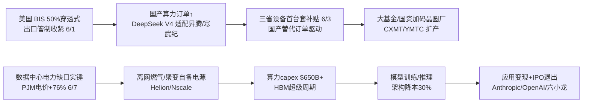

> **覆盖区间**：2026-06-02（周二）00:00 ~ 2026-06-08（周一）24:00（上海时区）
> **覆盖范围**：AI 产业链 5 层（能源 / 基础设施 / 芯片存储 / 模型框架 / 应用商业化）+ 4 横切维度（政策 / 国资 / 资金 / 人才）
> **时间窗声明**：仅收录上述自然周内的真实公开动态；区间外信息仅作背景并标注"（背景）"。所有关键数据标注来源 URL + 日期，查不到写"未公开"，绝不编造。

> **本周产业链全景**：本周资本与政策最活跃的是**应用商业化层（L5）的资本市场化**与**能源层（L1）的融资爆发**。主线一：Anthropic（6/1，约 9650 亿美元）率先机密递交 IPO，OpenAI（6/8，目标 8520 亿~1 万亿美元）紧随，SpaceX（1.75 万亿美元）冲史上最大 IPO——AI 军备竞赛从"私募融资"切换到"公开市场火力"。主线二：中国大模型集体资本化——DeepSeek 首轮募资约 74 亿美元（估值 520~590 亿美元）、Kimi 半年第三轮至 300 亿美元、智谱回 A 募 150 亿元。主线三：电力已确认为 AI 基建第一约束——聚变（Helion 4.65 亿美元 / 估值 155 亿美元）、液冷（ZutaCore 1 亿美元）融资爆发，离网燃气自备电源成刚需。**产业链联动**清晰可见："电网排队 → 自建电源（燃气/核电）→ 数据中心 → 芯片/HBM 需求 → 模型训练推理 → 应用变现 → 资本市场退出"——本周这条链的两端（能源、资本市场）最热。

## 🔥 本周 TOP 5 投资事件

> 按"对产业研判 + 一级市场机会判断的**信号价值**"排序，非新闻热度。

### 1. AI 巨头 IPO 竞赛全面引爆：Anthropic、OpenAI 先后机密递表 ｜ 2026-06-01 / 06-08

Anthropic（6/1，估值约 9650 亿美元，5 月末完成 650 亿美元私募后）率先机密递交美国 IPO，成为大模型公司"抢跑"公开市场第一家；OpenAI（6/8）确认机密递交 S-1，目标 Q4 2026 上市、估值区间 8520 亿~1 万亿美元；同期 Elon Musk 的 SpaceX 拟以 750 亿美元发行、1.75 万亿美元估值冲史上最大 IPO。Anthropic 估值在约 4 个月内从 3800 亿（2 月）翻逾 2.5 倍，Claude Code 病毒式增长是核心驱动。

↳ **投资意义**：这是一级市场**最重要的拐点信号**——AI 头部从"烧钱叙事"转向"公开市场定价"。若以近万亿估值上市成功，将为整个一级 AI 赛道提供"退出路径"与估值锚，利好 Pre-IPO 份额；但也意味着最肥的超额收益已被前轮投资者锁定，新进入者风险收益比下降。需警惕"上市即顶"——OpenAI 支出指引（2026 约 170 亿美元）远高于收入，盈利路径仍是核心拷问。[Reuters](https://www.reuters.com/technology/openai-files-us-ipo-after-anthropic-ai-giants-head-public-markets-2026-06-08/) ｜ [Anthropic IPO（Reuters）](https://www.reuters.com/business/ai-giant-anthropic-confidentially-files-us-ipo-2026-06-01/)

### 2. DeepSeek 首轮融资约 74 亿美元，估值 520~590 亿美元 ｜ 2026-06-03

DeepSeek 启动史上首轮外部融资，拟募约 500 亿元人民币（约 74 亿美元），投后估值 3500~4000 亿元（约 520~590 亿美元）。投资方阵容="国家队 + 战略产业资本"：创始人梁文锋自投约 200 亿元（占 40%），腾讯拟投 100 亿、宁德时代（CATL）拟投 50 亿；国家级 AI 基金、网易、京东在洽谈。两个月内估值近 3 倍跳升。

↳ **投资意义**：中国模型层标志性事件——曾"不需要钱"的 DeepSeek 转向大额融资，动因是 Agent 时代算力军备竞赛。**宁德时代入局信号极强**："电力即算力"被产业资本验证，利好电力设备/储能一级链。但与美厂仍有数量级差距（OpenAI 募资约 1220 亿、Anthropic 约 650 亿美元），受出口管制被迫走"国产供应链 + 本土资本 + 效率优先"路线。[路透/证券时报](https://finance.sina.cn/stock/jdts/2026-06-03/detail-iniactak2333700.d.html)

### 3. 存储超级周期三重确认：DRAM 涨价 + SK 五年产能翻倍 + NVIDIA 认证 HBM4 三大厂 ｜ 2026-06-01~06-05

TrendForce（6/1）：1Q26 常规 DRAM 合约价环比暴涨 93%~98%，存储产业营收环比 +81% 至 970 亿美元，预计 2Q26 再涨 58%~63%。SK 集团（6/2）宣布 SK 海力士未来五年晶圆产能翻倍、警告晶圆短缺持续到 2030 年，市值首破 1 万亿美元。黄仁勋（6/5）确认三星/SK海力士/美光三家均通过 Vera Rubin HBM4 认证，Rubin 机架内存成本占比较上代 +435%（摩根士丹利）。

↳ **投资意义**：存储正从"周期股"重估为"AI 驱动的成长股"，价格+产能+市值三重确认超级周期，供需缺口或持续至 2030 年。美光重回第一梯队（HBM4 份额 25~30%）是最大边际变化。一级关注 HBM 上游（先进封装/TSV/测试）、国产 DRAM（CXMT）替代。[TrendForce](https://www.trendforce.com/presscenter/news/20260601-13070.html) ｜ [财联社](https://www.cls.cn/detail/2388372)

### 4. Broadcom Q2 AI 半导体营收 108 亿美元 +143%，Q3 指引 +200% ｜ 2026-06-03

博通 Q2 FY2026 营收 222.19 亿美元（+48%），其中 AI 半导体 108 亿美元、同比暴增 143%，由定制 ASIC（为 Google TPU、Meta、字节等代设计）与 AI 网络驱动。CEO 陈福阳指引 Q3 AI 半导体同比增超 200% 至 160 亿美元。自由现金流 102.62 亿（占营收 46%）。

↳ **投资意义**：印证"超大厂自研芯片去英伟达化"主线加速兑现——定制 ASIC 增速（143%→200%）远超通用 GPU 大盘，博通是最大"卖铲人"。Q3 AI 指引 160 亿是本轮 ASIC 景气度最硬的前瞻信号。一级关注 ASIC 设计服务、Chiplet/先进封装 IP、AI 网络（以太网替代 NVLink）。[Broadcom IR](https://investors.broadcom.com/news-releases/news-release-details/broadcom-inc-announces-second-quarter-fiscal-year-2026-financial) ｜ [CNBC](https://www.cnbc.com/2026/06/03/broadcom-avgo-earnings-report-q2-2026.html)

### 5. 电力成 AI 第一约束：聚变/液冷融资爆发 + 离网燃气自备电源刚需化 ｜ 2026-06-02~06-07

能源+基础设施层本周资本密集流入：Helion（Sam Altman 背书）完成 4.65 亿美元 Series G、估值 155 亿美元（为微软 2028 供电）；Focused Energy 完成 2.4 亿美元 Series A（RWE 主投）；液冷 ZutaCore 完成 1 亿美元 Series C（三菱电机/开利/三星创投领衔）。Business Insider（6/7）量化：全美数据中心若全投运年耗电 224~359 TWh（同比 +50%），PJM 2026 Q1 批发电价同比暴涨 76%。Nscale Monarch 园区采用约 2GW 离网燃气（微软 1.35GW）。

↳ **投资意义**：电力（而非芯片）已成 AI 基建第一瓶颈，电价上涨触发监管反制（强制自建电源），反向把"离网自备电源"从经济选择变为合规刚需。确定性最高的资本流向是"卖铲子"环节：往复式燃气机组（Cat/Cummins）、电网设备、液冷——SRA 预付模式锁产能、收入可见度极高；聚变/SMR 估值已高度计入 AI 电力期权但商业化普遍 2028+。[Business Insider](https://www.businessinsider.com/us-ai-data-center-power-electricity-use-consumption-2026-6) ｜ [TechCrunch（Helion）](https://techcrunch.com/2026/06/04/helion-the-sam-altman-backed-fusion-startup-raises-465m-to-build-a-power-plant-for-microsoft/)

## 🧭 三条主线判断

**主线一 · 资本流向：从私募涌入公开市场，同时向"产业链两端"集中。** 头部（OpenAI/Anthropic/SpaceX）冲刺 IPO，标志一级超额收益向 Pre-IPO/二级倾斜；新增风险资金明显流向产业链**两端**——底层能源（聚变/液冷/燃气自备）与顶层应用资本化（中国六小龙集体上市/私募）。中段（通用基座、中间件）进入消化期。

**主线二 · 政策导向：中美"脱钩—自主"双向加速，监管基调"轻牌照、重安全/自主"。** 美国 Trump 签 EO 明确"不搞强制许可证"+ 网安导向（利好开发者估值确定性），BIS 延续 50% 穿透式出口管制；中国推进 AI 综合性立法 +"算电协同"上升国家战略 + 三省半导体设备首台套补贴。出口管制持续利好国产替代链。

**主线三 · 技术拐点：推理经济学靠"架构创新"而非"堆参数"降本，电力/人才成新瓶颈。** Nemotron 3 Ultra（Mamba-Transformer 混合/MTP/NVFP4）官称省成本 30%，微软自研 MAI 称成本效率 10x；HBM 单机价值量 +435% 抬高 BOM；顶尖 AI 人才薪酬破亿美元，人才成本成模型公司盈利路径核心变量。

---

## 🧩 产业链研判（so what 收敛层）

> 本节是给决策者的"结论"，由本周真实动态推导，区分确定性高/中/低。

### ① 本周产业链最强传导链

**链条一（中美博弈线）**：出口管制穿透收紧 → 国产芯片订单↑ → 设备补贴 → 国资加码晶圆厂 → 国产算力一级标的估值重估。【确定性 高】

**链条二（电力—资本线）**：电力缺口实锤 → 自建电源刚需 → 算力 capex 维持高位 → HBM/存储超级周期 → 模型层资本化 → IPO 退出。【确定性 高】

### ② 景气度信号

- **上行（拐点确认）**：存储/HBM（DRAM 2Q 再涨 58~63%、SK 产能五年翻倍）、定制 ASIC（博通 Q3 +200%）、能源自备电源（PJM 电价 +76%、离网燃气订单）、液冷（>4kW 芯片刚需）。【确定性 高】
- **上行（资本驱动）**：中国大模型一级估值（DeepSeek/Kimi/智谱）、聚变早期融资。【确定性 中——估值跑在基本面前面】
- **需警惕透支**：中国电力股"算电协同"主题（多股翻倍后澄清不涉算力，实际营收占比≈0）；vibe coding 估值（Lovable 120 亿美元）。【确定性 中】

### ③ 资本流向判断（A 目标）

钱本周明显向**产业链两端**集中：底层能源（聚变/液冷/燃气，确定性"卖铲子"）+ 顶层资本市场（IPO/大模型私募）。**新方向切换**：宁德时代入局 DeepSeek、运营商投 Kimi——"电力/储能资本 × AI"与"国资 + 产业资本主导融资"成为中国新范式，纯财务 VC 退居其次。【确定性 高】

### ④ 一级市场机会与风险（C 目标）

- **机会**：① "AI + 物理世界"早期赛道——具身智能（大脑/灵巧手/数据）、世界模型（VAST 近 2 亿元）、AI4S（量坤）；② 能源/液冷"卖铲子"环节（燃气机组、电网设备、CDU/冷板、两相工质），订单可见度高、有产业买家托底；③ 国产算力配套（超节点互联/光模块/国产 HBM/先进封装），政策长期托底。【确定性 中高】
- **风险**：① 头部估值近天花板（DeepSeek/Kimi/智谱/Anthropic），未上市份额安全边际薄；② 三地（港股/科创板/美股）IPO 供给短期集中，或分流资金、压制后上市者估值；③ 聚变/SMR 商业化 2028+，估值高度计入"AI 电力期权"；④ 人才成本不可持续（破亿美元薪酬）压制盈利。【确定性 中】

### ⑤ 下周值得跟踪的领先指标

1. **Oracle 6/10 盘后财报**：>5000 亿美元 backlog 兑现度（本周已先涨 16%）——"新型算力云"capex 回报的温度计。【确定性 高 · 时点明确】
2. **台积电 5 月营收（6/10）**：AI 高价值芯片需求持续性的先行数据。【确定性 高 · 时点明确】
3. **燧原科技 6/15 科创板上会**：国产 GPU 资本化进度；DeepSeek 首轮融资是否 close（投资方/估值最终落定）。【确定性 中】
4. **OpenAI/Anthropic S-1 正式披露的营收/毛利硬数据**：检验近万亿估值合理性的首个硬指标。【确定性 中 · 时点不定】

## 📚 各层深度正文

### 🔋 L1 能源层

速查表（导航）：

| 子赛道 | 热度 | 本周要点 |
|---|---|---|
| 核聚变融资 | 🔥重大 | Helion 4.65 亿美元/估值 155 亿；Focused Energy 2.4 亿美元 Series A |
| 核电 SMR | 🟢一般 | Oklo 收购橡树岭制造商 ARMEC，垂直整合补供应链 |
| 天然气自备/离网 | 🔥重大 | Nscale Monarch ~2GW 离网燃气（微软 1.35GW），详见 TOP5 |
| 光伏+储能 | 🟡边缘 | EDF×Masdar 128MWac 光伏 +40MW/160MWh 储能 15 年 PPA |

#### L1-能源-核聚变（融资热度爆发）

本周核聚变是本组最强信号。① **Helion Energy**（Sam Altman 背书）于 6/4 完成 **4.65 亿美元 Series G**，投后估值 **155 亿美元**，Thrive Capital 领投，累计融资超 15 亿美元；资金用于完成首座电厂 Orion，目标最早 2028 年向电网供电（与微软 2023 年 PPA 要求 2028 交付）。其磁约束直接感应取电路线效率潜力高，但因少发同行评议论文受部分物理学家质疑。② **Focused Energy**（德国，激光惯性约束）完成 **2.4 亿美元 Series A**（超额认购），德国电力巨头 **RWE** 主投（拟在退役核电站址建示范堆）。

↳ **投资判断**：聚变正从"科学项目"切换为"VC 资产类别"，催化剂是 AI 数据中心对"无限、全天候、低碳"电力的远期需求；资本流向"有 AI 巨头 PPA 或电力巨头产业背书"的标的。风险：商业化普遍 2028+，Helion 取电路线技术不确定性是最大尾部风险。[TechCrunch（Helion）](https://techcrunch.com/2026/06/04/helion-the-sam-altman-backed-fusion-startup-raises-465m-to-build-a-power-plant-for-microsoft/) ｜ [TechCrunch（Focused Energy）](https://techcrunch.com/2026/06/02/focused-energy-raises-whopping-240m-series-a-for-laser-powered-fusion-tech/)

#### L1-能源-核电 SMR（Oklo 垂直整合并购）

6/8，先进核能公司 **Oklo（NYSE: OKLO）** 宣布收购田纳西州橡树岭精密制造与工程公司 **ARMEC**（成立 2002 年、约 40 名工程/制造/焊接人员），交易金额未公开。战略意图是把关键部件与燃料制造产能内化，压缩 Aurora 反应堆交付周期。

↳ **投资判断**：SMR 赛道从"抢电力合同"进入"保交付/补供应链"阶段，制造端（精密加工/燃料）成真实瓶颈，相关并购有望增多。Oklo 仍零营收、无在运堆，本次并购是兑现路径上的实质一步而非营收兑现。[Oklo 官方](https://oklo.com/newsroom/news-details/2026/Oklo-Acquires-ARMEC-to-Expand-Vertically-Integrated-Manufacturing-Capabilities-for-Advanced-Reactor-and-Fuel-Manufacturing-Programs/default.aspx) ｜ [Seeking Alpha](https://seekingalpha.com/news/4601458-oklo-buys-nuclear-technology-company-armec-advancing-reactor-capabilities)

#### L1-能源-光伏+储能（数据中心绿电采购）

6/2，EDF power solutions North America 与阿布扎比可再生能源巨头 **Masdar** 就一座 **128MWac 光伏 + 40MW/160MWh 储能** 签订 **15 年期 PPA**。背景：美国公用事业级电池装机已超 40GW，4 小时储能成本预计跌破 100 美元/MWh。

↳ **投资判断**：光伏+储能凭成本下行成数据中心 firming 经济解，但单项目体量小，定位"补充电量+削峰"而非基荷，投资弹性弱于燃气/核电链。[Businesswire](https://www.businesswire.com/news/home/20260602203623/en/EDF-power-solutions-North-America-and-Masdar-Sign-Agreements-for-Solar-and-Energy-Storage-Project)

---

### 🏗️ L2 基础设施层

速查表（导航）：

| 子赛道 | 热度 | 本周要点 |
|---|---|---|
| 数据中心电力缺口 | 🔥重大 | 全美年耗电 +50%、PJM 电价 +76%，详见 TOP5 |
| GW 级新项目选址 | 🟢一般 | TAC Wythe >1GW 邻 765kV；选址锚定电力 |
| 液冷 | 🔥重大 | ZutaCore 1 亿美元 Series C，三菱/开利/三星战投 |

#### L2-数据中心-液冷（ZutaCore 大额融资）

6/3，直接芯片级无水两相液冷公司 **ZutaCore** 完成 **1 亿美元 Series C**，由**三菱电机、开利创投、三星电子创投**领衔——三大工业/暖通/半导体巨头战投，标志液冷进入"产业整合卡位"阶段。其两相平台支持 >4,000W AI/HPC 处理器，全球已 75+ 部署，资金用于兆瓦级部署能力与下一代芯片热管理。

↳ **投资判断**：单芯片功耗破 4kW 使风冷失效，液冷从"可选"转"刚需"，本轮由产业战投而非纯财务 VC 主导，早期标的估值有产业买家托底。资本流向两相/无水/直接芯片级液冷供应链（CDU/冷板/快接）。[ET Telecom](https://telecom.economictimes.indiatimes.com/amp/news/internet/zutacore-secures-100-million-in-series-c-funding-for-revolutionary-liquid-cooling-solutions/131479537)

#### L2-数据中心-GW 级选址（电力可得性主导）

6/4，TAC Data Centers 宣布在弗吉尼亚 Wythe 县建园区：需电 >1GW、9~11 栋楼、350~400 万平方英尺，紧邻 **765kV 高压输电线**。供电方 Appalachian Power 刚完成监管案，对 ≥100MW 单体/≥150MW 合计新大客户设定多年期承诺 + 最低计费要求（防成本转嫁普通用户）。

↳ **投资判断**：选址从"靠近网络/用户"转为"靠近电力/高压线/可自建电源"，765kV 走廊与离网燃气许可成稀缺资源。公用事业用监管手段防成本转嫁，抬升数据中心固定电力成本，进一步利好"自建离网电源"经济性。[Cardinal News](https://cardinalnews.org/2026/06/04/gigawatt-data-center-project-planned-for-wythe-county/)

---

### 💾 L3 芯片存储层

速查表（导航）：

| 子赛道 | 热度 | 本周要点 |
|---|---|---|
| 存储 HBM/DRAM | 🔥重大 | 超级周期三重确认，详见 TOP5 |
| 定制 ASIC | 🔥重大 | 博通 Q2 AI +143%、Q3 指引 +200%，详见 TOP5 |
| 美国出口管制 | 🔥重大 | BIS 穿透式 50% 规则重申（见横切·政策） |
| 中国设备国产化 | 🔥重大 | 三省首台套补贴（见横切·国资） |
| NVIDIA Vera Rubin | 🟢一般 | 进入满产，单机内存成本 +435% |
| 国产 AI 芯片 | 🟢一般 | 昆仑芯天池 256 超节点 6 月上市；昇腾路标 |
| AMD/TPU/台积电 | ⚪️静默 | 本周窗口内无新增催化 |

#### L3-芯片-NVIDIA（Vera Rubin 满产 + 黄仁勋韩国行）

黄仁勋在 Computex/GTC Taipei 确认 **Vera Rubin 进入满产**，锁定三星/SK海力士/美光 HBM4 供应；摩根士丹利测算 Rubin 机架内存成本占比较上代 **高 435%**，是 HBM 超级周期最硬的成本结构证据。6/4-5 转赴首尔会见 SK 崔泰源、三星/LG/现代/Naver 掌门，议题延伸至人形机器人与物理 AI，并展示为 SK 海力士芯片厂搭建的 Omniverse 数字孪生。Vera Rubin 预计 Q3 2026 交付，HBM4E 样品已出（供 2027 年底 Rubin Ultra）。

↳ **投资判断**：NVIDIA 叙事从"卖 GPU"扩展到"卖 AI 工厂系统 + 物理 AI + 数字孪生"，单系统存储价值量 +435% 既是 HBM 厂盛宴也抬高整机 BOM；中国市场（管制 + 审批双向卡点）仍是最大变量。[Korea Herald](https://www.koreaherald.com/article/10761132)

#### L3-存储-HBM（NVIDIA 认证三大厂供应 Vera Rubin HBM4）

6/5 黄仁勋在首尔确认三星、SK海力士、美光三家均通过 Vera Rubin HBM4 认证。供应链估算份额：SK海力士约 60~70%、三星约 25~30%、美光供应余量；三星已于 2026 年 2 月量产 HBM4。Arm CEO 称内存已成"最难解决的"瓶颈。

↳ **投资判断**：HBM 超级周期确认，供不应求延续至 2H26；SK 海力士领先但份额或被稀释，美光重回第一梯队为最大边际变化。一级关注 HBM 上游（先进封装/TSV/测试设备）、HBM4 配套材料国产化。[Bloomberg](https://www.bloomberg.com/news/articles/2026-06-05/nvidia-green-lit-big-three-memory-firms-to-supply-hbm4-ceo-says)

#### L3-存储-DRAM 价格与产能（涨价周期 + SK 五年产能翻倍）

TrendForce（6/1）：1Q26 常规 DRAM 合约价环比 +93~98%，整体存储营收环比 +81% 至 970 亿美元，2Q26 预计再涨 58~63%；原因是 AI 从训练转向推理、CSP 内存采购从 HBM/RDIMM 扩展到更广容量 RDIMM，供应商库存极低。1Q26 份额：三星 38.5%、SK 海力士 28.8%、美光 22.4%；HBM 份额 SK 58%、三星/美光各 21%。SK 海力士计划五年产能翻倍、市值破 1 万亿美元。

↳ **投资判断**：存储超级周期价格/产能/估值三重确认，缺口或持续至 2030 年。一级关注存储模组/接口芯片、国产 DRAM（CXMT）/NAND（YMTC）替代、存储测试与封装设备。[TrendForce](https://www.trendforce.com/presscenter/news/20260601-13070.html) ｜ [The Register](https://www.theregister.com/storage/2026/06/02/expect-more-of-those-dram-price-hikes-as-memory-shortage-continues-to-bite/)

#### L3-芯片-Broadcom（自研 ASIC ｜ Q2 FY2026 财报）

详见 TOP5 第 4 条。核心：Q2 营收 222.19 亿美元（+48%），AI 半导体 108 亿（+143%），Q3 AI 指引 160 亿（+200%）。[Broadcom IR](https://investors.broadcom.com/news-releases/news-release-details/broadcom-inc-announces-second-quarter-fiscal-year-2026-financial)

#### L3-芯片-中国自研 AI 芯片（昆仑芯/昇腾）

百度昆仑芯"天池 256 卡超节点"6 月正式上市，卡间互联总带宽较 4 月版提升 4 倍，推理单卡 tokens 吞吐较上代提升约 25%，已适配文心/DeepSeek/GLM/MiniMax。华为昇腾公布三年路标：950 系列（2026）/960（2027）/970（2028）。2025 下半年国产 AI 芯片合计份额突破 40%，华为出货逼近百万张。本周以政策面（穿透式管制 + 三省补贴）催化为主，无个股重大新公告。

↳ **投资判断**：国产算力"超节点 + 自研 HBM"系统路线确定性强，以系统方案对冲单芯片制程劣势。一级关注超节点互联（光模块/铜连接）、国产 HBM、Chiplet 封装、信创算力一体机。[百度 Create 2026](https://finance.sina.cn/stock/jdts/2026-05-13/detail-inhxtkrq9455365.d.html) ｜ [腾讯新闻](https://news.qq.com/rain/a/20260529A03LTN00)

#### L3-行业-全球半导体销售额（SIA 4 月）

6/5 SIA 公布 2026 年 4 月全球半导体销售 **1105 亿美元、同比 +93.9%**（接近翻倍），并上修 2026 全年预测至首破 **1.5 万亿美元**。

↳ **投资判断**：93.9% 同比确认 AI 驱动的超级景气周期，但需警惕高基数与下半年数据中心交付/产能瓶颈。1.5 万亿全年指引为半导体设备/材料/封测/EDA 提供系统性 β。[SIA](https://www.semiconductors.org/news-events/latest-news/)

> 💤 本周静默：AMD（6/2-6/8 无新发布/财报/大单，MI400 系列 2H26 放量留作跟踪）、Google TPU（自身无重大公开动态，去英伟达化由博通财报间接验证）、台积电（5 月营收 6/10 公布，落在下期）。

---

### 🧠 L4 模型框架层

速查表（导航）：

| 子赛道 | 热度 | 本周要点 |
|---|---|---|
| 巨头自研基座 | 🔥重大 | 微软 7 款 MAI 模型；NVIDIA Nemotron 3 Ultra 开源；Google Gemma 4 12B |
| 推理框架 | 🟢一般 | vLLM Day-0 支持 Nemotron + DeepLearning.AI 课程；SGLang 双标准引擎 |
| 训练框架 | ⚪️静默 | PyTorch/JAX/Megatron 本周无大版本 |

#### L4-训练-微软发布 7 款自研 MAI 模型（首个推理模型 MAI-Thinking-1）

6/2 Build 2026，微软 AI（Suleyman 领衔）一次发布 7 款全部自研模型。MAI-Thinking-1（首个推理模型，从零训练、**零蒸馏**）；MAI-Code-1-Flash（首个文本→代码模型，接入 GitHub Copilot/VS Code）。Suleyman 称针对麦肯锡场景微调后性能超 GPT-5.5、成本效率高 10x。微软对 OpenAI 投资 130 亿、对 Anthropic 投资 50 亿美元——此番自研是"既投又自建"对冲。

↳ **投资判断**：云厂"自研模型替代采购"是 2026 年最确定的成本曲线下行驱动，利好下游应用层、利空依赖单一 API 的中间层；"零蒸馏自训"意在规避版权/合规风险，加速企业 AI 采购。通用基座赛道窗口进一步收窄。[CNBC](https://www.cnbc.com/2026/06/02/microsoft-unveils-new-ai-models-lessen-reliance-on-openai-lower-costs.html)

#### L4-训练-NVIDIA Nemotron 3 Ultra 开源前沿推理模型（550B MoE / 1M 上下文）

NVIDIA 发布开源前沿推理模型 Nemotron 3 Ultra，vLLM 6/4 Day-0 支持。规格：混合 Transformer-Mamba MoE，总参 550B / 激活 55B，上下文最高 100 万 tokens，支持 NVFP4 + BF16。专为长程自主智能体设计，含 Latent MoE、多 token 预测（MTP）。官方称开源模型中 agent/编码/指令遵循领先，且相比其他领先开源模型节省最高 30% 成本（NVFP4 仅需 4×B200）。

↳ **投资判断**："开源前沿模型免费 + 硬件生态变现"是 NVIDIA 压制纯模型创业公司估值的结构性武器；架构创新（Mamba 混合/MTP/NVFP4）是降低推理 TCO 的真实变量，利好推理优化/量化/Agent harness 工具链。[vLLM 博客](https://vllm.ai/blog/2026-06-04-nemotron-3-ultra-vllm)

#### L4-训练-Google Gemma 4 12B 开放权重（Apache 2.0，多模态无编码器）

6/3 Google 在 HF/Kaggle 上线 Gemma 4 12B（Apache 2.0），12B 参数可在 16GB 笔记本运行，无编码器统一处理文本/图像/音频，Day-one 支持 Transformers/llama.cpp/MLX/SGLang/vLLM/Unsloth。Gemma 4 系列下载破 1.5 亿，全系列累计超 4 亿。

↳ **投资判断**：头部厂"免费开源高质量小模型 + 宽松许可"持续压低端侧/中小企业成本曲线，利好应用层与端侧硬件；对纯开源模型创业构成降维打击，差异化只能靠垂直数据与场景。[TechTimes](https://www.techtimes.com/articles/317758/20260604/google-gemma-4-12b-brings-multimodal-ai-16gb-laptops-free-under-apache-20.htm)

#### L4-推理框架-vLLM / SGLang（开源双寡头格局固化）

vLLM 本周两动态：① 6/4 对 Nemotron 3 Ultra Day-0 支持，深度嵌入 NVIDIA NeMo RL 训练/评估管线；② 6/3 联合 Red Hat 与 Andrew Ng 的 DeepLearning.AI 推出免费课程，覆盖 LLM Compressor（压缩）+ vLLM（serving）+ GuideLLM（基准）全栈。SGLang 持续被新模型首发接入（Gemma 4、Qwen3.6、MiniMax-M3、GLM-5.1）。

↳ **投资判断**：推理框架格局固化为 vLLM + SGLang 双寡头（闭源侧 TensorRT-LLM），"day-0 多框架支持"成发布标配。框架护城河从"性能"转向"生态 + 多硬件兼容 + 开发者教育"；单点性能优化创业面临被生态吸收风险，应聚焦框架之上的优化/编排/可观测性工具层。[vLLM 课程](https://vllm.ai/blog/2026-06-03-deeplearning-ai-vllm-course)

> 💤 本周静默：训练框架（PyTorch 2.11 为 2026-03 版本，本周仅文档更新）、TensorRT-LLM（无独立大版本）——竞争焦点已从框架本身转向模型适配速度与硬件协同（NVFP4/Blackwell）。

---

### 💰 L5 应用商业化层

速查表（导航）：

| 头部企业 | 热度 | 本周要点 |
|---|---|---|
| OpenAI / Anthropic | 🔥重大 | 先后机密递表 IPO，详见 TOP5 |
| DeepSeek | 🔥重大 | 首轮融资约 74 亿美元，详见 TOP5 |
| 智谱 / MiniMax / Kimi / 阶跃 | 🔥重大 | 集体资本化（回 A / 高频私募 / 拟 IPO） |
| Oracle | 🟢一般 | 6/5 涨 16%，6/10 财报前瞻（backlog >5000 亿） |
| Microsoft | 🟢一般 | Build 2026，Copilot SKU 下沉中小企业 |
| NVIDIA/AMD/AWS/Meta/Scale/Perplexity/Cohere | ⚪️静默 | 本周无重大投资事件 |
| 字节/腾讯/百度/华为/商汤/讯飞/面壁 | ⚪️静默 | 动作外溢到战投独角兽与算力 capex |

#### L5-智谱（启动"回 A"科创板，拟募 150 亿元）

6/1，智谱（02513.HK，1 月已成"全球大模型第一股"登陆港交所）公告拟申请科创板 A 股上市，募资 150 亿元（120 亿基座模型 / 20 亿 MaaS / 10 亿流资）。当前港股市值约 5858 亿港元（约 750 亿美元），为中国大模型上市公司市值第一。

↳ **投资判断**："A+H 双平台"是国产大模型资本化标杆。"上市即扩表、扩表即买算力"利好国产算力；"港股先行→回 A"可作为中国 AI 独角兽标准退出剧本，缩短退出周期。[澎湃](https://www.thepaper.cn/newsDetail_forward_33333571) ｜ [证券时报](https://www.stcn.com/article/detail/3579827.html)

#### L5-月之暗面 Kimi（半年第三轮，估值飙至 300 亿美元）

6/8，Kimi 寻求新一轮最高 20 亿美元融资，投后估值 300 亿美元——较上月（突破 200 亿）再跃升，为六个月内第三轮。回溯：3/14 估值 180 亿→5/6 美团龙珠领投、中国移动/CPE 参投的 20 亿轮（突破 200 亿）→6/8 新一轮 300 亿。受 Kimi K2.5 与 Kimi Claw 爆火带动，"20 天收入超 2025 全年"。

↳ **投资判断**：本周中国一级"估值最陡峭"标的，反映头部 C 端 AI 助手稀缺性溢价与 FOMO；中国移动（国资）参投再现"国资 + AI"绑定。连续高频融资意味份额稀释快、入场窗口短、安全边际趋薄。[澎湃](https://www.thepaper.cn/newsDetail_forward_33333571) ｜ [证券时报](https://www.stcn.com/article/detail/3948490.html)

#### L5-MiniMax / 阶跃星辰（六小龙集体资本化）

MiniMax（5/29 与中信证券签辅导协议，启动科创板 IPO；已港股上市，市值约 1593 亿港元/约 200 亿美元）；阶跃星辰（6/8 前后拟递交港股 IPO，估值最高 120 亿美元）。叠加智谱回 A、DeepSeek/Kimi 私募——2026 是"中国大模型资本化大年"。

↳ **投资判断**：六小龙集体冲刺资本市场，港股成国产 AI 首选上市地，对一级是密集退出窗口；但短期供给集中可能分流资金、压制后上市者估值。[财新](https://companies.caixin.com/m/2026-06-01/102449724.html)

#### L5-Oracle（6/10 财报临近催化）

本周无新公告，但市场围绕 6/10 盘后 Q4 FY2026 财报高度预期，ORCL 6/5 单日大涨约 16%。背景：RPO 合同 backlog 超 5000 亿美元，FY26 capex 指引 50 亿美元，OCI 云基建需求"astonishing"。

↳ **投资判断**：Oracle 是"新型算力云"叙事核心标的，>5000 亿 backlog 若在 6/10 兑现/上修将强化整个 AI 基建一级链景气；反之或触发对"capex 军备竞赛回报"的系统性重估。**本周异动 → 下周财报 = 重要观测窗口。**[Yahoo Finance](https://finance.yahoo.com/markets/stocks/articles/oracle-orcl-16-0-ai-181216524.html)

#### L5-Microsoft（Build 2026 + Copilot SKU 下沉）

6/2-3 Build 2026 发布大量 M365 Copilot 更新，7/1 起推出面向中小企业的 M365 Business with Copilot 新 SKU。2026 AI 基础设施 capex 承诺约 1900 亿美元，Azure 约 31% 增速。

↳ **投资判断**：Copilot 商业化 SKU 下沉中小企业是"AI 应用变现"关键一步；capex 高企但市场对回报兑现存疑，二级情绪是产业资本回报焦虑的温度计。[微软合作伙伴公告](https://learn.microsoft.com/en-us/partner-center/announcements/2026-june)

> 💤 本周静默：NVIDIA（无新公司事件，但 hyperscaler 2026 capex 升至 6500 亿美元+ 支撑算力链）、AMD、AWS、Meta、Scale AI、Perplexity、Cohere（中段应用层进入消化期）；中国大厂字节/腾讯/百度/华为/商汤/讯飞/面壁（动作外溢到战投独角兽与算力 capex，如腾讯投 DeepSeek、中国移动投 Kimi）。

---

### 🌐 横切维度：政策 / 国资 / 资金 / 人才

#### 政策-美国（Trump 签 AI 行政令《促进先进 AI 创新与安全》）

6/2 特朗普签署 EO（已读白宫原文全文）。关键条款：**Sec.1** 延续"美国优先"、强调"拒绝以过度监管扼杀创新"；**Sec.2** 30 天内国安系统优先网络防御，财政部 60 天内组建"AI 网络安全清算所"，向州/地方及关键基础设施开放"covered frontier models"；**Sec.3** 60 天内由 NSA 牵头建机密基准评测，设自愿框架（开发者可在发布前最多 **30 天**向政府提供模型访问）；**关键豁免 Sec.3(c)：不得被解释为对新 AI 模型设立强制性政府许可、预审或许可证要求**——明确"不搞强制牌照"。生效：签署日 2026-06-02，多数指令 30/60 天内落地。

↳ **投资判断**：EO 延续"轻监管、重安全/自主"路线，**明确否定强制许可证**，消除"牌照制"尾部风险，利好 OpenAI/Anthropic 冲刺 IPO 的估值确定性；"自愿评测 + 政府 30 天先期访问"强化美国 AI 龙头"国家队"属性；向关键基础设施开放前沿模型 + 网安清算所利好 AI 网络安全赛道。[白宫原文](https://www.whitehouse.gov/presidential-actions/2026/06/promoting-advanced-artificial-intelligence-innovation-and-security/)

#### 政策-美国（BIS 重申对华 AI 芯片穿透式管制）

约 6/1，BIS 重申对"总部或母公司在中国（D:5 国家组）、或由该类实体 50%+ 持股企业"出口受控先进计算物项需许可证（沿用 2025 年 9 月"关联方规则/50% 规则"，将实体清单限制自动延伸至 50%+ 持股子公司）。NVIDIA 回应称销售流程一贯合规。背景：Blackwell 顶配仍禁对华出口，H200（约 H20 的 6 倍算力）自 2025-12 获批可售华但待中方放行。

↳ **投资判断**：穿透式管制利好 NVIDIA 合规叙事、利空灰色转口贸易链；中长期强化国产算力（昇腾/寒武纪/海光）替代确定性。本周 DeepSeek V4 适配国产算力即直接映射。[Al Jazeera](https://www.aljazeera.com/economy/2026/6/1/us-says-ban-on-ai-chip-shipments-applies-to-chinese-firms-outside-china) ｜ [Federal Register](https://www.federalregister.gov/documents/2026/01/15/2026-00789/)

#### 政策-中国（国务院 2026 立法计划推进 AI 综合性立法）

（印发于 2026-05-11/14，作本周持续发酵背景）国务院办公厅《2026 年度立法工作计划》提出"加快推进人工智能健康发展综合性立法"，完善数据、算力、算法、产权、网络安全、供应链安全等共性要素。配套："算电协同"已于 2026 年 3 月首次写入《政府工作报告》。2025 年我国 AI 企业超 6000 家，核心产业规模预计破 1.2 万亿元，智能算力规模超 1590 EFLOPS。

↳ **投资判断**：中国 AI 立法转向"综合性立法 + 共性要素保障","算电协同"上升国家战略，是中国版"AI 基建 + 电力"主线的顶层背书。监管以"健康发展"为基调，对应用落地相对友好。[国务院立法计划](https://www.mee.gov.cn/zcwj/gwywj/202605/t20260514_1152263.shtml)

#### 政策-欧盟（AI Act 全面适用临近）

本周无新执法事件，但 **2026-08-02** 为关键节点——AI Act 对通用目的 AI（GPAI）及高风险系统全面适用、委员会执法权启动、成员国须设立 AI 监管沙盒。

↳ **投资判断**：合规窗口收窄，利好 AI 合规/治理 SaaS；对在欧部署的 GPAI 厂商（含中美龙头）抬升合规成本，短期非交易性事件。

#### 国资-中国（全国一体化算力网 + 算电协同 + 国资基金）

6/5 人民日报《全国一体化算力网怎么建》（已读全文）：① 鹏城实验室监测平台已纳管 **137 万 PFLOPS** 智算（约占全国 72%）；② 截至 2026-03，八大算力枢纽智算规模占全国比重超 80%；③ 庆阳 2026 计划开建 22 栋数据中心、年底算力破 20 万 PFLOPS；④ 2026-05-02 中国大唐中卫 **50 万千瓦光伏算电协同绿电直供项目**投运（全国首个大规模算电协同绿电直供）。另：6/2 中国国新系"国新钱江创投基金"成立（约 10 亿元）；三大运营商 2026 算力投资加码（中国电信 255 亿/+26%、中国联通约 500 亿、算力占 capex 升至 35%+）；6/5-6 中国国航发布 AI 算力服务器采购中标公示。

↳ **投资判断**："算电协同"国家战略加速落地，验证"AI 的尽头是电力"——利好绿电/储能/电力设备（宁德入局 DeepSeek 即映射）。运营商是国产智算最大最确定的采购方，国资采购长期托底国产替代链（昇腾/海光/寒武纪 + 国产服务器 + 国产大模型）。[人民日报](https://home.wuhan.gov.cn/mtbd/202606/t20260605_2774117.shtml) ｜ [证券时报](https://www.stcn.com/article/detail/3938856.html)

#### 国资-中国（三省半导体设备首台套补贴）

6/3 江苏、上海、广东同步更新"新建晶圆厂采购国产首台套设备可申领财政补助"细则：上海 30%+ 最高 2000 万元，广东最高 900 万元/套。背景：国产设备国产化率从 2024 年 15% 跃升至 2026 初 35%（刻蚀/薄膜 >40%）；CXMT 2026 扩产 5-6 万片、设备需求 50-60 亿美元；大基金三期注册资本 3440 亿元。

↳ **投资判断**：国产替代从"政策补贴驱动"向"订单驱动"切换的标志性事件，叠加美方 MATCH 法案外部施压，国产前道设备（刻蚀/薄膜/清洗/量测）进入批量导入黄金窗口；光刻仍是最大短板。[电子工程专辑](https://www.eet-china.com/mp/a501091.html) ｜ [21 世纪经济报道](https://www.21jingji.com/article/20260519/herald/8b430e7d627238215fb039418f39134f.html)

#### 人才（AI 薪酬战白热化，顶尖研究员破亿美元量级）

本周无单条"千万级 offer"新爆点，但人才市场持续白热化。薪酬阶梯：OpenAI L4-L5 约 100 万美元 → 顶尖研究员超 1000 万美元，极少破亿；Meta 为精英开出四年最高 3 亿美元总包仍难挖角。中国市场：脉脉数据 2026 年 1-2 月 AI 新发岗位量同比暴涨 12 倍，AI 科学家岗位平均月薪超 13 万元。

↳ **投资判断**：顶尖人才薪酬"破亿美元"是 AI 军备竞赛从"算力"延伸到"人才"的体现——人才成本是评估模型公司盈利路径的关键变量；"明星团队"本身即估值锚，团队稳定性是一级尽调核心风险点。[澎湃](https://m.thepaper.cn/newsDetail_forward_33260683)

---

### 📊 资金维度：本周重大融资 / 并购 / IPO 汇总

> 口径：覆盖 2026-06-02~06-08 窗口内披露事件；部分跨窗口边界（5/29-6/1）因本周持续发酵一并列入。

| 公司/事件 | 类型 | 金额 | 轮次/形式 | 估值 | 投资方/主导 | 日期 |
|---|---|---|---|---|---|---|
| OpenAI | IPO | — | 机密递交 S-1 | 目标 $852B–$1T | 上市 | 2026-06-08 |
| Anthropic | IPO | — | 机密递交（率先） | ~$965B | 上市 | 2026-06-01 |
| SpaceX | IPO | $75B 发行 | 拟史上最大 IPO | $1.75T | 上市 | 2026-06 上旬 |
| DeepSeek | 融资 | ~$74 亿 | 首轮 | $520–590 亿 | 梁文锋 200 亿+腾讯 100 亿+宁德 50 亿（元） | 2026-06-03 |
| 月之暗面 Kimi | 融资 | 最高 $20 亿 | 半年第 3 轮 | $300 亿 | 前轮美团龙珠/中国移动/CPE | 2026-06-08 |
| 智谱 Zhipu | IPO（回 A） | 拟募 150 亿元 | 科创板 A 股 | 港股市值 ~$750 亿 | 120 亿基座/20 亿 MaaS/10 亿流资 | 2026-06-01 |
| MiniMax | IPO（回 A） | — | 科创板辅导 | 港股市值 ~$200 亿 | 中信证券（辅导） | 2026-05-29 |
| 阶跃星辰 | IPO | — | 拟递交港股 | 最高 $120 亿 | 主要投资方 | 2026-06-08 |
| Suno | 融资 | $400M+ | — | $5.4B | — | 2026-06-03 |
| Lovable | 融资 | 洽谈中 | — | $12B | — | 2026-06-05 |
| VAST 瓦嘶特 | 融资 | 近 2 亿元 | A+/A++ | 未公开 | 渶策资本、中国人寿等 | 2026-06-01 |
| 国新钱江创投基金 | 基金募集 | ~10 亿元 | 创投基金成立 | — | 中国国新系 + 上城资本 | 2026-06-02 |
| 燧原科技 | IPO | — | 科创板 6/15 上会 | 未公开 | 国产 GPU | 2026-06 |

**资金维度 · 投资判断**：本周资金主线 = "巨头 IPO 竞赛 + 中国大模型高频私募 + 具身智能/AI4S 早期爆发"三层并行。背景量级：Q1 2026 全球 AI 融资达 2555 亿美元（已超 2025 全年），"寡头时代/赢家通吃"。风投视角：① 头部估值近天花板，新进入安全边际薄，超额收益向 Pre-IPO/二级倾斜；② 早期机会在"AI + 物理世界"（具身智能/世界模型/AI4S），国资 + 产业资本是主力 LP/GP；③ 三地 IPO 退出窗口集中开启，利好一级退出但短期供给集中或分流资金。

---

## 📋 关于本周报

- **数据口径**：覆盖 2026-06-02 ~ 2026-06-08（上海时区）自然周内的真实公开动态；区间外信息标注"（背景）"。
- **图标说明**：🔥 重大 ｜ 🟢 一般 ｜ 🟡 边缘 ｜ ⚪️ 静默 ｜ 💤 本周无动态。
- **来源说明**：关键数据均附原始来源 URL + 日期；财报/政府文件/政策原文优先于二手转述；重要数据交叉验证 ≥2 源；Reuters 等门禁站点以多源交叉印证。
- **质量门控自检**：覆盖率 ≥80%（5 层 + 4 横切全覆盖）｜原文深度抽查 5/5 通过 ｜ 政策类（美国 EO/BIS、中国立法计划/算电协同、欧盟 AI Act）均读原文摘条款 ｜ so what 收敛层五项齐全 ｜ 关键数据全部有源。
- **下期预告**：Oracle 6/10 财报 backlog 兑现度、台积电 5 月营收、燧原科技 6/15 上会、DeepSeek 首轮融资落定、OpenAI/Anthropic S-1 营收硬数据。
