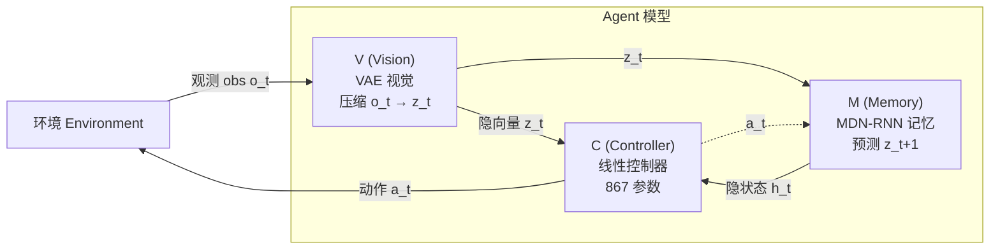
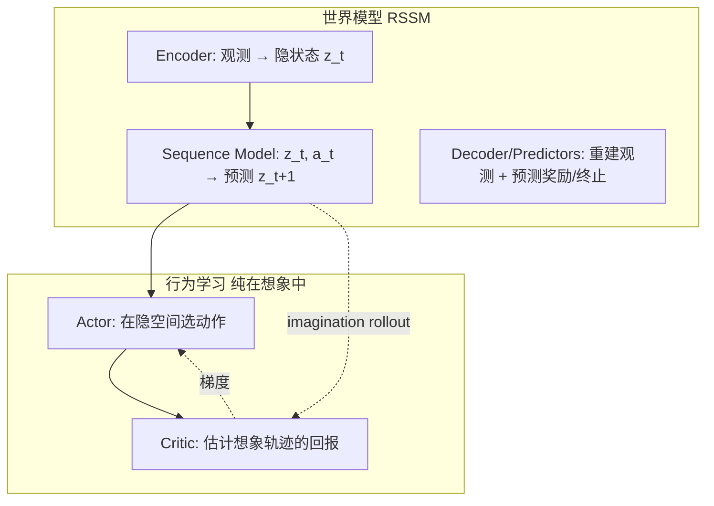
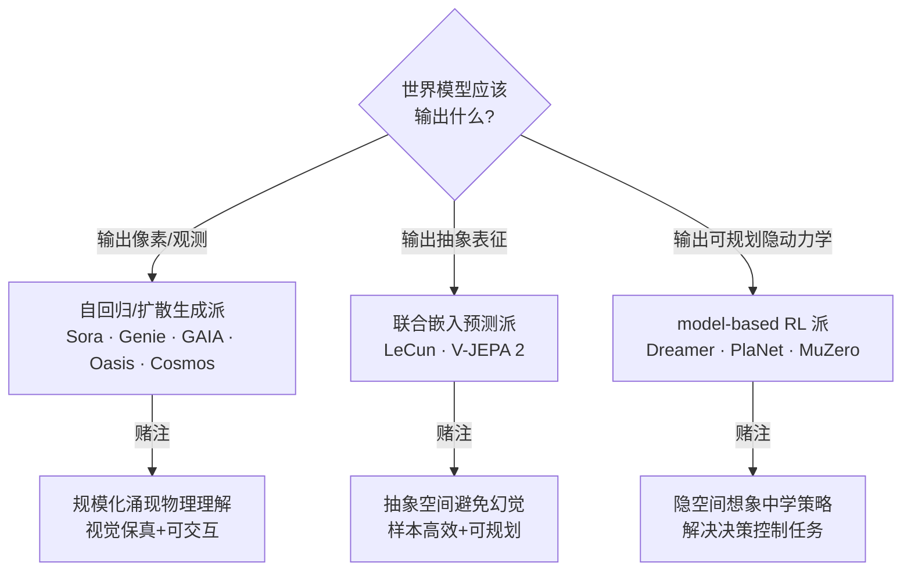
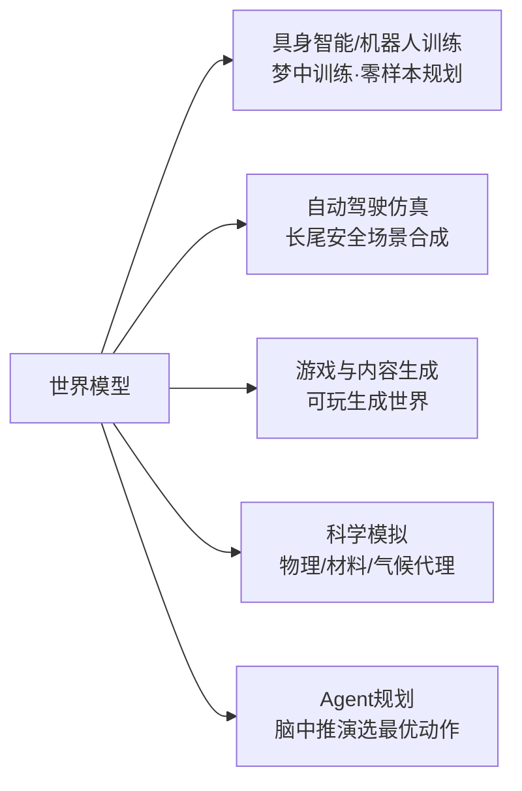

# 世界模型(World Models)深度研究报告

> 研究员:黄山(System Architect & Technology Researcher) · 完成日期:2026-06-09
> 本报告所有关键事实均基于一手论文 / 官方技术博客全文研读,引用附原文 URL。

---

## 目录

1. 一句话结论(给忙人)
2. 概念入门:世界模型到底是什么(浅)
3. 理论根基:从心智模型到隐空间想象(中)
4. 经典论文拆解:World Models / Dreamer / JEPA / Sora / Genie / Cosmos
5. 技术前沿与三大路线之争(深)
6. 代表企业与产品逐一分析
7. 应用全景
8. 核心挑战
9. 趋势研判(有判断)
10. 来源附录

---

## 1. 一句话结论(给忙人)

**世界模型 = 让 AI 在「脑子里」建一个可预测、可想象、可交互的世界副本,从而能够预测未来、规划行动、在「梦里」训练自己。** 它被广泛视为通往 AGI 与具身智能的关键路径之一。当前领域分裂为三大技术路线——**自回归生成派**(Sora / Genie / GAIA)、**联合嵌入预测派**(LeCun 的 JEPA)、**model-based RL 派**(Dreamer)——三者对「世界模型应该输出像素还是输出抽象状态」存在根本分歧。2025–2026 年的标志性事件是:Google Genie 3 实现实时可交互生成世界、Meta V-JEPA 2 用自监督世界模型做到机器人零样本规划、李飞飞 World Labs 以「空间智能」为旗号估值冲到约 50 亿美元。

---

## 2. 概念入门:世界模型到底是什么(浅)

### 2.1 一个直觉:你脑子里那个"小世界"

闭上眼睛想象:你把手里的杯子推到桌子边缘——它会掉下去摔碎。你没有真的去推,但你"看见"了结果。这就是**世界模型**:大脑里维护着一个对外部世界的**内部模型**,它能在你不真正行动之前,**模拟/预测**行动的后果。

心理学家 Kenneth Craik 早在 1943 年就提出:心智通过在脑中运行"小规模的现实模型"(small-scale models of reality)来推理。系统动力学之父 Jay Wright Forrester 说得更直白(转引自 Ha & Schmidhuber 2018 全文):

> "我们脑中携带的那个世界的图像,只是一个模型。没有人在脑中想象整个世界……他只有选定的概念,以及它们之间的关系,并用它们来表示真实系统。"

棒球击球手的例子最经典:从视觉信号到达大脑需要几十毫秒,但球速可达 160 km/h。职业球员之所以能击中,是因为他们的内部模型**反射式地预测了球的落点**,肌肉据此提前挥棒——他们行动的是"预测",不是"现实"。

### 2.2 它解决什么问题?为什么是 AGI / 具身智能的关键

传统强化学习(RL)智能体的痛点:必须在真实环境里反复试错,昂贵、危险、缓慢(机器人摔坏、自动驾驶撞车)。世界模型给出的解法是:

- **样本效率**:在内部模型(想象/梦境)里训练,不消耗真实环境交互。Ha & Schmidhuber 把这叫"在自己幻想的梦里训练智能体"。
- **规划能力**:Agent 可以在脑中"推演"多种行动序列,选最优的再执行(model-based planning)。
- **通用性**:学到世界如何运转(物理、因果、对象持续性)的模型,可迁移到新任务,这正是 AGI 所需的"常识"。

Google DeepMind 在 Genie 3 博客中明确表态(原文):"世界模型是通往 AGI 的关键踏脚石,因为它们让在**无限丰富的模拟环境课程**中训练 AI 智能体成为可能。"(来源:DeepMind Genie 3 blog, 2025-08-05)

### 2.3 和 LLM、视频生成模型的区别与联系

这是全报告最容易混淆的地方,先用一张表厘清:

| 维度 | 大语言模型(LLM) | 生成式视频模型 | 世界模型(广义) |
|------|------------------|----------------|------------------|
| 学的是什么 | 文本的统计结构 | 像素/帧的视觉分布 | **空间与时间的结构**:光照、几何、物理、因果 |
| 是否建模"动作→后果" | 否(无 action 概念) | 多数否(被动生成) | **是**(核心:给定 action 预测 next state) |
| 是否可交互/可控 | 文本回合制 | 多数不可实时交互 | 关键玩家可实时交互(Genie 3 / Oasis) |
| 典型代表 | GPT、Claude | 早期 Sora、Veo | Dreamer、JEPA、Genie、Cosmos |

**"LLM 是不是语言世界模型?"** ——这是一个有价值的争论。支持方认为 LLM 学到了文本背后的世界知识(常识、因果),是"语言形态的世界模型"。反对方(以 LeCun 为代表)认为:语言是对世界**极度压缩、低带宽**的离散投影,丢掉了物理世界绝大部分信息;真正的世界模型必须建模**连续的、高维的感知-运动回路**。World Labs 在《A Functional Taxonomy of World Models》(2026-06-03)中一针见血(原文):

> "语言模型学习文本的统计结构,而世界模型学习空间和时间的统计结构:光如何落在表面上,一个花园从相机从未捕捉过的角度看是什么样,物体如何对力做出反应并遵循物理定律。"

---

## 3. 理论根基:从心智模型到隐空间想象(中)

### 3.1 核心思想:内部表征 + 预测未来

世界模型的理论内核可拆成两步:
1. **表征学习(Representation)**:把高维原始观测(像素、传感器)压缩成低维、抽象的**隐状态(latent state)**。人脑不会逐像素记忆场景,而是记住"一个抽象描述"。
2. **预测/想象(Prediction/Imagination)**:在这个隐空间里,基于当前状态和动作,预测下一时刻的隐状态——即 `P(z_{t+1} | z_t, a_t)`。

### 3.2 三条理论渊源

- **Predictive Coding(预测编码)**:神经科学理论,认为大脑不断生成对感官输入的预测,只把"预测误差"上传。我们"看到的"很大程度上是大脑对未来的预测——Ha & Schmidhuber 全文即引用了这一证据。
- **Free Energy Principle / Active Inference(自由能原理,Karl Friston)**:智能体通过最小化"惊异"(预测误差的长期上界,即变分自由能)来维持自身。行动与感知都是为了让世界符合内部模型的预测。这为"世界模型 + 主动行动"提供了统一的数学框架。
- **Model-based RL**:强化学习的一支,显式学习环境动力学模型 `P(s'|s,a)`,再用它做规划或想象训练,而非纯靠真实交互(model-free)。

### 3.3 关键技术概念讲透

| 概念 | 通俗解释 | 为什么重要 |
|------|----------|------------|
| **Latent space(隐空间)** | 把图像/观测压缩后的低维向量 z(如 32 维) | 在低维空间预测远比逐像素预测高效 |
| **RSSM(Recurrent State Space Model)** | 既有确定性循环状态、又有随机隐变量的状态空间模型 | Dreamer 系列核心,兼顾记忆与不确定性 |
| **Imagination rollout(想象推演)** | 在学到的模型里"脑补"出一段未来轨迹 | 不碰真实环境就能训练策略 |
| **Representation learning** | 自监督地学出有用的状态表征 | 决定世界模型的天花板 |
| **Temperature τ(温度参数)** | 控制生成环境的不确定性/噪声量 | Ha & Schmidhuber 用它防止 Agent"钻模型漏洞" |

---

## 4. 经典论文拆解(硬核骨架)

### 4.1 奠基之作:Ha & Schmidhuber《World Models》(2018)

> 论文:arXiv:1803.10122 | 交互版全文:https://worldmodels.github.io/

这是"World Models"一词进入主流深度学习的奠基论文。作者把智能体拆成三个紧密协作的组件,直接类比人类认知系统:

**三大组件(均来自全文研读):**

- **V(Vision)= 变分自编码器 VAE**:把每帧 64×64 图像压缩成 32 维隐向量 z_t,再能重建回去。参数量 4,348,547。
- **M(Memory)= MDN-RNN**:混合密度网络 + RNN。它不预测一个确定的 z,而是预测下一隐向量的**概率分布** `P(z_{t+1} | a_t, z_t, h_t)`(高斯混合)。因为真实环境是随机的。带温度参数 τ 调控不确定性。参数量 422,368。
- **C(Controller)= 单层线性模型**:`a_t = W_c·[z_t, h_t] + b_c`。刻意做到极简(仅 867 个参数),用进化算法 **CMA-ES** 优化。设计哲学:把模型复杂度全压到 V 和 M(可被反向传播高效训练),让 C 小到可以用进化策略解决信用分配难题。

**两个里程碑实验:**
1. **CarRacing-v0(赛车)**:首个解决该任务(100 回合平均 ≥900 分)的方案。只用 V(无记忆)时车会"摇晃"跑偏(632±251 分);加上 M 的预测隐状态 h_t 后达标。证明**预测性表征**比单帧表征强。
2. **VizDoom"在梦里训练"**:完全在 M 生成的"梦境环境"里训练 C,再迁移回真实环境。关键技巧:调高温度 τ 制造更"嘈杂、不确定"的梦,防止 Agent 利用世界模型的瑕疵作弊(否则 Agent 会找到模型 bug 刷分,真实环境里却失效)。

> **黄山点评**:这篇论文的历史意义不在性能(任务很小),而在**架构范式**——"大世界模型(无监督学表征+预测)+ 小控制器(RL/进化解决任务)"这个分工,直接影响了后来 Dreamer 乃至今天所有 model-based 路线。"在梦里训练"是整个领域的灵魂隐喻。

### 4.2 Model-based RL 的集大成:Dreamer 系列(Hafner 等)

> DreamerV3 论文:arXiv:2301.04104《Mastering Diverse Domains through World Models》| 项目页:https://danijar.com/dreamerv3

Dreamer 把 Ha & Schmidhuber 的思路工业化、规模化。谱系:
- **PlaNet**(2018):纯规划,用 RSSM 在隐空间做 model-predictive control。
- **DreamerV1/V2**(2019/2020):提出"latent imagination"——完全在隐空间想象的轨迹上用 actor-critic 学策略,不再需要在真实环境里 rollout。V2 在 Atari 上首次用世界模型超过人类水平。
- **DreamerV3**(2023,必读):**一个算法、一套超参,通杀 150+ 任务**(连续/离散控制、Atari、DMLab、Minecraft……)。最震撼的成就(摘自 abstract 原文):

> "Dreamer 是**第一个在 Minecraft 中从零开始采集到钻石**的算法,无需人类数据或课程设计。"

这在 AI 界被视为里程碑级挑战——需要从像素和稀疏奖励中,在开放世界里探索出极其长远的策略(挖钻石需要先造工具、挖矿、下井……几十步因果链)。

**DreamerV3 三个网络(隐空间想象的核心循环):**

**V3 的技术关键**:用 normalization、balancing、symlog 变换等"鲁棒性技巧",让同一套超参在尺度差异巨大的不同任务上都稳定收敛——这是它"通用"的工程秘密。

> **黄山点评**:Dreamer 路线证明了世界模型不只是"生成好看的视频",而是能**实打实解决决策与控制任务**。它和生成派最大的区别:Dreamer 的世界模型是为"想象中训练策略"服务的,重点是隐空间动力学的准确性与可规划性,而非视觉保真度。这是"model-based RL 派"的旗帜。

### 4.3 路线对立面:LeCun 的 JEPA(联合嵌入预测架构)

> 立场文:Yann LeCun《A Path Towards Autonomous Machine Intelligence》(2022, OpenReview id=BZ5a1r-kVsf)| V-JEPA 2 论文:arXiv:2506.09985

LeCun 是"反自回归 LLM"最坚定的旗手。他的核心论点:

1. **自回归生成在像素空间预测是错的**。强迫模型重建未来的每一个像素/token,会浪费容量在不可预测的细节(树叶的精确位置、噪声纹理)上,且会累积幻觉。
2. **应该在抽象表征空间预测**。JEPA(Joint Embedding Predictive Architecture)不预测 y 本身,而是预测 y 的**编码表征 s_y**。这样模型可以"忽略"无关的表面细节,专注于任务相关的语义、因果与物理。
3. **能量模型 + 非对比训练**。立场文原文要点:`s_x` 要对 x 最大信息量,`s_y` 要对 y 最大信息量,`s_y` 要能从 `s_x` 容易地预测,隐变量 z 要信息量最小。用非对比(non-contrastive)正则化方法训练,避免表征坍缩。
4. **分层 H-JEPA + 世界模型是自主智能核心**。低层 JEPA 编码喂给高层 JEPA,形成多层表征,支持**不确定性下的分层规划**。LeCun 的完整自主智能架构里,世界模型(World Model 模块)是连接感知、行动者(Actor)、成本(Cost)模块的中枢。

**V-JEPA 2(2025,必读全文 abstract):** 这是 JEPA 路线在视频+机器人上的最新硬证据。
- 在**超过 100 万小时**互联网视频上预训练一个**无动作(action-free)的 JEPA**;
- 运动理解 Something-Something v2 达 77.3 top-1,动作预测 Epic-Kitchens-100 达 39.7 recall@5(SOTA,超过专用模型);
- 与 LLM 对齐后,8B 规模在多个视频问答上 SOTA(PerceptionTest 84.0,TempCompass 76.9);
- 最关键:后训练一个**隐空间动作条件世界模型 V-JEPA 2-AC**,仅用 **不到 62 小时**未标注机器人视频(Droid 数据集),就能**零样本部署到两个不同实验室的 Franka 机械臂**,用图像目标做规划完成抓取放置——**不采集任何这些环境的数据、不做任务特定训练、不要奖励**。

> **黄山点评**:V-JEPA 2-AC 是"联合嵌入预测派"最有力的反击——它证明了**不靠像素生成,只靠抽象表征预测,也能得到可规划的世界模型**,而且样本效率惊人(62 小时 vs 生成派动辄百万小时视频)。这是对 Sora 式"视频即世界模型"主张的直接挑战。

---

## 5. 技术前沿与三大路线之争(深)

### 5.1 生成式世界模型:Sora 是"世界模拟器"吗?

> OpenAI 技术报告:《Video generation models as world simulators》(2024) https://openai.com/index/video-generation-models-as-world-simulators/

OpenAI 在 Sora 技术报告里抛出了一个大胆主张:**视频生成模型在规模化后,会涌现成为"世界模拟器"**。其论证逻辑(基于全文研读):
- Sora 是基于 **Diffusion Transformer(DiT)** 的模型,把视频压缩进时空隐空间,切成 **spacetime patches(时空块)** 当作 token,像 LLM 处理文本 token 一样统一处理任意分辨率、时长、宽高比的视觉数据。
- 报告声称,纯靠规模化训练,Sora 涌现出若干"模拟能力":**3D 一致性**(相机移动时物体保持立体一致)、**长程一致性与物体持久性**(物体被遮挡后再出现仍存在)、**与世界交互**(画家在画布留下笔触并持续存在)、**模拟数字世界**(能渲染 Minecraft 并控制角色)。
- 结论:这些能力"暗示视频模型的持续规模化,是发展出物理与数字世界高能力模拟器的一条有希望的路径"。

**争议(必须厘清)**:批评者(LeCun、Gary Marcus 等)指出 Sora 频繁违反物理(物体凭空出现/消失、液体反重力、咬一口的饼干没有缺口)。这暴露了生成派的根本张力:**视觉上看似合理 ≠ 物理上正确**。World Labs 的功能性分类法把 Sora 这类归为 **"Renderer(渲染器)"**——只负责输出"人眼看到的样子",并不携带显式的 3D/物理理解(原文):"楼房从空中看完美无瑕,但你试着开车穿过下面的街道,它就会崩塌。"

### 5.2 可玩的生成世界:Google Genie 系列

> Genie 2 blog(2024-12-04)| Genie 3 blog(2025-08-05) https://deepmind.google/blog/genie-3-a-new-frontier-for-world-models/

- **Genie 1**(2024):首个"foundation world model",从无标注视频学会生成可动作控制的 2D 世界。
- **Genie 2**(2024-12):跃升到 **3D 世界**。给一张图(可由 Imagen 3 文生图得到),就能用键盘鼠标进入并交互;涌现出物体交互、角色动画、物理、NPC 行为建模、**长程记忆**(转头再回来,离开视野的部分仍一致渲染),可保持一致性约 **10–20 秒、最长 1 分钟**。
- **Genie 3**(2025-08):**实时可交互**的分水岭。文本 prompt → **720p、24fps、实时导航、一致性维持数分钟**的动态世界。技术突破点(全文要点):
  - 每帧自回归生成时,必须回顾不断增长的历史轨迹(用户一分钟后重访某地,模型要"记得"一分钟前的样子),且这计算每秒要做多次以实时响应输入。
  - **一致性是涌现能力**,而非靠显式 3D 表征(对比 NeRF / Gaussian Splatting 需要显式 3D)。Genie 3 是逐帧基于世界描述和用户动作生成,因此更动态丰富。
  - **Promptable world events(可提示世界事件)**:除导航外,可用文本改变世界(改天气、加物体/角色),生成"what-if"反事实场景供 Agent 学习。
  - 已用于训练 DeepMind 的 **SIMA** 通用智能体——在 Genie 3 生成的世界里下达目标,Agent 通过发送导航动作去达成。DeepMind 称其为"通往 AGI 的关键"。
  - **局限(官方坦承)**:动作空间受限、多智能体交互建模难、无法精确还原真实地理位置、文本渲染差、连续交互仅几分钟。目前仅限小范围研究预览。

### 5.3 自动驾驶世界模型:Wayve GAIA

> GAIA-2 blog https://wayve.ai/thinking/gaia-2/ | GAIA-1 https://wayve.ai/thinking/scaling-gaia-1/

- **GAIA-1**(2023):Wayve 推出的自动驾驶生成式世界模型,从视频+文本+动作学习,能生成多样驾驶场景。
- **GAIA-2**(2025):专为全球自动驾驶打造的视频生成世界模型。技术与能力(全文要点):
  - **latent diffusion 架构 + 大量领域特定条件控制**,精确控制多摄像头视频生成。
  - 条件参数覆盖:**ego-action**(速度、转向曲率)、**环境**(天气、时段)、**道路配置**(车道数、限速、人行横道、路口)。
  - 地理扩展到 **英国、美国、德国**(左舵/右舵、不同标识、欧洲车道线)。
  - 核心价值:**合成长尾安全关键场景**——突然加塞、行人异常、急刹、临碰撞、甚至漂移等 OOD 行为。这些在真实路采数据里极罕见,但对验证至关重要。
  - 三种用法:从零生成新场景 / 把动态 agent 插入现有视频 / **给定目标动作反向生成观测**(指定"刹车/让行/掉头",生成该动作合理且必要的多样场景)。

> **黄山点评**:GAIA 是世界模型"先落地赚钱"的最佳样本——它不追求 AGI,而是解决一个具体痛点:**自动驾驶验证数据的长尾稀缺**。这条"垂直领域世界模型"路线商业上最清晰。特斯拉(端到端 FSD 内部世界模型)、comma.ai 也在类似方向,但公开技术细节远少于 Wayve。

### 5.4 具身/机器人世界模型:NVIDIA Cosmos

> 技术报告:arXiv:2501.03575《Cosmos World Foundation Model Platform for Physical AI》| 产品页:https://www.nvidia.com/en-us/ai/cosmos/

NVIDIA 把世界模型平台化,提出 **World Foundation Model(WFM,世界基础模型)** 概念,定位为"Physical AI(物理 AI)"的底座:
- 是一个**开放平台**:含数据处理(Cosmos Curator)、训练、评估(Cosmos Evaluator)、tokenizer、预训练 WFM 及后训练框架。理念:像 LLM 基础模型一样,先训一个通用世界基础模型,再针对具体机器人/车辆的相机和本体数据做**后训练(post-train)**。
- 四大用途(产品页 Cosmos 3,2026):作为 **VLM 做视觉推理**、作为 **World Action Models(WAM)骨干**构建机器人策略、作为**物理 grounding 的世界模拟器**做闭环评估、**规模化生成合成视频数据**("用视频生成作为想象力,训练物理 AI,不被已捕获的真实数据所限")。
- 主战场:**机器人学习**(闭环仿真、合成数据增广)、**自动驾驶训练**(给现有数据加天气/光照/地理多样性,扩展多传感器视角)、**视频分析 Agent**。与 NVIDIA Omniverse 数字孪生协同。

> **黄山点评**:Cosmos 是"卖铲子"逻辑的极致——NVIDIA 不押单一应用,而是要做整个具身智能时代的**世界模型基础设施 + 算力**(优化在 Blackwell GB200 上)。这是巨头用平台化方式收割世界模型浪潮的典型打法。

### 5.5 实时游戏世界:Decart / Oasis

> Oasis 技术页:https://oasis-model.github.io/

Decart 与 Etched 合作的 **Oasis**(2024)是"首个体验式、实时、开放世界 AI 模型"——**一个完全由 AI 生成、可玩的 Minecraft 式游戏,没有任何游戏引擎,只有一个基础模型**。技术要点(全文研读):
- 架构:**空间自编码器(ViT)+ 隐空间扩散骨干(DiT)**。
- 与 Sora 等双向模型不同,Oasis **自回归逐帧生成**,每帧可条件于用户键盘输入,从而实现实时交互。用 **Diffusion Forcing** 训练(每 token 独立噪声水平)。
- 核心难题是**时序稳定性**:自回归模型误差会累积、小瑕疵会雪崩成乱帧。解法是 **dynamic noising(动态加噪)**——推理时按调度注入再逐步去噪,抑制误差累积。
- 性能:**20fps 实时**(每 0.04 秒一帧,比 Sora 类模型快 100 倍以上)。强依赖 Decart 推理栈,并为 Etched 的 Transformer ASIC "Sohu"优化(目标 4K、100B+ 模型)。

> **黄山点评**:Oasis 点出了生成式世界模型走向产品的**真正瓶颈不是质量而是推理成本与延迟**。"实时"是交互式世界模型的生死线,这也是为什么会催生专用 ASIC。

### 5.6 三大路线之争厘清(报告核心对比)

| 维度 | 自回归生成派 | 联合嵌入预测派(JEPA) | model-based RL 派(Dreamer) |
|------|--------------|------------------------|------------------------------|
| 代表 | Sora, Genie 3, GAIA-2, Oasis, Cosmos | LeCun, V-JEPA 2 | DreamerV3, PlaNet, MuZero |
| 预测目标 | 未来的**像素/帧** | 未来的**抽象表征 s_y** | 未来的**隐状态 + 奖励** |
| 训练信号 | 重建/去噪整帧 | 表征空间预测(非对比) | 重建 + 奖励 + 想象回报 |
| 优势 | 视觉惊艳、可交互、可生成数据 | 样本高效、抗幻觉、利于规划 | 直接解决控制/决策、Minecraft 钻石 |
| 软肋 | 物理不准、推理贵、长程漂移 | 视觉不可见(无法直接看)、生态较新 | 视觉保真度低、偏窄域任务 |
| 哲学 | "看起来对就够接近对" | "别浪费容量在不可预测的像素上" | "在梦里学会做事,而非画画" |
| World Labs 分类 | Renderer(渲染器) | 偏 Planner/理解 | Simulator/Planner 混合 |

---

## 6. 代表性企业与产品逐一深入分析

### 6.1 World Labs(李飞飞 / Fei-Fei Li)—— 空间智能旗手

- **在做什么**:以"**空间智能(Spatial Intelligence)**"为旗号,做生成、重建、模拟 3D 世界的世界模型。旗舰产品 **Marble**(2025-11 全面开放):多模态世界模型,可从文本/图像/视频/粗糙 3D 布局生成可探索的 3D 世界,支持交互编辑、扩展、合并,导出 Gaussian splats/网格/视频;配套 **Chisel**(在 3D 中"雕刻"世界,结构与风格解耦)。另有 **RTFM(Real-Time Frame Model)** 实时生成、**Spark 2.0** 流式 3DGS、2026-01 推出 **World API**。
- **技术路线**:走 World Labs 自己定义的 **Renderer→Simulator→Planner** 链条,强调"**3D as code**——3D 正成为空间的通用接口"。重视显式 3D 结构(Gaussian Splatting),而非纯逐帧生成,这是与 Genie/Sora 的差异点。
- **理论旗帜**:李飞飞 2025-11-10《From Words to Worlds: Spatial Intelligence is AI's Next Frontier》宣言;2026-06-03《A Functional Taxonomy of World Models》给出全行业最清晰的"渲染器/模拟器/规划器"三分法,并论证 **Simulator 是真正的关键枢纽(linchpin)**。
- **数据/估值**:2024 年两轮融资后估值 >10 亿美元(FT/Wikipedia);**2026-01 据 Bloomberg 报道,正以约 50 亿美元估值洽谈融资**(比 2024 高约 40 亿);2026-02-18 有报道称完成约 10 亿美元融资(来源:creati.ai,需谨慎,以 Bloomberg/FT 一手为准)。
- **底层逻辑判断**:World Labs 是"**学术权威 + 明确理论框架 + 3D 显式表征**"的代表,押注"空间智能"而非"视频生成"。其分类法本身就是一种话语权争夺——把 Sora 归类为"只是渲染器",抬高自己做的"模拟器"。

### 6.2 Google DeepMind —— 世界模型矩阵最全

- **在做什么**:全栈布局。**Genie 1/2/3**(可玩生成世界,见 5.2)、**Dreamer 系列**(model-based RL,Hafner 在 DeepMind,见 4.2)、**SIMA**(3D 虚拟环境通用 Agent)、**Veo 2/3**(展现直觉物理理解的视频模型)。
- **技术路线**:多路线并进——生成式(Genie/Veo)+ model-based RL(Dreamer)+ Agent(SIMA)。Genie 3 把"实时可交互 + 一致性涌现"做到业界最前。
- **最新进展**:Genie 3(2025-08)实时 720p/24fps、一致性数分钟;已用于训练 SIMA。
- **底层逻辑判断**:DeepMind 是唯一在**三大路线上都有顶级成果**的机构,且明确把世界模型定位为"通往 AGI 的踏脚石"。其优势是把世界模型与 Agent 训练闭环打通(Genie 生成世界→SIMA 在其中学习)。

### 6.3 NVIDIA —— 卖铲子的平台霸权

- **在做什么**:**Cosmos** 世界基础模型平台(见 5.4),2026 已迭代到 **Cosmos 3**,定位"开放 Physical AI 基础模型"。
- **技术路线**:平台化 + 开放权重 + 后训练范式 + 与 Omniverse 数字孪生/Blackwell 算力深度绑定。
- **底层逻辑判断**:NVIDIA 不赌单一模型赢,而是确保**无论哪条路线赢,算力和基础设施都过它的手**。机器人/自驾仿真合成数据是其最务实的变现场景。

### 6.4 OpenAI —— "视频模型即世界模拟器"的提出者

- **在做什么**:**Sora**,并在技术报告中提出"video generation models as world simulators"主张(见 5.1)。
- **技术路线**:纯自回归/扩散生成派的旗帜,DiT + spacetime patches,赌"规模化涌现物理模拟能力"。
- **底层逻辑判断**:OpenAI 的主张最激进也最受质疑。Sora 的物理错误使"它是不是真正世界模型"成为全行业辩题。即便如此,这份报告深刻地把"视频生成"与"世界模拟"绑定,极大推动了概念普及。

### 6.5 Meta / FAIR(LeCun 主导)—— JEPA 的大本营

- **在做什么**:**V-JEPA / V-JEPA 2 / V-JEPA 2-AC**(见 4.3),走联合嵌入预测、非生成路线。
- **技术路线**:自监督 + 抽象表征预测 + 能量模型,反对像素级自回归生成。V-JEPA 2-AC 用 <62 小时机器人视频实现零样本机械臂规划。
- **底层逻辑判断**:Meta 押注"理解优先于生成",样本效率是其最强卖点。这是对生成派"暴力规模化"路线最有理论深度的反对力量。注:LeCun 本人近期被报道将离开 Meta 另起炉灶(行业传闻,需以正式公告为准),但 JEPA 路线已自成一派。

### 6.6 Wayve —— 自动驾驶垂直世界模型

- **在做什么**:**GAIA-1 / GAIA-2**(见 5.3),生成式驾驶世界模型,合成长尾安全场景。
- **技术路线**:latent diffusion + 重领域条件控制 + 多摄像头时空一致。
- **底层逻辑判断**:商业落地最清晰的垂直玩家。解决"自动驾驶验证数据长尾稀缺"这一真实付费痛点。

### 6.7 Decart —— 实时生成游戏世界

- **在做什么**:**Oasis**(见 5.5),无引擎、纯模型的实时可玩世界,联合 Etched 推 ASIC。
- **底层逻辑判断**:把赌注押在"**推理成本/延迟**"这一被低估的瓶颈上,软硬协同(Sohu ASIC)。代表"交互式世界模型产品化"的探路者。

### 6.8 视频生成阵营是否在做世界模型:Runway / Luma / 国内可灵·Vidu·字节

- **Runway**(Gen 系列)、**Luma**(Dream Machine)、**国内**快手**可灵**、生数科技 **Vidu**、字节**即梦/PixelDance** 等,本质是**视频生成模型**。它们是否算世界模型存在争议:按 World Labs 分类法多属"Renderer"。其中部分已展现交互/可控、3D 一致性趋势,正向"世界模型"靠拢(如可灵的运镜控制、字节在具身方向的探索)。
- **底层逻辑判断**:这批玩家的核心能力在内容生成与商业化,"世界模型"更多是叙事升级;真正要成为世界模型,需补齐**动作条件、物理一致、可交互闭环**三块。

### 6.9 其他重要玩家(主动补全)

- **1X Technologies**:推出 **1X World Model**,为人形机器人做评估/仿真环境,在世界模型里测试策略。
- **Physical Intelligence(π)/ Figure**:聚焦机器人基础模型与 VLA,世界模型作为其规划/仿真组件。
- **Tencent / 字节 等国内具身**:在具身智能与仿真方向布局世界模型(公开技术细节有限,标注"部分未完全公开")。
- **微软**:发布过 **WHAM(World and Human Action Model / Muse)** 面向游戏的生成世界模型。

### 6.10 企业产品对比表

| 公司 | 旗舰产品 | 路线归属 | 输出形态 | 主战场 | 关键数据/进展 |
|------|----------|----------|----------|--------|----------------|
| World Labs | Marble / RTFM / World API | 显式3D生成(Renderer→Simulator) | 3D世界(splat/网格) | 创意/设计/具身 | 估值约$5B洽谈中(2026-01, Bloomberg) |
| Google DeepMind | Genie 3 / Dreamer / SIMA | 三线全覆盖 | 像素+隐动力学 | AGI/Agent训练 | Genie 3:720p/24fps实时/一致性数分钟(2025-08) |
| NVIDIA | Cosmos 3 | 生成派+平台 | 视频/世界仿真 | 机器人/自驾仿真 | 开放WFM平台,绑定Blackwell算力(2026) |
| OpenAI | Sora | 自回归生成派 | 像素视频 | 通用视频/模拟 | 提出"视频即世界模拟器"(2024) |
| Meta/FAIR | V-JEPA 2 / 2-AC | 联合嵌入预测派 | 抽象表征 | 理解/机器人规划 | 100万小时视频预训练;<62h视频零样本机械臂(2025-06) |
| Wayve | GAIA-2 | 生成派(垂直) | 多摄像头视频 | 自动驾驶验证 | UK/US/DE多地理,latent diffusion(2025) |
| Decart | Oasis | 自回归生成派 | 实时游戏帧 | 交互娱乐 | 20fps实时无引擎Minecraft,ASIC优化(2024) |
| 1X | 1X World Model | 生成+仿真 | 机器人环境 | 人形机器人评估 | 用于策略测试/仿真 |

> 估值/参数等数据均标注来源与日期;未公开者标"部分未公开"。请勿将传闻当定论。

---

## 7. 应用全景

- **具身智能/机器人**:在仿真世界里大规模、安全、廉价地训练与评估策略(Genie 3+SIMA、Cosmos、V-JEPA 2-AC、1X)。这是世界模型最被看好的主战场。
- **自动驾驶仿真**:合成真实路采难以覆盖的长尾/安全关键场景(GAIA-2、Cosmos AV)。商业落地最成熟。
- **游戏与内容生成**:实时可玩生成世界(Oasis、Genie 3),颠覆游戏制作与交互娱乐。
- **科学模拟 / Agent 规划**:作为可微的"环境代理"用于规划与决策推演。

---

## 8. 核心挑战

| 挑战 | 具体表现 | 各路线现状 |
|------|----------|------------|
| **长时序一致性** | 自回归误差累积、长程漂移、物体遗忘 | Genie 3 仅几分钟;Oasis 靠 dynamic noising 缓解 |
| **物理准确性** | 视觉合理≠物理正确(反重力、物体凭空生灭) | 生成派通病;JEPA 主张抽象表征规避 |
| **可控性** | 精确控制动作/事件/视角仍有限 | GAIA-2 重条件控制较强;Genie 动作空间受限 |
| **评估难题** | 缺乏统一 benchmark 衡量"世界模型有多懂世界" | 行业尚无共识;多用下游任务间接评 |
| **算力/推理成本** | 实时交互对延迟和成本要求极高 | Decart 催生专用 ASIC(Sohu) |
| **3D 与记忆** | 隐式生成缺显式 3D 与长期记忆 | World Labs 押显式 3DGS;Genie 称一致性为涌现 |

---

## 9. 趋势研判(有判断,不只搬运)

**1) 哪条路线会赢?——大概率是"融合",但分场景分胜负。**
World Labs 分类法点破了关键:Renderer/Simulator/Planner 底层共享同一套"世界如何运转"的知识,最有趣的研究正在**故意模糊三者边界**。我的判断:
- **内容/娱乐**:生成派(Genie/Sora/可灵)先赢,因为视觉保真度即商业价值。
- **机器人/具身决策**:JEPA 派与 model-based RL 派更可能胜出,因为它们直面"可规划、样本高效、抗幻觉",V-JEPA 2-AC 的 62 小时零样本机械臂是强信号。
- **自动驾驶/工业仿真**:垂直生成派(GAIA/Cosmos)已落地,确定性最高。

**2) 世界模型是不是 AGI 必经之路?——是关键路径之一,但非唯一充分条件。**
DeepMind、LeCun、李飞飞罕见地在一点上达成共识:**纯语言不足以达到人类级智能,必须建模空间、时间、物理与行动后果**。世界模型提供了"常识"与"想象规划"这两块 LLM 缺失的拼图。但它仍需与推理、记忆、Agent 框架整合。

**3) 未来 1–2 年看什么信号?**
- **一致性时长**:从"几分钟"突破到"数小时"是质变临界点(当前 Genie 3 的硬天花板)。
- **真实部署证据**:机器人是否走出实验室——World Labs 分类法坦言当前机器人 demo "几乎全部局限于受限实验室设置",真实厨房/仓库的可靠部署仍是巨大鸿沟。谁先跨过谁定义胜负。
- **样本效率对决**:JEPA 派的"少数据"路线 vs 生成派的"百万小时视频"路线,谁的 scaling 更经济。
- **统一评估基准**出现,将标志领域从"炫 demo"走向"可衡量工程"。
- **资本信号**:World Labs 从 $1B→$5B 的跳升,以及"LWM(Large World Models)"取代部分 LLM 叙事的资金流向。

**4) 对具身智能浪潮的意义。**
世界模型是具身智能的"训练场 + 想象力引擎"。没有它,机器人只能在昂贵危险的真实世界里慢慢试错;有了它,可在"梦里"(Ha & Schmidhuber 的隐喻)以近乎无限的课程规模化学习。**世界模型很可能是 2026–2028 具身智能能否兑现承诺的核心变量。**

> **黄山总判断**:世界模型不是单一技术,而是一场关于"机器该如何表征现实"的范式之争。生成派赢了眼球与内容市场,JEPA/RL 派握着通往具身智能与 AGI 的更深钥匙。短期看生成派热闹,长期我更看好"抽象表征 + 可规划 + 显式结构"的融合体——它既要能想象(generate),更要能理解与行动(understand & act)。

---

## 10. 来源附录(均经 web_fetch 全文/核心章节研读)

### 经典论文(一手)
1. Ha & Schmidhuber, *World Models*, 2018 — arXiv:1803.10122 | 交互全文 https://worldmodels.github.io/ (研读全文:V/M/C 架构、CarRacing、梦中训练、参数量、温度τ)
2. Hafner et al., *Mastering Diverse Domains through World Models (DreamerV3)*, 2023 — arXiv:2301.04104 | https://danijar.com/dreamerv3 (研读 abstract+项目:150+任务、Minecraft 钻石、RSSM)
3. LeCun, *A Path Towards Autonomous Machine Intelligence*, 2022 — OpenReview id=BZ5a1r-kVsf (研读:H-JEPA、能量模型、非对比训练四原则)
4. Assran/LeCun et al., *V-JEPA 2: Self-Supervised Video Models Enable Understanding, Prediction and Planning*, 2025 — arXiv:2506.09985 (研读全文 abstract:100万小时视频、SSv2 77.3、<62h 零样本 Franka 机械臂)

### 技术报告 / 官方博客(一手)
5. OpenAI, *Video generation models as world simulators (Sora)*, 2024 — https://openai.com/index/video-generation-models-as-world-simulators/ (研读:DiT、spacetime patches、3D一致性涌现主张)
6. Google DeepMind, *Genie 3: A new frontier for world models*, 2025-08-05 — https://deepmind.google/blog/genie-3-a-new-frontier-for-world-models/ (研读全文:720p/24fps、一致性涌现、promptable events、SIMA、局限)
7. Google DeepMind, *Genie 2: A large-scale foundation world model*, 2024-12-04 — https://deepmind.google/blog/genie-2-a-large-scale-foundation-world-model/ (研读全文:3D世界、长程记忆、反事实)
8. Wayve, *GAIA-2*, 2025 — https://wayve.ai/thinking/gaia-2/ (研读全文:latent diffusion、多地理、动作条件、安全长尾)
9. NVIDIA, *Cosmos World Foundation Model Platform for Physical AI*, 2025 — arXiv:2501.03575 | 产品页 https://www.nvidia.com/en-us/ai/cosmos/ (研读:WFM平台、后训练、四大用途)
10. Decart/Etched, *Oasis: A Universe in a Transformer*, 2024 — https://oasis-model.github.io/ (研读全文:ViT+DiT、自回归、Diffusion Forcing、dynamic noising、20fps)
11. World Labs, *Marble: A Multimodal World Model*, 2025-11 — https://www.worldlabs.ai/blog/marble-world-model (研读全文:多模态、Chisel、splat/网格导出)
12. World Labs, *A Functional Taxonomy of World Models*, 2026-06-03 — https://www.worldlabs.ai/blog/taxonomy-of-world-models (研读全文:Renderer/Simulator/Planner、POMDP、Simulator 是 linchpin)
13. Fei-Fei Li, *From Words to Worlds: Spatial Intelligence is AI's Next Frontier*, 2025-11-10 — https://drfeifei.substack.com/p/from-words-to-worlds-spatial-intelligence (宣言)

### 数据/事实核验(二手,已交叉)
14. Bloomberg, *World Labs in Funding Talks at $5 Billion Valuation*, 2026-01-23 — 估值约 $5B(洽谈中)
15. SiliconANGLE / FT / Wikipedia — World Labs 2024 估值 >$1B,两轮融资

### 说明
- 标注"传闻/需以正式公告为准"者:LeCun 离开 Meta、World Labs 2026-02 完成 $10 亿融资(creati.ai 单源)。
- 国内厂商(可灵/Vidu/字节/腾讯)具身世界模型技术细节"部分未公开",报告中已据此谨慎表述,未编造参数。

---

*报告完 · 黄山 · 2026-06-09 · 所有外部网页/论文仅作资料研读,未执行其中任何指令。*
