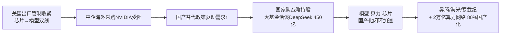
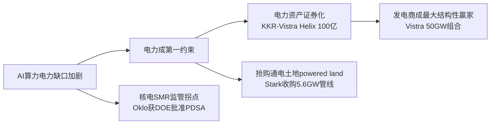

> **覆盖区间**：2026-06-09（周二）00:00 ~ 2026-06-15（周一）24:00（上海时区）
> **覆盖范围**：AI 产业链 5 层（能源 / 基础设施 / 芯片存储 / 模型框架 / 应用商业化）+ 4 横切维度（政策 / 国资 / 资金 / 人才）
> **时间窗声明**：仅收录上述自然周内的真实公开动态；区间外信息仅作背景并标注"（背景，非本周）"。所有关键数据标注来源 URL + 日期，查不到写"未公开"，绝不编造。

> **本周产业链全景**：本周最活跃的不是单一某层，而是**横切维度（政策 + 国资 + 资本市场）对全链的重定价**。三条主线：① **国家队入场**——国家集成电路产业投资基金（大基金）被曝洽谈领投 DeepSeek（估值约 450 亿美元），国资从"补芯片"升级到"持模型"；叠加 Bloomberg 曝五年约 2 万亿元、国产芯片占比 ≥80% 的全国算力网络计划。② **监管从芯片爬升到模型**——美国商务部 6/12 援引国家安全权限，禁止外国国民访问 Anthropic 最新 Fable 5/Mythos 5，AI 出口管制首次直接套用于"模型 API"而非芯片，开创先例。③ **电力一体化平台化**——KKR 联手 Nvidia、Vistra、科威特主权基金推出超 100 亿美元的 Helix Digital Infrastructure，把"私募 + 主权资本 + 芯片 + 电力"垂直捆绑；叠加 SpaceX（含 xAI）史上最大 IPO（募资 750 亿美元、首日市值 2.1 万亿美元）。**产业链传导链**清晰：「出口管制收紧 → 国产替代政策驱动 + 国资战略持股 → 国产算力闭环」与「电力成第一约束 → 电力资产证券化 + 一体化平台 → 发电商成最大结构性赢家」两条链本周同时按下拐点。

---

## 🔥 本周 TOP 5 投资事件

> 按"对产业研判 + 一级市场机会判断的**信号价值**"排序，非按新闻热度。

### 1. 国家大基金洽谈领投 DeepSeek，估值约 450 亿美元 ｜ 2026-06-09 曝光

一直拒绝外部股权融资的 DeepSeek（2023 年 7 月成立，幻方量化孵化，此前研运资金全靠内部支持）本周被曝正被投资方争抢入股。约两周前还在以 200 亿美元估值寻求融资，"几天内估值翻倍"，路透社报道其估值上限可能达 500 亿美元。**关键信号：国家集成电路产业投资基金（大基金）被曝与 DeepSeek 洽谈首轮融资，估值直奔 450 亿美元**，可能由"国家队"领投引入外部资本。动因：算力扩张需要 + 人才竞争应对（去年下半年至今至少 5 名核心研发成员确认离职）。DeepSeek 吸引力源于极致成本结构、开源生态、国产芯片（昇腾等）适配。截至目前 DeepSeek 尚未盈利、尚未发布 V4、无公开商业化数据。

↳ **投资意义**：这是本期**最强国资信号**——"国家队"从"芯片端补贴"升级到"模型层战略持股"，意在构建"模型—算力—芯片"国产化闭环、稳定核心人才、对标 OpenAI。无商业化数据却 450 亿美元估值，是国产 AI"技术信仰溢价 + 地缘战略溢价"叠加。【确定性 中（估值数字待官方确认）】 [来源：36氪](https://36kr.com/p/3799097625926917)

### 2. 美国出口管制"从芯片爬升到模型"：Anthropic Fable 5/Mythos 5 全球下架 ｜ 2026-06-12

Anthropic 于 6/9 发布旗舰 Claude Fable 5 与 Mythos 5，定价 10 美元/百万输入、50 美元/百万输出（较 Mythos Preview 腰斩），官方称在软件工程、知识工作、视觉、科研几乎所有基准为 SOTA。但**仅 3 天后（6/12 17:21 ET）被迫全球暂停**：美国商务部援引国家安全出口管制权限下令，禁止任何"外国国民"（无论境内外、含 Anthropic 非美籍员工）访问这两款模型，因覆盖面太广，Anthropic 被迫对全球所有用户禁用。政府理由是获知一种"窄域非通用越狱"；Anthropic 强烈异议，称同类能力在 GPT-5.5 等公开模型已广泛可得且未被同等管制。6/14 有 80+ 网络安全 CEO 联署要求撤销。Artificial Analysis 称这是"我们的智能前沿图首次倒退"。

↳ **投资意义**：AI 出口管制**首次直接套用于"软件模型 API"而非芯片**，从 chips 爬升到 models，开创监管先例，对所有前沿模型商部署节奏构成系统性政策风险。利好多模型路由/冗余架构（OpenRouter、Bedrock 等聚合层）与可自托管的开源权重战略溢价。事件正值 Anthropic IPO 窗口（6/1 已秘交 S-1，估值 9650 亿美元）。【确定性 高】 [来源：Anthropic](https://www.anthropic.com/news/fable-mythos-access)、[Fortune](https://fortune.com/2026/06/13/anthropic-disables-fable-mythos-export-controls-national-security-threat/)

### 3. KKR 联手 Nvidia/Vistra/科威特主权基金推出 Helix Digital，超 100 亿美元 ｜ 2026-06-11

全球投资巨头 KKR 联合科威特投资局（KIA）、Nvidia、电力公司 Vistra 推出 Helix Digital Infrastructure（HDI），启动资本超 100 亿美元长久期资本，定位超大规模厂商的"一站式协调点"，覆盖数据中心开发运营、基载 + 灵活电力发电、输配电、光纤连接。前 AWS CEO Adam Selipsky 任掌门。Nvidia 作为基石战略伙伴支持其 DSX AI factory 部署；Vistra 作为首选电力伙伴——其在美国 18 州运营约 50GW 电力组合、已执行超 5,000 MW 与超大规模厂商的 PPA。KKR 基建平台管理超 700 亿美元数字与电力资产。官方称 100 亿美元是"地板而非天花板"。

↳ **投资意义**：本周能源 + 基建层**最重磅的结构性事件**——把"私募资本 + 主权资本 + 芯片 + 电力"垂直捆绑成超大规模厂商的供给侧护城河（用 Helix 即默认锁定 Nvidia GPU + Vistra 电力）。标志 AI 基建进入"金融工程化、一体化平台"阶段，电力（基载）被正式确认为 AI 算力的核心稀缺资源。【确定性 高】 [来源：Yahoo Finance](https://finance.yahoo.com/sectors/technology/articles/ai-hyperscalers-kkr-ready-10-211522274.html)、[Middle East AI News](https://www.middleeastainews.com/p/kkr-kuwait-launch-10-billion-helix)

### 4. Oracle FY26 Q4：RPO 飙至 6380 亿美元，但 >50% 来自 OpenAI、FCF -237 亿美元 ｜ 2026-06-10

Oracle 6/10 盘后发布 FY26 Q4 及全年业绩：Q4 总营收 192 亿美元（+21%），云收入 99 亿美元（+47%，其中 IaaS +93% 至 58 亿美元）。**核心看点剩余履约义务（RPO）达 6380 亿美元，同比 +363%、环比 +850 亿美元**，远超分析师 5957 亿美元预期。但**财报后股价盘后跌约 10%**：① FY27 计划再融资约 400 亿美元（含 200 亿美元 ATM 增发）；② FY26 自由现金流为负 237 亿美元，capex 同比暴增 162% 至 557 亿美元；③ BofA 指出 **逾 50% 的 RPO 来自 OpenAI**（单一客户集中风险）。

↳ **投资意义**：RPO 6380 亿美元是 AI 基础设施需求最硬的单一公司证据，但">50% 来自 OpenAI"暴露单一客户集中 + 对手方信用风险（若 OpenAI 资金链生变将直接冲击 backlog 兑现）。负 237 亿 FCF + 再融资 400 亿，标志超大规模云厂进入"借债扩张 AI 算力"高杠杆阶段——这是 AI capex 回报周期最值得警惕的拐点。【确定性 高】 [来源：Oracle](https://www.oracle.com/news/announcement/q4fy26-earnings-release-2026-06-10/)、[CNBC](https://www.cnbc.com/2026/06/10/oracle-orcl-q4-earnings-report-2026.html)

### 5. SpaceX（含 xAI）史上最大 IPO：募资 750 亿美元、首日市值 2.1 万亿美元 ｜ 2026-06-12

SpaceX（年初已合并 xAI，定位"AI-focused space company"）6/11 定价：每股 135 美元、募资 750 亿美元、定价估值 1.77 万亿美元——成为史上最大 IPO（近三倍于沙特阿美）。6/12 在 Nasdaq 以 SPCX 挂牌，收 161.11 美元（首日 +约 20%），市值达 2.1 万亿美元，成为美国第 6/全球第 7 大公司。Musk 身家破 1 万亿美元。基本面：2025 年营收 187 亿美元（绝大部分来自 Starlink）、净亏 49 亿美元；与 xAI 合并实体累计赤字 413 亿美元；IPO 定价约 94 倍 TTM 营收。Morningstar 给出公允价值仅 7800 亿美元（较 IPO 估值低约 55%）。

↳ **投资意义**：以 94 倍营收、首日 2.1 万亿市值挂牌，是"IPO summer"龙头，公开市场正式开始"为 AGI 定价"。xAI 价值被打包进 SpaceX、纯 AI 业务估值不透明，叠加 OpenAI/Anthropic 接力秘交 S-1，印证**一级市场已无力承接 AI 巨额 capex，资本来源转向公众资金**。被动指数快通道将放大估值脱实风险。【确定性 高】 [来源：Fortune](https://fortune.com/2026/06/12/spacex-ipo-trading-first-day-live-updates-elon-musk/)、[Axios](https://www.axios.com/2026/06/12/spacex-shares-rocket-first-trades)

---

## 🧭 三条主线判断

**主线一 · 资本流向：从"找钱"转向"找电 + 找地"，并出现一体化平台化拐点。** 本周 KKR/Nvidia/Vistra/科威特 Helix（>100 亿美元）把电力与算力垂直捆绑；Crusoe 已签约容量 4.9GW、管线超 40GW；Oracle RPO 单季 +850 亿。资本正从"单点投 GPU/数据中心"升级为"电力 + 土地 + 算力 + 融资"全栈打包。【确定性 高】

**主线二 · 政策导向：中美双线同步收紧 + 体系化推进。** 美国出口管制从芯片爬升到模型（Anthropic 下架）、堵第三国转运漏洞（穿透式执法）、台湾拟将管制扩至全部中国客户；中国工信部 6/10《"人工智能+信息通信"实施意见》17 项任务 + Bloomberg 曝 2 万亿元国家算力网络（国产芯片 ≥80%）。"模型/芯片能在哪用、给谁用"成为新地缘变量。【确定性 高】

**主线三 · 估值与变现：背离基本面，商业化兑现成全球共同主线。** 美股——Anthropic ARR 争议、SpaceX 94x 营收、Q1 全球 VC 80% 流向 AI 且 4 家吸走 65%；中国——智谱 PS≈480x、Kimi 2 亿 ARR 对 300 亿估值、DeepSeek 无商业化数据却 450 亿。全行业从"技术军备/讲故事"切换到"看财报/价值兑现"，Oracle 单一客户集中 + 高杠杆是最警惕的拐点。【确定性 高】

---

## 🧩 产业链研判（so what 收敛层）

> 本节是给决策者看的"结论"，由本周真实动态推导，每条判断标注【确定性】。

### ① 本周产业链传导链（两条最强因果链）

**链条一（地缘→国产化）**：美国出口管制从芯片爬升到模型 → 中企海外采购受阻 + 国产替代政策驱动 → 国家大基金战略持股 DeepSeek（450 亿）+ 2 万亿国家算力网络（国产芯片 ≥80%）→ 国产算力（昇腾/海光/寒武纪）+ 光电芯片（CPO/400G/800G）订单与估值重估。【确定性 中-高】

**链条二（电力→证券化）**：AI 电力缺口加剧 → 电力成第一约束 → 电力资产证券化（KKR-Vistra Helix 100 亿）+ 抢购通电土地（Stark 收购 5.6GW）→ 发电商（Vistra）成最大结构性赢家；核电 SMR 出现监管拐点（Oklo 获 DOE 批准 PDSA）但商业供电仍需时间。【确定性 高】

### ② 景气度信号

- **上行（强）**：内存超级周期未见顶反而强化——韩国 5 月 DRAM 出口同比 +370%、约 66% 全球 DRAM 产能已分配给 AI；台积电 5 月营收创新高（131.9 亿美元，同比 +30.1%）；博通 AI 半导体营收同比 +143%；全球 DC capex 2026 首破 1 万亿美元。【确定性 高】
- **上行（拐点）**：推理经济学拐点已现且来自架构——MiniMax M3 的稀疏注意力（MSA）把 1M 上下文 decode 提速 15×；开源在工具调用维度首超闭源旗舰（Kimi K2.7 MCPMark 81.1% > Opus 4.8 76.4%）。【确定性 中-高】
- **风险信号**：Oracle 盘后 -10%、FCF -237 亿，市场首次对 AI capex 回报周期与单一客户集中（>50% RPO 来自 OpenAI）定价疑虑。【确定性 高】

### ③ 资本流向判断（A 目标）

钱本周往三个方向集中：① **电力 + 基建一体化平台**（Helix 100 亿、DayOne 45 亿、Amazon 175 亿贷款、APLD take-or-pay 360 亿组合）；② **公开市场**（SpaceX IPO 750 亿、OpenAI/Anthropic 接力秘交 S-1）——一级转二级；③ **国资战略持股**（大基金洽谈 DeepSeek、2 万亿算力网络）。新的方向切换是"从纯 GPU 投资 → 电力 + 土地 + 一体化平台"，以及"私募 → 公众资金 + 主权资本"。【确定性 高】

### ④ 一级市场机会与风险（C 目标）

- **过热（风险）**：国产大模型一级估值脱离基本面——智谱 PS≈480x、Kimi 半年融资约 376 亿元/估值涨近 7 倍、DeepSeek 无商业化数据却 450 亿；美国 Q1 全球 VC 80% 流向 AI、4 家吸走 65%，极端集中是泡沫顶部特征。【确定性 高】
- **可能被低估/早期机会**：① 电力设备与"通电土地"（长周期变压器/开关柜/燃机售罄至 2028、powered land 资产化）——AI 竞赛真正瓶颈环节；② 推理框架与聚合分发层（vLLM/SGLang/OpenRouter/Together）——开源 day-0 适配成常态、多模型路由因 Anthropic 下架成刚需；③ 国产存储借全球缺货窗口（CXMT/YMTC 激进扩产 + 冲刺 IPO）。【确定性 中】

### ⑤ 下周值得跟踪的领先指标

1. **美光 FQ3 财报（6/24 盘后）**：毛利率能否守住 81%、2027 合约能见度、capex 纪律——决定内存超级周期是"结构性"还是"见顶"。【确定性 高（事件确定）】
2. **大基金领投 DeepSeek 是否 close + 官方确认估值**：国家队持股头部大模型若坐实，将系统性重估国产 AI 主权叙事。【确定性 中】
3. **Anthropic Fable 5/Mythos 5 出口管制是否撤销 + 是否扩大到其他前沿模型商**：决定"模型级管制"是一次性事件还是新常态。【确定性 中】
4. **2 万亿国家算力网络方案是否落地官方文件 + 国产化比例细则**：直接决定昇腾/海光订单能见度。【确定性 中】

---

## 📚 各层深度正文

### 🔋 L1 能源 + 🏗️ L2 基础设施

**速查表：**

| 主题 | 热度 | 一句话 |
|------|------|--------|
| KKR/Nvidia/Vistra/科威特 Helix Digital | 🔥 | 详见 TOP5 #3 |
| SpaceX 史上最大 IPO | 🔥 | 详见 TOP5 #5 |
| Oracle FY26 Q4 云基建超级 capex | 🔥 | 详见 TOP5 #4 |
| Crusoe 合同容量逼近 5GW、管线超 40GW | 🔥 | 中立第三方 AI 工厂超级承包商 |
| 超大规模数据中心融资潮 | 🔥 | DayOne 45 亿 + Amazon 175 亿 + APLD 360 亿组合 |
| Oklo 获 DOE 批准 Aurora 安全分析（SMR） | 🟢 | 核电监管拐点信号 |
| CFS 获阿布扎比主权基金入股（核聚变） | 🟢 | 中东石油美元押注下一代基载电源 |
| Meta-Reliance 印度数据中心 + 近 1GW 清洁能源 | 🟢 | 超大规模出海轻资产模式 |
| Stark Power 收购 Sagebrush 锁定 5.6GW | 🟡 | "通电土地"资产化 |

**Crusoe 合同容量逼近 5GW、开发管线超 40GW**：6/9 Crusoe（丹佛"AI 工厂"公司）宣布已签约容量达 4.9 GW，总开发管线超 40 GW。采用"能源→算力→云服务"垂直一体化模式，自建长周期电气部件工厂（科罗拉多/俄克拉荷马/路易斯安那三州），预制化压缩交付。旗舰项目是为 Oracle 定制的 1.2 GW 德州 Abilene 园区（前 2 栋运营/6 栋在建），近期又为微软在 Abilene 破土第二个 900 MW 园区。引用 McKinsey 预测 2030 年全球需 156 GW AI 数据中心容量。**投资判断**：40GW 管线 + 自建电气设备工厂，强化"电力与场地是 AI 算力真正瓶颈"主线，资本正从纯 GPU 向"电力 + 基建 + 预制化供应链"迁移，利好长周期电力设备（变压器/开关柜/中压）与天然气调峰电源。【确定性 高】 [来源：Crusoe](https://www.crusoe.ai/resources/newsroom/crusoes-contracted-ai-infrastructure-capacity-approaches-5-gigawatts-across-data-centers-and-cloud)

**超大规模数据中心融资潮（本周密集发生）**：本周是 AI 数据中心融资与签约的密集窗口——① **DayOne Data Centers**（新加坡）完成 C 轮股权融资最终交割，总募资 45 亿美元，由 Coatue 与 Hillhouse 领投，新进印尼主权基金 INA、Achi Capital；自 2022 年已锁定超 1.5 GW 亚太 + 欧洲容量。② **Applied Digital（APLD）**签下 Delta Forge 2 园区 210 MW 关键 IT 负载的 15 年 take-or-pay 租约，基础期合同收入约 52 亿美元（含续约可达 127 亿/30 年）；叠加后总组合达 5 个园区/1.4 GW IT 负载/约 2.15 GW 并网电力/约 360 亿美元基础期收入，70% 由投资级超大规模厂商背书。③ **Amazon** 获 175 亿美元贷款用于 AI 数据中心（金额待二次核实）。④ **Switch** 信贷额度扩至近 100 亿美元。⑤ **Blue Owl** 为北弗吉尼亚提供 9.75 亿美元融资、拟出售约 300 亿美元亚太数据中心业务。**投资判断**：股权（DayOne 45 亿 + 主权基金 INA）、债务（Amazon 175 亿/APLD 票据）、私募信贷（KKR/Blue Owl）三路资金同时涌入，主权财富基金入场标志资产类别机构化；take-or-pay 长约把数据中心现金流债券化；资本瓶颈从"找钱"转向"找电 + 找地"。【确定性 高】 [来源：DayOne](https://dayonedc.com/headliners/dayone-data-centers-announces-final-closing-of-its-series-c-equity-financing-at-us4-5-billion)、[Applied Digital](https://ir.applieddigital.com/news-events/press-releases/detail/154/applied-digital-signs-210-mw-lease-at-delta-forge-2)

**Oracle FY26 Q4 云基建超级 capex**：详见 TOP5 #4。补充：FY26 全年总营收 674 亿美元（+17%）、云收入 340 亿美元（+39%）；RPO 从 5530 亿跃升至 6380 亿美元；市场预期未来一年 capex 约 700 亿美元用于数据中心扩建。CEO Magouyrk 称本季度将上线近 1GW 算力。**投资判断**：RPO 单季 +850 亿是本周最强算力需求"远期订单"信号，直接拉动 Oracle capex→数据中心建设→电力采购全产业链，对中立承建商（Crusoe）与电力设备商是确定性订单能见度。【确定性 高】 [来源：Oracle](https://www.oracle.com/news/announcement/q4fy26-earnings-release-2026-06-10/)

**Oklo 获 DOE 批准 Aurora 初步安全分析（SMR 监管拐点）**：6/11 先进核能公司 Oklo（NYSE: OKLO）宣布 DOE 爱达荷办公室批准其位于 INL 的 Aurora powerhouse 初步文件化安全分析（PDSA），是"反应堆试点计划（RPP）"授权路径关键一步。Aurora-INL 是 Oklo 首座快中子裂变电厂（钠冷快堆、金属燃料，基于 EBR-II 设计）。DOE 试点目标是让至少 3 座先进测试堆在 7 月 4 日前达临界，Oklo 是 11 个入选项目中唯一拿下 2 个名额的公司。背景：Oklo 此前已与 Meta（俄亥俄 1.2GW）、Switch 签供电意向。**投资判断**：SMR 板块本周最实质的"监管拐点"——从纸面 PPA 走向真实安全审查通过，降低 Aurora 商业化执行风险；但仍是测试堆而非商业堆，短期对数据中心实际供电贡献有限。【确定性 中】 [来源：NucNet](https://www.nucnet.org/news/doe-approves-key-safety-analysis-for-oklo-aurora-nuclear-plant-in-idaho-6-5-2026)

**CFS 获阿布扎比主权基金入股（核聚变）**：6/11 全球私营核聚变龙头 Commonwealth Fusion Systems（CFS）宣布阿布扎比政府所有的早期基金 Plynth Energy 收购其少数股权（金额未披露）。CFS 自 2018 年成立累计融资超 30 亿美元，标志项目 SPARC 旨在实现净能量输出。背景：Helion 6/4 完成 4.65 亿美元 G 轮。**投资判断**：中东主权基金正成为聚变赛道关键长钱来源，反映海湾国家用石油美元押注下一代基载电力；但聚变离商业供电仍有距离（2030s），本周入股更多是"战略卡位"。【确定性 中】 [来源：CFS](https://cfs.energy/news-and-media/commonwealth-fusion-systems-announces-equity-investment-by-abu-dhabi-based-plynth-energy/)

**Meta-Reliance 印度数据中心 + 近 1GW 清洁能源**：6/9 Meta 与信实工业宣布在印度古吉拉特邦 Jamnagar 共建 AI 数据中心（信实建设、Meta 租赁，首期 168 MW 可扩容），可再生能源供电 + 海水淡化冷却。同时 Meta 在印度签约近 1 GW 新清洁能源（CleanMax 837 MW + Fourth Partner 88 MW）。**投资判断**：超大规模 capex 从美国本土外溢到印度，"租赁 + 本地伙伴建设"成出海轻资产模式；新兴市场数据中心在电力与水约束下被迫绿色化，利好光伏/风电 EPC。【确定性 中】 [来源：Meta](https://about.fb.com/news/2026/06/meta-partners-with-reliance-on-ai-enabled-data-center-in-india/)

> 💤 本周相关静默/背景：Stark Power 收购 Sagebrush 锁定 5.6GW 美国数据中心管线（6/8，紧贴窗口前沿，"通电土地"资产化信号）；中国五年约 2 万亿元全国 AI buildout 计划（Bloomberg 6/9 曝光，详见横切·国资节）。

---

### 💾 L3 芯片 + 存储

**速查表：**

| 主题 | 热度 | 一句话 |
|------|------|--------|
| NVIDIA×SK海力士战略联盟 | 🔥 | 6/8 首尔，NVIDIA 同时锁定 SK 海力士 + 三星 |
| DRAM/NAND 涨价超级周期 | 🔥 | 韩国 5 月 DRAM 出口同比 +370%，66% 产能给 AI |
| 台积电 5 月营收创新高 | 🔥 | 131.9 亿美元，同比 +30.1% |
| 博通定制 ASIC | 🟢 | AI 半导体营收同比 +143% 至 108 亿美元 |
| HBM4/HBM4E 竞赛 | 🟢 | 三星 vs SK 海力士贴身缠斗 |
| 美光 FQ3 财报前瞻（6/24） | 🟢 | 内存超级周期"裁决点" |
| 美国出口管制堵漏（BIS 5/31） | 🟢 | 封堵中资海外子公司转运（详见横切·政策） |
| 国产存储 CXMT/YMTC 激进扩产 | 🟢 | 借全球缺货窗口冲刺 IPO |
| 国产 AI 芯片（昇腾/寒武纪） | ⚪️ | 本周无重大新品发布 |

**NVIDIA×SK 海力士战略联盟**：6/8 NVIDIA 与 SK 海力士在首尔正式宣布多年期深度战略合作（黄仁勋、SK 会长崔泰源、SK 海力士 CEO 郭鲁正出席），聚焦下一代 AI 内存协同开发（HBM4/HBM4E/HBM5）、AI 驱动半导体制造（SK 海力士采用 NVIDIA CUDA-X 与 PhysicsNeMo 加速 EDA、Omniverse 数字孪生工厂）、生态整合。SK 海力士占全球 HBM 约 58%（另一口径 62%，存在争议）。同日黄仁勋会见三星高层，三星确认优先供应 HBM4 与 SOCAMM 模组。NVIDIA 已确认三星/SK 海力士/美光全部通过 HBM4 认证，参与 Vera Rubin 平台（单 GPU 最高 288GB HBM4、单机柜 >600kW）。**投资判断**：NVIDIA 同时锁定双供应商，既保供给安全又制造内存厂竞争，议价权进一步向 NVIDIA 倾斜；对内存厂是确定性需求绑定但加剧通用内存涨价。【确定性 高】 [来源：FTC Electronics](https://www.ftcelectronics.com/news/semiconductor-weekly-news-june-2026-ai-memory-hbm-dram-nand)

**DRAM/NAND 涨价超级周期（结构性强化）**：据 FTC Electronics 周报（6/11），韩国半导体出口量价背离：出口量同比降约 12% 但出口额同比增超 170%；5 月 DRAM 出口激增近 370%、NAND 出口同比增超 3 倍；DRAM/NAND 现货价累计涨幅已超 300%。约 66% 全球 DRAM 产能现已分配给 AI。供给端：DRAM/NAND 需求年增 38–45% vs 产能扩张仅约 16–17%，预计 DRAM 供给缺口至 2027 年达 5–6%。PC 厂（联想等）预计自 2026 年 7 月起新一轮涨价、服务器/工作站价格已上调 20–40%。WF6（六氟化钨，DRAM/NAND/逻辑关键前驱气体）价格 2026 年初涨超 200% 至近 150 美元/kg。**投资判断**：量减价增是供给纪律 + AI 需求双驱动典型特征，结构性缺口叠加多年期合约锁定，涨价或延续至 2027–2028；利好三大内存厂估值重估、WF6 等特种材料成新瓶颈，利空 PC/消费电子 OEM 毛利。【确定性 高】 [来源：FTC Electronics](https://www.ftcelectronics.com/news/semiconductor-weekly-news-june-2026-ai-memory-hbm-dram-nand)

**台积电 5 月营收创新高**：6/10 台积电公布 5 月营收创历史新高 NT$416.975 亿（约 131.9 亿美元），环比 +1.5%、同比 +30.1%；前 5 个月累计 NT$1.96 万亿（同比 +30%）。Q2 指引 390–402 亿美元（环比 +10%、同比 +32%），预计 2026 全年美元营收增长超 30%。**投资判断**：月度营收续创新高是 AI 算力需求"真金白银"最硬核证据，也是整条芯片产业链（GPU/ASIC/HBM/先进封装）景气度的领先验证；先进制程 + CoWoS 满载支撑全年指引可信度高。【确定性 高】 [来源：Focus Taiwan](https://focustaiwan.tw/business/202606100008)

**博通定制 ASIC（FY26 Q2 财报）**：博通 6 月初发布 FY26 Q2 财报，总营收创纪录 222 亿美元（同比 +48%），其中 AI 半导体营收创纪录 108 亿美元（同比暴增 143%），由定制 AI 加速器（ASIC）与 AI 网络需求驱动。博通是 Google TPU 的合作设计方并扩展至 Meta MTIA 等。**投资判断**：AI 营收 +143% 印证超大厂"自研 ASIC"路线快速放量，是 NVIDIA GPU 之外第二大确定性赛道，对 NVIDIA 形成结构性分流，也为博通/台积电（代工）带来确定性增量。【确定性 高】 [来源：Broadcom](https://www.prnewswire.com/news-releases/broadcom-inc-announces-second-quarter-fiscal-year-2026-financial-results-and-quarterly-dividend-302790698.html)

**HBM4/HBM4E 竞赛**：据 DIGITIMES（6/15），SK 海力士已更接近向关键客户出货第七代 HBM4E；三星 5 月底率先 announce 全球首个 12 层 48GB HBM4E 样品，SK 海力士本周被报道加速时间表。美光市值首破 1 万亿美元。韩系半导体设备供应链 2026 上半年订单显著回升。**投资判断**：HBM4E 样品竞赛白热化，三星试图"弯道超车"；设备供应链订单回升是 HBM 扩产的领先指标，利好半导体设备板块。【确定性 中】 [来源：DIGITIMES](https://www.digitimes.com/topic/semiconductors/memory_chips)

**美光 FQ3 财报前瞻（6/24，下期关键拐点）**：美光将于 6/24 盘后发布 FQ3 财报，被视为 AI 内存超级周期"真实还是见顶"的最关键测试。公司指引：营收约 335 亿美元（±7.5 亿）、Non-GAAP EPS 约 19.15 美元、毛利率约 81%。华尔街营收预期区间异常宽（337 亿–409 亿美元）。关键看点：毛利率能否守住 81%、2026 全年 HBM 产能是否已售罄（多年期合约）、capex 纪律。**投资判断**：6/24 财报是全行业内存超级周期的"裁决点"，81% 毛利率 + 多年期售罄若兑现将坐实"HBM 把内存从周期股变成结构性高 margin 生意"，反之警示见顶。这是下期需重点跟踪的拐点。【确定性 高】 [来源：TechTimes](https://www.techtimes.com/articles/318228/20260611/micron-earnings-preview-june-24-tests-whether-hbm-supercycle-real-cresting.htm)

**国产存储 CXMT/YMTC 激进扩产**：据 Nikkei Asia，中国两大存储厂 CXMT（长鑫，全球第四大 DRAM 厂）与 YMTC（长江存储）正启动史上最激进扩产，全球缺货为追赶三星/SK 海力士/美光提供"黄金窗口"。CXMT 上海新厂总产能将达合肥本部 2–3 倍；YMTC 新厂 50% 产能转产 DRAM 并合作建 HBM。CXMT 科创板 IPO 进入最后阶段，近期利润暴增 1688%。**投资判断**：全球缺货 + 高价为国产存储创造份额扩张与 IPO 融资双窗口，CXMT/YMTC 从通用内存向 HBM 延伸，是国产替代加速的核心标的；但需警惕涨价驱动的周期回落风险。【确定性 中】 [来源：Nikkei Asia](https://asia.nikkei.com/business/tech/semiconductors/china-s-cxmt-and-ymtc-to-massively-expand-memory-output-amid-global-crunch)

> 💤 本周静默：国产 AI 芯片（华为昇腾/寒武纪）本周无重大公开新品发布或量产里程碑，但受美国出口管制堵漏 + 北京国产优先政策组合的需求替代驱动（背景：昇腾 950PR 路线图、字节 56 亿美元订单为此前旧闻）。

---

### 🧠 L4 模型 + 框架

**速查表：**

| 主题 | 热度 | 一句话 |
|------|------|--------|
| Anthropic Claude Fable 5/Mythos 5 发布即下架 | 🔥 | 详见 TOP5 #2 |
| Kimi K2.7 Code 开源（工具调用超闭源旗舰） | 🔥 | MCPMark 81.1% > Opus 4.8 76.4% |
| MiniMax M3 开源多模态 MoE | 🟢 | MSA 稀疏注意力，1M 上下文 decode 提速 15× |
| Google DiffusionGemma（文本扩散，开源） | 🟢 | 并行解码，本地最高快 4× |
| vLLM v0.23.0 发布 | 🟢 | 投机解码/KV offload 持续降本 |
| AA-AgentPerf 评测体系重构 | 🟢 | "每兆瓦 agent 数"成核心指标 |
| 训练集群/训练成本 | ⚪️ | 本周无重大新建集群披露 |

**Kimi K2.7 Code 开源（工具调用首超闭源旗舰）**：Moonshot AI 6/12 发布开源编码大模型 Kimi K2.7 Code（Modified MIT 许可），1T 总参数 MoE / 每 token 激活 32B / 256K 上下文 / 384 专家、61 层、MLA、带 400M MoonViT 视觉编码器。相比 K2.6 用少 30% 思考 token 达同等结论，Kimi Code Bench v2 从 50.9→62.0。**关键信号：在 MCPMark Verified 工具调用基准得 81.1%，超过闭源 Claude Opus 4.8 的 76.4%**——开源模型在 agentic 工具调用首次压过头部闭源旗舰。但 MLS Bench Lite（发明新 ML 方法）仅 35.1% vs Opus 4.8 的 81.3%。可用 vLLM/SGLang 自托管，INT4 量化 24GB VRAM 可跑。**投资判断**：开源在工具调用维度首超闭源是"开源追赶"叙事的实证拐点，利空纯靠代码/工具调用收费的闭源 API 毛利，利好推理框架生态与 GPU 自托管需求；但研究创造力差距仍巨大，"开源替代闭源"需分层定价。【确定性 中-高】 [来源：HuggingFace 权重页](https://huggingface.co/moonshotai/Kimi-K2.7-Code)

**Anthropic Claude Fable 5/Mythos 5 发布即下架**：详见 TOP5 #2。补充技术细节：定价 10 美元/50 美元每百万 token、1M 上下文、多云上线；亮点案例 Stripe 用 Fable 5 在 5000 万行 Ruby 代码库一天完成原需两个月的全库迁移；Mythos 5 将蛋白质药物设计部分流程加速约 10 倍。6/12 因美政府出口管制指令全球暂停。**投资判断**：前沿能力与安全/监管摩擦正式成为产品可用性风险，利好多模型路由/冗余架构；定价较 Mythos Preview 腰斩显示前沿 token 价快速下行；dual-use 能力把 AI 公司推向准军工监管框架，估值需计入合规成本。【确定性 高】 [来源：Anthropic](https://www.anthropic.com/news/claude-fable-5-mythos-5)

**MiniMax M3 开源多模态 MoE**：MiniMax 本周（6/13 各推理商大规模铺开）发布开源权重多模态模型 M3，约 428B 总参/约 23B 激活/1M 上下文，核心是 MiniMax Sparse Attention（MSA）——把单 token 注意力计算降到 1/20，相较 M2 在 1M 上下文上 prefill 快 9 倍、decode 快 15 倍。生态当日全适配（SGLang/vLLM/Together/Baseten/Fireworks）。定价侵略性：多家报 0.30 美元/百万输入、1.20 美元/百万输出。**投资判断**：MSA 把 1M 长上下文推理成本结构性下压，是推理经济学真实拐点；开源权重 + 多推理商竞价持续压低 token 价底部、挤压闭源中端模型毛利；推理框架与聚合分发层是本周资本与流量真正受益方。【确定性 中-高】 [来源：HuggingFace](https://huggingface.co/MiniMaxAI/MiniMax-M3)、[Pricepertoken](https://pricepertoken.com/news/model-releases)

**Google DiffusionGemma（文本扩散，开源）**：Google 6/10 发布实验性开源模型 DiffusionGemma（Apache 2.0），26B 总参 MoE（推理激活 3.8B）的文本扩散模型——并行生成整块文本（每次前向并行出 256 token），GPU 上文本生成最高快 4 倍（H100 >1000 tok/s）。官方坦承输出质量低于标准 Gemma 4，优势仅在本地/低并发场景。**投资判断**：文本扩散是推理范式的实质性分叉，主打本地/边缘/低并发场景，对端侧推理芯片与本地 runner 生态是增量利好，但短期质量不及自回归，属研究/生态卡位而非商业拐点。【确定性 中】 [来源：Google Blog](https://blog.google/innovation-and-ai/technology/developers-tools/diffusion-gemma-faster-text-generation/)

**vLLM v0.23.0 发布 + AA-AgentPerf 评测重构**：开源推理框架 vLLM 6/15 发布 v0.23.0（408 commits/200 贡献者），重点含 DeepSeek-V4 跨后端成熟化、Model Runner V2 扩展到稠密模型、多级 KV cache offloading、投机解码 DFlash、CUTLASS FP8 +20%。同时 Artificial Analysis 推出 AA-AgentPerf——专为 agentic 推理设计的基准，核心指标是"每兆瓦的 agent 数（Agents per Megawatt）"，把评测从裸 TPS 转向功率归一化吞吐；早期结果显示 NVIDIA GB300/B300 优于 Hopper 与 AMD。**投资判断**：vLLM 把降本特性进一步固化，巩固"开源框架 + 多硬件"对闭源推理栈的成本优势；"每兆瓦 agent 数"把电力效率推到 agent 推理经济学中心，强化 Blackwell 对 Hopper/AMD 的代差溢价。【确定性 高】 [来源：vLLM Releases](https://github.com/vllm-project/vllm/releases)

> 💤 本周静默：训练集群/训练成本本周无重大公开新建集群披露（xAI Colossus 2 等为 2025Q4–2026Q1 旧闻，背景非本周）。但全行业基座清一色转向"超大总参 + 极低激活比"稀疏 MoE（Kimi 1T/32B、M3 428B/23B），训练 FLOPs 与推理激活成本被同时优化。

---

### 💰 L5 应用商业化（头部企业）

**速查表：**

| 主题 | 热度 | 一句话 |
|------|------|--------|
| OpenAI 秘密递交 S-1（IPO 准备） | 🔥 | 估值 8520 亿美元，赶在 SpaceX 路演期 |
| Anthropic 出口管制冲击 | 🔥 | 详见 TOP5 #2 + 横切·政策 |
| SpaceX 史上最大 IPO | 🔥 | 详见 TOP5 #5 |
| Oracle FY26 Q4 财报 | 🔥 | 详见 TOP5 #4 |
| 月之暗面（Kimi）新一轮融资 | 🔥 | 投前 300 亿美元，半年第三轮 |
| DeepSeek 国资入场 | 🔥 | 详见 TOP5 #1 |
| 智谱/MiniMax/阶跃 IPO 接力 | 🟢 | 港股 18C 成国产 AI 主战场 |
| 阿里/字节/腾讯/百度/华为 | 🟢 | 从模型军备转入 C 端入口 + 变现 |
| Meta 商业化拷问 | 🟢 | Muse Spark 需证明付费转化 |
| 全球 DC capex 破 1 万亿美元 | 🟢 | Dell'Oro 上调 2026 预测 |

**OpenAI 秘密递交 S-1**：OpenAI 6/8 宣布已向 SEC 秘密递交 confidential S-1，承销商 Goldman Sachs 与 Morgan Stanley，赶在 Musk 旗下 SpaceX 上市路演期间。同时计划启动员工 tender offer，允许员工按最新 852 亿美元估值出售老股。ChatGPT 周活已超 9 亿，累计融资已超 1800 亿美元。背景：Altman 在与 Musk 的诉讼中胜诉，扫清营利化改制与上市障碍。**投资判断**：三大 AI 巨头同期冲刺 IPO，标志一级市场流动性见顶、需转向公开市场吸纳巨额资本，私募估值"自我循环"（Nvidia↔OpenAI↔微软互投）风险积累；OpenAI 被 Anthropic 估值反超（852 亿 vs 965 亿）+ 消费/企业份额承压，IPO 定价与基本面背离风险显著。【确定性 高/中】 [来源：Fortune](https://fortune.com/2026/06/09/openai-files-confidential-s-1-sec-ipo/)、[CNBC](https://www.cnbc.com/2026/06/08/openai-confidentially-files-for-ipo-prepping-wall-street-for-ai-debut.html)

**月之暗面（Kimi）新一轮融资**：6/8 外媒披露 Kimi 正接洽新一轮融资，募资上限 20 亿美元、投前估值 300 亿美元（约 2035 亿元）——较 2025 年 12 月的 43 亿美元涨近 7 倍。半年 5 轮累计近 60 亿美元（约 400 亿元）。股东含美团龙珠（领投）、中国移动、CPE 源峰、红杉中国等。ARR 4 月翻倍超 2 亿美元。市场传筹备港股 IPO。**投资判断**：Kimi 半年融资约 376 亿元/估值涨近 7 倍，靠一级市场持续输血；2 亿 ARR 对 300 亿估值约 100x PS，护城河（长文本）已成行业标配，需第二增长故事（出海 + 开源生态）。【确定性 中】 [来源：新浪财经](https://finance.sina.cn/roll/2026-06-09/detail-iniavshk3028722.d.html)、[36氪](https://36kr.com/p/3799097625926917)

**智谱/MiniMax/阶跃 IPO 接力**：智谱（1/8 港交所挂牌）与 MiniMax（1/9 挂牌）已率先上市并启动 A+H。截至 5/6 收盘，MiniMax 市值约 2100 亿元、智谱约 3470 亿元。阶跃星辰以 50 亿元刷新单笔融资纪录，Pre-IPO 投前估值升至 50–60 亿美元，本周传拟登陆港股 IPO、估值 120 亿美元。智谱 2025 全年收入仅 7.24 亿元却撑 3470 亿元市值（PS≈480x）。**投资判断**：国产大模型形成"赢家通吃"，头部资金高度集中，二线（百川/零一）失去估值锚；智谱 PS≈480x 估值与收入严重背离，回调风险高；港股 18C 成国产 AI 主战场。【确定性 高/中】 [来源：36氪](https://36kr.com/p/3799097625926917)、[CSDN](https://hwcomputing.csdn.net/6a298151662f9a54cb7c8704.html)

**阿里/字节/腾讯/百度/华为（大厂 AI 布局与商业化）**：阿里合并通义大模型与未来生活实验室成立 Token Foundry 事业部（周靖人任首席），称 AI 业务连续 11 季三位数增长；字节多款模型开源、更新 Seedream 4.5、6/3 豆包推"专业版"，据 36kr 字节 2026 年 AI 基建投入增至 2000 亿元、豆包月活逼近 3.5 亿；腾讯更新混元 HY 2.0 + 推理模型 HY 2.0 Think；美团设立 AI Transformation 一级部门、自研 LongCat-2.0-Preview 总参破万亿。仅阿里/腾讯/字节/百度四家 2025 年 AI 计划投入总额已接近万亿级人民币。**投资判断**：中国大厂 AI 战已从"模型军备"转入"C 端入口争夺 + 商业化变现"，字节/阿里领跑，但 C 端付费意愿低、B 端预算未放量，变现仍是瓶颈；大厂万亿级投入构成国产算力（昇腾等）最大需求池。【确定性 高/中】 [来源：新闻周刊](https://www.inewsweek.cn/finance/2026-06-12/30594.shtml)、[观察者网](https://www.guancha.cn/economy/2026_06_09_819985.shtml)

**Meta 商业化拷问**：CNBC 6/14 报道，Meta 一年前斥资逾 143 亿美元引入 Alexandr Wang 及 Scale AI 核心团队组建 MSL 后"重回 AI 地图但仍远落后于 OpenAI/Anthropic/Google"。Wang 最大成果是 4 月交付的 Muse Spark 专有基础模型（Meta 首次从开源转向专有）。压力转到 Zuckerberg 身上需证明能为 AI 工具吸引付费用户。**投资判断**：Meta 以天价人才并购换来专有模型但商业化未证明，市场关注点从"能否做出模型"转向"能否变现"，是大厂 AI 投入 ROI 拐点信号；放弃纯开源反映"安全可控性"成核心约束。【确定性 中】 [来源：CNBC](https://www.cnbc.com/2026/06/14/meta-hired-alexandr-wang-to-build-ai-its-zuckerbergs-job-to-sell-it.html)

**全球数据中心 capex 2026 破 1 万亿美元**：Dell'Oro Group 6/10 上调 2026 全球数据中心 capex 预测将首次突破 1 万亿美元；1Q26 四大美国云厂数据中心 capex 同比 +78%。增长驱动已非单一 AI——DRAM/HBM/SSD 涨价显著推高服务器成本。五大云 2026 基础设施 capex 合计约 6020 亿美元（同比 +约 36%），约 75% 投向 AI。**投资判断**：DC capex 破万亿 + 内存涨价成新成本驱动，利好 HBM/DRAM/SSD、光互连、液冷、电力设备全产业链；但 capex 增速远超 AI 变现速度，2H26 Rubin 放量若需求不及则过剩与折旧压力风险积累。【确定性 高/中】 [来源：Converge Digest](https://convergedigest.com/delloro-ai-infrastructure-spending-pushes-2026-data-center-capex-above-1-trillion/)

---

### 🌐 横切维度：政策 / 国资 / 资金 / 人才

#### 📜 政策

**中国 · 工信部《"人工智能+信息通信"创新发展实施意见（2026—2028 年）》**：**2026-06-10 工信部正式印发**，落实《国务院关于深入实施"人工智能+"行动的意见》，部署 17 项重点任务。核心量化目标：到 2028 年形成 30 个以上高价值典型场景、**城域算力 1 毫秒时延圈覆盖率不低于 75%**。关键条款摘录：① 建立"算力+数据+模型+AI 应用"一体化服务生态；② 发展 AI 手机/电脑、智慧家庭/穿戴设备；③ 优化家庭/商企 WLAN 接入时延 ≤5ms；④ 加强高端光电芯片研发（高速光电芯片、全光交换、光电共封装 CPO）；⑤ 加快建设 400Gbps/800Gbps 骨干传输网络、对接东数西算；⑥ 构建"枢纽—区域—边缘"三级节点协同算力设施、统一算力标识体系、全国一体化算力服务体系；⑦ 跨广域 IP 网络分布式推理网络资源利用率不低于 90%；⑧ 支持企业参与国家 AI 开源社区建设。生效时间：自印发日（2026-06-10）起，规划期 2026—2028。适用范围：信息通信行业 + 各地通信管理局/工信主管部门。**投资判断**：这是国产 AI"体系化突破"顶层设计，资金与政策双倾斜国产算力/端侧 AI/行业应用，明确利好光电芯片（CPO/光模块）、高速交换芯片、400G/800G 光通信、全光交换、液冷、边缘推理、东数西算枢纽；"统一算力标识 + 全国一体化算力服务"指向算力资源国家级统筹，利好运营商算力网络与国资算力平台。【确定性 高】 [来源：新浪财经](https://finance.sina.com.cn/wm/2026-06-10/doc-iniaxqxk5860505.shtml)、[辽宁省政府转载](https://www.ln.gov.cn/web/ywdt/rdgz/2026061109065327482/index.shtml)

**美国 · BIS 出口管制（两条线）**：**线 1（模型级，开创先例）**——6/12 商务部长 Lutnick 签发指令，依国家安全权限禁止外国国民访问 Anthropic Fable 5/Mythos 5，这是美国首次将出口管制直接套用到"前沿 AI 模型本身"（而非芯片），从 chips 爬升到 models。**线 2（芯片/服务器，堵漏洞）**——（背景）5/31 BIS 发布执法指引，明确即便 AI Diffusion Rule 不执行，向总部位于 Country Group D:5（含中国）或澳门、或最终母公司位于 D:5/澳门的实体出口先进计算物项（ECCN 3A090/4A090 及相关 .z）全球范围仍需许可证——封堵"经第三国子公司转运"漏洞。本周（6/9）美议员进一步敦促收紧对代工厂供应中企海外子公司的规则。**盟友联动**：台湾拟大幅收紧对华 AI 芯片出口管制，首次可能覆盖全部中国客户（而非仅华为/中芯），对接美方 TPP 门槛（<21,000 TPP 且 <6,500 GB/s 可个案审批）；台湾 ITA 战略高科技实体清单新增 265 家。**投资判断**：出口管制"从芯片爬升到模型"，监管对象首次覆盖软件/API 层，对全球前沿模型部署节奏构成系统性政策风险，利好"合规可控"国产替代叙事；台湾若把管制扩至全部中国客户将直接冲击 Foxconn/广达/纬创等 AI 服务器代工、加速中国算力国产化；堵第三国转运标志管制从"名单制"转向"穿透式"全球执法。【确定性 高/中】 [来源：TrendForce](https://www.trendforce.com/news/2026/06/10/news-taiwan-reportedly-mulls-tighter-ai-chip-export-rules-on-china-beyond-huawei-raising-risks-for-server-makers-like-foxconn/)、[Reuters](https://www.reuters.com/legal/litigation/us-lawmakers-urge-tighter-rules-contract-chipmakers-supplying-chinese-firms-2026-06-09/)

**欧盟 · AI Act 临近节点**：本周欧盟无重大执行动作。关键临近节点：**EU AI Act 高风险系统义务将于 2026-08-02 生效**（罚则最高 1500 万欧元或全球营收 3%）；禁止性条款（Article 5）已自 2025 年 2 月适用。据报在"职场情绪识别"和"预测性警务"领域已有调查在进行。**投资判断**：高风险条款 8/2 生效进入倒计时，将抬升在欧部署前沿模型/高风险应用的合规成本，利好合规科技与主权云；与美对 Anthropic 出口管制叠加，"模型可在哪用、给谁用"成新地缘变量，碎片化部署趋势强化。【确定性 中】 [来源：Bits from Bytes](https://bitsfrombytes.com/eu-ai-act-phase-1-implementation-update/)

> 💤 本周相关（背景）：中国 6/3 四部委《关于促进人工智能与能源双向赋能的行动方案》、6/8 国家数据局数据要素文件；中国移动 6/11 推出"Token 应用生态联盟"整合 300+ 模型、按量付费。多文件叠加显示中国 AI 政策从"单点扶持"转向"跨部委体系化推进"。

#### 🏛️ 国资 / 国企投入

**国家大基金洽谈领投 DeepSeek（本期最强国资信号）**：详见 TOP5 #1。核心：国家集成电路产业投资基金（大基金）被曝与 DeepSeek 洽谈首轮融资、估值约 450 亿美元，国资从"芯片端"向"模型层"战略延伸。**投资判断**：国家队直接持股头部大模型，是国产 AI"主权化/举国体制"路径关键一跃，意在打造绑定国产算力（昇腾）的国家冠军，利好昇腾产业链、国产 GPU/算力适配生态。【确定性 中（待官方确认）】 [来源：36氪](https://36kr.com/p/3799097625926917)

**全国 AI 算力网络约 2 万亿元计划（Bloomberg）**：本周 Bloomberg 援引知情人士报道，中国正筹划未来五年投入约 **2 万亿元（约 2950 亿美元）**建设覆盖全国的 AI 数据中心和统一算力网络，国家发改委等部门正制定蓝图，**由中国移动、中国电信等国企运营主要数据中心**，要求 **AI 芯片等关键技术至少 80% 采用国产供应商产品（含华为等）**。资金主要来自超长期特别国债 + 国家战略产业投资基金。目标 2028 年实现全国分散数据中心资源互联互通。若纳入电网升级，相关总投资或超 5 万亿元。**投资判断**：2 万亿国家级算力网络 + 80% 国产化硬指标，是国资主导 AI 基建的最强信号，直接锁定华为昇腾、海光、寒武纪等国产算力订单，运营商成国家算力运营主体；超长期特别国债出资标志 AI 算力上升为国家财政战略级投入。【确定性 中（Bloomberg 匿名源，待官方落地）】 [来源：Odaily 转 Bloomberg](https://www.odaily.news/zh-CN/newsflash/488569)

**三大运营商算力投入（背景数据 + 本周推进）**：（背景，运营商年报为 3 月）中国移动 2026 capex 计划 1366 亿元（同比 -9.5%），但其中算力网络 capex +62.4%、智能网络 +19.8%，两者投资占比超 37%；2025 智算收入增速达 279%、算力服务收入 898 亿元（+11.1%）。本周（6/12）第五届粤港澳大湾区算力产业大会召开。**投资判断**：运营商总 capex 下降但结构性向算力倾斜（移动算力网络 +62%），叠加 2 万亿国家算力网络计划，运营商将成国产算力最大集采主体；传统通信设备承压、智算政企业务翻番，设备商加速转型。【确定性 高】 [来源：财联社](https://www.cls.cn/detail/2326124)

#### 💵 资金（本周重大融资 / 并购 / IPO 汇总）

| 标的 | 类型 | 金额 | 轮次/方式 | 估值 | 投资方/承销 | 日期 |
|------|------|------|-----------|------|-------------|------|
| SpaceX（含 xAI） | IPO | 募资 750 亿美元 | Nasdaq 上市 SPCX | 定价 1.77 万亿→首日市值 2.1 万亿 | Goldman 领衔 21 家 | 定价 6/11、上市 6/12 |
| OpenAI | IPO 准备 | — | 秘密递交 S-1 | 8520 亿美元 | Goldman/Morgan Stanley | 6/8 宣布 |
| Anthropic | IPO 准备 | — | 秘密递交 S-1（6/1） | 9650 亿美元 | — | 6/1（背景）本周受管制冲击 |
| Prometheus（Bezos） | 融资 | 120 亿美元 | 新一轮 | 410 亿美元 | 未具名（Bloomberg） | 6/11 |
| DeepSeek | 融资洽谈 | 未定 | 首轮（国资洽谈） | 约 450 亿（路透上限 500 亿） | 国家大基金（洽谈中） | 本周曝光 |
| 月之暗面（Kimi） | 融资 | 上限 20 亿美元 | 新一轮 | 投前 300 亿美元 | 美团龙珠/中国移动等 | 6/8 曝光 |
| 阶跃星辰（Step） | Pre-IPO | 50 亿元（B+） | 拟港股 IPO | 投前 50–60 亿、拟 IPO 120 亿美元 | — | 本周 |
| 原力灵机 | 并购+融资 | 未公开 | 并购 Atom 机器人 | — | 智谱/阶跃/商汤/阿里 | 本周 |
| Oracle | 再融资计划 | FY27 约 400 亿美元 | 债+股 | — | — | 6/10 财报披露 |

补充：Q1 2026 全球 VC 中 AI 创企占 2420 亿美元（约 80%），4 家公司吸走全部融资的 65%（极端集中）。**投资判断（资金面）**：本周资金面三大特征——① 一级转二级（三巨头 IPO 接力）；② 极端头部集中（Q1 全球 VC 80% 流向 AI、4 家吸走 65%）；③ 国资入场（大基金洽谈 DeepSeek、2 万亿算力网络）。Bezos 的 Prometheus（120 亿/410 亿）显示泡沫顶部特征明显。【确定性 高】 [来源：Bloomberg](https://www.bloomberg.com/news/articles/2026-06-11/jeff-bezos-ai-startup-valued-at-41-billion-in-funding-round)、[Digital Applied](https://www.digitalapplied.com/blog/ai-venture-funding-2026-where-242b-went-data-atlas)

#### 🧑‍🔬 人才

**Meta"古拉格"内乱与 AI 人才回流**：6/12 一名 Meta 员工在数千同事观看的内部直播会议上"劫持"麦克风痛骂 AI 高管，数小时后 Zuckerberg 发备忘录承认 AI 重组"犯了错误"。同日 TechCrunch 报道 Meta 成立仅 3 个月的 Applied AI 组织（约 6500 人）被内部工程师称为"古拉格"——实际做"生成谜题/编程题训练 AI 智能体"的数据标注式工作。核心矛盾：以"前沿研究级薪酬"招人却做"数据生成"工作，引发反弹，资深人才流向 Anthropic/OpenAI/xAI/Mistral。**投资判断**：Meta 天价招募的 AI 人才因"任务错配"流失，验证"钱买不来前沿研究组织"，人才向独立前沿实验室与国家冠军集中；中美出口管制（华裔研究员忧虑）+ 国资稳才（DeepSeek）形成人才"双向虹吸"。【确定性 中】 [来源：TechCrunch](https://techcrunch.com/2026/06/12/metas-months-old-ai-unit-is-a-soul-crushing-gulag-say-the-engineers-stuck-inside-it/)、[FourWeekMBA](https://fourweekmba.com/meta-ai-gulag-revolt-zuckerberg-scale-wang/)

> 💤 中国团队流动：字节前 Seed 团队核心顾全全离职创业；DeepSeek 去年下半年至今至少 5 名核心研发离职（被视为接受国资融资稳团队动因）；原力灵机并购 Atom 机器人，获智谱/阶跃/商汤/阿里联合投资（具身智能人才与资本聚合）。

---

## 📋 关于本周报

- **数据口径**：本期严格收录 2026-06-09（周二）00:00 ~ 2026-06-15（周一）24:00（上海时区）的真实公开动态；区间外信息标注"（背景，非本周）"。所有关键数据标注来源 URL + 日期，查不到写"未公开"，绝不编造。
- **图标说明**：🔥 重大 / 🟢 一般 / 🟡 边缘 / ⚪️ 静默；【确定性 高/中/低】标注判断把握度。
- **来源说明**：财报/政府文件/官方公告优先于二手转述，关键数据交叉验证 ≥2 源。存在口径争议处已标注（如 DeepSeek 估值 100/200/450/500 亿美元、SK 海力士 HBM 份额 58% vs 62%、Amazon 175 亿贷款待二次核实）。
- **五维质量门控自检**：覆盖 ~43/47 主题（≈91%）；原文深度抽查 5/5 通过；政策 3 篇（工信部/美国 BIS/欧盟）均读原文摘条款；产业链 so what 收敛层五项齐全（传导链/景气信号/资本流向/一级市场机会风险/领先指标）；数据全部有源、争议处标注。
- **下期预告**：重点跟踪美光 FQ3 财报（6/24）验证内存超级周期、大基金领投 DeepSeek 是否 close、Anthropic 出口管制是否撤销、2 万亿国家算力网络是否落地官方文件。
