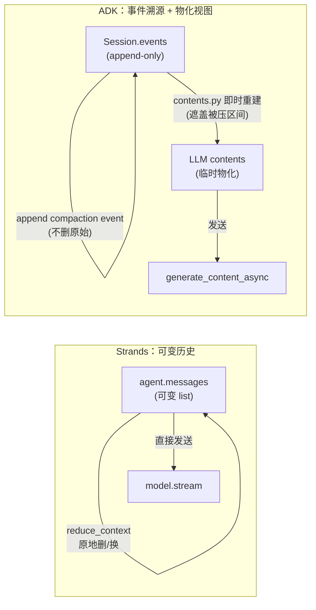
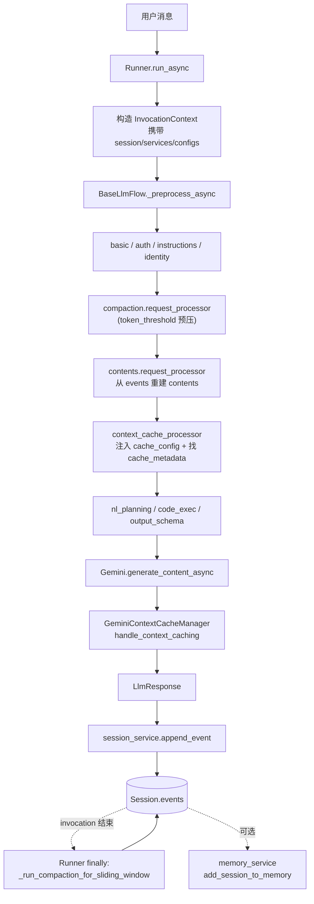
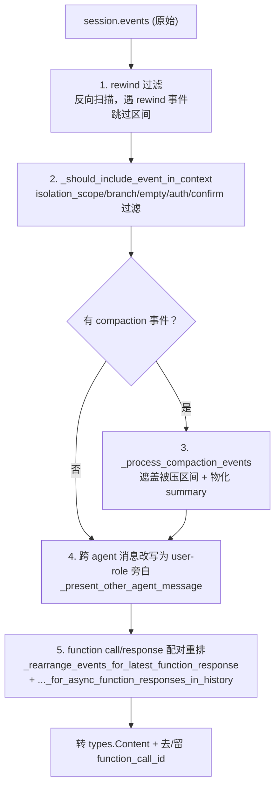

# Google ADK-Python 上下文管理机制 —— 源码级深度解读（对标 AWS Strands）

> 研究对象：`github.com/google/adk-python`（本地 clone：`/tmp/adk-python`，HEAD `73ecf8d`）
> 源码根：`src/google/adk/`
> 方法：逐行精读核心源码 + 测试用例反推设计意图 + 与上一份 Strands 报告横向对比
> 对比基准：`research/2026-06-18-strands-agentcore-context-compression.md`
> 产出人：黄山（System Architect & Technology Researcher）
> 日期：2026-06-18

---

## 0. 执行摘要

如果说 Strands 的上下文管理是「轻量双引擎」（声明式 ConversationManager + 模型驱动 Agentic 工具，二者共享一套 `compression/` 安全原语，直接原地改写 `agent.messages` 列表），那么 **Google ADK 是一套「事件溯源 + 服务化 + 多层」的重型产品化体系**。两者范式差异是根本性的：

1. **「一切皆 Event」的事件溯源模型**：ADK 不维护一个可变的 `messages` 数组。会话的唯一真相是 `Session.events`——一个**只追加（append-only）**的事件流。每次模型调用前，上下文是**从 events 流即时重建（rebuild）**出来的（`contents.py`），而非维护一份可变历史。压缩不删除原始 events，而是**追加一个 compaction summary event**，重建时让 summary「遮盖（subsume）」其覆盖时间段的原始 events。这是与 Strands「原地改写 messages」最根本的范式差异。

2. **压缩是「后置（post-invocation）+ 预处理（pre-request）」双时机、双触发**：
   - **触发一：sliding-window（间隔触发）**——按「**新 invocation 数**」计数，每累积 `compaction_interval` 个新用户轮次就压一次（`compaction.py:_run_compaction_for_sliding_window`）。
   - **触发二：token_threshold（阈值触发）**——当最近观测到的 prompt token 数 ≥ `token_threshold` 时，压掉旧事件、保留最近 `event_retention_size` 个原始事件。
   - **`overlap_size` 重叠**：sliding-window 的精髓——新压缩范围从「上一压缩区间结束前 `overlap_size` 个 invocation」开始，**让相邻 summary 在时间上重叠**，维持上下文连续性（避免摘要边界处语义断裂）。
   - **rolling summary（滚动摘要）**：token_threshold 路径会把**上一份 summary 作为种子事件（seed）放在待压列表开头**，让新摘要「吸收并取代」旧摘要——summary of summaries。

3. **上下文拼装（`contents.py`，1030 行）是 ADK 最核心、最复杂的文件**：每次请求都执行一条长流水——rewind 过滤 → isolation_scope/branch/empty/auth 过滤 → compaction 遮盖（`_process_compaction_events`）→ 跨 agent 消息改写为 user-role 旁白 → function call/response 配对重排（两个 rearrange 函数）→ 转 `types.Content`。**function-call/response 配对保护是在「拼装」阶段做的，而非「压缩」阶段**——这与 Strands 在压缩切点做 tool-pair 保护的时机不同。

4. **上下文缓存（`gemini_context_cache_manager.py`）是 ADK 相对 Strands 的最大补强**：Strands 报告里点名的「缺 prompt-cache 前缀保护」短板，ADK 有一整套机制——**指纹（fingerprint）+ 前缀 contents 计数 + cache_intervals/ttl 生命周期**。核心策略 `_find_count_of_contents_to_cache`：**缓存「最后一批连续 user content 之前」的所有内容**，即把稳定前缀做成 Gemini CachedContent，可变尾部正常发送。这正是 Strands 没有的「前缀稳定以命中 KV cache」优化。

5. **Session（短期）vs Memory（长期）双层服务**：
   - **Session**：当前会话的 events + state，多后端（in_memory/database/sqlite/vertex_ai）。State 有**三级作用域** `app:`/`user:`/`temp:` + 默认 session 级，前缀路由到不同持久化范围。
   - **Memory**：跨会话长期记忆，`add_session_to_memory` 摄取 + `search_memory` 检索，多后端（in_memory 关键词 / vertex_ai RAG / memory_bank）。通过 `PreloadMemoryTool` 在每次请求前 RAG 检索并注入 system instruction。

6. **设计哲学差异一句话总结**：Strands 把上下文当**可变状态**来管理（mutate messages in place），ADK 把上下文当**不可变事件日志的物化视图**来管理（rebuild from append-only events）。前者轻、直接、适合嵌入；后者重、可溯源、可恢复、多 agent 隔离，适合生产级有状态服务。

下文逐层展开，所有源码引用标注 `文件路径:行号`，真实从 `/tmp/adk-python` 读出。

---

## 1. 整体架构：五层全景 + 事件溯源模型

### 1.1 分层全景

ADK 的上下文管理可拆成五层，自底向上：

| 层 | 核心文件 | 职责 |
|----|---------|------|
| **E. 状态/记忆持久化** | `sessions/*`、`memory/*` | Session（events+state，多后端）、Memory（长期 RAG）、State 三级作用域 |
| **D. 上下文对象模型** | `agents/invocation_context.py`、`events/event.py`、`agents/context.py` | InvocationContext 容器、Event 模型、只读/可写/回调上下文分层 |
| **C. 上下文缓存** | `flows/llm_flows/context_cache_processor.py`、`models/gemini_context_cache_manager.py` | 利用 Gemini CachedContent，前缀稳定命中 KV cache |
| **B. 上下文拼装** | `flows/llm_flows/contents.py`、`base_llm_flow.py` | 每次请求从 events 重建 LLM contents（过滤/重排/配对/遮盖） |
| **A. 压缩/摘要** | `apps/compaction.py`、`apps/_configs.py`、`apps/llm_event_summarizer.py`、`flows/llm_flows/compaction.py` | 双触发压缩（间隔/阈值）、overlap、rolling summary、LLM 摘要 |

**关键架构洞察**：这五层都围绕一个中心数据结构——`Session.events`（`sessions/session.py:48-55`），一个 append-only 的 `list[Event]`。压缩层往里**追加** compaction event；拼装层从里**读取并物化**成 contents；缓存层对物化后的前缀做缓存；对象模型层把它包进 InvocationContext 传递；持久化层把它存到多后端。**没有任何一层会「删除」或「原地修改」已有的 event**——这是事件溯源（event sourcing）的本质。

### 1.2 事件溯源 vs 可变历史（与 Strands 的根本范式差异）



- **Strands**：`agent.messages` 是唯一真相且可变。压缩 = 原地删除/替换列表元素。摘要替换后**原文永久消失**（不可逆）。
- **ADK**：`Session.events` 是唯一真相且 append-only。压缩 = 追加一个带 `EventCompaction`（含 start/end timestamp + summary content）的 event。`contents.py` 每次重建时，**被 compaction 时间区间覆盖的原始 events 被「遮盖」不进 contents，但它们仍物理留在 events 流里**——理论上可溯源（虽然 ADK 默认不提供 expand 回放）。

这个差异决定了后续所有设计：ADK 的压缩不需要 tool-pair 切点保护（因为不删元素），但拼装时需要复杂的「遮盖 + 重排 + 配对」逻辑；ADK 天然支持多 agent 隔离（按 branch/isolation_scope 过滤同一 events 流的不同视图）；ADK 天然支持 rewind（追加 rewind 标记 event，重建时跳过）。

### 1.3 上下文在一次 invocation 中的数据流



**两个压缩时机**（这是 ADK 的关键设计，区别于 Strands 的「调用前钩子 + 溢出捕获」）：
1. **预处理时机（pre-request）**：`compaction.request_processor`（`single_flow.py:47-49`）在 contents 之前跑，只处理 **token_threshold** 触发——「Compaction should run before contents so compacted events are reflected in the model request context」（源码注释 `single_flow.py:46`）。
2. **后置时机（post-invocation）**：`runners.py:577-583`，在整个 invocation 的 `finally` 块里跑 `_run_compaction_for_sliding_window`，处理 **sliding-window** 间隔触发（并可选叠加 token_threshold，除非预处理已跑过 `skip_token_compaction=ic.token_compaction_checked`）。

这种「预处理压 token、后置压间隔」的双时机分工，与 Strands「BeforeModelCallEvent 主动 + 溢出 reactive + finally apply_management」的三嵌入点，是两种不同的生命周期编排哲学。

### 1.4 配置入口：App 容器

ADK 的上下文管理配置全部挂在 `App`（`apps/app.py`）这个顶层容器上（与 Strands 挂在 `Agent` 构造参数上不同）：

- `events_compaction_config: EventsCompactionConfig`（`app.py:88`）—— 压缩配置
- `context_cache_config: ContextCacheConfig`（`app.py:91`）—— 缓存配置，「applies to all LLM agents in the app」
- `resumability_config`（`app.py:93`）—— 可恢复性（暂停/恢复 invocation）

App 是 pydantic `BaseModel`，`extra="forbid"`（`app.py:62`），`root_agent` 必填校验（`app.py:113-115`）。配置在 App 级而非 Agent 级，体现 ADK「应用（多 agent 系统）」而非「单 agent」的产品定位。

---

## 2. 压缩机制深剖（对标 Strands 核心）

这是与 Strands 报告 §2-§6 的正面对标。ADK 压缩引擎全在 `apps/compaction.py`（632 行），是本次研究的重头。

### 2.1 配置语义：EventsCompactionConfig 四字段（`apps/_configs.py:46-81`）

```python
class EventsCompactionConfig(BaseModel):
  summarizer: Optional[BaseEventsSummarizer] = None   # 摘要器，None 则自动注入 LlmEventSummarizer
  compaction_interval: int                            # 间隔触发：每 N 个新 invocation 压一次
  overlap_size: int                                   # 重叠：新压缩范围回溯 N 个 invocation
  token_threshold: Optional[int] = Field(default=None, gt=0)        # 阈值触发
  event_retention_size: Optional[int] = Field(default=None, ge=0)   # 保留最近 N 个原始事件
```

**逐字段语义**：
- `compaction_interval`（必填）：「The number of *new* user-initiated invocations that, once fully represented in the session's events, will trigger a compaction」。注意计量单位是 **invocation（用户轮次）**，不是 Strands 的 message 条数或 token 数。
- `overlap_size`（必填）：「The number of preceding invocations to include from the end of the last compacted range. This creates an overlap between consecutive compacted summaries, maintaining context.」**这是 ADK 独有的设计，Strands 没有对应物**——详见 §2.4。
- `token_threshold`（可选，`gt=0`）：post-invocation token 阈值触发。「the most recently observed prompt token count meets or exceeds this threshold」——注意是「**最近观测到的** prompt token」，来自上一次 LLM 响应的 `usage_metadata`，不是当前请求的估算。
- `event_retention_size`（可选，`ge=0`）：token 触发时保留最近 N 个**原始**事件不压。

**`_validate_token_params` 校验（`_configs.py:84-93`）**：
```python
@model_validator(mode="after")
def _validate_token_params(self):
    token_threshold_set = self.token_threshold is not None
    retention_size_set = self.event_retention_size is not None
    if token_threshold_set != retention_size_set:
        raise ValueError("token_threshold and event_retention_size must be set together.")
    return self
```
用 `!=`（异或）强制「两个 token 字段要么都设、要么都不设」。`compaction_interval`/`overlap_size` 是必填字段（无默认值），所以**sliding-window 模式总是可用**，token-threshold 是叠加的可选增强。测试 `test_events_compaction_config_rejects_partial_token_fields`（`test_compaction.py:393`）锁定这一约束。

### 2.2 两种触发的全景判定（`_has_*_config`）

```python
def _has_token_threshold_config(config):   # compaction.py:202-209
    return bool(config and config.token_threshold is not None
                and config.event_retention_size is not None)

def _has_sliding_window_config(config):    # compaction.py:212-218
    return bool(config and config.compaction_interval is not None
                and config.overlap_size is not None)
```

主入口 `_run_compaction_for_sliding_window`（`compaction.py:425+`）的优先级逻辑（`compaction.py:560-575`）：
```python
# Prefer token-threshold compaction if configured and triggered.
if not skip_token_compaction and _has_token_threshold_config(config):
    token_compacted = await _run_compaction_for_token_threshold(app, session, session_service)
    if token_compacted:
        return None     # token 压了就不再 sliding-window 压
if not _has_sliding_window_config(config):
    return None
```
**token-threshold 优先于 sliding-window**：若 token 触发成功，本轮直接 return，不再做间隔压缩。这是「阈值是更紧急的信号」的体现。

### 2.3 sliding-window（间隔触发）数据流逐行走读（`compaction.py:425-632`）

这是 ADK 压缩的「常规节拍器」。算法（去掉 token 分支后）：

```python
# 1. 找上一次压缩的结束时间戳（反向扫描第一个 compaction event）
last_compacted_end_timestamp = 0.0
for event in reversed(events):
    if event.actions.compaction and event.actions.compaction.end_timestamp:
        last_compacted_end_timestamp = event.actions.compaction.end_timestamp
        break

# 2. 收集每个 invocation_id 的最新时间戳（只看非 compaction event）
invocation_latest_timestamps = {}
for event in events:
    if event.invocation_id and not event.actions.compaction:
        invocation_latest_timestamps[event.invocation_id] = max(..., event.timestamp)
unique_invocation_ids = list(invocation_latest_timestamps.keys())  # 保序

# 3. 哪些 invocation 是「上次压缩后才出现的新轮次」
new_invocation_ids = [inv for inv in unique_invocation_ids
                      if invocation_latest_timestamps[inv] > last_compacted_end_timestamp]

# 4. 不够阈值就不压
if len(new_invocation_ids) < config.compaction_interval:
    return None

# 5. 计算压缩范围 [start_inv, end_inv]
end_inv_id = new_invocation_ids[-1]            # 范围终点 = 最后一个新轮次
first_new_inv_idx = unique_invocation_ids.index(new_invocation_ids[0])
start_idx = max(0, first_new_inv_idx - config.overlap_size)   # ★ overlap 回溯
start_inv_id = unique_invocation_ids[start_idx]
```

然后用 `start_inv_id`/`end_inv_id` 定位 events 切片，**过滤掉切片里已有的 compaction event**，再过 `_longest_self_contained_prefix`（见 §2.6），最后调 `_ensure_compaction_summarizer` + `_summarize_events_with_trace`，把生成的 compaction event `append_event` 回 session。

**关键洞察**：ADK 按 **invocation（用户轮次）粒度** 计数与切割，而非 Strands 的 message 粒度或 token 比例。一个 invocation 可能包含多条 events（user 输入 + model 回复 + 多次 tool 往返）。这种粒度更「业务对齐」——压缩边界天然落在完整轮次之间，不会把一轮对话从中切开。

### 2.4 overlap_size 重叠的设计意图（ADK 独有，Strands 无对应）

这是 ADK 压缩最值得讲的一处。看官方 docstring 给的例子（`compaction.py:443-490`，`compaction_interval=2, overlap_size=1`）：

- inv1,inv2 完成 → 触发，压 `[1,2]` → 追加 `CompactedEvent(inv=[1,2])`
- inv3 完成 → 只有 1 个新轮次 < 2，不压
- inv4 完成 → inv3,inv4 共 2 个新轮次 ≥ 2，触发。上次压到 inv2，`overlap_size=1` 让新范围从「新块(inv3)前 1 个 invocation」即 **inv2** 开始 → 压 `[2,4]` → 追加 `CompactedEvent(inv=[2,4])`

测试 `test_run_compaction_for_sliding_window_with_overlap`（`test_compaction.py:293-345`）实测：上次压 `[1,2]`，新增 inv3/4/5（3>2），overlap=1 → 实际送进 summarizer 的事件是 `['inv2','inv3','inv4','inv5']`——**inv2 被重复纳入第二份摘要**。

**为什么要重叠**？相邻两份摘要 `[1,2]` 与 `[2,4]` 在 inv2 上重叠。重建上下文时（§3），后者「遮盖」前者（subsume，因为范围更大）。重叠保证了：当新摘要接替旧摘要时，**新摘要的开头携带了旧区间尾部的上下文**，不会出现「摘要A讲到inv2戛然而止，摘要B从inv3突兀开始」的语义断层。这相当于给摘要流加了「滑动窗口的步进重叠」，维持跨摘要的叙事连续性。**Strands 的 Summarizing 没有这个机制**——它每次把最旧段折叠成一条 summary 消息直接替换，相邻摘要之间无重叠保护。这是 ADK 在「摘要连续性」上的一个独到设计。

### 2.5 token_threshold（阈值触发）数据流（`compaction.py:380-422`）

```python
async def _run_compaction_for_token_threshold_config(...):
    if not _has_token_threshold_config(config): return False
    # 1. 取最近观测 token 数（优先 usage_metadata，否则按 contents 估算 chars//4）
    prompt_token_count = _latest_prompt_token_count(session.events, ...)
    if prompt_token_count is None or prompt_token_count < config.token_threshold:
        return False    # 没到阈值
    # 2. 选取待压事件（保留最近 event_retention_size 个原始事件）
    events_to_compact = _events_to_compact_for_token_threshold(
        events=session.events, event_retention_size=config.event_retention_size)
    if not events_to_compact: return False
    # 3. 摘要 + 追加
    _ensure_compaction_summarizer(config=config, agent=agent)
    compaction_event = await _summarize_events_with_trace(..., trigger='token_threshold')
    if compaction_event:
        await session_service.append_event(session=session, event=compaction_event)
        return True
```

`_latest_prompt_token_count`（`compaction.py:166-179`）：反向找第一个有 `usage_metadata.prompt_token_count` 的 event；找不到则回退到 `_estimate_prompt_token_count`——**复用 `contents._get_contents` 走一遍真实拼装路径**，数文本字符 `//4` 估算（`compaction.py:120-145`）。注释明确：「mirrors the effective content-building path used by the contents request processor」——估算与真实拼装同源，避免偏差。

`_events_to_compact_for_token_threshold`（`compaction.py:230-290`）：
- 取「上次压缩结束时间戳之后的、非 compaction 的」候选事件
- `if len(candidate_events) <= event_retention_size: return []`——候选还没超过保留数，不压
- 切割点 `_safe_token_compaction_split_index`（见 §2.6）保证不孤立 tool response
- `_longest_self_contained_prefix` 再保证 tool-pair 闭合
- **rolling summary 种子**：见 §2.7

测试 `test_run_compaction_for_token_threshold_keeps_retention_events`（`test_compaction.py:452`）、`..._equal_threshold_compacts`（阈值 100、token 100 → 等于即触发，验证 `>=` 语义）、`..._with_zero_retention`（retention=0 → 压全部候选）逐一锁定边界。

### 2.6 tool-pair 安全：与 Strands 同目标、不同时机与手法

ADK 也要保护 function_call/function_response 配对，但因为不删元素，它保护的是「压缩区间边界」而非「删除切点」。两个关键函数：

**一、`_longest_self_contained_prefix`（`compaction.py:316-339`）**——返回「可安全压缩的最长前缀」：
```python
open_ids = set()
safe_length = 0
for index, event in enumerate(events):
    open_ids -= _event_function_response_ids(event)   # 先闭合（响应减 obligation）
    open_ids |= _event_function_call_ids(event)        # 再开启（调用加 obligation）
    if event.actions:
        open_ids |= set(event.actions.requested_tool_confirmations)
        open_ids |= set(event.actions.requested_auth_configs)
    if not open_ids:               # 所有义务都闭合了 → 这是个安全点
        safe_length = index + 1
return events[:safe_length]
```
设计哲学：用「未闭合调用 id 集合」跟踪 obligation。function_call / tool-confirmation / auth-request 开启一个 obligation，同 id 的 function_response 闭合它。**响应在同事件内先于开启处理**，确保一个响应只能闭合「更早事件」开的义务。只在 obligation 全部闭合的点才是可摘要边界，返回以该点结尾的最长前缀（若窗口始终未平衡则返回空）。这与 Strands `adjust_split_point_for_tool_pairs` 目标一致（不拆配对），但 Strands 是「向前推进切点」，ADK 是「取最长平衡前缀」。

**二、`_safe_token_compaction_split_index`（`compaction.py:342-377`）**——防止「保留的 tool response 被孤立」：保留尾部事件可能含 function_response，如果它们的 function_call 在被压的前缀里，拼装会失败。算法反向扫描，维护未匹配响应 id 集，把切点往前移到「没有未匹配响应」的位置，让 function_call 与其 response 一起被保留。测试 `test_run_compaction_for_token_threshold_keeps_tool_call_pair`（`test_compaction.py:501`）锁定。

**与 Strands 的时机差异**：Strands 在**压缩时**做 tool-pair 切点保护（因为要删元素）；ADK 在**压缩选事件时**保证压缩区间自闭合，另外还在**拼装时**（§3）用两个 rearrange 函数做二次配对保护。ADK 的保护是「压缩端 + 拼装端」双重的。

### 2.7 rolling summary（滑动摘要）：summary of summaries

token_threshold 路径的精华（`compaction.py:270-289`）：若存在上一份压缩事件，**把它的 summary content 作为一个「种子事件」放在待压列表开头**：
```python
if latest_compaction_event and ...compacted_content is not None:
    seed_event = Event(
        timestamp=latest_compaction_event.actions.compaction.start_timestamp,
        author='model',
        content=latest_compaction_event.actions.compaction.compacted_content,
        branch=latest_compaction_event.branch,
        invocation_id=Event.new_id())
    return [seed_event] + events_to_compact
```
这样新摘要 = summarize(旧摘要 + 新增原始事件)——**summary of summaries**。测试 `test_run_compaction_for_token_threshold_seeds_previous_compaction`（`test_compaction.py:631-688`）实测：上有 `Summary 1-2`，新增 e3-e6，retention=2，送进 summarizer 的是 `['Summary 1-2', 'e3', 'e4']`——旧摘要被当作第一条输入，且 seed 的 timestamp 被设为旧摘要的 start_timestamp（1.0），使新摘要的覆盖区间从 1.0 起「吞掉」旧摘要 → 重建时新摘要 subsume 旧摘要。

**这是 ADK 压缩的另一个亮点**：不是「叠加多份独立摘要」，而是「后一份摘要吞并前一份」，保证上下文里始终只有一份有效摘要（加保留的原始尾部）。与 Strands 的单一 `_summary_message` 覆盖语义相近，但 ADK 是通过「时间戳 subsume + seed 重入」在事件流上实现的，不需要专门的 `_summary_message` 成员。

### 2.8 LLM 摘要器 LlmEventSummarizer（`apps/llm_event_summarizer.py`）

摘要 prompt 模板（`llm_event_summarizer.py:48-56`）：
```
The following is a conversation history between a user and an AI agent. It may or
may not start from a compacted history. Please identify and reiterate the user
request, summarize the context so far, focusing on key decisions made and
information obtained, as well as any unresolved questions or tasks. ...
{conversation_history}
```
注意「It may or may not start from a compacted history」一句——这正是为 rolling summary 设计的，提示模型输入可能已是摘要。

**关键设计：`_format_events_for_prompt`（`:79-110`）把 events 渲染成纯文本**（而非结构化 contents）：
- thought（思考）也纳入（`{author} (thought): ...`）——「Thoughts carry the agent's analysis of tool responses」；但**compaction 事件的 thought 跳过**，防止上一份摘要的推理泄漏进下一份。
- function_call 渲染为 `{author} called tool: name(args)`，function_response 渲染为 `Tool response from name: ...`——证据保留。
- `_truncate`（`:112-117`）：每个 tool args/response 截断到 `_MAX_TOOL_CONTENT_CHARS=2000`（`:60`），标记 `... [truncated N chars]`——「so compaction does not inflate the very context it exists to shrink」（注释 `:58-59`）。这与 Strands Sliding Window 截 tool 结果到首尾 200 字符思路一致，但发生在摘要输入阶段。

`maybe_summarize_events`（`:119-171`）：构造 `LlmRequest`（单条 user content = prompt）→ `generate_content_async(stream=False)` 拿第一个有 content 的响应 → **强制 `summary_content.role = 'model'`**（与 Strands 强制 user-role 相反！）→ 包成 `EventCompaction(start_timestamp=events[0].ts, end_timestamp=events[-1].ts, compacted_content=summary)` → 返回 `Event(author='user', actions=EventActions(compaction=...))`。

**两个 role 细节耐人寻味**：summary content 是 `role='model'`（拼装时作为 model 发言出现），但承载它的 Event 是 `author='user'`。这是因为在 ADK 的事件模型里，author 是「谁追加了这个事件」，而 content.role 是「发给模型时的角色」。摘要作为「历史的模型侧陈述」更合适用 model role，这与 Strands「摘要是用户提供的背景」用 user role 是两种不同的建模选择。

---

## 3. 上下文拼装走读（`contents.py`，1030 行）

这是 ADK 上下文管理最核心也最复杂的文件，对标 Strands 没有独立的「拼装」阶段（Strands 直接发 `agent.messages`）。ADK 因为是从 events 流重建，每次请求都要跑一条长流水。

### 3.1 入口：include_contents 两模式（`contents.py:79-101`）

```python
if agent.include_contents == 'default':
    llm_request.contents = _get_contents(branch, session.events, agent.name, ...)
else:   # 'none'
    llm_request.contents = _get_current_turn_contents(branch, session.events, ...)
```
- `'default'`：包含完整会话历史（走 `_get_contents`）。
- `'none'`：只包含当前轮（`_get_current_turn_contents`，`:730-770`）——反向找最近一个 user / 其他 agent 回复的事件，从那里切到末尾再走 `_get_contents`。这是「无记忆 agent」（每轮独立）的场景。

### 3.2 `_get_contents` 流水线（`:586-700`）——五步重建



**第 1 步 rewind 过滤**（`:611-628`）：反向扫描，遇到带 `rewind_before_invocation_id` 的事件，就跳回到那个 invocation，中间的事件被从历史中移除。这就是事件溯源「追加标记、重建时跳过」实现 rewind 的例子——Strands 无此能力。

**第 2 步过滤**（`_should_include_event_in_context`，`:380-410`）过掉：isolation_scope 不匹配、空内容、不属于当前 branch、ADK 框架事件、auth 事件、确认请求事件。

**第 5 步跨 agent 改写**（`_present_other_agent_message`，`:772-840`）：另一个 agent 的消息被重写成 `role='user'` 且加 `[agent_name] said:` / `called tool` / `returned result:` 前缀。这是多 agent 共享上下文时避免「谁说的」混乱的手法——把其他 agent 的发言降级为「背景旁白」。Strands 无此（它是单 agent messages）。

### 3.3 压缩遮盖：`_process_compaction_events`（`:412-490`）

这是「压缩如何注入回 contents」的核心，对标 Strands「摘要替换最旧段」：

1. **收集所有有效 compaction 事件**的 (index, start_ts, end_ts)。
2. **计算 subsumed（被遮盖）集合**：若 compaction A 的区间完全包含 B（`other_start <= start and other_end >= end`），且 A 严格更大或 index 更靠后，则 B 被 subsume。这处理了 overlap 产生的重叠摘要——`[1,2]` 被 `[2,4]`？不，`[2,4]` 不包含 `[1,2]`（start 2>1）。但 rolling summary 场景里新摘要 start=旧摘要 start，则新者包含旧者 → 旧者 subsumed。
3. **物化 summary 为临时 Event**：非 subsumed 的 compaction，在其 `end_timestamp` 位置生成一个 `Event(author='model', content=compacted_content)`。
4. **过滤被覆盖的原始事件**：`_is_timestamp_compacted(ts)`——原始事件的 timestamp 落在任何保留 compaction 区间内则跳过。
5. **按时间戳排序**（稳定 tie-breaker：原 index）返回。

**与 Strands 的本质区别**：Strands 的摘要是「原地列表拼接」`protected + [summary] + remaining`，原文已物理删除；ADK 的遮盖是「原始事件仍在、仅拼装时按时间戳过滤」。这意味着：同一个 session 可被不同 agent（不同 branch/isolation_scope）以不同方式重建；compaction 事件本身也是 event，能被后续更大的 compaction 遮盖（多代 rolling summary 叠加时只保留最终一代可见）。**这是「可重放、可多视图」 vs 「不可逆单视图」的根本差异。**

### 3.4 function call/response 配对保护（拼装阶段）

两个 rearrange 函数（对标 Strands 的 tool-pair 保护，但时机不同）：

**一、`_rearrange_events_for_latest_function_response`（`:159-240`）**：若最后一个事件是 async function_response，把它与对应 function_call 之间的中间事件清理、合并为一个响应事件。还做了严格校验：「Last response event should only contain the responses for the function calls in the same function call event」，不满足招 `ValueError`。

**二、`_rearrange_events_for_async_function_responses_in_history`（`:117-156`）**：把历史中的异步 function_response 重新排序，让每个 function_call 紧跟其 response；多个异步响应合并为一条（`_merge_function_response_events`，`:842-910`）。目标明确（注释）：「function_call and function_response are always of the same number」且「consecutively in the content」。

**function_call_id 的去留策略**（`:43-77`）是个精微点：`preserve_function_call_ids` 默认 False（Gemini 不需 id），但如果是 Anthropic / LiteLLM / Gemini Interactions API——这些 provider 靠 id 配对 tool call——则保留 id，以免 replay 时配对断裂。这比 Strands「所有 provider 统一靠位置配对」更细腻。

### 3.5 指令注入位置（`_add_instructions_to_user_content`，`:960-1030`）

instruction 相关 content（system 指令、preload memory 注入等）不是简单 append，而是插在「最后一批连续 user content 之前」。反向扫描找插入点：遇到非 user content 或含 function_response 的 content 就插在其后。这保证指令/记忆总是紧贴当前用户问题，而不是被压在历史末尾。

---

## 4. 上下文缓存（重点对比 Strands 短板）

Strands 报告 §12.2 点名的最大短板——「缺乏 prompt-cache 前缀保护，删头/换前缀会击穿 KV cache」——ADK 有一整套机制补上了。

### 4.1 两层结构：processor 接线 + manager 执行

- **`context_cache_processor.py`**（processor，在 contents 之后跑）：设 `llm_request.cache_config`，并从 session events 反向找最近的 `cache_metadata` 与 `previous_token_count`。关键：若找到的 cache 来自「不同 invocation 且有活跃 cache」，则 `invocations_used + 1`（`context_cache_processor.py:120-135`）——跟踪 cache 复用了几轮。
- **`gemini_context_cache_manager.py`**（manager，在模型调用时执行）：真正创建/复用/清理 Gemini CachedContent。

### 4.2 前缀稳定策略：`_find_count_of_contents_to_cache`（`gemini_context_cache_manager.py:163-191`）

这是 ADK 「前缀稳定以命中 KV cache」的核心：
```python
# Strategy: Find the last continuous batch of user contents and cache
# all contents before them.
last_user_batch_start = len(contents)
for i in range(len(contents) - 1, -1, -1):
    if contents[i].role == "user":
        last_user_batch_start = i
    else:
        break
return last_user_batch_start   # 缓存这个位置之前的所有 content
```
**设计意图**：把「最后一批连续 user content」之前的所有内容（= 稳定的历史前缀）做成 CachedContent，可变的尾部（当前用户轮次）正常发送。这样跨轮次时前缀逐字节不变 → Gemini KV cache 命中。**这正是 Strands 缺的**。

### 4.3 指纹（fingerprint）与生命周期

`_generate_cache_fingerprint`（`:259-303`）：sha256 哈希 `{system_instruction, tools, tool_config, 前N个contents}` 取前 16 位。**指纹变了说明前缀变了 → cache 失效**。`_is_cache_valid`（`:213-257`）检查四件事：非 fingerprint-only、未过期（`time.time() < expire_time`）、未超 `cache_intervals`、指纹匹配。

### 4.4 创建与应用 cache

`_create_new_cache_with_contents`（`:305-340`）三道门槛：无 `previous_token_count` 不建（首轮不缓存）、`< min_tokens` 不建、`< _GEMINI_MIN_CACHE_TOKENS=4096`（`:34`）不建（客户端先拦避免无用 round-trip）。`_apply_cache_to_request`（`:430-455`）：把 system_instruction/tools/tool_config 置 None（它们已在 cache里）、设 `config.cached_content = cache_name`、`contents = contents[cache_contents_count:]`（只留未缓存的尾部）。

### 4.5 ContextCacheConfig 参数（`agents/context_cache_config.py`）

- `cache_intervals=10`（`ge=1,le=100`）：同一 cache 最多复用多少轮后刷新。
- `ttl_seconds=1800`（30 分钟）：cache TTL。
- `min_tokens=0`：启用缓存的最小「上一请求实际 token 数」门槛。docstring 明确：「Gemini enforces a hard 4096-token minimum」、「No cache is created on the first request of a session; caching begins on the second turn」。
- `create_http_options`：可给 `CachedContent.create()` 加超时，超时则无缓存继续请求。

### 4.6 与 Strands / Claude Code 的缓存经济学对比

| 维度 | ADK | Strands | Claude Code (cache_edits) |
|------|-----|---------|--------------------------|
| 前缀稳定 | ✅ 缓存「最后一批 user 之前」的前缀 | ❌ 无（删头/换前缀击穿） | ✅ 删尾不删头保前缀 |
| 缓存载体 | Gemini CachedContent（显式创建/复用） | 无 | Anthropic prompt cache 断点 |
| 失效检测 | fingerprint 指纹 + 过期 + intervals | 无 | tool_use 定向删除保前缀逐字节 |
| 与压缩的冲突 | 压缩追加 summary event 会改变拼装后前缀 → cache 失效重建 | 压缩删头直接击穿 | 压缩设计与缓存协同 |

**一个重要洞察（ADK 自身的 trade-off）**：ADK 的缓存与压缩是**两个独立机制，且会互相干扰**。一旦 sliding-window/token 压缩追加了新 summary event，下次拼装出的 contents 前缀就变了（summary 取代了一批原始事件），`_generate_cache_fingerprint` 检测到指纹不匹配 → 旧 cache 作废重建。所以 ADK 虽有前缀缓存，但压缩事件仍会阶段性击穿缓存——只是压缩发生频率低（按 invocation 间隔），不像 Strands 那样每次压都击穿。Claude Code 的 cache_edits 才是真正「压缩与缓存协同」（定向删 tool_use 保前缀逐字节）。三者排序：Claude Code > ADK > Strands。

---

## 5. Session（短期）vs Memory（长期）双层

ADK 明确区分两种记忆，这是 Strands 没有的产品化分层（Strands 只有 messages + 可选 SessionManager 持久化）。

### 5.1 Session：events + state，多后端

`Session`（`sessions/session.py`）= `id/app_name/user_id/state(dict)/events(list)/last_update_time`。主体是 `events`（append-only）与 `state`。多后端：
- `InMemorySessionService`（原型/测试）
- `DatabaseSessionService`（32KB，生产级关系型）
- `SqliteSessionService`
- `VertexAiSessionService`（托管）

`append_event`（`base_session_service.py:154-165`）是上下文写入的唯一入口：partial 事件不落、先 `_apply_temp_state` 再 `_trim_temp_delta_state` 再 `_update_session_state`，最后 `events.append`。

### 5.2 State 三级作用域（`sessions/state.py` + `_session_util.py`）

State 用键名**前缀路由**到不同持久化范围（`state.py:60-62`）：
- `app:` → APP_PREFIX：应用级，跨所有用户/会话共享
- `user:` → USER_PREFIX：用户级，跨该用户所有会话共享
- `temp:` → TEMP_PREFIX：临时，**仅本次 invocation 内存有效，不持久化**
- 无前缀 → session 级（默认）

`extract_state_delta`（`_session_util.py:37-49`）按前缀拆成 `{app, user, session}` 三个 delta（temp 被排除在持久化外）。`_merge_state`（`in_memory_session_service.py:224-246`）读取时把 app/user state 加回前缀合并进 session.state。`temp:` 的巧妙：`_apply_temp_state` 把它写进内存 session.state（让同一 invocation 内后续 agent 能读，如 SequentialAgent 的 `output_key='temp:x'`），但 `_trim_temp_delta_state` 从 event delta 里删掉（不落盘）。

**State schema 校验**（`state.py:30-58`）：可选 pydantic schema，`__setitem__` 时校验键名与类型；含 `:` 的前缀键跳过校验。

### 5.3 Memory：长期跨会话记忆（`memory/*`）

`BaseMemoryService`（`base_memory_service.py`）三个方法：`add_session_to_memory`（摘取整个 session）、`add_events_to_memory`（增量摘取部分事件）、`search_memory`（检索）。多后端：
- `InMemoryMemoryService`：**关键词匹配**（`_extract_words_lower` 取交集），仅原型。
- `VertexAiRagMemoryService`：把 session events 写临时 txt 上传 RAG corpus（display_name 编码 app/user/session），`search_memory` 走 `rag.retrieval_query` 语义检索。有 `_merge_event_lists` 去重叠。
- `VertexAiMemoryBankService`（31KB）：托管记忆库。

### 5.4 记忆注入上下文：PreloadMemoryTool（`tools/preload_memory_tool.py`）

这是「长期记忆→当前上下文」的桥。`process_llm_request` 每次请求自动跑（不被模型调用）：取 user query → `search_memory(query)` → 把命中记忆拼成 `<PAST_CONVERSATIONS>...</PAST_CONVERSATIONS>` → `append_instructions` 注入系统指令。这是 RAG-augmented context，与 Strands 的 ContextInjector 思路相近（注入不进历史的临时上下文）。另有 `LoadMemoryTool`（模型主动调用检索）。

**双层分工总结**：Session = 短期「这次对话」（events 按时间顺序重建）；Memory = 长期「跨对话记忆」（语义/关键词检索注入）。压缩只作用于 short-term session events；memory 是另一条独立的持久化路径。

---

## 6. 上下文对象模型层

### 6.1 Event：一切的原子（`events/event.py` + `event_actions.py`）

`Event` 继承 `LlmResponse`，关键字段：
- `invocation_id`：所属调用（用户轮次）——压缩按此计数。
- `author`：'user' 或 agent 名。
- `actions: EventActions`——携带副作用（重要）。
- `branch`：`agent_1.agent_2.agent_3` 形式，多子 agent 不见彼此历史。
- `isolation_scope`：任务隔离作用域（Task API）。
- `timestamp`：压缩遮盖、拼装排序的依据。

`EventActions`（`event_actions.py`）是上下文流转的枢纽，含：
- `state_delta: dict`——状态变更（按前缀路由到三级作用域）。
- `artifact_delta: dict`——产物版本。
- `compaction: EventCompaction`——**压缩摘要就存在这里**（start_timestamp/end_timestamp/compacted_content）。
- `rewind_before_invocation_id`——rewind 标记。
- `requested_auth_configs` / `requested_tool_confirmations`——开启 tool-pair obligation。
- `transfer_to_agent` / `escalate` / `end_of_agent` / `agent_state`——多 agent 调度与 checkpoint。

**「一切皆 Event」如何统领上下文**：user 输入、model 回复、tool 调用/响应、状态变更、压缩摘要、rewind、agent 转移——全都是 Event。上下文 = events 流的某个物化视图。这是与 Strands「Message 是唯一公民，其他（metrics/traces）是旁路」最大的模型差异。

### 6.2 InvocationContext：贯穿一次调用的容器（`agents/invocation_context.py`）

一个大 pydantic 容器，携带：`session`、`session_service`、`memory_service`、`artifact_service`、`context_cache_config`、`events_compaction_config`、`branch`、`isolation_scope`、`invocation_id`、`agent`、`user_content`、`token_compaction_checked`、`plugin_manager` 等。它是拼装/压缩/缓存各 processor 的共享传递载体。`_get_events`（`:340-370`）提供按 invocation/branch 过滤的 events 视图。`increment_llm_call_count`、`LlmCallsLimitExceededError` 限流。

### 6.3 上下文对象分层：只读/可写/回调

- `ReadonlyContext`（`readonly_context.py`）：只暴露 `user_content/invocation_id/agent_name/state(MappingProxyType 只读)/session/user_id`。`state` 用 `MappingProxyType` 包装保证不可变。用于 instruction provider 等只读场景。
- `CallbackContext = Context`（`callback_context.py`）：统一为 `Context`（`context.py`，31KB），可读写 state、访问 artifact/memory。

这种「只读/可写」分层是为了在不同生命周期钩子（instruction 生成 vs tool 回调）暴露不同权限面，防止误改。Strands 无此分层（直接传 agent）。

---

## 7. 设计哲学与 trade-off

### 7.1 三组根本张力

1. **事件溯源（append-only）vs 可变状态**
   - ADK：Session.events 不可变，上下文是物化视图。**优**：可溯源、可多视图（多 agent 隔离）、可 rewind、可 resume。**劣**：每次请求要跑完整拼装流水（1030 行 contents.py），计算开销大，复杂度高。
   - Strands：agent.messages 可变，直接发送。**优**：轻、快、直接。**劣**：不可溯源（摘要不可逆）、单视图。

2. **服务化（多后端）vs 嵌入式**
   - ADK：Session/Memory 都是可插拔服务（in_memory/database/sqlite/vertex_ai），面向生产部署。代价是重、依赖多。
   - Strands：轻量，SessionManager 是可选挂件。适合嵌入、函数级部署。

3. **压缩决策主体：框架 vs 模型**
   - ADK：**纯框架决策**（间隔/阈值/retention/overlap 都是确定性规则）。无模型驱动压缩。
   - Strands：双引擎——框架阈值 + Agentic 模型自管（summarize/truncate/pin 三工具）。**这是 Strands 相对 ADK 的亮点**——让模型按语义相关性掌的 pin/压缩，ADK 无此能力。

### 7.2 各自适用场景

- **选 ADK**：需要生产级有状态服务、多后端持久化、多 agent 上下文隔离、会话可恢复/rewind、长期 RAG 记忆、Gemini 前缀缓存。适合企业平台、多租户。
- **选 Strands**：需要轻量嵌入、模型驱动的语义感知压缩、开箱即用的 auto 组合。适合单 agent、SDK 集成。

### 7.3 两个值得称道的 ADK 工程决策

1. **overlap_size 重叠摘要**：用「滑动窗口重叠」保证跨摘要连续性，这是 Strands 纯替换式摘要没有的。
2. **rolling summary seed 重入**：用事件流上的 timestamp subsume + seed event，实现 summary-of-summaries，不需专门状态。

### 7.4 ADK 的独特于 Strands 之处 / 反之

- **ADK 独有**：事件溯源、多后端服务、State 三级作用域、Session/Memory 双层、Gemini 前缀缓存、overlap 重叠、rewind、多 agent isolation_scope/branch 隔离、resumability。
- **Strands 独有**：Agentic 模型驱动压缩（三工具 + telemetry）、显式 pin 机制、proactive/reactive 双触发溢出恢复、ContextOffloader 大结果卸载。
- **双方都有**：LLM 摘要压缩、tool-pair 保护（时机不同）、token 估算、持久化。

---

## 8. 横向对比表：ADK vs Strands vs OpenClaw LCM

| 维度 | **Google ADK** | **AWS Strands** | **OpenClaw LCM（我们）** |
|------|---------------|-----------------|---------------------|
| 核心范式 | 事件溯源 + 服务化多层（append-only events 物化视图） | 轻量双引擎（可变 messages 原地改写） | 无损分层压缩（summary 是可 expand 的 DAG） |
| 压缩触发 | 双触发：sliding-window（按 invocation 间隔）+ token_threshold（阈值） | 双触发：proactive（阈值钩子）+ reactive（溢出捕获） | 阈值/事件驱动 |
| 压缩粒度 | **invocation（用户轮次）** | message 条数 / token 比例 | 消息/轮次 |
| 压缩时机 | pre-request（token）+ post-invocation（间隔） | before-model 钩子 + 溢出 + finally | 推理循环内 |
| tool-pair 保护 | 压缩选事件（self-contained prefix）+ 拼装重排双重 | 压缩切点（adjust_split / find_trim） | tool-pair 保护 |
| 缓存友好 | **✅ 前缀稳定缓存「最后一批user之前」+ 指纹失效检测** | ❌ 无（删头击穿） | 部分（看实现） |
| 有损/无损 | 半有损（摘要有损，但原始 event 物理保留、理论可溯源） | 有损（原文物理删除） | **无损（可 expand 还原）** |
| 持久化 | **多后端（in_memory/db/sqlite/vertex_ai）** | 可选 SessionManager | 文件 + DAG |
| 长期记忆 | **✅ Memory 服务（RAG/memory_bank）+ preload 注入** | 无专门层（ContextOffloader 近似） | file_xxx + grep/expand |
| 决策主体 | **纯框架**（确定性规则） | 框架 + **模型自管（Agentic）** | 框架 + 可检索 |
| 多 agent 隔离 | **✅ branch + isolation_scope** | 无（单 agent） | — |
| 可溯源/rewind | **✅ rewind event + 事件溯源** | ❌ | ✅ expand |
| 状态作用域 | **app/user/session/temp 四级** | 无（messages 扯平） | — |

**三者哲学一句话**：ADK 追求「生产级可溯源 + 服务化」，Strands 追求「轻量灵活 + 模型自管」，LCM 追求「零信息丢失」。

---

## 9. 关键洞察与局限

### 9.1 亮点

1. **事件溯源是最底层的架构决策**：append-only events + 物化视图一口气解决了 rewind、多 agent 隔离、resume、可溯源、压缩不损原始五件事。压缩只是「追加一个遮盖性 summary event」，优雅。
2. **overlap_size 重叠摘要**：业界少见的「摘要连续性」设计，比纯替换式摘要更能维持跨段语义。
3. **rolling summary**：summary-of-summaries 控制上下文里始终只有一代有效摘要。
4. **前缀稳定缓存**：直接补上了 Strands 点名的短板，「最后一批user之前」的策略简单有效。
5. **token 估算与拼装同源**：`_estimate_prompt_token_count` 复用 `_get_contents`，避免估算与实际偏差。
6. **State 三级作用域 + temp 语义**：`temp:` 「内存可读、不落盘」的设计服务于 SequentialAgent 跨 agent 传值。

### 9.2 局限与短板

1. **无模型驱动压缩**：ADK 压缩全是确定性框架规则（按轮次/阈值），**没有 Strands Agentic 那种「让模型按语义相关性决定压什么/保什么」的能力**。也没有显式 pin 机制保护关键消息。这是 ADK 相对 Strands 的明显缺口。
2. **摘要不可逆（实践上）**：虽然原始 event 物理留在 events 流里（理论可溯源），但 ADK **不提供 expand/回放 API**，拼装时被压区间被永久遮盖。不如 LCM 的主动可 expand。
3. **缓存与压缩互干扰**（§4.6）：压缩追加 summary event 会改变拼装前缀 → 指纹失配 → cache 作废重建。两个机制未协同（不如 Claude Code cache_edits）。
4. **拼装流水复杂度高**：contents.py 1030 行，每次请求跑 rewind/过滤/遮盖/重排/跨agent改写全流，计算开销与维护成本都高。事件越多，重建越慢（虽有 token 压缩缓解）。
5. **token 阈值依赖上一轮 usage_metadata**：冷启动或缺失时退化为 `chars//4` 粗估，不如真实 tokenizer 准。
6. **in_memory 记忆只是关键词匹配**：语义检索需 Vertex AI RAG（绑定 GCP），本地可用性受限。

### 9.3 对自研 harness 的启示

- **可借鉴**：overlap 重叠摘要（维持跨摘要连续性）、rolling summary seed 重入、前缀稳定缓存「最后一批user之前」、State 三级作用域、事件溯源支撑 rewind/多视图。
- **我们的优势**：LCM 无损可 expand > ADK「遮盖但不提供回放」；若再补上 ADK 式的事件溯源 + 多视图，可兼得无损 + 可溯源 + 多 agent 隔离。
- **共同待补**：ADK 与 Strands 都缺「压缩与缓存真正协同」，这提醒我们若引入摘要务必评估对 prompt cache 的冲击。

---

## 附录：核心源码文件清单（行号基于 HEAD 73ecf8d）

| 文件 | 行数 | 职责 |
|------|------|------|
| `apps/compaction.py` | 632 | 压缩主引擎：双触发、overlap、rolling summary、self-contained prefix、safe split |
| `apps/_configs.py` | 95 | EventsCompactionConfig 四字段 + _validate_token_params |
| `apps/llm_event_summarizer.py` | 171 | LLM 摘要器：文本渲染 + truncate + role=model |
| `apps/base_events_summarizer.py` | 45 | 摘要器抽象基类 |
| `flows/llm_flows/compaction.py` | 58 | token_threshold 预处理 processor |
| `flows/llm_flows/contents.py` | 1030 | 上下文拼装：rewind/过滤/遮盖/重排/跨agent改写 |
| `flows/llm_flows/context_cache_processor.py` | 161 | 缓存 processor：注入 config + 找 metadata |
| `models/gemini_context_cache_manager.py` | ~470 | Gemini CachedContent 创建/复用/指纹/前缀策略 |
| `agents/context_cache_config.py` | 106 | ContextCacheConfig：intervals/ttl/min_tokens |
| `agents/invocation_context.py` | 490 | InvocationContext 容器 |
| `events/event.py` + `event_actions.py` | ~370+170 | Event 模型 + EventActions（含 EventCompaction） |
| `sessions/session.py` / `state.py` / `base_session_service.py` | — | Session 模型 / State 三级作用域 / append_event |
| `memory/*` | — | 长期记忆多后端 |
| `flows/llm_flows/single_flow.py` | — | processor 链编排（compaction 在 contents 前） |
| `runners.py:577-583` | — | 后置 sliding-window 压缩触发 |

测试：`tests/unittests/apps/test_compaction.py`（overlap/token_threshold/seed/retention）、`test_compaction_runner_e2e.py`、`tests/unittests/agents/test_gemini_context_cache_manager.py`。

*本报告所有源码引用均实读自 `/tmp/adk-python`（HEAD 73ecf8d），未经 git push，待小帅审核。*
