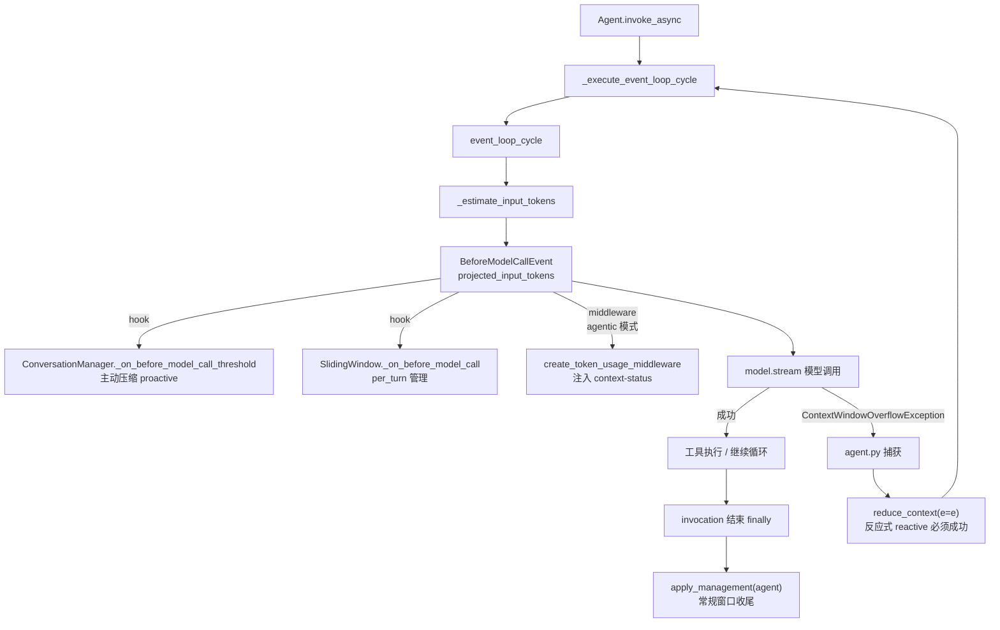
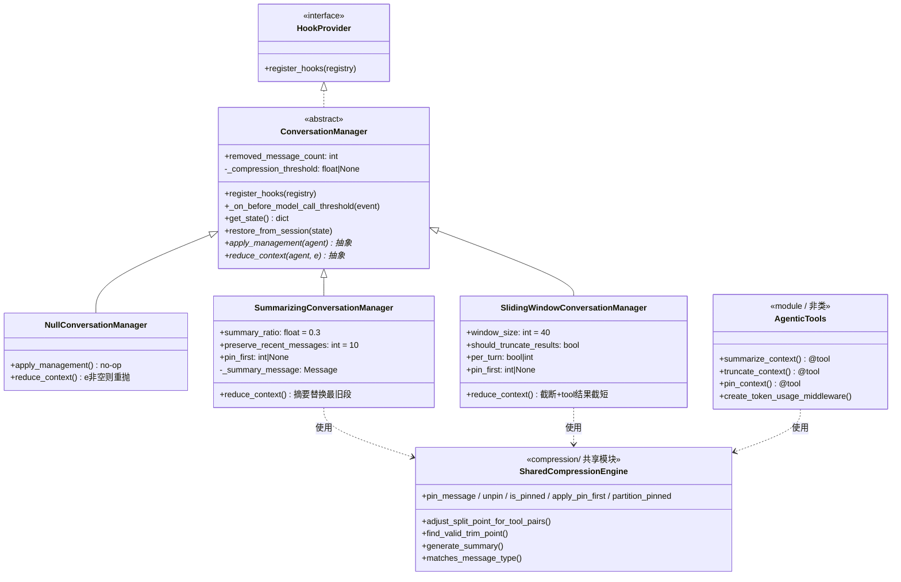
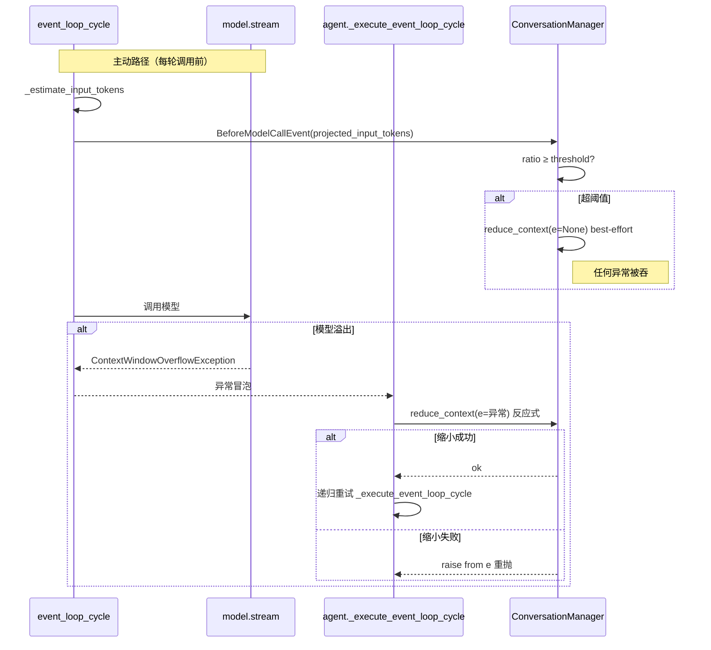
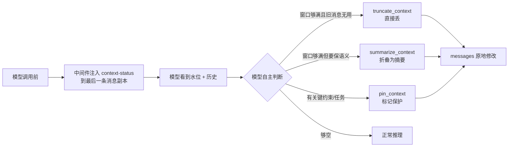

# AWS Strands Agents（AgentCore harness-sdk）上下文压缩机制 —— 源码级深度解读

> 研究对象：`github.com/strands-agents/harness-sdk`（本地 clone：`/tmp/harness-sdk`，HEAD `562d7f4`）
> 主语言：Python SDK（`strands-py/`），TypeScript SDK（`strands-ts/`）作对照验证
> 方法：逐行精读核心源码 + 测试用例反推设计意图 + 官方文档交叉印证 + Python/TS 双实现差异比对
> 产出人：黄山（System Architect & Technology Researcher）
> 日期：2026-06-18

---

## 0. 执行摘要

Strands Agents 的上下文管理在 harness-sdk 中是一个**分层、双引擎、可组合**的体系，远不止"截断历史"那么简单。核心结论：

1. **两条压缩路线并存且可叠加**：
   - **声明式 `ConversationManager`**（框架自动驱动）：抽象基类 + 三个具体实现（Sliding Window / Summarizing / Null）。它的首要职责是**溢出恢复（overflow recovery）**，并可选开启**主动压缩（proactive compression）**。
   - **模型驱动的 Agentic 模式**（`context_manager="agentic"`）：向模型注入 `summarize_context` / `truncate_context` / `pin_context` 三个 `@tool`，并通过中间件把"上下文水位"实时喂给模型，**让 LLM 自己决定何时压、压什么、保什么**。

2. **双触发机制**（声明式路线的精髓）：
   - **Reactive（反应式，`e` 非空）**：模型抛 `ContextWindowOverflowException` 后，Agent 捕获并调用 `reduce_context(e=e)`，**必须成功否则重抛**——因为不缩小历史下一次调用必然再次溢出。
   - **Proactive（主动式，`e` 为空）**：`BeforeModelCallEvent` 钩子在每次模型调用前检查 `projected_input_tokens / context_window_limit ≥ threshold`，超阈值则 best-effort 压缩，**任何异常都被吞掉**，保证模型调用照常进行。

3. **三大底层安全机制**（共享引擎 `compression/`）：
   - **tool-pair 边界保护**：`adjust_split_point_for_tool_pairs` / `find_valid_trim_point` 确保切割点不会拆散 `toolUse`/`toolResult` 配对，且 trim 点必须是纯 user message（多数 provider 的硬约束）。
   - **消息固定（Pin）**：`metadata.custom.pinned` 标志 + tool-pair 伙伴连带保护 + `apply_pin_first` 永久固定首 N 条。
   - **摘要生成**：`generate_summary` **绕过 agent pipeline 直连 `model.stream`**，避开 `_invocation_lock` 死锁与 metrics/traces 污染；结果**强制转 user-role** 以保持会话合法性；`DEFAULT_SUMMARIZATION_PROMPT` 用强约束提示工程逼出结构化 bullet 摘要。

4. **`context_manager="auto"`** 是开箱即用的"最优组合"：`SummarizingConversationManager(summary_ratio=0.3, threshold=0.85)` + `ContextOffloader(max_result_tokens=1500, preview=750)`，宣称在 ContextBench 上得分最高。

5. **Agentic 模式**把压缩决策权交给模型：文档原话"模型比阈值更清楚哪些消息还重要"——coding agent 可以丢掉已改完的过时文件、同时 pin 住正在攻克的失败测试，这是 by-age 的固定阈值做不到的判断。代价是模型读 telemetry + 调工具消耗的 token。

6. **Python 与 TS 实现高度对齐**，但有若干**关键差异**（详见 §10）：最重要的是 `adjust_split_point` 在 split_point ≥ len 时 Python 抛异常而 TS 直接返回；以及 Sliding Window 的 `_find_tool_pair_trim_point` 回退是 **Python 独有**。

下文逐层展开，所有源码引用均标注 `文件路径:行号`，真实从 `/tmp/harness-sdk` 读出。

---

## 1. 整体架构

### 1.1 在 Agent loop 中的位置

上下文压缩在 Agent 执行循环中有**三个嵌入点**（均在 `strands-py/src/strands/`）：

1. **每次模型调用前**（`event_loop/event_loop.py:485-494`）：估算 `projected_input_tokens` → 构造 `BeforeModelCallEvent` → 触发所有钩子（含 `ConversationManager._on_before_model_call_threshold` 主动压缩、Sliding Window 的 per-turn 管理、Agentic 的 token telemetry 中间件）。
2. **模型调用溢出时**（`agent/agent.py:1289-1303`）：捕获 `ContextWindowOverflowException` → `reduce_context(self, e=e)` → 递归重试 `_execute_event_loop_cycle`。
3. **每次 invocation 结束后**（`agent/agent.py:1241`，`finally` 块）：`apply_management(self)` 做常规窗口收尾；工具调用后也会触发（`tools/_caller.py:138`）。



### 1.2 类继承关系



**关键架构洞察**：`compression/` 是一个**被两条路线共享的底层引擎**。注释明确写道（`context_compression.py:1-7`）："These functions are used by both the conversation managers (reactive/proactive compression) and the agentic context-management tools (model-driven compression)."声明式与模型驱动两条路线**复用同一套 tool-pair 安全/摘要/pin 原语**，只是触发主体不同（框架 vs 模型）。

### 1.3 两条路线的分工

| 维度 | 声明式 ConversationManager | Agentic 模型驱动 |
|------|---------------------------|------------------|
| 决策主体 | 框架（确定性规则/阈值） | LLM（按语义判断相关性） |
| 触发方式 | reactive 溢出 + proactive 阈值钩子 | 模型读 `<context-status>` 自主调用工具 |
| 控制粒度 | 按"年龄"（最旧的先压） | 按"相关性"（模型挑哪条压/保） |
| token 成本 | 几乎零（无模型介入；摘要才用一次模型） | 模型读 telemetry + 调工具的额外 token |
| 注入物 | 钩子回调 | 3 个 `@tool` + 1 个 input 中间件 |
| 兜底 | 自身即兜底 | 仍组合一个无主动压缩的 `SummarizingConversationManager` 作安全网（`agent.py:538-542`） |

注意：**两者并非互斥**。`context_manager="agentic"` 时底层仍挂一个 Summarizing 管理器（关闭主动压缩）作兜底——"如果模型放任窗口溢出，它会反应式压缩"（文档 `context-management.mdx`）。

---

## 2. 双触发机制深剖（声明式路线的精髓）

`ConversationManager` 文档字符串明确两条调用场景（`conversation_manager.py:160-185`，`reduce_context` docstring）：

> 1. **Reactive** (e is set): A context window overflow occurred. The implementation MUST remove enough history for the next model call to succeed, or re-raise the error.
> 2. **Proactive** (e is None): The compression threshold was exceeded. This is best-effort — returning without reduction or raising is acceptable; the model call proceeds regardless.

### 2.1 projected_input_tokens 从哪来

源头在 `event_loop/event_loop.py:485-494`：

```python
projected_input_tokens: int | None = None
try:
    projected_input_tokens = await _estimate_input_tokens(agent)
except Exception as e:
    logger.debug("error=<%s> | token estimation failed, proceeding without estimate", e)

before_model_call_event = BeforeModelCallEvent(
    agent=agent,
    invocation_state=invocation_state,
    projected_input_tokens=projected_input_tokens,
)
```

`_estimate_input_tokens`（`event_loop.py:120` 起）的算法很讲究——**增量估算**：

```python
# Find the last assistant message with usage metadata
for i, msg in reversed(list(enumerate(messages))):
    if msg.get("role") == "assistant" and msg.get("metadata", {}).get("usage"):
        last_assistant_idx = i
        break

if last_assistant_idx >= 0:
    usage = messages[last_assistant_idx]["metadata"]["usage"]
    known_baseline = usage["inputTokens"] + usage["outputTokens"]
    new_messages = messages[last_assistant_idx + 1 :]
    if not new_messages:
        return known_baseline
    # System prompt and tool spec tokens are already included in the baseline
    return known_baseline + await agent.model.count_tokens(new_messages)

# Cold start: resolve tool specs lazily for estimation only
tool_specs = agent.tool_registry.get_all_tool_specs()
return await agent.model.count_tokens(messages, tool_specs=tool_specs, ...)
```

**设计洞察**：它不重新数整个历史，而是以"上一条带 usage 元数据的 assistant 消息"为已知基线（`inputTokens + outputTokens` 即上一轮模型实际看到的总量），只对"新增消息"调用 `count_tokens`。这是因为 system prompt 与 tool spec 的 token 已经包含在基线里，避免重复计数，也避免每轮 O(n) 全量 tokenization 的开销。冷启动（无 usage 元数据）才走全量估算，并**懒解析 tool_specs 仅供估算用**（注释 `event_loop.py:124-126`：调用方在 `BeforeModelCallEvent` 之前不需要先解析它们）。token 估算是**非致命**的：失败就 `projected_input_tokens=None`，主动压缩直接跳过（`conversation_manager.py:139-141`）。

### 2.2 Proactive 路径逐行走读

`conversation_manager.py:117-159`，`_on_before_model_call_threshold`：

```python
# Early return if proactive compression is not enabled
if self._compression_threshold is None:
    return

context_window_limit = event.agent.model.context_window_limit
if context_window_limit is None:
    context_window_limit = DEFAULT_CONTEXT_WINDOW_LIMIT  # 200_000
    if not self._context_window_limit_warned:
        self._context_window_limit_warned = True
        logger.warning("... context_window_limit not set on model, using default ...")

if event.projected_input_tokens is None:
    logger.debug("projected_input_tokens=<None> | skipping proactive compression")
    return

ratio = event.projected_input_tokens / context_window_limit
if ratio >= self._compression_threshold:
    # Proactive compression is best-effort: swallow errors so the model call can still proceed.
    try:
        self.reduce_context(agent=event.agent)   # 注意：不传 e
    except Exception:
        logger.debug("proactive compression failed, will proceed with model call", exc_info=True)
```

逐点解读：
- **钩子永远注册**（`register_hooks` 总是 `add_callback(BeforeModelCallEvent, ...)`，`conversation_manager.py:113`），阈值检查放在 handler 内部——"Always subscribe — the threshold check happens inside the handler"。这避免了"是否开启"分支造成的钩子链不一致，未配置时就是早返回 no-op。测试 `test_proactive_compression_always_registers_hook` / `test_proactive_compression_hook_is_noop_when_not_configured` 锁定了这一行为。
- **context_window_limit 缺失时回退 200K**，且只 warn 一次（`_context_window_limit_warned` 闸门）。`context_window_limit` 属性本身从 model config 取（`models/model.py:178-184`）。
- **`reduce_context(agent=event.agent)` 不传 `e`**，这就是 proactive 信号。
- **best-effort：`try/except Exception` 全吞**。设计哲学：主动压缩是"锦上添花"，它失败不能阻断正常推理——大不了这一轮不压，等真溢出再 reactive 兜底。

阈值校验在 `__init__`（`conversation_manager.py:88-90`）：`threshold <= 0 or threshold > 1` 抛 `ValueError`。`(0, 1]` 区间，测试覆盖 0/负数/>1 拒绝、1.0 接受。`proactive_compression=True` → 0.7；dict → 取 `compression_threshold` 键；`False`/`None` → `None`（禁用）。

### 2.3 Reactive 路径逐行走读

`agent/agent.py:1289-1303`，`_execute_event_loop_cycle`：

```python
try:
    events = event_loop_cycle(agent=self, ...)
    async for event in events:
        yield event
except ContextWindowOverflowException as e:
    # Try reducing the context size and retrying
    self.conversation_manager.reduce_context(self, e=e)   # 注意：传 e
    # Sync agent after reduce_context to keep conversation_manager_state up to date in the session
    if self._session_manager:
        self._session_manager.sync_agent(self)
    events = self._execute_event_loop_cycle(invocation_state, ...)   # 递归重试
    async for event in events:
        yield event
```

逐点解读：
- 这是一个**捕获-缩小-递归重试**的结构。`reduce_context(self, e=e)` 传入了异常对象 → 反应式语义。
- **必须成功或重抛**：以 Summarizing 为例（`summarizing_conversation_manager.py:138-149`），`reduce_context` 内部 `try/except`，若 `e is not None`（反应式）则 `raise summarization_error from e`——把摘要失败链到原始溢出异常重抛；若 `e is None`（主动）则 `logger.warning` 后静默返回。Null 管理器更直接（`null_conversation_manager.py:42-44`）：`if e: raise e`——它没有任何缩小能力，反应式时只能把溢出原样抛出。
- **为何 reactive 必须成功**：不缩小历史，下一次模型调用必然再次溢出，陷入死循环或无进展。所以反应式是"硬约束"。而 proactive 是"软优化"，吞异常无妨。
- 重试是**递归调用** `_execute_event_loop_cycle` 自身，缩小后从头再跑一轮 cycle。

### 2.4 ContextWindowOverflowException 的传播链

`event_loop.py:386-396` 显示该异常被列入"直接冒泡、不包装成 EventLoopException"的白名单：

```python
except (StructuredOutputException, EventLoopException,
        ContextWindowOverflowException, MaxTokensReachedException) as e:
    tracer.end_span_with_error(cycle_span, str(e), e)
    raise   # 直接重抛，由 agent.py 的 _execute_event_loop_cycle 捕获
```

这保证了溢出异常能干净地穿透 event_loop 内层，被外层的 reactive 恢复逻辑接住。



---

## 3. 三种策略 + Agentic 对比

### 3.1 逐策略算法

#### (a) NullConversationManager（对照基准，`null_conversation_manager.py`，45 行）

```python
def apply_management(self, agent, **kwargs): pass          # 完全 no-op
def reduce_context(self, agent, e=None, **kwargs):
    if e:
        raise e                                            # 反应式：原样重抛溢出
```

意图：保留完整历史/外部托管/测试场景。它是"什么都不做"的语义基准——反应式时无法缩小，只能重抛；主动式时静默返回。注意 stateful 模型（服务端管状态）时 Agent 强制使用它（`agent.py:322-323`）。

#### (b) SlidingWindowConversationManager（`sliding_window_conversation_manager.py`，400 行）

默认 `window_size=40`。核心 `reduce_context` 流程（`:179-265`）：

1. **首次 pin**：`if self.pin_first and not self._pin_first_applied: apply_pin_first(messages, self.pin_first)`。
2. **`window_size==0` 特例**（`:215-219`）："remove all non-pinned messages"——只留 pinned，其余全清，`removed_message_count += 差值`。测试 `test_window_size_zero_clears_all_messages_*` 锁定。
3. **反应式优先截短 tool 结果**（`:222-232`，仅 `e is not None` 且 `should_truncate_results`）：找最旧带 toolResult 的消息，`_truncate_tool_results` 把大文本截成首尾各 200 字符（`_PRESERVE_CHARS=200`），中间替换为 `... [truncated: N chars removed] ...`；toolResult 内嵌图片替换为 `[image: fmt, N bytes]` 占位符。**成功截短就 return**，不动消息数。这是"先减肥再砍人"——尽量保留消息条目，只压缩臃肿的 tool 输出。
4. **trim 消息**（`:234-265`）：`start_index = 2 if len<=window_size else len-window_size` → `find_valid_trim_point` 找首个合法 user 边界 → 删除 `[0, trim_index)` 内所有**非 pinned** 消息（reversed 删除保持索引稳定）。
5. **回退**（Python 独有，`:240-258`）：若无纯 user trim 点，`_find_tool_pair_trim_point` 找 `assistant(toolUse)+user(toolResult)` 完整配对边界作回退——"providers treat a complete toolUse/toolResult pair as a valid conversation continuation"。仍找不到：反应式抛 `ContextWindowOverflowException`，主动/常规则 `logger.warning` 后静默返回。

**per_turn 主动管理**（`:104-130`）：`per_turn=True` 每次模型调用前都 `apply_management`；`per_turn=N` 每 N 次一次（`_model_call_count % N == 0`）。适合频繁截图的 web 浏览类 agent，防止 loop 变慢。`apply_management`（`:155-173`）只在 `len(messages) > window_size` 时才 `reduce_context`（不传 e，常规管理）。

`_find_oldest_message_with_tool_results`（`:380-400`）从最旧往新找，**跳过 pinned**，让截短优先打击"最不相关"的旧 tool 结果。

#### (c) SummarizingConversationManager（`summarizing_conversation_manager.py`，307 行）

默认 `summary_ratio=0.3`（clamp 到 `[0.1, 0.8]`），`preserve_recent_messages=10`。**`apply_management` 是 no-op**（`:103-115`）——"summarization only happens on context overflow"，即它**不做常规主动收尾**，只在 reduce_context（反应式溢出或主动阈值）时压。

核心 `_summarize_oldest`（`:151-194`）逐行：

```python
# 1. 计算要摘要的条数
messages_to_summarize_count = max(1, int(len(agent.messages) * self.summary_ratio))
# 2. 保护最近 N 条
messages_to_summarize_count = min(count, len(agent.messages) - self.preserve_recent_messages)
if messages_to_summarize_count <= 0:
    raise ContextWindowOverflowException("Cannot summarize: insufficient messages for summarization")
# 3. tool-pair 边界对齐
messages_to_summarize_count = self._adjust_split_point_for_tool_pairs(agent.messages, count)
# 4. 首次 pin（仅第一次 reduction）
if self.pin_first and not self._pin_first_applied:
    apply_pin_first(agent.messages, self.pin_first); self._pin_first_applied = True
# 5. 分区：[0, count) 拆成 pinned(保留) 和 非pinned(摘要)
protected_to_preserve, to_summarize = partition_pinned(agent.messages, 0, count)
if not to_summarize:
    raise ContextWindowOverflowException("Cannot summarize: all messages in summarize range are pinned")
remaining_messages = agent.messages[count:]
# 6. 维护 removed_message_count（摘要消息不算 removed）
self.removed_message_count += len(to_summarize)
if self._summary_message:
    self.removed_message_count -= 1
# 7. 生成摘要并替换
self._summary_message = self._generate_summary(to_summarize, agent)
agent.messages[:] = protected_to_preserve + [self._summary_message] + remaining_messages
```

**结构**：`[pinned 保留段] + [新摘要(1条)] + [保留的最近段]`。摘要是 user-role 消息。`removed_message_count` 把"被吸进摘要的真实消息数"累计，但不把摘要本身算进去（`-1` 修正，避免上一轮摘要被重复计数）。

`_generate_summary` 两条路（`:196-235`）：
- 有 `summarization_agent` → `_generate_summary_with_agent`：跑完整 agent pipeline，可用工具。临时禁用 structured output（否则 toolUse 块在 user 消息里非法）、无工具时塞 noop_tool 满足 tool spec 要求、`try/finally` 还原 agent 原状态。
- 默认 → `_generate_summary_with_model`：`run_async(lambda: generate_summary(messages, agent.model, system_prompt))`——直连 model.stream，详见 §6。

#### (d) Agentic 模式（`_context_manager/modes/agentic/agentic_context.py`，332 行）—— §7 详述

### 3.2 四策略对比表

| 维度 | Null | Sliding Window | Summarizing | Agentic |
|------|------|----------------|-------------|---------|
| 算法 | 不动 | 截断最旧 + tool 结果截短 | 最旧段折叠为模型摘要 | 模型调工具自管 |
| 信息保真 | 100%（但会溢出） | 低（直接丢/截短，有损） | 中高（摘要保留要点） | 由模型判断（最优但不确定） |
| token 成本 | 0 | 0（无模型） | 摘要时一次模型调用 | telemetry + 工具调用持续开销 |
| 主要参数 | 无 | `window_size=40`, `should_truncate_results`, `per_turn`, `pin_first` | `summary_ratio=0.3`, `preserve_recent_messages=10`, `pin_first` | `keep_recent=10`, `summary_ratio=0.3`, `message_type` |
| 常规管理 | 无 | `apply_management` 每轮收尾（>window 才动） | **无**（仅溢出触发） | 无（模型驱动） |
| 主动压缩 | 不支持（重抛） | 支持（proactive_compression 参数） | 支持 | 关闭（模型自管） |
| tool 结果处理 | — | 反应式截短到首尾 200 字符 | 随消息一起摘要 | message_type="tools" 定向 |
| 确定性 | 完全确定 | 完全确定 | 确定（除摘要文本） | 不确定（模型决策） |
| 适用场景 | 外部托管/测试/stateful | 长对话、tool-heavy 流水 | 需保留语义连续性 | 需按相关性精细取舍 |
| pin 支持 | — | ✅ `pin_first` + is_pinned | ✅ `pin_first` + partition | ✅ pin_context 工具（last_turn/N/indices） |

### 3.3 auto 模式的"最优组合"（`agent.py:498-561`）

`context_manager="auto"`（`_resolve_context_manager`）：
```python
default_conversation_manager = SummarizingConversationManager(
    summary_ratio=_CONTEXT_MANAGER_SUMMARY_RATIO,            # 0.3
    proactive_compression={"compression_threshold": _CONTEXT_MANAGER_COMPRESSION_THRESHOLD},  # 0.85
)
# + 自动追加 ContextOffloader(max_result_tokens=1500, preview_tokens=750)
```
`context_manager="agentic"`：
```python
default_conversation_manager = SummarizingConversationManager(summary_ratio=0.3)  # 无主动压缩，纯兜底
# + ContextOffloader(max_result_tokens=8000, ...)  # 阈值更高，让模型看更多 inline
# + 注入 3 工具 + token telemetry 中间件
```
关键常量（`agent.py:121-133`）：`_CONTEXT_MANAGER_MAX_RESULT_TOKENS=1500`、`_AGENTIC_CONTEXT_MANAGER_MAX_RESULT_TOKENS=8000`、`_CONTEXT_MANAGER_PREVIEW_TOKENS=750`、`_CONTEXT_MANAGER_SUMMARY_RATIO=0.3`、`_CONTEXT_MANAGER_COMPRESSION_THRESHOLD=0.85`。文档称这套默认值"在 ContextBench 评测中得分最高"。注意 auto 的 0.85 阈值比基类默认 0.7 更激进地往后压（更晚触发，省 token）。**用户自定义优先**：传了 `conversation_manager` 会替换 auto 组的 Summarizing，但 ContextOffloader 仍会补；plugins 里已有 ContextOffloader 则不重复添加。

---

## 4. 底层安全机制一：tool-pair 边界保护

### 4.1 为什么必须保护 toolUse/toolResult 配对

模型 provider（Bedrock、Anthropic 等）对消息序列有硬约束：一个 `toolUse`（assistant 发起工具调用）必须紧跟一个 `toolResult`（user 回工具结果），二者通过 `toolUseId` 配对。若压缩切割点落在配对中间，会产生：
- **orphaned toolResult**：有结果无调用 → provider 报错（历史第一条不能是 toolResult，因为它需要前面有 toolUse）。
- **dangling toolUse**：有调用无结果 → provider 期待结果却没有 → 报错。

所以所有压缩操作的切割点都必须经过 tool-pair 安全校验。

### 4.2 adjust_split_point_for_tool_pairs 逐步走读（`context_compression.py:68-115`）

用途：摘要场景。给定初始 split_point（前面要被摘要的条数），**向前推进**到一个不破坏配对的安全点。

```python
if split_point > len(messages):
    raise ContextWindowOverflowException("Split point exceeds message array length")
if split_point == len(messages):
    return split_point   # 全部摘要，合法

while split_point < len(messages):
    if (
        # 该位置是 toolResult → 它会变成 orphaned（前面的 toolUse 被摘要了）
        any("toolResult" in content for content in messages[split_point]["content"])
        or (
            # 该位置是 toolUse 但下一条不是 toolResult → 配对会被拆
            any("toolUse" in content for content in messages[split_point]["content"])
            and split_point + 1 < len(messages)
            and not any("toolResult" in content for content in messages[split_point + 1]["content"])
        )
    ):
        split_point += 1   # 不安全，往前挪
    else:
        break              # 找到安全点
else:
    raise ContextWindowOverflowException("Unable to trim conversation context!")
return split_point
```

**语义**：split_point 指向"保留段的第一条"。这一条若是 toolResult，说明它的 toolUse 在被摘要的 `[0, split_point)` 段里 → orphaned，不行，往前推；若是 toolUse 但下一条不是 toolResult，配对被拆，往前推。`while...else`（Python 特性）：循环正常走完（没 break）说明走到尽头没找到 → 抛异常。

测试印证设计意图（`test_context_compression.py`）：
- `test_skips_tool_result_messages`：`[toolResult, user]` split 0 → 1（跳过 orphaned toolResult）
- `test_skips_tool_use_without_following_tool_result`：`[toolUse, assistant文本, user]` split 0 → 1
- `test_accepts_tool_use_when_followed_by_tool_result`：`[toolUse, toolResult, user]` split 0 → **0**（配对完整，可在此切，把整对一起摘要）
- `test_skips_multiple_consecutive_tool_results`：连续两个 toolResult，split 0 → 2
- `test_raises_when_no_valid_split_point_exists`：`[toolResult, toolResult]` → 抛 `Unable to trim conversation context`

### 4.3 find_valid_trim_point 逐步走读（`context_compression.py:118-160`）

用途：截断场景（Sliding Window / Agentic truncate）。从 start_index 起找一个合法 trim 点。比 adjust 多一条**强约束：必须是 user message**。

```python
trim_index = start_index
while trim_index < len(messages):
    message = messages[trim_index]
    if message["role"] != "user":         # 1. 必须 user
        trim_index += 1; continue
    if any("toolResult" in content for content in message["content"]):  # 2. 非 orphaned toolResult
        trim_index += 1; continue
    if any("toolUse" in content for content in message["content"]):     # 3. toolUse 须紧跟 toolResult
        next_has_tool_result = trim_index + 1 < len(messages) and any(
            "toolResult" in content for content in messages[trim_index + 1]["content"])
        if not next_has_tool_result:
            trim_index += 1; continue
    break
return trim_index   # 找不到返回 len(messages)
```

**为什么 trim 点必须是 user message**：截断保留的是 `[trim_index:]`，这个新历史的**第一条**会成为对话起点。多数 provider 要求对话以 user message 开头（system 之后第一条必须 user）。若以 assistant 开头，provider 直接拒绝。这是与 adjust 的关键区别——adjust 切的是"摘要段终点/保留段起点"，由于前面会拼上 pinned 段或摘要消息（user-role），不一定要求 user；而 trim 是纯删除，保留段起点直接暴露为对话首条，故必须 user。

测试印证：`test_skips_non_user_messages`（assistant 在前则跳过）、`test_returns_messages_length_when_no_valid_point_found`（`[assistant, toolResult]` → 返回 len，表示"无合法点"）。

### 4.4 Sliding Window 的 Python 独有回退

`find_valid_trim_point` 找不到纯 user 点（返回 ≥ len）时，Sliding Window 还有 `_find_tool_pair_trim_point`（`sliding_window_conversation_manager.py:267-291`）：找首个 `assistant(toolUse) + user(toolResult)` 完整配对边界。注释明确："This fallback is Python-specific and has no equivalent in find_valid_trim_point"。意图：tool-heavy 对话里可能压根没有纯 user 文本消息（全是 tool 往返），不给这个回退就永远 trim 不动。测试 `test_sliding_window_tool_heavy_conversation_falls_back_to_tool_pair_boundary` / `test_sliding_window_prefers_plain_user_message_over_tool_pair_fallback`（优先纯 user，回退才用 tool-pair）锁定。

---

## 5. 底层安全机制二：消息固定（Pin）

### 5.1 数据结构（`pin_message.py`）

pin 标志存于 `message["metadata"]["custom"]["pinned"] = True`（`pin_message.py:113-119`）：

```python
def pin_message(messages, index):
    message = messages[index]
    metadata = message.get("metadata", {})
    custom = metadata.get("custom", {})
    custom["pinned"] = True
    metadata["custom"] = custom
    message["metadata"] = metadata
```

`unpin_message`（`:122-130`）反向操作，并**清理空容器**：移除 `pinned` 后若 `custom` 空则删 `custom`，`metadata` 空则删 `metadata`——保持消息干净，避免残留空字典（测试 `test_removes_pin_from_previously_pinned_messages` 断言 `"metadata" not in messages[1]`）。

### 5.2 tool-pair 伙伴连带保护（`is_pinned`，`:35-62`）

这是 pin 机制最精巧处：

```python
def is_pinned(messages, index):
    if _has_pinned_flag(messages[index]):
        return True
    # 检查相邻 tool-pair 伙伴是否被 pin
    my_ids = _get_tool_use_ids(messages[index])
    if not my_ids:
        return False
    for neighbor_index in (index - 1, index + 1):
        if 0 <= neighbor_index < len(messages):
            neighbor = messages[neighbor_index]
            if _has_pinned_flag(neighbor) and my_ids & _get_tool_use_ids(neighbor):
                return True
    return False
```

**逻辑**：消息自己有 pinned 标志 → pinned。否则若它含 toolUse/toolResult（有 toolUseId），检查左右邻居：若邻居被 pin 且**共享同一 toolUseId**，则自己也算 pinned。`_get_tool_use_ids`（`:8-21`）从 toolUse/toolResult 块提取 `toolUseId` 集合，`my_ids & neighbor_ids` 取交集。

**意图**：pin 了 toolUse 就连带保护它的 toolResult（反之亦然），**配对永不被拆**。测试 `test_preserves_pinned_tool_use_when_its_tool_result_is_eligible`（agentic）验证：pin 了 toolUse(id-1)，其 toolResult 即使"eligible"也会被连带保留，最终 toolUse 仍带 pinned 标志存活。

### 5.3 apply_pin_first 的设计意图（`:65-73`）

```python
def apply_pin_first(messages, count):
    for i in range(min(count, len(messages))):
        pin_message(messages, i)
```

永久固定首 N 条。**意图**：对话开头往往是系统级约束、任务定义、关键背景（user 设定的"你是谁、做什么、规则是什么"），这些必须跨整个会话存活，绝不能被压缩。Sliding Window 和 Summarizing 都支持 `pin_first` 参数，且**只在首次 reduction 时应用一次**（`_pin_first_applied` 闸门）——之后这些消息的 pinned 标志已持久化在 metadata 里，无需重复。

### 5.4 partition_pinned（`:76-95`）

```python
def partition_pinned(messages, start, end):
    pinned, unpinned = [], []
    for i in range(start, end):
        (pinned if is_pinned(messages, i) else unpinned).append(messages[i])
    return pinned, unpinned
```

把 `[start, end)` 范围拆成 pinned（保留）+ unpinned（可压缩）。Summarizing 用它把 `[0, split_point)` 拆成"保留段"和"待摘要段"，保证 pinned 消息原样保留、只摘要 unpinned 部分。

### 5.5 Agentic 的 pin_context 工具 —— 见 §7.3

---

## 6. 底层安全机制三：摘要生成

### 6.1 generate_summary 为何绕过 agent pipeline（`context_compression.py:163-208`）

```python
async def generate_summary(messages_to_summarize, model, system_prompt=None):
    resolved_system_prompt = system_prompt if system_prompt is not None else DEFAULT_SUMMARIZATION_PROMPT
    summarization_messages = list(messages_to_summarize) + [
        {"role": "user", "content": [{"text": "Please summarize this conversation."}]}
    ]
    chunks = model.stream(summarization_messages, tool_specs=None, system_prompt=resolved_system_prompt)
    result_message = None
    async for event in process_stream(chunks):
        if "stop" in event:
            _, result_message, _, _ = event["stop"]
    if result_message is None:
        raise RuntimeError("Failed to generate summary: no response from model")
    # Return the summary as a user-role message so it's valid as conversation history
    return cast(Message, {**result_message, "role": "user"})
```

**为何直连 `model.stream`** 而非 `agent(...)`（`summarizing_conversation_manager.py:208-220` 注释说得最清楚）：

> calling the parent agent would re-enter the agent pipeline which would **deadlock on `_invocation_lock`** and corrupt metrics / traces / interrupt state.

摘要发生在 reduce_context 内，而 reduce_context 是在 agent 调用过程中触发的——此时 `_invocation_lock` 已被持有。若再调 `agent(...)` 会重入、死锁。直连 model.stream 跳过 lock / metrics / traces / tool loop，是干净的"裸模型调用"。`tool_specs=None`：摘要不需要工具。

### 6.2 为何摘要结果强制转 user-role

`return {**result_message, "role": "user"}`。模型生成的摘要本来是 assistant-role。强制改成 user-role 的原因：
1. **会话合法性**：摘要要插回历史替换最旧段。若是 assistant-role，可能与前后消息的 role 交替规则冲突（provider 要求 user/assistant 交替，不能两个 assistant 相邻）。作为 user 消息，它像"用户提供的背景"一样安全嵌入任意位置。
2. **避免被当成模型的话**：摘要是"关于对话的元信息"，不是模型在对话中的发言，user-role 语义更贴切。

Python 用 `{**result_message, "role": "user"}` **保留原消息其他字段**（如 content）只改 role；TS 则是 `new Message({role:'user', content: result.value.message.content})` 只取 content 重建（§10 差异点）。测试 `test_returns_a_user_role_message` 锁定。

### 6.3 DEFAULT_SUMMARIZATION_PROMPT 的提示工程（`context_compression.py:25-58`）

```
You are a conversation summarizer. Provide a concise summary of the conversation history.

Format Requirements:
- You MUST create a structured and concise summary in bullet-point format.
- You MUST NOT respond conversationally.
- You MUST NOT address the user directly.
- You MUST NOT comment on tool availability.

Assumptions:
- You MUST NOT assume tool executions failed unless otherwise stated.

Task: ... structured summary document:
- key topics and questions covered
- all significant tools executed and their results
- any code or technical information shared
- a section of key insights gained
- format the summary in the third person

Example format:
## Conversation Summary
* Topic 1: Key information
## Tools Executed
* Tool X: Result Y
```

逐条解读"为何这么设计"：
- **强制 bullet-point + 结构化**：摘要要被模型在后续轮次反复读取，结构化（## 分节 + * 列点）比散文更易解析、token 更省、信息密度更高。
- **MUST NOT respond conversationally / address the user**：防止模型把"摘要任务"误当成"和用户对话"，输出"好的，这是您的对话摘要..."这类寒暄——那会污染历史、浪费 token，且第二人称在 user-role 消息里语义错乱。
- **第三人称**：摘要作为 user-role 消息嵌入历史，若用第一/第二人称会与真实对话的人称体系冲突。第三人称（"用户询问了 X，工具返回了 Y"）是中立的旁观叙述，无歧义。
- **MUST NOT comment on tool availability / MUST NOT assume tool executions failed**：防止模型脑补"工具不可用""调用失败了"——摘要时工具上下文已被剥离（`tool_specs=None`），模型看不到工具列表，容易误判。这条显式约束避免幻觉性的失败假设。
- **必须含 tools executed and results / code / key insights**：这三类是 agent 对话里最高价值、最不可丢的信息（工具结果是事实依据，代码是产物，洞察是结论），强制保留防止模型只摘要"聊天"而丢掉"干活"的部分。

这是一套**防御性提示工程**：用一连串 MUST/MUST NOT 把模型钉死在"结构化、中立、信息完整"的输出模式，最大化摘要作为"压缩后历史"的可用性与保真度。

---

## 7. Agentic 模型驱动压缩（亮点）

### 7.1 整体机制：信息 + 杠杆

`context_manager="agentic"` 给模型两样东西（文档 `context-management.mdx`）："Two things give the model the information and the levers to manage context."

- **信息（telemetry）**：`create_token_usage_middleware`（`agentic_context.py:280-332`）在每次模型调用前，往最后一条消息**追加**一个 `<context-status>` 块：
  ```
  <context-status>
  <used>50,000 / 200,000 tokens (25.0%)</used>
  <remaining>~150,000 tokens</remaining>
  </context-status>
  ```
  注意：**不修改原消息**，而是 copy 最后一条 + append（`messages[-1] = new_message`，`replace(context, messages=messages)`）。`projected_input_tokens is None` 时直接返回不注入。这是模型决策的唯一信号——它据此判断窗口是否够满该压。

- **杠杆（3 个 @tool）**：模型可主动调用 `summarize_context` / `truncate_context` / `pin_context`。

注入点（`agent.py:353-360, 402-406`）：构造 Agent 时 `context_manager=="agentic"` 则 `process_tools([summarize_context, truncate_context, pin_context])` 并 `add_middleware(InvokeModelStage.Input, create_token_usage_middleware(self.model))`。



### 7.2 summarize_context 与 truncate_context（`agentic_context.py:78-200`）

两者都是 `@tool(context=True)`（注入 `ToolContext`，含 agent）。参数设计：

**`summarize_context(keep_recent, summary_ratio, message_type)`**：
- `keep_recent`（默认 10，clamp 下限 `_MIN_MESSAGES_FOR_COMPRESSION=2`）：保留最近几条 verbatim。
- `summary_ratio`（默认 0.3，clamp `[0.1, 0.8]`）：最旧的多少比例折叠进摘要。
- `message_type`（"tools"/"messages"/"all"，默认 all）：定向哪类消息。
- 流程：`split_point = max(1, int(len*ratio))` → `min(split_point, len-keep_recent)` → `adjust_split_point_for_tool_pairs` → `_collect_preserved` 分出 eligible/preserved → `generate_summary(eligible)` → `messages[:split_point] = preserved + [summary]`。
- 每个失败路径**都返回给模型一句可操作的提示**而非抛异常，例如 split 失败："Try a smaller keep_recent, a larger summary_ratio, or use truncate_context with message_type=\"tools\" instead." 这是关键设计：工具返回值是给模型读的，要引导它下一步怎么改参数重试。

**`truncate_context(keep_recent, message_type)`**：直接丢弃，无摘要。`start_index = len-window_size` → `find_valid_trim_point` → `_collect_preserved` → `messages[:trim_point] = preserved`。无效 trim 点时提示"Try a larger keep_recent or use summarize_context instead."

**`_collect_preserved`（`:43-76`）—— 第一条 user 永远保留**：
```python
for i in range(range_end):
    msg = messages[i]
    is_first_user = not found_first_user and msg["role"] == "user"
    if is_first_user: found_first_user = True
    if is_first_user or is_pinned(messages, i) or not matches_message_type(msg, filter):
        preserved.append(msg)
    else:
        eligible.append(msg)
```
三类被保留：**首条 user 消息**（保证对话以 user 开头合法）、pinned 消息、不匹配 message_type 的消息。其余才 eligible（可压）。这把"对话起点合法性""用户固定""类型过滤"三重保护合并在一次遍历里。

### 7.3 pin_context（`agentic_context.py:203-263`）—— 三种选择语义

`pin_context(select, filter, action="pin")`。`select` 三种形态：

- **`"last_turn"`**：从末尾往回走，直到撞到一条带 text 的 user 消息（turn 边界），把整个当前轮次（assistant 回复 + tool 往返 + 发起的 user 消息）全选中。测试 `test_includes_tool_calls_in_the_current_turn` 验证连 tool 调用一起 pin（4 条）。
- **`int N`**：最后 N 条。`count = min(max(0, select), len)`——**负数/0 选空，不回绕**。测试 `test_clamps_to_conversation_length`（N=100 → clamp 到全部）。
- **`list[int]`**：指定零基索引。`[i for i in select if 0 <= i < len]`——**负数被丢弃不回绕**（`test_rejects_negative_indices` 断言负数不会 wrap 到末尾）。全部越界返回 "All indices out of range"。

`filter`（"user"/"assistant"/"tools"）二次缩窄选择（`_matches_pin_filter`，`:266-276`）。`action` pin/unpin。

**设计意图**：给模型"相对引用"而非绝对索引——"pin 当前这轮""pin 最近 3 条""pin 第 0/2/4 条"。文档建议"Pin sparingly——too many pinned messages limit what can be compressed"。模型用它锁住关键约束/事实/当前任务，使其跨压缩存活。这正是 Agentic 优于固定阈值的体现：模型知道"哪条失败测试要留着攻克"。

### 7.4 与传统 ConversationManager 的本质区别

| | 传统 ConversationManager | Agentic 工具 |
|--|------------------------|-------------|
| 决策时机 | 框架在固定钩子点 | 模型在推理中任意时刻 |
| 决策依据 | token 阈值/消息数（年龄） | 语义相关性（模型判断） |
| 失败处理 | 抛异常/吞异常 | 返回引导性文字给模型重试 |
| 参数来源 | 构造时固定 | 模型每次调用动态传 |
| 可解释性 | 规则透明 | 模型黑盒决策 |

文档点评最精辟：*"The model is better positioned than a threshold to know which messages still matter. A coding agent can drop a stale file it already edited while pinning the failing test it is working toward. A threshold cannot tell the difference; it compresses by age. Agentic mode trades tokens for that judgment."*

**优劣**：Agentic 优在按相关性精细取舍（语义感知），劣在不确定性（模型可能误判/忘了压/压错）+ 额外 token 成本。所以底层仍挂 Summarizing 兜底。文档给的选择建议：*"Use 'auto' for most agents... Reach for 'agentic' when you want the model itself to decide what stays in context."*

---

## 8. 会话持久化

### 8.1 基类（`conversation_manager.py:187-201`）

```python
def restore_from_session(self, state):
    if state.get("__name__") != self.__class__.__name__:
        raise ValueError("Invalid conversation manager state.")
    self.removed_message_count = state["removed_message_count"]
    return None

def get_state(self):
    return {"__name__": self.__class__.__name__, "removed_message_count": self.removed_message_count}
```

`__name__` 做类型校验（防止把 Sliding 的 state 恢复到 Summarizing），`removed_message_count` 是核心持久状态。测试 `test_null_conversation_does_not_restore_with_incorrect_state` 验证类型不符抛错。

### 8.2 Summarizing 的摘要持久化（`summarizing_conversation_manager.py:88-101`）

```python
def restore_from_session(self, state):
    super().restore_from_session(state)
    self._summary_message = state.get("summary_message")
    return [self._summary_message] if self._summary_message else None  # 关键：返回摘要消息

def get_state(self):
    return {"summary_message": self._summary_message, **super().get_state()}
```

**关键设计**：`restore_from_session` 返回 `[summary_message]`——基类签名说这是"要 prepend 到 agent messages 的消息列表"。session 恢复时，被摘要掉的原始消息已不在持久化的 messages 里（它们被替换成了摘要），所以恢复时要把**摘要消息重新塞回历史开头**，否则会话连续性断裂。`removed_message_count` 则记录"有多少真实消息被折叠了"，供 session 层正确对齐索引。

### 8.3 Sliding Window 的 per_turn 计数持久化（`sliding_window_conversation_manager.py:132-153`）

```python
def get_state(self):
    state = super().get_state(); state["model_call_count"] = self._model_call_count; return state
def restore_from_session(self, state):
    result = super().restore_from_session(state)
    self._model_call_count = state.get("model_call_count", 0)
    return result
```

`model_call_count` 持久化保证 `per_turn=N` 的计数跨 session 连续（测试 `test_per_turn_state_persistence`）。

### 8.4 与 Agent 持久化的接线（`agent.py:1483, 1520`）

```python
data["conversation_manager_state"] = self.conversation_manager.get_state()    # 保存
self.conversation_manager.restore_from_session(data["conversation_manager_state"])  # 恢复
```

reduce_context 后还会 `_session_manager.sync_agent(self)`（`agent.py:1297-1299`）确保压缩后状态及时落盘。

---

## 9. 设计哲学与 trade-off

### 9.1 三组核心张力

1. **信息保真 vs token 成本**
   - Null：100% 保真但会溢出（无成本但无用）。
   - Sliding Window：直接丢弃/截短，token 省到极致但有损（中间内容永久消失）。
   - Summarizing：摘要保留要点，保真度高于截断，代价是一次模型调用 + 摘要本身仍占 token。
   - Agentic：理论保真最优（模型挑最该留的），但 telemetry + 工具调用持续烧 token。
   - **取舍点**：Strands 默认 auto（Summarizing 0.3 + Offloader 1500）是"中庸"——既不暴力丢也不全保留，配合 offloader 把大 tool 结果搬到外部存储，inline 只留预览。

2. **自动 vs 模型自主**
   - 声明式：框架按规则自动管，零模型介入，确定、可预测、可测试。
   - Agentic：模型自主，语义感知、灵活，但引入不确定性（模型可能不压、压错、忘 pin）。
   - **Strands 的态度**：默认推 auto（"for most agents"），Agentic 是进阶选项，且**永远配兜底**——不完全信任模型，Summarizing 始终在背后接溢出。

3. **确定性 vs 灵活性**
   - tool-pair 保护、trim 必须 user、pin 连带保护——这些都是**硬确定性规则**，无论哪条路线都强制遵守（共享引擎）。
   - 灵活性体现在"压多少/压哪类/保哪条"的策略层，由参数或模型决定。
   - **分层设计的智慧**：把"绝对不能错"的会话合法性约束沉到共享底层（确定），把"怎么压更好"的策略上浮到可配置/模型层（灵活）。

### 9.2 几个值得称道的工程决策

- **proactive 吞异常 / reactive 重抛**的非对称设计：精准区分"优化"与"必须"，避免主动压缩的失败拖垮正常推理，又保证溢出恢复的硬性成功。
- **增量 token 估算**：用 usage 元数据做基线，避免每轮 O(n) 全量 tokenization。
- **摘要直连 model.stream 绕过 pipeline**：避开 `_invocation_lock` 重入死锁，是踩过坑后的成熟设计（注释明确提到 deadlock/corrupt 风险）。
- **工具返回引导性文字而非异常**：Agentic 工具失败时返回"换个参数试试"，把"错误处理"变成"对模型的指令"，符合 LLM 交互范式。
- **first-user 永久保留 + pin_first**：用最小代价保住对话合法性与关键开头。

### 9.3 业界横向对比

| 维度 | Strands（本文） | Anthropic Claude Code（cache_edits/microcompact） | LangChain Memory | OpenClaw LCM（我们） |
|------|----------------|------------------------------------------------|------------------|---------------------|
| 核心范式 | 双引擎：声明式规则 + 模型驱动工具 | 服务端 cache_edits 定向删 tool_use + 客户端 microcompact 摘要 | 多种 Memory 类（Buffer/Summary/Window/Entity） | 无损分层压缩（LCM），summary 是 DAG，可无损回溯 |
| 是否有损 | Sliding 有损 / Summarizing 半有损 / Agentic 视模型 | 摘要有损但保留原文重读机制 | Summary 有损 / Window 截断有损 | **无损**（原始消息可 expand 还原） |
| 缓存友好 | 未见显式 prompt-cache 前缀保护（删头会破缓存） | **核心卖点**：删尾不删头保 KV 前缀，cache_edits 定向删 tool_use 保前缀逐字节一致 | 无 | — |
| 决策主体 | 框架阈值 / 模型自主（Agentic） | 服务端策略 + 客户端阈值 | 开发者选 Memory 类 | 框架 + 可检索 |
| tool 结果处理 | Offloader 卸载到外部存储 + 截短 | tool_use 定向清除 + 重读文件 | 无专门机制 | 大输出落 file_xxx，可 grep/expand |
| 可回溯 | Summarizing 不可逆（原文已删） | 可重读源文件 | 不可逆 | **可逆**（lcm_expand 还原原始） |
| pin/保护 | metadata.custom.pinned + 连带保护 | 工具白名单（幂等可重取） | 无 | — |

**异同与高下**：
- **Strands vs Claude Code**：Claude Code 的 cache_edits 把"缓存经济学"做到极致（删尾保前缀、tool_use 定向删除），Strands **没有显式的 prompt-cache 前缀保护机制**——它的 Sliding/Summarizing 都从**头部**删/压（删最旧），这在 KV cache 视角下会击穿前缀缓存（前缀变了，后续全 miss）。这是 Strands 当前的一个**明显短板**（见 §12）。但 Strands 的 Agentic 模型驱动 + 工具化 pin 是 Claude Code 没有的"开放式"灵活性。
- **Strands vs LangChain**：Strands 的双引擎 + 共享 tool-pair 安全引擎比 LangChain 零散的 Memory 类更系统化、更工程化（LangChain 的 Memory 多是"拼接策略"，缺少 tool-pair 配对保护这种 provider 级硬约束处理）。
- **Strands vs OpenClaw LCM**：我们的 LCM 是**无损**的（summary 是可 expand 的 DAG，原始消息永不真删），Strands 的 Summarizing 是**有损**的（原文被摘要替换后不可还原）。我们在"可回溯/零信息丢失"上更强；Strands 在"模型驱动自管（Agentic）"和"开箱即用组合（auto + offloader）"上更成熟产品化。两者哲学不同：LCM 追求"不丢"，Strands 追求"够用 + 灵活 + 低成本"。Strands 的 ContextOffloader（大 tool 结果落外部存储 + 可检索）在思路上与我们的 file_xxx 落盘 + grep/expand **高度神似**——都是"把大块挪走、留引用、按需取回"。

---

## 10. Python 与 TS 实现差异比对

整体两端**高度对齐**（同名函数、同默认值：`DEFAULT_COMPRESSION_THRESHOLD=0.7`、`DEFAULT_CONTEXT_WINDOW_LIMIT=200_000`、`summary_ratio` clamp `[0.1,0.8]` 默认 0.3、`preserve_recent=10`、`_PRESERVE_CHARS/PRESERVE_CHARS=200`、Agentic 常量全同）。但有以下**实质差异**：

1. **`adjust_split_point_for_tool_pairs` 边界处理（最重要）**：
   - Python（`context_compression.py:79-84`）：`split_point > len` 抛 `ContextWindowOverflowException("Split point exceeds message array length")`；`== len` 返回。
   - TS（`context-compression.ts`）：`splitPoint >= messages.length` 直接 `return splitPoint`，**不抛**；只在 while 走到尽头时 throw `"Unable to find valid split point for summarization"`（错误文案也不同）。
   - 影响：Python 对"split 越界"更严格（显式拒绝），TS 更宽容。错误消息文案两端不一致。

2. **Sliding Window 的 `_find_tool_pair_trim_point` 回退是 Python 独有**：
   - 注释明确（`sliding_window_conversation_manager.py:280-284`）："This fallback is Python-specific and has no equivalent in find_valid_trim_point (whose behavior mirrors the TypeScript SDK)." TS 的 Sliding Window 没有这个 assistant(toolUse)+user(toolResult) 回退边界。tool-heavy 对话在 Python 端更容易被 trim 成功。

3. **`generate_summary` 返回值构造**：
   - Python：`{**result_message, "role": "user"}`——保留原消息所有字段，只覆盖 role。
   - TS：`new Message({role:'user', content: result.value.message.content})`——只取 content 重建，丢弃其他字段（如 metadata）。

4. **参数校验位置**：
   - Python 在**运行时**用 `max(_MIN_MESSAGES_FOR_COMPRESSION, preserve_recent)` 等代码 clamp（防御性）。
   - TS 用 **zod schema** 在工具入参层校验（`keepRecent.int().min(2)`、`summaryRatio.min(0.1).max(0.8)`、`select` number `.min(1)`、indices `.min(0)`）。即 TS 把约束前移到 schema，Python 在函数体内兜底。语义等价但分层不同——TS 的非法值在 schema 层就被拒，Python 接受后再 clamp。

5. **pin_context select=int 下限**：
   - Python：`min(max(0, select), len)`，负数/0 → 选空（运行时）。
   - TS：zod `z.number().int().min(1)`，<1 直接被 schema 拒。

6. **token 字段命名**：Python `projected_input_tokens` / `context_window_limit`（snake_case），TS `projectedInputTokens` / `contextWindowLimit`（camelCase）；中间件注入文案完全一致。

7. **`<context-status>` 数字格式化**：Python `f"{n:,}"`，TS `n.toLocaleString()`——结果一致（千分位逗号），实现不同。

**结论**：核心算法、默认值、安全约束两端语义一致，可放心认为"实现对齐"。差异集中在**错误处理严格度（adjust 越界）**、**Python 独有的 tool-pair trim 回退**、**校验分层（zod vs 运行时 clamp）**、**摘要消息字段保留**四处。其中第 1、2 点会导致**边界场景行为不同**，是迁移/对照时需特别注意的。

---

## 11. 插件层：Offloader 与 Injector 与压缩的配合

### 11.1 ContextOffloader（上下文卸载）

定位（文档 `context-offloader.mdx`）：**proactive、在 tool 执行时拦截大结果，存到外部存储，inline 只留预览**。与压缩的分工：

- **压缩（ConversationManager）管"整体历史增长"**——跨多轮的消息累积。
- **Offloader 管"单个大 tool 结果"**——一次工具返回几十/几百 KB 时，在它进入对话**之前**就拦下。

工作流：每次 tool 调用后估算结果 token，超 `max_result_tokens`（默认 2500，auto 模式 1500，agentic 模式 8000）则：① 每个 content 块单独存进 storage 后端；② inline 替换为前 `preview_tokens`（默认 1000，auto 750）+ 每块存储引用 + 引导语。`model.count_tokens()` 估算（native API 优先，回退 chars/4 文本、chars/2 JSON）。

文档对比点（与 Sliding Window 截短的关系）："The default SlidingWindowConversationManager handles this **reactively**——after the context overflows, it truncates tool results to the first and last 200 characters. This works as a safety net, but the truncation is **lossy** (the middle content is gone permanently) and happens **after a failed API call** has already been wasted. ContextOffloader takes a **proactive** approach: it intercepts results at tool execution time, **before** they enter the conversation, so the overflow never happens in the first place."

存储后端：`InMemoryStorage`（进程内，默认 20 cycle 未访问即驱逐）、`FileStorage`（落盘 + `.metadata.json`）、`S3Storage`。注册 `retrieve_offloaded_content` 工具供 agent 按引用取回（TS 版还支持 pattern/line_range 定向检索，Python 版较简）。

**与压缩的配合关系**：Offloader 是"第一道防线"（防大结果进对话），ConversationManager 是"第二道防线"（管整体历史）。文档明确："Not a replacement for conversation management... You still need a conversation manager." auto/agentic 模式默认把两者组合好。这与我们 OpenClaw 的 file_xxx 落盘机制思路一致——大输出挪走、留引用、按需 grep/expand。

### 11.2 ContextInjector（上下文注入）

定位（文档 `context-injector.mdx`）：**每次模型调用前把实时文本折叠进模型输入，但永不写入历史**（ephemeral）。用于"agent 该一直知道但不该存进历史"的东西：当前时间、sandbox 描述符、环境事实、检索结果。

两部分：callback（注入**什么**）+ trigger（**何时**注入：`userTurn` 默认 / `everyTurn` / 自定义 predicate）。

**与压缩的关系（互补而非配合）**：
- Injector 注入的内容**不进历史**，所以**不受压缩影响**也不增加历史 token 累积——它是"每轮临时贴上、用完即弃"。
- 而 Agentic 模式的 `create_token_usage_middleware` 本质上就是一种**框架内置的特殊 injector**——每轮往最后一条消息 append `<context-status>`，但同样不持久化（copy + append，原消息不动）。两者机制同源（都是 InvokeModelStage.Input 阶段的输入增广）。
- 文档点明 Injector 是 memory context injection 的底层引擎："This is the same injection mechanism that powers memory context injection."
- **安全提示**：注入文本逐字到模型，是 prompt-injection 面，若插值不可信数据需自行转义；callback 抛错则 fail-open（跳过注入，模型调用照常）。

**三者全景**：Offloader（卸载大结果，减少进入历史的量）+ ConversationManager（压缩已在历史里的量）+ Injector（注入不进历史的临时增广）——三个正交的 token 管理维度，分别管"进多少""留多少""临时加多少"。

---

## 12. 关键洞察与局限

### 12.1 关键洞察

1. **双引擎共享底层是最优雅的架构决策**：声明式与模型驱动复用同一套 tool-pair 安全/pin/摘要原语（`compression/`），既保证两条路线行为一致，又避免重复实现 provider 级会话合法性约束。

2. **proactive/reactive 非对称错误处理是教科书级设计**：用 `e is None` 一个参数区分"软优化（吞异常）"与"硬恢复（重抛）"，简洁且语义精准。

3. **Agentic 模式代表了上下文管理的范式前移**：从"框架按年龄压"到"模型按相关性压"。`<context-status>` telemetry + 三工具 + 引导性返回值，构成一套完整的"让 LLM 自管记忆"的交互协议。返回值不抛异常而是"教模型怎么改参数重试"，是 LLM 原生工程范式的体现。

4. **摘要直连 model.stream 绕过 pipeline** 是踩过 `_invocation_lock` 死锁坑后的成熟设计，注释里的 deadlock/corrupt 警告是宝贵的工程记忆。

5. **first-user 永久保留 + pin_first + tool-pair 连带保护** 三层保护以最小代价守住"对话合法性"这条 provider 红线。

### 12.2 局限与短板

1. **缺乏 prompt-cache 前缀保护（最大短板）**：Strands 的 Sliding/Summarizing 都从**历史头部**删/压（删最旧）。在 KV cache / prompt caching 视角下，**改动前缀会击穿整个缓存**（前缀逐字节变化 → 后续全部 cache miss）。对比 Claude Code 的 cache_edits（删尾保前缀、tool_use 定向删除保前缀一致），Strands 当前**没有显式的缓存经济学优化**。摘要替换最旧段尤其会让 prompt cache 全失效，成本上可能抵消甚至超过省下的 token。这是相对 Anthropic 方案最明显的差距。

2. **Summarizing 不可逆**：原文被摘要替换后无法还原（不像我们 LCM 的可 expand DAG）。摘要质量依赖模型，若摘要丢了关键细节，后续无从追回。restore_from_session 也只能恢复摘要而非原文。

3. **Agentic 模式的不确定性**：模型可能忘记压缩、压错对象、过度 pin。虽有 Summarizing 兜底，但模型的额外 token 开销（读 telemetry + 调工具）在长会话里可能可观，且决策不可预测、难以测试。

4. **token 估算依赖 usage 元数据**：冷启动或元数据缺失时退化为全量 `count_tokens`，开销较大；估算失败则主动压缩完全跳过（只能等真溢出反应式兜底）。

5. **Python/TS 边界行为不一致**：`adjust_split_point` 越界处理、Sliding 的 tool-pair trim 回退（Python 独有）——跨语言迁移或对照时可能踩坑。

6. **截短是中间丢失的有损操作**：Sliding Window 的 `_truncate_tool_results` 保首尾 200 字符、丢中间，若关键信息在中间则永久丢失（Offloader 可缓解但需主动配置）。

### 12.3 对自研 harness 的启示

- **可借鉴**：双引擎分层（确定性底层 + 灵活策略层）、proactive/reactive 非对称错误处理、Agentic 工具化让模型自管、Offloader"卸载-引用-取回"模式（与我们 file_xxx 神似）。
- **我们的优势**：LCM 无损可回溯 > Strands 有损摘要；若再补上 Strands 式的"模型驱动 pin/压缩工具"，可兼得无损 + 模型自管。
- **共同待补**：Strands 缺缓存前缀保护，提醒我们若引入摘要替换务必评估对 prompt cache 的冲击——删头/换前缀的成本账要算清。

---

## 附录：核心源码文件清单（行号基于 HEAD 562d7f4）

| 文件 | 行数 | 职责 |
|------|------|------|
| `strands-py/.../conversation_manager/conversation_manager.py` | 216 | 抽象基类、双触发钩子、ProactiveCompressionConfig、持久化 |
| `.../compression/context_compression.py` | 212 | 共享引擎：adjust_split/find_trim/generate_summary/MessageType/DEFAULT_PROMPT |
| `.../compression/pin_message.py` | 130 | pin/unpin/is_pinned（连带保护）/apply_pin_first/partition_pinned |
| `.../summarizing_conversation_manager.py` | 307 | 摘要式压缩、双摘要路径、摘要持久化 |
| `.../sliding_window_conversation_manager.py` | 400 | 滑动窗口、tool结果截短、per_turn、tool-pair回退（Python独有） |
| `.../null_conversation_manager.py` | 45 | 空实现/对照基准 |
| `strands-py/.../_context_manager/modes/agentic/agentic_context.py` | 332 | Agentic 三工具 + token telemetry 中间件 |
| `strands-py/.../event_loop/event_loop.py` | — | `_estimate_input_tokens`(:120) / BeforeModelCallEvent(:485) / 溢出冒泡(:386) |
| `strands-py/.../agent/agent.py` | — | reactive 恢复(:1289) / apply_management(:1241) / _resolve_context_manager(:498) / agentic 注入(:353,402) |
| `strands-py/.../hooks/events.py` | — | BeforeModelCallEvent.projected_input_tokens(:229-251) |
| `strands-ts/src/conversation-manager/`、`context-manager/modes/agentic/` | — | TS 对照实现 |

文档：`site/src/content/docs/user-guide/concepts/context-management.mdx`（主）、`plugins/context-offloader.mdx`、`plugins/context-injector.mdx`。
测试：`tests/strands/agent/conversation_manager/test_context_compression.py`、`test_agentic_context.py`、`test_summarizing_conversation_manager.py`、`test_conversation_manager.py`。

---

*本报告所有源码引用均实读自 `/tmp/harness-sdk`（HEAD 562d7f4），未经 git push，待小帅审核。*
