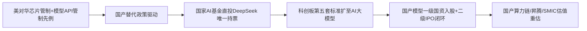
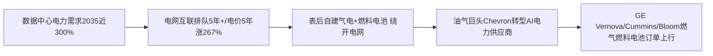

> **覆盖区间**：2026-06-16（周二）00:00 ~ 2026-06-22（周一）24:00（上海时区）
> **覆盖范围**：AI 产业链 5 层（能源 / 基础设施 / 芯片存储 / 模型框架 / 应用商业化）+ 4 横切维度（政策 / 国资 / 资金 / 人才）
> **时间窗声明**：仅收录上述自然周内的真实公开动态；区间外信息仅作背景并标注"（背景，非本周）"。所有关键数据标注来源 URL + 日期，查不到写"未公开"，绝不编造。

> **本周产业链全景**：本周最活跃的是**横切维度（资本市场 + 国资 + 政策）与能源底层的双向夹击**。三条主线同时按下拐点：① **资本接力上市、中美双轨分化**——中国侧 DeepSeek 完成 510 亿元（约 74 亿美元）首轮融资、估值近 4000 亿元，创中国 AI 单轮纪录，国家人工智能产业投资基金成唯一直接持股且有投票权的外部方；美国侧 SpaceX 以 600 亿美元全股票收购 Cursor，被称"AI 应用层首笔大型退出"，叠加 OpenAI 2025 年净亏 390 亿美元财务泄露。② **政策中松美紧**——证监会在陆家嘴论坛宣布科创板第五套标准扩至 AI 大模型，为国产模型打开境内 IPO 通道；美国 42 州总检察长联合传票 + 白宫行政令聚焦 to C 安全执法。③ **算力底层量价齐升**——高盛将 2026 定性为 15 年来最严重内存短缺（HBM 缺口 5.1%），Q2 DRAM 合约价环比涨 58–63%；能源侧 Chevron×Microsoft、Circe×Cummins、Oracle 三笔表后自建电力交易确认"自筹电力"成数据中心新范式。**两条最强传导链**：「国资战略入股 + 科创板通道打开 → 国产模型一二级闭环」与「电网互联排队 5 年+ → 表后自建气电/燃料电池 → 油气巨头转型 AI 电力供应商」本周同时成型。

---

## 🔥 本周 TOP 5 投资事件

> 按"对产业研判 + 一级市场机会判断的**信号价值**"排序，非按新闻热度。

### 1. DeepSeek 完成 510 亿元首轮融资，国家 AI 基金成唯一持票外部方 ｜ 2026-06-16

企查查工商数据显示，杭州深度求索（DeepSeek）正式完成成立以来首轮外部融资，整体规模约 510 亿元（约 74 亿美元），投后估值近 4000 亿元（>500 亿美元），创中国 AI 行业单轮融资历史纪录。投资方阵容：创始人梁文锋个人出资 200 亿元（占比最大）、腾讯 100 亿元、宁德时代 50 亿元、京东/网易/IDG 资本各约 30 亿元，以及国家人工智能产业投资基金（合伙企业）10 亿元直投。本轮采用独特交易架构：要求外部投资者将资金注入由梁文锋管理的有限合伙企业（而非直接持股 DeepSeek），设五年锁定期、不享表决权、仅能获取特定财务信息；**国家 AI 产业投资基金是唯一例外——直接入股且享有投票权、不受五年锁定限制**。融资用途：扩展 AI 基础设施（内蒙古自建数据中心）、强化研发、员工股权激励、加快商业化。

↳ **投资意义**：标志国产大模型从"技术竞赛"全面升级为"资本竞赛"，头部资金极度集中、赢家通吃【确定性 高】。"有限合伙 + 五年锁定 + 无投票权"是梁文锋隔绝资本干预、保留绝对控制（合计控股 84.29%）的精巧设计，国资成唯一有投票权外部方，凸显国资在自主可控大模型中的战略锚定【确定性 高】。腾讯参股是对自研混元的战略对冲，宁德时代入股则沿"算力-电力"链卡位 DeepSeek 数据中心的储能需求【确定性 中】。 [IT之家](https://www.ithome.com/0/965/686.htm) ｜ [新浪财经](https://finance.sina.com.cn/wm/2026-06-17/doc-inicsmhz3982396.shtml)

### 2. SpaceX 以 600 亿美元全股票收购 Cursor ｜ 2026-06-16

SpaceX（年初已并入 xAI）宣布以 600 亿美元全股票收购自主编程初创 Cursor（开发商 Anysphere，2022 年由 4 名 MIT 毕业生创立），预计 2026 Q3 完成。当日 SpaceX 市值达 2.8 万亿美元，超越 Amazon 成全美第 5 大上市公司。Cursor 是"vibe coding"现象级 AI 编程助手、年化营收 40 亿美元（约 15 倍 ARR），但其平台可切换 Anthropic/OpenAI 等多家模型。SpaceX 确认与 Cursor 正联合训练一款将同时上线 Cursor 与 xAI "Grok Build"的模型。早期投资人 Chamath 称这是"AI 应用层第一笔、但非最后一笔大型退出"。批评者指出 SpaceX IPO 仅售 4% 股份制造"人为稀缺"推高股价，再用高估值股票零现金收购，而公司每季度仍亏 40 亿美元。另据 SpaceX IPO 文件，Anthropic 将按 12.5 亿美元/月付费使用其算力至 2029 年 5 月。

↳ **投资意义**：600 亿美元收购 40 亿美元营收的 Cursor 印证 AI 编程应用层进入头部并购整合期，或开启 IPO 后巨头用高估值股票横扫应用层标的的浪潮【确定性 高】。用 4% 流通盘制造稀缺溢价做"纸面货币"并购、与对手方（Anthropic 算力租约）交叉绑定，循环融资风险加剧【确定性 中】。Cursor 并入后 xAI 补齐编程短板、对标 Claude Code/Codex，但模型中立性丧失或致原有多模型用户流失【确定性 中】。 [LA Times](https://www.latimes.com/business/story/2026-06-16/spacex-buys-ai-coding-startup-cursor-for-60-billion-in-race-for-edge-over-anthropic-openai)

### 3. 证监会：科创板第五套标准扩至 AI 大模型 ｜ 2026-06-17

2026 陆家嘴论坛开幕，证监会主席吴清发表主题演讲。AI 核心条款原文摘录："近期，科创板方面将抓紧推出 2 项改革措施。**一是扩大第五套标准适用范围至人工智能领域，积极支持优质人工智能大模型企业上市**。二是落实发展未来产业战略部署，支持量子科技、生物制造、具身智能等更多领域'硬科技'企业在科创板上市。"监管端原文："我们将统筹好发展与安全，**适时发布规范发展资本市场人工智能的指导意见**……依法从严打击利用人工智能非法荐股、造谣传谣、违法交易等乱象。"背景数据：两创板上市公司 >2000 家、总市值 >35 万亿元；新"国九条"两年来中长期资金净买入 A 股约 1.3 万亿元。

↳ **投资意义**：科创板第五套标准（允许未盈利硬科技企业上市）扩至 AI 大模型，是国家级资本市场为国产大模型打开境内 IPO 通道的关键政策，直接利好智谱（已启动科创板上市）、MiniMax、月之暗面、DeepSeek 等"6 小龙"的境内退出路径，与 DeepSeek 同周国资领投融资形成"一级国资入股 + 二级 IPO 通道"的政策闭环【确定性 高】。"具身智能"明确纳入支持范围，机器人赛道境内上市预期升温【确定性 中】。 [新京报·吴清演讲全文](https://www.bjnews.com.cn/detail/1781674456129708.html)

### 4. 高盛定性 15 年来最严重内存短缺，Q2 DRAM 合约价涨 58–63% ｜ 2026-06-17

高盛发布重磅报告，预测 2026 年内存市场将面临 15 年来最严重供给短缺：DRAM 缺口 4.9%、NAND Flash 4.2%、HBM 高达 5.1%；并将 2027 年 DRAM 短缺预测从 2.5% 大幅上调至 5.9%，暗示短缺或延续至 2028 年。价格端已剧烈反应：据 TrendForce，Q2 DRAM 固定合约价环比暴涨 58–63%、NAND Flash 跳涨 70–75%；高盛预测 2026 全年 DRAM 均价同比飙升 326%。本轮周期与以往本质不同：①需求由 AI 基建投资驱动而非手机/PC 换机；②供给受制于新晶圆厂 4–5 年建设周期；③客户为锁货签订含预付款/罚则的长约（LTA），削弱价格战动机。三大原厂已将约 93% 的 DRAM 产能转向 AI。同期 SK 海力士向客户通知 DDR5 涨价 15–20%。

↳ **投资意义**：内存超级周期已被高盛"定性"，供需缺口 + LTA 长约 + 四五年建厂周期三重支撑，2026–2027 上行确定性高，短期无超供可能【确定性 高】。三大原厂（SK 海力士/三星/美光）ASP 与毛利率齐升，从周期股向"稳定现金流"模型重估；台日供应链（Kioxia/力积电）受外溢受益。核心风险：下半年通用内存或现"温和下行"形成分叉周期，美光 6/24 财报语调是全链估值关键拐点【确定性 中】。 [高盛报告综述](https://finance.biggo.com/news/853cb658-c593-48a9-a743-ffaa215f23e9)

### 5. 表后自建电力三连击：油气巨头转型 AI 电力供应商 ｜ 2026-06-17 ~ 06-22

本周能源层三笔同构交易确认"自筹电力"成数据中心新范式。① Chevron 与 Microsoft 签 20 年购电协议，在西德州共建 2.67GW 名为「Project Kilby」的同址燃气发电设施，预计 2026 年底做 FID、2028 首电，带来超 100 亿美元州地方税收。② Circe Energy 与 Cummins 签约，为西德州数据中心园区锁定 2GW 天然气发电（2027 起步 150MW、2030 达 1.1GW），典型 behind-the-meter 绕开公用事业互联。③ Oracle 新墨西哥 Project Jupiter 放弃原燃气轮机设计，改用 Bloom Energy 固体氧化物燃料电池微电网，单项目签约最高 2.45GW、组合 2.8GW，降氮氧化物约 92%、发电零耗水。背景：ERCOT 大型项目互联排队平均 5 年+，表后发电消除排队风险。

↳ **投资意义**：表后自建气电是多 GW 级 AI 园区当前最现实的供电方案，西德州二叠盆地成"AI 电力高地"，利好 GE Vernova（燃气轮机+GridOS）、Cummins、Caterpillar/Solar Turbines、Bloom Energy（2.8GW 组合订单是关键催化）【确定性 高】。油气巨头（Chevron）正成为 AI 电力新供给方，纯碳中和叙事在算力军备竞赛下让位于"GW 级可靠电力"，能源资本流向被重定向：气电/核电是赢家，海上风电是输家【确定性 高】。 [Converge Digest](https://convergedigest.com/chevron-signs-20-year-power-deal-with-microsoft/) ｜ [Energy.media](https://energy.media/energy-deals/circe-energy-secures-2gw-of-natural-gas-capacity-for-west-texas-data-center/)

---

## 🧭 三条主线判断

**主线一 · 资本流向：中美双轨分化，IPO/并购接力成主线。** 本周最硬的两笔交易——DeepSeek 首轮 74 亿美元融资（中国 AI 单轮历史纪录）与 SpaceX 600 亿美元全股票收购 Cursor（"AI 应用层首笔大型退出"）——揭示资本主线已从"一级市场巨额输血"转向"国资战略入股（中）+ 公开市场流动性驱动应用层整合（美）"。叠加 OpenAI/Anthropic/SpaceX 三巨头 IPO 接力（SpaceX 首周 +37%），一级市场对 AI 巨额 capex 的承接力见顶，公众资金接棒为 AGI 定价。

**主线二 · 政策导向：中美同向收紧但着力点相反。** 中国（6/17 陆家嘴论坛）用科创板第五套标准扩至 AI 大模型，为国产模型打开境内 IPO 通道，"一级国资入股 + 二级 IPO 退出"政策闭环成型；美国（42 州传票 + 白宫 6/2 行政令）聚焦 AI to C 安全/隐私执法，抬高商业化合规成本。中国"促上市"、美国"严监管"，是两国 AI 产业阶段差异（中国仍需资本催熟、美国需约束已成熟的 to C 风险）的镜像。

**主线三 · 技术拐点：算力底层量价齐升，能源转向表后自建。** 芯片侧 MLPerf Training 6.0（6/16）成总催化——英伟达 Blackwell 全项清场、AMD MI355X 追至 B200 差距 5–6% 内；内存被高盛定性 15 年最严重短缺；先进封装（CoWoS）2026 需求约 100 万片晶圆 vs 2024 约 37 万片，是第一硬瓶颈。能源侧瓶颈从"服务器交付"转移到"电力与热工流"，表后自建气电/燃料电池绕开 5 年+ 电网排队成主流路径。

---

## 🧩 产业链研判（so what 收敛层）

> 本节是给老板看的"结论层"，由本周真实动态推导，区分确定性。

### ① 本周最强两条传导链

**链一（国产自主可控闭环）**：美国出口管制（芯片 + 首例模型 API 管制）→ 国产替代政策驱动 → 国家 AI 基金以唯一持票方直投 DeepSeek → 科创板第五套标准同周扩至 AI 大模型 → 国产模型"一级国资入股 + 二级 IPO 退出"闭环成型 → 国产算力链估值重估。【确定性 高】

**链二（能源成 AI 硬约束）**：数据中心电力需求到 2035 近 300%、电网互联排队 5 年+、电价 5 年涨 267% → 表后自建气电/燃料电池绕开电网 → 油气巨头 Chevron 转型 AI 电力供应商 → GE Vernova/Cummins/Bloom 燃气与燃料电池订单上行。【确定性 高】

### ② 景气度信号

- **上行**：内存（HBM/DRAM/NAND，高盛定性 15 年最严重短缺、Q2 合约价 +58–75%）、先进封装（CoWoS 售罄至 2027）、表后燃气发电设备（GE Vernova/Cummins/Bloom）、中国国产算力链（政策 + 国资 + IPO 三重驱动）。【确定性 高】
- **拐点出现**：代工格局（三星 2nm 良率约 50% + 赢 Tesla/AMD/NVIDIA、英特尔 18A-P + Google 300 万 TPU 大单，台积电近垄断现边际分流）；开源 vs 闭源（Anthropic Fable 5 被政府关停 vs GLM-5.2 价格 1/6 不可关停）。【确定性 中】
- **承压/下行风险**：闭源前沿模型估值（政府可一键关停的政策折价）、通用内存下半年或现"分叉式"温和下行、海上风电（特朗普政府累计 26 亿美元取消近海风电租约）。【确定性 中】

### ③ 资本流向判断（A 目标）

钱本周明确流向三处：**国产自主可控模型层**（国资 + 产业资本托底 DeepSeek）、**算力底层卖铲人**（台积电封装/内存原厂/博通 ASIC）、**表后电力设备**（燃气轮机/燃料电池）。出现的方向切换是：美国资本从"一级巨额融资"切向"公开市场上市 + 应用层并购整合"；中国资本从国资"建算力"上移到"投模型"。【确定性 高】

### ④ 一级市场机会与风险（C 目标）

- **过热风险**：估值-收入剪刀差是全行业最大风险——智谱年收入 7.24 亿元撑 7000 亿港元市值（P/S 约 480 倍）、Kimi 约 2 亿美元 ARR 对 200 亿美元估值（约 100 倍）、DeepSeek 开源 + 永久降价压制变现却估值 500 亿美元；OpenAI 经营性亏损 80 亿美元/营收 240 亿美元。MiniMax 7 月近 50% 股份解禁是首个真实流动性压力测试。【确定性 中】
- **可能被低估/早期机会**：先进封装外溢链（CoWoS→CoPoS 玻璃基板/Ibiden/Innolux）、推理框架商业化（Inferact 已获 a16z 1.5 亿美元商业化 vLLM）、燃料电池（Bloom 2.8GW 组合订单）、HALEU 燃料"卖铲人"（Centrus，确定性优于 pre-revenue 的反应堆开发商）。【确定性 中】

### ⑤ 下周值得跟踪的领先指标

1. **美光 6/24 FY26 Q3 财报**：81% 毛利率能否维持 + CEO 语调，是内存全链估值关键拐点（期权已 price in ±20%）。【确定性 高】
2. **英伟达 6/24 年度股东大会**：Rubin 放量节奏与非中国需求对冲表述。【确定性 中】
3. **Anthropic Fable 5/Mythos 5 是否恢复**（Kalshi 预测 7/1 前恢复约 57%）：决定"政府关停前沿模型"先例的边界。【确定性 中】

---

## 📚 各层深度正文

> 自底向上分层全量深度内容。已进 TOP5 的事件正文标注"详见 TOP5"，不重复展开判断。

### 🔋 L1 能源层

速查表（导航）：

| 子主题 | 热度 | 一句话 |
|---|---|---|
| 天然气 PPA（Chevron×Microsoft） | 🔥重大 | 2.67GW 西德州自建气电，详见 TOP5 |
| 核电 SMR 燃料链（Oklo×Centrus） | 🟢一般 | HALEU 供应意向书，破先进核电燃料瓶颈 |
| 核电融资模式（Duke 提议巨头出资） | 🟢一般 | "客户出资共建核电"重塑融资范式 |
| 核电 SMR（NuScale/TVA/日本$250亿） | 🟢一般 | 多重催化，板块情绪升温 |
| 光伏/核聚变 | ⚪️静默 | 本周无单笔大额交易 |

**核电 SMR 燃料链：Oklo × Centrus 签 HALEU 供应意向书**

2026-06-19 左右，先进核电公司 Oklo（NYSE: OKLO）与铀浓缩商 Centrus Energy（NYSE: LEU）签署意向书（LOI），Centrus 承诺从其俄亥俄州 Piketon 的 American Centrifuge Plant 供应足量国产高丰度低浓铀（HALEU），支持 Oklo 规划的 1.2GW 清洁能源园区中最多 5 座 Aurora powerhouse 多年运行，2029 年开始交付。这是"首批大规模商业 HALEU 供应协议之一"，可能含 Oklo 向 Centrus 的预付款。同时 Oklo 与北美最大工程建设商之一 Kiewit Nuclear Solutions 签署 MOU，支持俄州初期 Aurora 部署的 EPC 规划。该交易直击先进核电最大瓶颈——国产 HALEU 燃料供给（此前依赖俄罗斯）。延续 Oklo 2026 年 1 月与 Meta 的协议。Aurora 采用液态金属冷却、低耗水、快中子裂变，build-own-operate 模式。

关键数据：HALEU 支持最多 5 座 Aurora；园区 1.2GW；交付始于 2029；DOE 已授予 9 亿美元 HALEU 任务订单；Oklo 市值约 100 亿美元（[mining.com](https://www.mining.com/centrus-energy-oklo-sign-multi-year-nuclear-fuel-deal/)，2026-06-19）；HALEU 合同金额未公开。

投资判断：HALEU 是先进核电（Oklo/X-energy/TerraPower 等）的真正瓶颈，Centrus 作为美国唯一商业 HALEU 产能持有者是"卖铲人"，确定性优于尚无收入的 reactor 开发商。Oklo 仍 pre-revenue、2029 才交付、100 亿美元市值已 price-in 商业化预期，属高风险高弹性标的。"燃料-发电-客户-EPC"四要素闭环是先进核电从 PPT 走向落地的样板。[Centrus 官方公告](https://www.centrusenergy.com/news/oklo-centrus-sign-letter-of-intent-to-purchase-nuclear-fuel-for-aurora-powerhouse-deployment-in-southern-ohio/)

**核电融资模式：Duke Energy 提议科技巨头出资共建核电**

2026-06-19，美东南区大型受监管公用事业 Duke Energy（NYSE: DUK）提出创新融资模式：邀请大型科技公司直接出资帮助建设新核电厂。传统模式下，受监管公用事业靠借债/增发建厂、再通过监管批准的电价上调回收成本——但核电项目常超期超支，资本投入与成本回收之间的时滞令公用事业承担巨大财务风险，这正是核电新建迟缓的根因。Duke 的提案让科技巨头分担前期资本与下行风险，形成多方共赢。文章特别点名 Oklo——因其已与 Meta 等深度绑定，若 Duke 说服 Meta 等买单，这些公司可能优先选 Oklo 而非 NuScale 或 Nano Nuclear。该提案仍是政策性提议、未签约、无具体金额。

投资判断：若成行，将重塑核电融资范式——把超支风险从公用事业/纳税人转移到现金充裕的 hyperscaler，可能大幅加速 SMR 商业化。受益排序：已绑定 hyperscaler 的 SMR 玩家（Oklo）> 纯技术 SMR（NuScale/Nano Nuclear）> 传统公用事业。目前属"拐点信号"而非已兑现事件。[The Motley Fool](https://www.fool.com/investing/2026/06/19/this-utility-wants-technology-companies-to-help-fo/)

**核电 SMR：NuScale Paragon 安全里程碑 + TVA 6GW + 日本 250 亿美元承诺**

SMR 板块本周多重催化。① 6-18，NuScale Power（NYSE: SMR）宣布授予 Paragon 一份合同，完成其高度集成保护系统的最终设计工作——关键安全里程碑，股价单日涨 12.67%（一周累涨约 14%）。② NuScale 联合 TVA（田纳西河谷管理局）与 ENTRA1 Energy 推进一个 6GW SMR 项目，为 TVA 七州区域供碳中和电力。③ 宏观催化：日本承诺最高 250 亿美元支持美国 SMR 项目，提振板块情绪。④ NuScale Q1 2026 约 10 亿美元流动性支撑 6 模块计划。⑤ 行业背景：瑞典 Vattenfall 本周选定 Rolls-Royce SMR。文章警示 NuScale"交易更多基于潜力而非进展"。

投资判断：SMR 板块（NuScale/Oklo/Nano Nuclear）本周受"安全里程碑 + 主权资本（日本 250 亿美元）+ 数据中心需求"三重催化，但仍是 pre-revenue、靠题材驱动的高弹性标的。Paragon 安全系统定稿是 NuScale 走向 NRC 最终批准的实质进展，含金量较高。主权资本入场标志 SMR 上升为国家能源安全议题，但 2029-2030 才交付，短期无现金流。[NuScale 官网](https://www.nuscalepower.com/) ｜ [StocksToTrade](https://stockstotrade.com/news/nuscale-power-corporation-smr-news-2026_06_18/)

> 💤 本周静默：光伏（A 组范围内无单笔大额光伏交易/融资）；核聚变（仅"私人资本超 130 亿美元"趋势综述，无本周单笔签约）。

---

### 🏗️ L2 基础设施层

速查表（导航）：

| 子主题 | 热度 | 一句话 |
|---|---|---|
| FERC 电网"快车道"+电价改革 | 🔥重大 | 联邦把 AI 竞争力置于电网政策核心 |
| 自建气电（Circe×Cummins 2GW） | 🔥重大 | 西德州表后气电，详见 TOP5 |
| Oracle Stargate 4.5GW + 自筹电力 | 🔥重大 | FY26 capex 557 亿美元超指引 |
| 数据中心产能真相（SemiAnalysis） | 🟢一般 | 驳"半数取消"，揭真实延期瓶颈 |
| 散热/液冷+能效框架 | 🟡边缘 | 行业框架为主，无单笔大单 |

**FERC 为数据中心开互联"快车道" + 电价改革**

2026-06-18，美国联邦能源监管委员会（FERC）发布重磅命令，要求六大电网运营商为数据中心等大型用电户开通互联"快车道"，须证明数据中心"能及时有序接入输电系统"；数据中心自付互联成本；委员们全票通过。运营商有 30 天报告剩余可用发电容量、60 天"捍卫或修订"区域电价。**关键矛盾：FERC 给了接入快车道，但未解决发电容量短缺本身。** 背景数据触目：截至 2023 年底，电厂并网申请容量已超过现有全部电厂装机；数据中心电力需求预计到 2035 年增近 300%；批发电价较 5 年前最高涨 267%（Bloomberg）。同期（6-17）特朗普政府宣布付 7.65 亿美元给 Invenergy 取消加州/缅因/纽约近海风电租约，累计已花约 26 亿美元取消海上风电。

关键数据：6 大电网运营商；30 天/60 天期限；电价较 5 年前最高 +267%；数据中心需求到 2035 增近 300%；取消风电支出 7.65 亿美元单笔/26 亿美元累计（[AP News](https://apnews.com/article/power-electricity-ai-plants-data-centers-grid-506e3d206871111f15c3c62fc5368be5)，2026-06-17）。

投资判断：FERC 快车道是政策拐点信号——联邦层面正式把"AI 竞争力"置于电网政策核心，利好已有并网位置/自有发电的玩家（Vistra/Constellation/Chevron 气电）。但"只通车不增电"暴露根本瓶颈仍是发电容量，behind-the-meter 自建电源将是未来 2-3 年主线。政策同时打压海上风电、扶持天然气+地热+核电，能源资本流向被政治重新定向。[TechCrunch](https://techcrunch.com/2026/06/18/ai-data-centers-just-got-a-government-mandated-fast-lane-to-the-grid/) ｜ [FERC 官方](https://www.ferc.gov/news-events/news/ferc-launches-aggressive-targeted-action-speed-large-load-integration)

**Oracle Stargate 4.5GW 在建 + 自筹电力/燃料电池微电网**

本周围绕 Stargate 的建设与"自筹电力"模式有多条动态。① 6-18，Oracle 与 OpenAI 在密歇根 Stargate 园区正式开工。② Stargate 现已有 4.5GW 在建产能，分布于德州、新墨西哥、威斯康星、密歇根四州（其他口径称规划近 7GW 甚至 10GW，存在产能口径差异——以"4.5GW 在建"为最保守可核口径）。③ Oracle FY2026（截至 5-31）实际资本开支 557 亿美元，超出其自身 500 亿美元指引。④ 新墨西哥 Project Jupiter（Stargate 子项目）放弃原燃气轮机+柴油机设计，改用 Bloom Energy 固体氧化物燃料电池微电网，单项目签约最高 2.45GW、组合最高 2.8GW，相比原设计降氮氧化物约 92%、发电零耗水。⑤ 散热采用 direct-to-chip 闭环非蒸发液冷，日常零补水。

关键数据：Stargate 4.5GW 在建；Oracle FY26 capex 557 亿美元 vs 500 亿美元指引；Bloom 燃料电池单项目 2.45GW/组合 2.8GW；降 NOx 约 92%；密歇根开工 6-18。各口径 Stargate 总规划 4.5/7/10GW 存在争议（[shashi.co](https://www.shashi.co/2026/06/power-and-water-are-where-ai.html)，2026-06-20）。

投资判断：Stargate 557 亿美元 capex 超指引印证 AI 基建资本仍在加速，Oracle 成超大规模 capex 新极点。"自筹电力 + behind-the-meter"成数据中心选址核心范式，利好燃料电池（Bloom Energy）、燃气轮机、微电网。选址向"廉价能源 + 土地 + 宽松监管"区域集中。水资源与社区反对成隐性风险，闭环液冷 + 燃料电池"零耗水/低排放"设计是合规护城河。

**数据中心产能真相：SemiAnalysis 驳"2026 半数产能取消"**

2026-06-21，权威研究机构 SemiAnalysis 发文驳斥"2026 年美国半数数据中心产能将延期/取消"的流行说法。核心论点：①流行数字基于错误分母——SemiAnalysis 卫星图模型显示仅前两大 hyperscaler 自建在建产能就超过 5GW，分母低估数倍，其 YE2026 北美超大规模自建预测半年来仅变动约 1%、colocation 变动 <5%。②被标记延期的几乎都是早期/预建设"announced"投机产能。③美国大型负荷排队已从 2025 年 12 月的"超过半个 TW"升至超过 1TW，绝大多数高度投机。④真实延期案例：Oracle/STACK 新墨西哥 Project Jupiter 因天然气管道（400,000 Dth/d）与许可受阻延至 2029（NMED 收到约 7155 条公众意见）；Nebius 新泽西 300MW 因设备交付延迟从 4 个月拖到 10-11 个月。

投资判断："半数取消"是伪命题——真正在建的核心 hyperscaler 产能稳健，被砍的是投机性早期项目，对设备供应商需求无实质影响。真实瓶颈被精确定位：天然气管道 + 许可 + NIMBY，而非需求或资本。这意味着拥有"管道 + 许可 + 成熟 EPC"能力者是稀缺赢家。投资应只认 satellite-verified 在建产能，对 GW 级新闻稿打折。[SemiAnalysis](https://newsletter.semianalysis.com/p/stop-saying-half-of-2026-us-datacenter)

**散热/液冷与电力瓶颈产业框架**

本周散热与电力瓶颈侧以"行业框架/趋势"为主，无单笔大额交易。NEMA、ASHRAE 与太平洋西北国家实验室（PNNL）联合发布 AI 数据中心能效框架（发布于 6-10，背景）；Omdia 报告指出 2026 年数据中心电力与散热系统将被根本性重新设计以弥合到 GW 级园区的鸿沟；瓶颈已从"服务器交付"转移到"电力与热工流"，高密度液冷环境的电气工程师/技师严重短缺；GE Vernova 6 月推出 GridOS for Transmission 软件编排数据中心负荷。

投资判断：瓶颈"从服务器转向电力与散热"是 2026 核心叙事，利好供电链（GE Vernova、Vertiv、施耐德/伊顿）与液冷（DLC、浸没式）。专业电气工程师/技师短缺是隐性瓶颈，拉长项目周期。本周无液冷厂商大单，属"主题确认"而非"事件兑现"。[ENR](https://www.enr.com/articles/63177-ai-data-centers-become-city-scale-infrastructure-prompting-new-industry-playbook)

---

### 💾 L3 芯片 + 存储层

速查表（导航）：

| 子主题 | 热度 | 一句话 |
|---|---|---|
| 内存超级周期（高盛定性） | 🔥重大 | 15 年最严重短缺，详见 TOP5 |
| HBM（SK海力士 12层 HBM4E 送样） | 🔥重大 | 48GB/堆栈，巩固龙头 |
| 台积电（涨价+CoWoS+Amkor） | 🔥重大 | ADR 6/20 涨 6.86%，封装第一瓶颈 |
| NVIDIA（MLPerf 6.0 清场） | 🔥重大 | Blackwell 全项第一，唯一全提交 |
| AMD（MI355X 追至 B200 差距 5%内） | 🟢一般 | 训练侧实质跨越 |
| 自研 ASIC（博通 Q3 指引 160 亿） | 🟢一般 | AI 半导体 +143%，FY27 瞄准千亿 |
| 中国国产芯片（昇腾/SMIC+管制） | 🔥重大 | 国家算力网 80% 国产化强制 |
| 代工三强（三星/英特尔分流） | 🟢一般 | 2nm GAA 首次广泛部署 |

**HBM：SK 海力士提前送样 12 层 HBM4E**

6 月 18 日 SK 海力士官方宣布向主要客户出货 12 层 HBM4E 样品（提前于计划），实现单堆栈 48GB 容量，每针脚最高 16Gbps 速率、约 4TB/s 带宽，功效较前代提升 20% 以上，并采用 Advanced MR-MUF 技术将热阻较 HBM4 降低 17%。此举把与三星的竞赛进一步收紧。从竞争格局看，英伟达已于 6 月 5 日认证三星、SK 海力士、美光为下一代 Vera Rubin 平台的 HBM4 供应商；供应链分析师估算 SK 海力士将拿下 60%–70% 订单、三星 25%–30%、美光取剩余份额。SK 海力士对英伟达的营收依赖度已接近 30%。

关键数据：12 层 HBM4E：48GB/堆栈，16Gbps/针脚，约 4TB/s，功效 +20%，热阻 -17%（[SK 海力士官方](https://news.skhynix.com/12-layer-hbm4e-sample/)，2026-06-18）；HBM4 订单份额估算 SK 海力士 60–70%/三星 25–30%/美光余量；2026 HBM 供给缺口 5.1%（高盛）。

投资判断：HBM 是本轮 AI 内存超级周期中确定性最高、定价权最强的细分。SK 海力士提前送样 HBM4E 巩固龙头地位，叠加 Vera Rubin 三供格局，韩厂仍是核心受益者，但美光放量是份额变量。HBM 相对通用 DRAM 将持续溢价。需警惕对少数客户（英伟达/博通）的高度依赖。[BigGo 综述](https://finance.biggo.com/news/853cb658-c593-48a9-a743-ffaa215f23e9)

**台积电：涨价预期 + CoWoS 缓解 + Amkor 十年封装协议**

本周台积电是芯片板块最大焦点，6 月 20 日 ADR（TSM）开盘大涨 6.86%。核心驱动：①代工涨价预期——市场传出台积电将上调代工价格，尤其 3 纳米节点将大幅提价；②与 Amkor 的十年先进封装/测试协议落地（亚利桑那州），强化美国本土供应链；③CoWoS 瓶颈缓解信号——台积电对 CoWoS 封装家族激进扩产，有望年底前将产能缺口缩窄一半，下一代 CoPoS 玻璃基板试产线已在评估。业内估计 2026 年 CoWoS 总需求接近 100 万片晶圆（2024 年约 37 万片），台积电 CoWoS-S 与 CoWoS-L 产线全部售罄。台积电 2026 全年 capex 指引高达 520–560 亿美元。

关键数据：TSM ADR 6/20 开盘 +6.86%（[TradingKey](https://www.tradingkey.com/news/market-movers/261978923-market-movers-tsm-20260620)）；2026 CoWoS 总需求约 100 万片 vs 2024 约 37 万片；2026 底全行业 CoWoS 产能约 20 万 wpm、台积电约 12 万 wpm（TrendForce）；台积电 2026 capex 520–560 亿美元；CoPoS 预计 2H28 量产。

投资判断：台积电仍是整个 AI 算力链最确定的"卖铲人"，先进封装（CoWoS/CoPoS）是 2026 年最硬瓶颈，量价齐升 + 涨价预期支撑估值上修。风险点：Q2 营收可能不及 35% 增速预期；Google/AMD/Tesla 启动双供应商策略转向三星。封装环节（Amkor、ASE、玻璃基板）是 2026 确定性受益细分赛道。[Viks Newsletter](https://www.viksnewsletter.com/p/battle-for-advanced-packaging-tsmc-intel-amkor)

**NVIDIA：MLPerf Training 6.0 全项清场**

6 月 16 日 MLCommons 发布 MLPerf Training v6.0，英伟达 Blackwell 平台横扫全部基准、实现"clean sweep"——每项基准取得最快 time-to-train，且是唯一在所有测试提交结果的平台。本轮新增反映最新趋势的预训练基准：DeepSeek-V3（671B MoE）和 GPT-OSS-20B。关键记录（GB300 NVL72）：DeepSeek-V3 671B 用 8192 GPU 仅 2.02 分钟；Llama 3.1 405B 用 8192 GPU 7.07 分钟。软件优化在 GPT-OSS 上带来 93% 端到端加速；过去 3 个月 GB300 在 DeepSeek-V3 上吞吐 +1.3x（纯软件无需改硅）。GB300 NVL72 较 GB200 相同机架配置最高快 60%。英伟达将于 6 月 24 日召开年度股东大会。

关键数据：MLPerf 6.0 英伟达全项第一、唯一全提交；DeepSeek-V3 671B 8192 GPU 训练 2.02 分钟；GB300 vs GB200 最高 +60%（[NVIDIA 官方博客](https://developer.nvidia.com/blog/nvidia-blackwell-tops-mlperf-training-6-0-with-industry-leading-scale-and-performance/)，2026-06-16）；Blackwell+Rubin 2026-27 预计合计 1 万亿美元营收（背景）。

投资判断：英伟达在 MLPerf 6.0 训练侧再次"清场"，尤其在 MoE 新基准上确立绝对领先，强化训练侧护城河与 CUDA 全栈软件壁垒。结合 Grace Blackwell"售罄"+ Vera Rubin 下半年出货，基本面仍极强。风险=中国市场归零 + ASIC/AMD 分流推理需求 + 高估值。6 月 24 日股东大会为催化。

**AMD：MI355X 追至 B200 差距 5–6% 内**

本周 AMD 官方发布 MLPerf Training 6.0 成绩，为史上最全面训练提交：首次跨两大 LLM 基准启用生产级 MXFP4 训练配方、首次用 AMD Primus 统一训练框架、首次多节点提交。核心成绩：MI355X 在 Llama 2-70B 微调上实现 3.5 倍代际跃升（从 MI300X MXFP8 到 MI355X MXFP4，仅一年）；对比英伟达 B200，MI355X 用 MXFP4 在 Llama 2-70B 微调差距 5% 以内、Llama 3.1-8B 预训练差距 6% 以内；与 Oracle 云合作提交 FLUX.1 512-GPU，首次匹配英伟达最大 512-GPU 训练规模。生态创纪录 10 家伙伴提交。MI400/MI450 "Helios" 将于 2026 年搭载 HBM4。背景：AMD 已与 OpenAI、Meta 各签 6GW GPU 部署协议。

关键数据：MI355X Llama 2-70B 微调 3.5 倍代际提升；vs B200 差距 5–6% 内；MI350 系列 CDNA 4、3nm、1850 亿晶体管、288GB HBM3E、10 PF MXFP4（[AMD 官方博客](https://www.amd.com/en/blogs/2026/amd-delivers-breakthrough-mlperf-training-6-0-results.html)）。

投资判断：AMD 首次拿出接近英伟达 B200 的训练成绩 + 多节点规模化 + 10 家 OEM/云生态背书，是从"推理替代"向"训练可用"的实质性跨越，叠加 Helios 路线图与 OpenAI/Meta 各 6GW 大单，作为"第二供应商"确定性显著增强。ROCm 软件成熟度仍是核心变量。

---
**自研 ASIC：博通 FY Q2 AI 半导体 +143%，Q3 指引 160 亿美元**

本周自研 ASIC 赛道焦点在博通（AVGO）。6 月 22 日博通股价回落至 396.72 美元（高估值 AI 基建股整体回调），但 JPMorgan 力挺，驳斥"博通与谷歌延迟/取消下一代 TPU v9 2 纳米项目"传闻，称"无延迟、无取消"，维持 Overweight 与 580 美元目标价。基本面：博通 FY Q2 AI 半导体营收同比 +143% 至 108 亿美元，指引 Q3 AI 半导体营收 160 亿美元（同比增长超 200%）。关键在"合约管道"：博通 4 月 SEC 文件披露为谷歌下一代 AI 机架供应的保障协议延至 2031 年；6 月 9 日与 Apollo、Blackstone 成立平台，初始 350 亿美元支持超 1GW 算力，瞄准 2028 年前超 20GW。Anthropic 已与谷歌/博通签多 GW 下一代 TPU 产能（2027 起），其 run-rate 营收已超 300 亿美元。Google TPU v7 Ironwood 约为 Blackwell 性能 90%、单芯片成本低约 44%。

关键数据：博通 FY Q2 AI 半导体营收 108 亿美元（+143%）、Q3 指引 160 亿美元（+200%+）；FY27 AI 营收预计 ≥1000 亿美元；估值 25x next year EPS（[ts2.tech](https://ts2.tech/en/broadcoms-google-ai-chip-contract-takes-on-new-weight-as-jpmorgan-defends-stock/)，2026-06-22）；TPU Ironwood 约 Blackwell 性能 90%、成本低约 44%。

投资判断：自研 ASIC 是 2026 最强结构性趋势之一。博通已从"芯片设计商"升级为"AI 算力经纪商"（硅+网络+私募信贷融资），FY27 AI 营收瞄准 1000 亿美元，估值相对增速（53-66% CAGR）显著偏低，性价比突出。核心风险=客户集中度（Google/Meta/Anthropic/OpenAI 既给可见度也给议价权，Marvell 抢单）。[The Motley Fool](https://www.fool.com/investing/2026/06/19/broadcom-builds-custom-chips-for-google-meta-anthr/)

**中国国产芯片：国家算力网 80% 国产化强制 + 昇腾训练 DeepSeek V4-Pro**

本周中国国产芯片叙事密集爆发。①国家级算力网计划：中国正起草五年期 2 万亿元（约 2950 亿美元）AI 基建计划，将数千数据中心连成统一国家算力网，强制要求至少 80% 核心技术（含 AI 加速芯片）来自国产供应商，2028 年完工，由中国移动/中国电信运营；含电网整合后总投资或达 5 万亿元。②DeepSeek V4-Pro（6 月 19 日报道）：1.6 万亿参数 MoE 前沿模型，全程在华为昇腾 950 芯片上训练，零英伟达 GPU。③Z.ai 的 GLM-5.2 在华为昇腾上训练登顶全球开源权重榜。技术现实：昇腾 910C 为双 die 封装、基于 SMIC N+2（约 7nm，DUV 多重曝光）；CloudMatrix 384 系统 BF16 算力约 300 PFLOPS 可比肩英伟达 GB200 NVL72，但功耗约为对应英伟达系统的 4 倍。瓶颈：SMIC N+2 利用率超 93%、无 EUV、国产 HBM 受限。英伟达截至 2026-04 季度对华数据中心 Hopper 出货为 0（去年同期 46 亿美元）。

关键数据：国家算力网 2 万亿元约 2950 亿美元、80% 国产化强制、2028 完工（[TechTimes 引 Bloomberg](https://www.techtimes.com/articles/318868/20260622/china-ai-data-center-grid-locks-out-nvidia-295-billion-domestic-chip-mandate.htm)，2026-06-22）；英伟达对华数据中心 Hopper 出货=0；DeepSeek V4-Pro 1.6 万亿参数全程昇腾 950 训练（[FourWeekMBA](https://fourweekmba.com/deepseek-v4-pro-huawei-ascend-export-controls/)，2026-06-19）；华为 2025 出货约 81.2 万颗昇腾、2026 AI 处理器营收预计约 120 亿美元（+60%）；中国国产芯片 2030 覆盖率约 76%、市场规模约 670 亿美元。

投资判断：中国 AI 芯片市场对英伟达已"立法式归零"，这是结构性而非周期性收缩。国产链（华为昇腾/SMIC/寒武纪/壁仞/摩尔线程）获国家级捕获式市场，是确定性国产替代主线。但技术天花板真实：SMIC 7nm+ 无 EUV + 国产 HBM 短缺三重约束，软件生态（CANN vs CUDA）落后。投资上需区分"政策 beta"与"真实技术 alpha"。中国需求减少反而为非中国买家腾出 CoWoS/HBM 产能。

**代工三强：三星 2nm 良率约 50% + 英特尔 18A-P 首获大客户**

本周代工"三强争霸"叙事升温，台积电产能紧张外溢利好三星与英特尔。①英特尔代工 6 月 16 日在 VLSI 2026 披露：Intel 18A 已于 2025 年量产，并发布性能增强版 18A-P；据报道苹果或用 Intel 18A-P 制造 2027 年 M7，Google 已向英特尔下单 300 万颗 TPU（2028 交付）。②三星代工因台积电产能耗尽密集赢单：2nm 节点良率已达约 50%，传出获 AMD 下代 Epyc、NVIDIA、Tesla（下代 AI6 芯片独家三星德州厂）、Qualcomm、Google、Groq 等客户。三家 foundry 均在 2026 年带来 2nm 级 GAA 工艺，标志行业首次广泛部署 gate-all-around 晶体管。

关键数据：Intel 18A 2025 量产、18A-P 发布；Google 向英特尔订 300 万颗 TPU（2028）；三星 2nm 良率约 50%；三星赢单 AMD 二代 2nm Epyc/NVIDIA/Tesla AI6/Qualcomm/Groq（[TechSpot](https://www.techspot.com/news/112800-samsung-foundry-booming-tsmc-struggles-demand-bags-nvidia.html)）。

投资判断：台积电先进制程/封装产能售罄是结构性事件，正驱动"双供应商策略"，三星（2nm 良率改善 + Tesla/AMD/NVIDIA 赢单）与英特尔代工（18A 量产 + Google 300 万 TPU 大单）迎来份额拐点。这是 2026 代工格局最重要的边际变化。良率与量产稳定性仍是兑现门槛，台积电领先地位短期不改。半导体设备（ASML/AMAT/北方华创）受三厂同步 2nm 扩产驱动确定受益。[Intel Newsroom](https://newsroom.intel.com/intel-foundry/intel-foundry-details-process-milestones-future-innovation-at-vlsi-symposium)

---

### 🧠 L4 模型 + 框架层

速查表（导航）：

| 子主题 | 热度 | 一句话 |
|---|---|---|
| Anthropic Fable 5/Mythos 5 被政府关停 | 🔥重大 | 首次政府"中途关停"前沿模型 |
| 开源 vs 闭源（GLM-5.2 价格 1/6） | 🔥重大 | 753B 开源 MoE，不可关停叙事 |
| 推理经济学（DeepSeek-V4 1.6T） | 🟢一般 | 成本曲线凸性，软件 43 天复利降本 |
| vLLM v0.23.0 / SGLang v0.5.13 | 🟢一般 | 模型 day-0 适配 + 多硬件 |
| PyTorch Blackwell 救火 patch | 🟡边缘 | B200 训练数值稳定性阵痛 |
| 框架资本（Inferact 1.5 亿美元） | 🟡边缘 | 推理引擎成 VC 新主战场 |

> 说明：本期框架层多数重大版本（vLLM v0.23.0、SGLang v0.5.13、GLM-5.2）均落在 6/13–6/15，即本周窗口前 1–3 天，标注"（背景，紧贴窗口前）"，其窗口内的持续影响（采用、复盘、扩散）写入本周动态。

**Anthropic Fable 5 / Mythos 5 因出口管制停服（本周窗口内核心事件）**

这是本周窗口内模型层最大事件。时间线：Anthropic 于 6/9 公开发布 Mythos-class 顶级模型 Fable 5 与 Mythos 5；6/12 17:21 ET 美商务部长 Lutnick 致信 Amodei，援引《出口管制改革法》新兴技术权限发出"Is Informed"指令，要求对全球任何外国国民（含在美工作的外籍 Anthropic 员工）停止一切访问——Anthropic 被迫全平台下线两款模型，截至 6/21 仍未恢复。触发点为一个被"可信合作伙伴"上报的越狱——绕过 Fable 5 安全护栏即可触达 Mythos 架构的高级网络攻击能力。Anthropic 反驳称该能力"在 GPT-5.5 等已公开模型同样可得"，并警告"若此标准推广至全行业，将实质上叫停所有前沿厂的新模型部署"。WSJ/Semafor 报道指向亚马逊（Anthropic 最大投资方之一）CEO Jassy 向财政部官员反映其研究员用 Fable 5 获取了可用于网络攻击的信息。背景：Anthropic 本月已秘密递交 IPO 招股书，披露 470 亿美元营收 run rate、9650 亿美元估值。

关键数据：营收 run rate 470 亿美元、估值 9650 亿美元（IPO S-1，6/1）；停服时点 6/12 17:21 ET、截至 6/21 仍下线；Kalshi 预测市场 7/1 前恢复概率约 57%（[Forbes](https://www.forbes.com/sites/anishasircar/2026/06/16/anthropic-disabled-fable-5-and-mythos-5-after-a-us-export-control-order-heres-what-happened/)）。

投资判断：这是 AI 史上首次政府对已大规模商用部署的前沿模型行使"中途关停"权力，开创危险先例。①单一前沿厂依赖=业务连续性风险，企业需常备开源/第二来源，直接利好开源权重模型与多模型路由中间件。②对 Anthropic IPO 估值（9650 亿美元）形成实质性政策不确定性折价。③利好"主权 AI"叙事。④亚马逊作为投资方却疑似触发禁令，暴露治理与股东利益冲突。[Anthropic 官方](https://www.anthropic.com/news/fable-mythos-access)

**开源 vs 闭源：GLM-5.2（背景，紧贴窗口前 6/13）**

Z.ai（智谱）于 6/13 发布 GLM-5.2——753B 参数开源权重 MoE、MIT 许可、1M token 上下文，兼容 Claude Code/Cline 等工具链。公司明确将发布时点定位为对 Fable 5 出口管制的回应叙事："前沿智能不应被某国政府是否许可而 gate"。价格才是更硬的头条：经 OpenRouter 约 1.40 美元输入/4.40 美元输出每百万 token，约为 GPT-5.5（5/30 美元）的 1/6。Z.ai 自称在多个长程编码基准超 GPT-5.5，但所有 benchmark 均为厂商自报或第三方转述、未独立复现，且用 Z.ai 自有端点存在中国数据司法管辖考量。

关键数据：GLM-5.2 753B MoE、MIT License、1M context；价格 1.40 美元 in/4.40 美元 out 每百万 token，约 GPT-5.5 的 1/6；benchmark 均厂商自报未独立复现（[DigitalApplied 周报](https://www.digitalapplied.com/blog/ai-marketing-week-in-review-june-15-21-2026)）。

投资判断：开源权重 + 中国实验室（DeepSeek-V4、GLM-5.2、Ring-2.6-1T）正合力压低全球推理成本曲线，闭源厂毛利与定价权承压。叠加 Fable 出口管制，"开源不可被关停"成为企业采购的硬性风控偏好——这是本周开源 vs 闭源格局的关键拐点信号。企业第二来源 + 多模型路由从"最佳实践"升级为"合规刚需"。

**推理经济学：DeepSeek-V4 1.6T 单 token 成本（背景基准，本周持续被引用）**

SemiAnalysis 于 6/9 发布《DeepSeekV4 1.6T Day 0 to Day 43 Performance Over Time》深度复盘，给出本期最硬的推理经济学坐标。DeepSeek-V4 Pro 1.6T 在 H200 上的实测 owning-hyperscaler TCO：45 tok/s/user 时 1.85 美元/百万 token；87 tok/s/user 时 4.26 美元；128 tok/s/user 时 6.36 美元——即交互速度越快、单 token 成本越高（凸性成本曲线）。GPU 租赁基准：GB200 NVL72 2.21 美元/GPU/hr，H200 1.41 美元/GPU/hr。关键结论：同一硬件上纯靠软件栈优化，43 天内 token 经济性显著改善——这正是 vLLM/SGLang 本周迭代的价值变现。AMD MI355X 上 DeepSeek-R1 分离式做到 0.169 美元/百万 token @ 129 tok/s/user。

关键数据：DeepSeek-V4 Pro 1.6T @ H200：1.85（45 tok/s）/4.26（87）/6.36（128）美元每百万 token（[SemiAnalysis InferenceX](https://inferencex.semianalysis.com/compare-per-dollar/deepseek-v4-gb200-vs-h200)）；GB200 NVL72 2.21 美元/GPU/hr、H200 1.41 美元/GPU/hr；AMD MI355X R1 0.169 美元/百万 token（[LMSYS MoRI](https://www.lmsys.org/blog/2026-05-28-mori/)）。

投资判断：①推理成本曲线是凸的（追求低延迟=成本指数上升），高交互场景（agent/语音）单位经济性远差于批处理——这决定 agent 应用的毛利天花板。②软件优化的"43 天复利"使 GPU 资产的有效经济寿命延长，对持有大量 H200/GB200 的云厂是 TCO 利好。③AMD MI355X 在 R1 上做到 0.169 美元已逼近商用临界，"推理去 NVIDIA 化"的成本可行性正在建立。

**推理框架与训练框架：vLLM / SGLang / PyTorch（背景紧贴窗口前 + 窗口内 patch）**

vLLM 于 6/15（紧贴窗口前 1 天）发布 v0.23.0，含 200 位贡献者的 408 个 commit，是本季度最大单次推理框架迭代：DeepSeek-V4 全面成熟、Model Runner V2 默认扩展到 Llama/Mistral、Rust 前端成长、多层 KV cache offloading、全面适配 Transformers v5、Step-3.7-Flash/Gemma 4 等 day-0 支持。SGLang 于 6/13 发布 v0.5.13：Spec V2 成默认投机解码、DeepSeek-V4 上下文并行 + 稀疏注意力 kernel、联合 Intel 的异构 CPU+GPU EPD 分离（P99 TTFT 最高约 1.3x 提升）、联合 AMD 的 MoRI on MI355X。PyTorch 于 6/18（窗口内）发布 patch 修复版，修复 B200/B100 上的两个 Blackwell 关键回归（FLASH_ATTN 非确定性输出、Triton conv2d 非法内存访问），将 Triton 升级到 3.7.1。

关键数据：vLLM v0.23.0，408 commits/200 contributors（[vLLM Releases](https://github.com/vllm-project/vllm/releases)）；SGLang v0.5.13 Spec V2 默认（[SGLang Releases](https://github.com/sgl-project/sglang/releases)）；PyTorch patch 6/18，Triton 升至 3.7.1（[PyTorch Releases](https://github.com/pytorch/pytorch/releases)）。

投资判断：三大框架同步发力多硬件（SGLang 联合 AMD/Intel、vLLM 强化 ROCm/XPU、PyTorch 投入 ROCm+MX 量化），AMD MI355X 推理成本已逼近商用临界，中期对 NVIDIA 推理段毛利构成实质压力。框架层"模型 day-0 适配"成新常态——任何新基座一发布即被开源推理栈吸收，推理护城河从"能不能跑"转向"跑得多便宜"。B200 训练的数值稳定性问题需框架持续救火，大集群训练的"软件成熟度成本"被低估。框架商业化（Inferact 获 a16z 1.5 亿美元商业化 vLLM）成为继模型层后下一个 VC 主战场。

---

### 💰 L5 应用与商业化层

速查表（导航）：

| 子主题 | 热度 | 一句话 |
|---|---|---|
| DeepSeek 首轮 510 亿元融资 | 🔥重大 | 中国 AI 单轮纪录，详见 TOP5 |
| SpaceX 600 亿美元收购 Cursor | 🔥重大 | 应用层首笔大型退出，详见 TOP5 |
| OpenAI 2025 净亏 390 亿美元泄露 | 🔥重大 | IPO 前财务透明度成定价关键 |
| 美国其他大厂 | 🟡边缘 | 主要为上周事件延续消化 |
| 中国大厂应用商业化 | 🟢一般 | 入口绑定 + 场景耦合 |
| 中国大模型创业公司 | 🟢一般 | 分化加剧，赢家通吃 |

**OpenAI：2025 净亏 390 亿美元财务泄露**

2026-06-16，英国《金融时报》援引经审计财务数据独家披露：OpenAI 2025 年净亏损从 2024 年的 50 亿美元暴增至约 390 亿美元，全年支出 340 亿美元（其中研发 190 亿美元）。FT 消息源称巨额亏损主因是 2025 年 10 月完成的营利化重组——重组前投资人持有的"可转换权益"按美国会计准则被计为负债并随估值上升周期性重估，产生约 300 亿美元非现金会计费用。剔除重组费用与其他非现金项后，经营性亏损约 80 亿美元。该数据紧随上周（6/9）OpenAI 秘密递交 IPO 招股书之后曝光。OpenAI 3 月称月营收 20 亿美元（年化约 240 亿美元）、3 月轮投后估值 8520 亿美元，据 Nasdaq Private Market 最新估值 8337 亿美元。

关键数据：2025 净亏约 390 亿美元（2024 为 50 亿美元）、全年支出 340 亿美元（研发 190 亿美元）、非现金重组费用约 300 亿美元、剔除后亏损 80 亿美元；月营收 20 亿美元；投后估值 8520 亿美元、私市最新 8337 亿美元（[StockTwits 引 FT](https://stocktwits.com/news-articles/markets/equity/open-ai-financials-leaked-ahead-of-ipo-chat-gpt-maker-said-to-have-lost-39-b-last-year-here-s-how-that-compares-to-anthropic-space-x/cZKWilcR7Ei)，2026-06-16）。

投资判断：390 亿美元账面亏损中 300 亿美元为一次性非现金重组费用，经营性亏损 80 亿美元是更真实的烧钱口径，但 80 亿美元亏 +240 亿美元营收意味着仍处"以巨亏换增长"阶段，IPO 前财务透明度成定价关键变量【确定性 高】。估值已被 Anthropic（9650 亿美元）反超且 Nasdaq 私市报价（8337 亿美元）低于 3 月投后（8520 亿美元），一级市场对 OpenAI 估值出现松动迹象【确定性 中】。

**美国其他大厂（NVIDIA/Google/Microsoft/Meta/Amazon/Oracle/Palantir/Anthropic）**

上述大厂本周（6/16–6/22）无各自独立的重大公开商业化/财报/并购动态，主要为上周事件的延续报道与市场消化。本周相关线索：①Anthropic 作为上周出口管制与 IPO 当事方持续受关注，据 SpaceX IPO 文件将按 12.5 亿美元/月租用 xAI Colossus 算力至 2029/5（交叉绑定）；②大厂 2026 capex 指引（背景）：Amazon/Google/Microsoft/Meta 合计约 7250 亿美元（+77% YoY，FT 口径），本周无新增修订；③SpaceX IPO 首周收涨 37%，市场预期为 OpenAI/Anthropic 公开上市铺路。

关键数据：大厂 2026 合计 capex 约 7250 亿美元（+77%，背景，[Tom's Hardware](https://www.tomshardware.com/tech-industry/big-tech/big-techs-ai-spending-plans-reach-725-billion)）；SpaceX IPO 首周 +37%（[MarketScreener](https://www.marketscreener.com/news/spacex-ipo-sparks-anticipation-for-openai-and-anthropic-ce7f5cd3dd8cf22c)，2026-06-20）。

投资判断：美国 AI 大厂资本叙事本周从"私募巨额融资"转向"公开市场接力上市"，SpaceX 首周 +37% 为 OpenAI/Anthropic 定价提供乐观锚，但 OpenAI 财务泄露与 Oracle 财报后 -10% 同时提示市场对 AI capex 回报周期的分歧仍在【确定性 中】。大厂间算力租约/股权/订单交叉绑定（Anthropic↔xAI、OpenAI↔Oracle、Meta↔AMD）持续深化，循环依赖是系统性风险点【确定性 高】。

**中国大厂应用商业化（字节豆包/阿里千问/腾讯混元/百度文心）**

本周四家互联网大厂无单独重大融资/财报事件，主线是产品迭代与商业化卡位的延续。腾讯混元更新通用模型 HY 2.0、新增推理模型 HY 2.0 Think；可灵 AI（快手）新增可灵-视频 Omni 1/可灵视频 2.6 及生图可灵-图像 O1；字节豆包更新生图 Seedream 4.5。商业化背景：①字节豆包月活约 3.45 亿、公有云大模型 API 市场份额 46.4% 居首（阿里云 27%、百度 17%）；②豆包近期打响 C 端付费第一枪（68–500 元/月三档订阅）；③腾讯一季度 AI 资本开支 319 亿元，元宝月活 5735 万产出未匹配投入（故参股 DeepSeek 对冲）。中国大模型已形成"4+6"格局。

关键数据：豆包月活 3.45 亿、API 份额 46.4%（[BAAI Hub](https://hub.baai.ac.cn/view/51710)）；腾讯 Q1 AI capex 319 亿元、元宝月活 5735 万（[新浪财经](https://finance.sina.com.cn/wm/2026-06-17/doc-inicsmhz3982396.shtml)）。

投资判断：大厂 AI 竞争本周聚焦"入口绑定 + 场景耦合"（豆包嵌抖音、千问融电商、混元入微信、文心绑搜索），单纯工具型 AI 已难留客，商业化主线从参数转向推理效率与场景适配【确定性 高】。豆包 C 端付费试水是国内首次规模化订阅变现尝试，成败将定义中国 AI to C 商业模式天花板【确定性 中】。腾讯"自研混元 + 参股 DeepSeek"两条腿策略，反映大厂在自主模型 ROI 未兑现下的避险心态【确定性 中】。

**中国大模型创业公司（智谱/MiniMax/月之暗面/阶跃星辰）**

本周该梯队无新落地融资事件，主线为二级市场表现与 IPO 进程。可记格局：①智谱已成"大模型第一股"，港股市值突破 7000 亿港元并启动科创板上市；②MiniMax 港股市值约 2100 亿元人民币；③月之暗面（Kimi）半年内完成四轮融资累计超 39 亿美元、估值突破 200 亿美元；④阶跃星辰完成近 25 亿美元融资、冲刺港股 IPO。需关注 7 月解禁潮（MiniMax 近 50% 股份解禁）对流动性溢价的压力测试。

关键数据：智谱港股市值 >7000 亿港元、启动科创板；Kimi 累计融资 >39 亿美元、估值 >200 亿美元；阶跃星辰约 25 亿美元融资（[新浪财经](https://finance.sina.com.cn/wm/2026-06-17/doc-inicsmhz3982396.shtml)）。

投资判断：创业梯队分化加剧——智谱/MiniMax 已二级市场扎根、Kimi 仍一级排队、百川/零一转型后失去估值锚，"赢家通吃"格局成型【确定性 高】。智谱年收入仅 7.24 亿元撑起 7000 亿港元市值（P/S 近 480 倍），估值-收入背离极端，二级市场 7 月解禁潮是首个真实压力测试【确定性 中】。

---

### 🌐 横切维度：政策 / 国资 / 资金 / 人才

**政策 · 中国：科创板第五套标准扩至 AI 大模型**（详见 TOP5）。配套政策：主动 ETF 沪深推出、商业不动产 REITs 试点（6/18 首批 4 单上交所挂牌）、人民币外汇期货试点、支持港股公司境内上市、培育耐心资本。

**政策 · 美国：OpenAI 遭 42 州总检察长联合传票**

2026-06-12（窗口前 2 天，影响延续至本周 IPO 进程），由 42 个州总检察长组成的联盟向 OpenAI 送达传票，就其消费者业务与用户安全展开广泛调查，正值 OpenAI 秘交 S-1 之际。传票要求文件范围（WSJ）："包括广告、用户参与与留存、消费者数据与健康数据处理、涉及未成年人与老年人的活动、深度学习模型、模型谄媚（sycophancy）及公司政策。"42 州另致信 OpenAI 及竞对（Meta、Anthropic、Alphabet、xAI）表达关切。背景：佛州 4 月已就 ChatGPT 在两起枪击案中"为行凶者 planning 提供建议"展开刑事调查；6/11 OpenAI 被一名加拿大母亲起诉。

关键数据：42 州总检察长联合传票、6/12 送达（[WSJ](https://www.wsj.com/tech/openai-investigated-by-coalition-of-state-attorneys-general-088a3928)，2026-06-13）；加拿大诉讼 6/11、佛州刑事调查 4 月（[AP News](https://apnews.com/article/openai-chatgpt-subpoena-attorneys-general-probe-a95894407773307fae8ae3ce9742b586)）。

投资判断：42 州联合传票叠加 S-1 递交，是美国监管层对 AI to C 安全/隐私的最密集执法，直接抬高 OpenAI 上市合规成本与不确定性，IPO 定价承压【确定性 中】。调查范围延伸至 Meta/Anthropic/Google/xAI，AI to C 安全正成为全行业硬性合规门槛，利好具备安全治理叙事的厂商、利空激进商业化【确定性 中】。

**政策 · 美国：BIS 出口管制（本周无新规）**

本周（6/16–6/22）BIS 无新出口管制规则或实体清单公告。本期生效的相关框架均为背景：①2026-01-15 生效终规，将 H200/MI325X 级 AI 芯片对华出口审查从"推定拒绝"改为"逐案审查"，被视为对华芯片政策松动；②2026-04-14 规则的"50% 穿透规则"（实体清单成员持股≥50% 的实体自动纳入管制），并封堵外国 SME 设备对华免许可漏洞；③上月出口管制首次套用于"软件模型 API 访问"（Anthropic Fable 5/Mythos 5 被禁），开创先例。

关键数据：H200/MI325X 逐案审查 2026-01-15 生效；50% 穿透规则 2026-04-14（[BIS 官方](https://www.bis.gov/press-release/department-commerce-revises-license-review-policy-semiconductors-exported-china)）。

投资判断：BIS 本周静默，但"松芯片、紧实体"双轨结构延续，对 NVIDIA 对华营收（H200）是短期利好、对国产替代（华为昇腾）构成竞争压力；模型 API 管制先例仍悬于前沿厂商部署节奏之上【确定性 中】。

**政策 · 欧盟（本周无重大新规）**：本周欧盟无 AI Act 新执法或主权 AI 重大公告。背景：2026-05-07 欧盟理事会与议会达成临时协议简化 AI Act，将透明度义务（AI 生成内容标注）从 2026-08-02 推迟至 2026-12-02；2026-06-03 发布"科技主权一揽子"与"AI 大陆行动计划"。投资判断：欧盟"放松时间表 + 强化主权"双轨延续，AI Act 合规压力后移利好部署节奏，本周无新变量【确定性 中】。[欧盟委员会](https://commission.europa.eu/news-and-media/news/strengthening-europes-tech-sovereignty-2026-06-03_en)

**国资 · 国家人工智能产业投资基金领投 DeepSeek**

核心国资事件见 TOP5。2026-06-16 DeepSeek 首轮融资落地，国家人工智能产业投资基金（合伙企业）直接出资约 10 亿元入股，且是本轮唯一直接持股、享有投票权、不受五年锁定期限制的投资方。此安排凸显国资在国产自主可控基础大模型中的独特战略地位。另据 5 月披露（背景），国家集成电路产业投资基金曾洽谈领投 DeepSeek、估值锁 450 亿美元——最终落地以"国家 AI 产业投资基金"名义直投。中国移动则以战略投资人身份参投月之暗面 20 亿美元轮（5 月披露）。

投资判断：国资以"唯一持票权外部方"身份入股 DeepSeek，是国家级资本对国产开源大模型龙头的战略锚定，意图确保自主可控 + 监管适配 + 人才/算力留存，国资在"卡脖子"基础模型环节的角色从产业链（芯片/算力）上移至模型层【确定性 高】。"国资直投 + 有限合伙隔离其他资本"的混合架构，是中国式"战略投资人不夺创始人控制权"的制度创新样本【确定性 中】。

**国资 · 三大运营商/算力网（本周无新动态）**：本期背景格局：①算力网 2026-05-09 经国务院常务会议升格为国家战略基础设施，与水网/电网/通信网并列，"十五五"累计投资或超 2 万亿元；②2026 年三大运营商算力投资占比均升至 30% 以上，中国移动智算服务收入增速 279%；③运营商服务器集采国产算力占比超 90%。本周无新增集采或基金设立公开披露。投资判断：算力网升格 + 运营商算力投资占比破 30%，国资是国产算力最大需求托底方，DeepSeek 国资入股可视为国资从"建算力"向"投模型"延伸的延续信号【确定性 中】。

**人才（本周无重大公开 offer 事件）**：本周无千万级 offer/明星团队组建的重大公开事件。可记线索：①DeepSeek 融资背景披露"去年下半年至今至少有 5 名核心研发成员确认离职"，其本轮融资用途明确含"向员工提供股权激励"以留人；②美国 AI 人才战为背景（Meta MSL 此前以最高 3 亿美元/4 年挖角）。投资判断：本周人才战无新增高峰，但 DeepSeek"融资留人"与核心成员流失并存，反映即便头部国产模型公司在全球人才争夺中仍承压；薪酬战的中国侧主要靠股权而非美式现金巨额签字费【确定性 中】。[36氪](https://36kr.com/p/3799097625926917)

**资金 · 本周重大融资/并购/IPO 汇总**

| 标的 | 类型 | 金额 | 估值 | 投资方/交易方 | 日期 |
|------|------|------|------|--------------|------|
| DeepSeek | 首轮股权融资 | 510 亿元（约 74 亿美元） | 近 4000 亿元（>500 亿美元） | 梁文锋 200 亿/腾讯 100 亿/宁德时代 50 亿/京东·网易·IDG 各 30 亿/国家 AI 产业投资基金 10 亿直投（唯一持票） | 2026-06-16 |
| SpaceX→Cursor | 并购（全股票） | 600 亿美元 | Cursor 年化营收 40 亿美元（约 15x） | SpaceX 全股票、零现金、Q3 2026 完成 | 2026-06-16 |
| OpenAI（财务泄露，非融资） | 财务披露 | 2025 净亏 390 亿美元（剔除一次性后 80 亿美元） | 投后 8520 亿/私市 8337 亿美元 | FT 披露审计数据 | 2026-06-16 |
| 月之暗面 Kimi（背景） | C+ 轮 | 20 亿美元 | 投后 >200 亿美元 | 美团龙珠领投、中国移动·CPE 参投 | 5 月披露 |

投资判断：本周一级市场两大事件分处中美——中国是"国资主导的基础模型龙头融资落地"（DeepSeek），美国是"上市后用高估值股票横扫应用层"（SpaceX–Cursor），资本叙事分化清晰：中国靠国资 + 产业资本托底自主模型，美国靠公开市场流动性驱动应用层并购整合【确定性 高】。两笔交易均为"非典型架构"（DeepSeek 有限合伙隔离 + SpaceX 零现金纸面并购），反映头部资产稀缺下的定价与控制权博弈白热化【确定性 中】。

---

## 📋 关于本周报

- **数据口径**：覆盖 2026-06-16（周二）00:00 ~ 2026-06-22（周一）24:00（上海时区）完整自然周。所有"本周动态"严格限定区间内，区间外标注"（背景，非本周）"。
- **图标说明**：🔥重大 / 🟢一般 / 🟡边缘 / ⚪️静默；【确定性 高/中/低】为对判断成立可能性的标注。
- **来源说明**：关键财务/政策数据均附来源 URL + 日期，重要数据交叉验证 ≥2 源，查不到的标"未公开"，绝不编造。政策类均读官方原文/政府公告摘录关键条款。
- **五维质量门控自检**：覆盖率 37 主题（4 组）实质覆盖 ≥80%；原文深度抽查 5/5 通过；政策 4 篇（中国陆家嘴/美国 42 州/BIS/欧盟）均读原文摘条款；产业链 so what 收敛层五项齐全且带确定性标注；关键数据全部有源、多源交叉验证。
- **下期预告**：跟踪美光 6/24 财报内存超级周期拐点、英伟达股东大会 Rubin 放量、Anthropic Fable 5 是否恢复、科创板 AI 大模型首批申报、DeepSeek 国资入股后续动作。

> 本报告为产业与资本层面的事实与逻辑研判，不构成任何投资建议。
