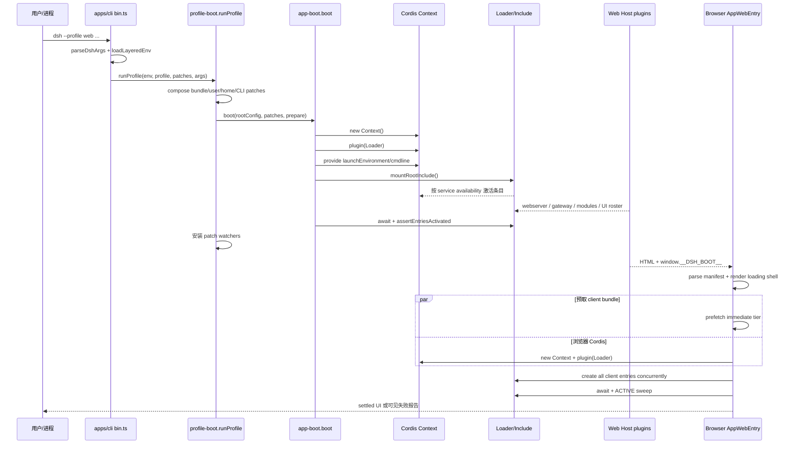
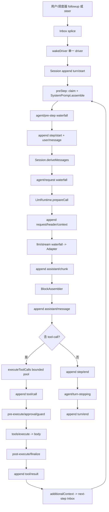

# DeepSeek Harness 源码架构精读

> 精读对象：DeepSeek Harness 官方仓库（shallow clone）  
> 精读日期：2026-08-16（Asia/Shanghai）  
> HEAD：`47f943859bef60e4160492346772ded9b24f765a`

## 提纲

1. 研究方法、版本与阅读边界
2. Monorepo 包结构与分层
3. CLI / Web 启动链
4. Vendored Cordis：Context、Service、Plugin 生命周期、依赖注入与事件
5. Agent Loop 核心状态机
6. Model / Tool / Session / Storage / Sandbox / Scheduler / UI 插件装配
7. Preset 与配置系统
8. 一次 Agent Turn 的端到端数据流
9. 并发模型、取消、错误边界与恢复
10. 测试与构建体系
11. 设计取舍、架构风险与改进建议
12. Mermaid 组件图、启动时序图与 Turn 数据流图
13. 关键路径与符号索引

## 1. 研究方法、版本与阅读边界

本报告基于 `git clone --depth 1 https://github.com/deepseek-ai/deepseek-harness` 得到的工作树，HEAD 为 **`47f943859bef60e4160492346772ded9b24f765a`**。阅读采用“目录扫描 → 符号搜索 → 单文件精读”的方式：先用 `find/tree` 与文本搜索定位入口、服务定义、装配清单和测试配置，再每次只打开一个关键文件；没有把整个仓库、全部 YAML 或全部测试一次性载入。因而本文不是 README 复述，而是从真正执行路径反推系统边界。

仓库本身已经提供大量架构文档，但精读时把源码视为最终事实。特别关注两类容易被文档掩盖的细节：一是 Cordis 的依赖不是简单构造器注入，而是可随服务出现/消失自动重载的 Fiber 生命周期；二是一次 turn 的事实源不是某个可变 conversation 数组，而是 `Session` 的追加事件日志及其 surface 投影。

## 2. Monorepo 包结构与分层

根 `pnpm-workspace.yaml` 显示这是 pnpm 11 工作区，成员包括 `vendor/*`、`packages/*/*`、`native/landlock-run`、`apps/*`、`website`、`examples` 与 Python SDK runtime。根 `package.json` 名为 `@deepseek-ai/dsh-root`，构建面分成 Host 与 Client 两张图：`build:lib:host` 运行 `tsc -b tsconfig.host.json` 加 `tsdown --env.DSH_BUILD_FACE host`，`build:lib:client` 对应 client face，之后 `build:web` 产出浏览器前端。

从目录和依赖方向看，可以把 monorepo 划成六层：

1. **vendored 框架层**：`vendor/cordis` 是上下文、服务、插件、事件和 Fiber 生命周期内核；`vendor/loader`、`vendor/include`、`vendor/group`、`vendor/hmr` 等负责配置树加载。`pnpm-workspace.yaml` 通过 overrides 固定 vendored `cosmokit`、`schemastery`，避免本地构建混入另一份框架单例。
2. **核心领域/协议层**：`packages/core/{agent,agent-loop,session,scope,system-prompt,tools}` 与 `packages/llm/llm` 定义 Agent、事件日志、请求、工具运行时等稳定契约。这里尽量不直接绑定 HTTP、磁盘或 UI。
3. **能力定义与实现层**：典型做法是“定义包 + provider 包”，例如 `sandbox/sandbox` 对应 `sandbox-local`，`session/session-persistence` 对应 JSONL/SQLite，`storage/storage` 对应 JSON/SQLite，`fs/fs` 对应 local/sandbox，`llm/llm` 对应 DeepSeek/pi-ai/retry。实现以 Cordis Service 或插件注册到上下文。
4. **横切扩展层**：`packages/{compaction,context,credentials,guard,hooks,interaction,jobs,mcp,preset,schedule,skill,subagent,workflow,...}` 通过事件、水瀑中间件、工具注册或 prompt section 参与 agent，而不是侵入 loop。
5. **产品装配层**：`packages/bundle/base`、`headless`、`web-app` 的 `cordis.patch.yml` 决定运行时插件图。它们是“可执行架构”，远比一个手写容器文件更重要。
6. **入口与表现层**：`apps/cli` 是 `dsh` 可执行程序；`apps/web` 只有薄浏览器入口。Web 的 Host 插件位于 `packages/host/*`，Client 内核和 UI 插件位于 `packages/client/*`，通过双 face 包与运行时 module table 相接。

这种粒度很细：工作区有大量二级 package，而不是一个 `core` 巨包。优点是契约、provider 和 UI 可以独立发布、测试、裁剪；代价是 package graph、版本同步和“某服务应属于 host plane 还是 agent/preset plane”的认知成本很高。仓库用 `scripts/check-workspace-constraints.ts`、`verify-runtime-closure`、`verify-package-invariants`、`gen-module-graph` 等门禁抵消这种复杂度。

### 2.1 总体组件图

```mermaid
flowchart TB
  CLI[apps/cli\n bin.ts / profile-boot.ts] --> BOOT[packages/boot/app-boot\n boot()]
  BOOT --> CORDIS[vendor/cordis\n Context + Fiber + Events]
  BOOT --> LOADER[vendored Loader/Include/Group]
  LOADER --> BASE[bundle/base patch]
  LOADER --> MODE{profile bundle}
  MODE --> HEADLESS[bundle/headless]
  MODE --> WEBHOST[bundle/web-app Host]

  BASE --> CORE[Agent / AgentLoop / Session / Tools / SystemPrompt]
  BASE --> MODEL[LLM runtime + adapters]
  BASE --> IO[Sandbox / FS / Shell / Jobs]
  BASE --> DURABLE[SessionPersistence JSONL]
  BASE --> EXT[Skills / Goals / Compaction / Subagents / Workflow]

  WEBHOST --> API[Webserver + API Gateway + Connection]
  WEBHOST --> STORAGE[Storage registry + JSON backend/domain]
  WEBHOST --> MODULES[client-modules graph]
  MODULES --> WEB[apps/web AppWebEntry]
  WEB --> UIRUNTIME[Client Runtime]
  WEB --> UIP[UI plugin roster\nconversation/tool/settings/sidebar/...]

  PRESET[AgentPresets standing mounts] --> CORE
  SCHED[Schedule plugin] --> CORE
  CORE --> MODEL
  CORE --> DURABLE
  CORE --> IO
```

## 3. CLI / Web 启动链

### 3.1 CLI：参数分流、profile 合成、Cordis boot

CLI 真入口是 `apps/cli/src/bin.ts`。它调用 `parseDshArgs()`，随后按 mode 动态导入：`profile` 进入 `runProfile()`，`plugin` 进入包管理命令，`dump-config` 输出合成配置。动态 import 使不相关模式不进入启动闭包，也让帮助/版本/解析错误在加载产品图之前结束。

`apps/cli/src/profile-boot.ts#runProfile` 是产品启动的主链：

- `loadLayeredEnv('dsh')` 先冻结启动环境。`packages/boot/app-boot/src/index.ts#loadLayeredEnv` 的优先级是 inherited process > 调用目录 `.env` > `$DSH_HOME/.env`，并拒绝 `.env` 设置 `PATH`、`NODE_OPTIONS`、代理、证书、`DSH_*`、`GIT_*` 等 bootstrap-only 变量，防止项目文件悄悄改变进程加载和网络信任边界。
- `composeProfile()` 读取 profile manifest 的 `dsh.profile.bundles`，按顺序叠加 bundle patches、profile 的 `cordis.patch.yml`、全局 home patch、命令行 `--patch`，最后叠加 telemetry hard-disable。源码用 `structuredClone` 为每次 boot/HMR 生成新对象，避免 Include 对 insert row 的原地修改污染下一代配置。
- `prepareProfile()` 总是重写空的根 `cordis.yml`。真正的树全由 patch 层构成；这样 Loader 的 write-back 不会把已合成条目烘焙进根文件，下一次启动也不会重复插入。
- `runProfile()` 在任何配置条目加载前向 root context `provide` 不可变 launch environment，并通过 `provideCmdline()` 提供参数快照和受控退出函数；然后调用 `app-boot#boot()`。
- 信号处理在启动窗口前就安装：SIGTERM 走正常 0 退出，SIGINT 为 130；两者先 abort 再 `ctx.fiber.dispose()`。`installFailLoud()` 捕获未处理 rejection，最多等待有限时间释放终端/资源，再退出 1。
- 启动后为 profile patch 和 home patch 安装 HMR watcher。即使 Web/headless 禁掉共享模块 HMR，也会按需挂载 timer 与 watch-only HMR，保持配置层热更新。

`packages/boot/app-boot/src/index.ts#boot` 是 Cordis 边界：创建 `new Context()`，设置 `baseUrl` 和 `dshHomePath`，先 `ctx.plugin(Loader)`，再执行 host `prepare`，然后用根 Include 挂载配置树，等待 `ctx.loader.await()`，最后 `assertEntriesActivated()`。任何阶段失败都会先 dispose 部分 context，再保留最深 cause 的原始栈包装为 host preparation 或 plugin tree failure。这里还专门审计“enabled 但没有 fiber”“FAILED”“仍 PENDING 缺服务”的条目，补偿依赖等待本身没有超时的问题。

profile 定义在 `packages/boot/app-boot/src/profile.ts#PROFILE_TEMPLATES`：`web = base + web-app`，`headless = base + headless`。安装内 bundle 优先从运行中的 dsh 安装解析，profile-local 插件次之；`healProfilesModuleFallback()` BFS 扫安装依赖/peer 依赖并维护 `$DSH_HOME/profiles/node_modules` 符号链接，目标是让 out-of-tree 插件和主程序共享同一份 Cordis/Service Definition，而不是出现两个不相认的容器单例。

### 3.2 Web：Host 图生成 manifest，浏览器再启动一棵 Cordis 树

Web 不是 CLI 直接 import React 应用。Host 侧由 `packages/bundle/web-app/cordis.patch.yml` 装配 webserver、API proxy、Cordis host runner、client-modules 等条目。`client-modules` 扫描带 client face 的图，向 HTML 注入 `window.__DSH_BOOT__`，并为 `/plugins/<id>/client.js` 提供模块资源。

浏览器入口 `apps/web/src/main.ts` 仅找到 `#root` 并执行 `new AppWebEntry(el).run()`。真正内核是 `packages/client/web/src/boot.tsx#AppWebEntry`：

1. `parseBootManifest(window.__DSH_BOOT__)` 把 wire manifest 分成 module view 与 plugin view。
2. 构造 `ClientModuleSystem`，静态注册 shell 自有的 app-shell，以及无法“通过自己加载自己”的 modules client half。
3. 立即渲染只依赖 shell 的 loading page；它不 import 任一业务 UI 插件，因此插件失败时仍能显示诊断。
4. 并行预取 `immediately` tier，同时创建浏览器侧 `new Context()` 并挂载 Loader。
5. 在任何 Entry 创建前把 `loader.internal` 指向 module system，禁止浏览器误走 bare dynamic import。
6. 等预取 barrier 后，并发 `loader.create()` modules row、manifest 每个插件 row 和 app-shell row；Cordis 注入决定激活先后，数组顺序不承载语义。
7. `loader.await()` 后完整 sweep：无 fiber 即 import 失败，PENDING 会列出缺失 service，FAILED 直接报错；全部 ACTIVE 才把 settled signal 置为 true，让 `AppRoot` 一次切换到真实 UI。

这个双树模型值得强调：Node Host 有自己的 Cordis root，浏览器 Client 也有自己的 Cordis root；它们不是跨进程共享对象，而是由 API gateway/connection 协议连接，Host 生成 client plugin roster，Client 以同样的 Service/Fiber 机制装配 UI。

### 3.3 启动时序图



## 4. Vendored Cordis：Context、Service、Plugin 与事件

`vendor/cordis/src/context.ts#Context` 不是普通对象，而是由 `ReflectService.handler` 包装的 Proxy。root 构造时建立 isolation/intercept 原型链、root `Fiber`，再安装 reflect、registry、events、logger 四个内建服务。`extend(meta)` 创建原型继承的子 context；`isolate(name,label)` 为某服务切换作用域符号；`intercept(name,config)` 为后代插件叠加该服务的配置。普通 `ctx.foo` 读取最终进入 reflect 的 service resolver，因此“上下文对象”同时是作用域、依赖容器、事件载体和生命周期所有者。

`vendor/cordis/src/service.ts#Service` 的构造器调用 `ctx.reflect.provide(name,this,check)`，服务因此归当前 Fiber 所有，Fiber 卸载时自动撤销。带 `Service.invoke` 的服务还可表现为 callable。`Service.resolveConfig` 沿 intercept 原型链从根到近端合并配置，实现按子树覆写而不污染父容器。

插件入口由 `vendor/cordis/src/registry.ts#Plugin` 定义为函数、class 或 `{apply}` 对象。`RegistryService.plugin()` 解析入口、复用 runtime 元数据并创建一个 `Fiber`；返回值是 thenable wrapper，`await ctx.plugin(X)` 等待其生命周期稳定。`inject` 可为数组或 name→intercept config 映射；`@Inject` 装饰器既能声明 class 依赖，也能让方法延迟到服务可用后执行。

真正的动态依赖注入发生在 `vendor/cordis/src/fiber.ts#Fiber`。状态为 PENDING、LOADING、ACTIVE、FAILED、UNLOADING、DISPOSED。Fiber 根据每个依赖对应 provider fiber uid 拼接 epoch：依赖齐全时 `_reload()`，provider 消失或变更时 `_unload()`，随后若新 epoch 可用再重载。插件返回的 function、Promise、iterable 或 async iterable 被统一解释为 effect/disposer；disposer 逆注册顺序执行，并可被显式 dispose 与父 Fiber teardown 安全 join。配置先经过 `internal/config` waterfall 和 Standard Schema 验证；`update()` 再经过 `internal/update`，允许 HMR 拦截或否决重启。

`vendor/cordis/src/reflect.ts#ReflectService.provide` 用 isolation symbol 存实现，防止同一 realm 重复提供；`notify()` 扫描所有依赖该名字的 fibers，重新检查实现并刷新 epoch。严格 `ctx.get(name)` 只返回 ACTIVE provider；插件直接读取未 inject 服务会得到明确错误，避免隐式时序依赖。

`vendor/cordis/src/events.ts#EventsService` 提供五种语义：`emit` 同步广播；`parallel` 并发并以 AggregateError 汇总；`serial` 顺序 await 且首个有效返回值停止；`bail` 为同步短路；`waterfall` 是 around middleware，每个 listener 必须调用 `next()` 才继续。listener 也是 Fiber effect，随 owner 自动移除，并受 Context filter 约束。内建事件包括 `internal/plugin`、`internal/status`、`internal/service`、`internal/config`、`internal/update`、`internal/get/set` 和 `internal/dispatch`。

这套模型的关键不是“DI 容器帮忙 new 对象”，而是**依赖拓扑就是生命周期状态机**：服务出现使消费者激活，服务撤销使其先清理再等待；配置树、preset 子树和 UI 插件都复用同一规则。风险也在这里：依赖缺失默认永久 PENDING，所以产品 boot 与浏览器 boot 都必须额外 sweep；同步 `emit` 中一个异常可能饿死后续 listener，业务服务如 LLM registry、Session、Tool result 因而自行逐 listener containment。

## 5. Agent Loop：事件溯源驱动的 React 状态机

`packages/core/agent-loop/src/index.ts#AgentLoop` 是 concrete factory，静态注入 `agents/sessions/llm/tools/systemPrompt`。它验证配置和 `maxParallelToolCalls`，安装 settings 热读 getter，注册 factory，并把 provider/model/cwd 作为 prompt variables。`FactoryOwnership` 持有 teardown AbortController、在建任务和 live agent disposer，确保 factory 卸载会等待 create/resume 与 agent 反向清理，而不是留下半发布对象。

每个实例是 `packages/core/agent-loop/src/agent.ts#ReactLoopAgent`。其 phase 只有 idle、maintenance、running；running 携带 turn、step、AbortController 与 wake latch。Inbox 将输入分为 `next-turn` 和 `next-step`：`followup` 开新 turn，`steer` 插入下一 step 并唤醒，`inject` 插入但不唤醒。`wakeDriver()` 保证同一 agent 只有一个 driver；维护任务或已 abort 活动期间的 wake 被锁存，收敛到 idle 后重放。

`turn()` 先持久追加 `turn/start`，然后循环：`preStep()` claim inbox，组装 system prompt 和 runtime context，经 `agent/pre-step` waterfall 决定 enter/reject；进入后追加 `step/start` 与 `user/message`，调用 `step()`，最后无论成功失败都追加 `step/end`，整个 turn 在 finally 中追加 `turn/end`。如果 tool 产生 next-step context 或用户 steer，继续同一 turn 的下一 step；否则 `agent/turn-stopping` 串行钩子结束 turn。仍有 next-turn 输入则换新的 AbortController 继续，否则回 idle。

`step()` 由 session 重新派生全部模型消息，而不是读临时数组。`buildRequest()` 经 `agent/request` waterfall 选择 route，调用 `llm.prepareCall()` 将 adapter、默认 maxTokens/reasoning、retry policy 和 model context 绑定为一次不可漂移的 prepared call；请求 header 或 context 变化会追加 `request/header`、`request/context`。最终 request 深冻结并带 sessionId/signal。

模型 stream 的每个 chunk 先追加 `assistant/chunk`，再喂给 `BlockAssembler`。错误/中止通过 `agent/request-error` 决定 retry；成功则创建完整 `assistant/message`，并用 `sourceEventSeqs` 指向 chunks。无 tool-call 即 completed；达到 token 上限为 max-tokens；有 tool-call 则交给 `executeToolCalls()`，结果是否 `concludesTurn` 决定是否立刻结束。

异常边界非常明确：turn 内将 `LlmError.failure` 保留为结构化 reason，其他错误压平为 UNKNOWN；`throwError()` 先发 `agent/error` 再抛，最外层 `kick()` 吞掉已报告失败，确保一个 agent 的错误不会成为进程级 unhandled rejection。cancel 则 abort 当前活动并按选项清空 inbox，turn/end 记录 aborted reason。

## 6. Model、Tool、Session、Storage、Sandbox、Scheduler、UI 装配

### 6.1 Base bundle 是默认运行平面

`packages/bundle/base/cordis.patch.yml` 一次 insert 默认核心图：`llm`、`sessions`、`agent`、`agent-loop`、`tools`、`system-prompt`；DeepSeek 与 pi-ai adapter；JSONL session persistence；credentials/settings；subprocess、local sandbox、sandbox policy、bash/pwsh sandbox；FS/Shell/Jobs/Skill/Goal/Plan/Compaction/Subagent/Workflow/Web Search 等工具。平台条件用 `!!js process.platform` 禁用不适用的 shell。默认 sandbox policy 为 `workspace-write`，approval 为 `ask`；`danger-full-access` 才映射 `never`。

`packages/llm/llm/src/index.ts#LlmRuntime` 是 adapter registry。`registerAdapter()` 的 route 集合先全量验证再同步 commit，`replace()` 不留路由空窗；`prepareCall()` 将 exact adapter registration 与解析后的配置捆绑；`stream()` 经过 `llm/stream` waterfall，retry/replay 可以包裹终端 adapter。凭证在请求时解析，错误只指出 ref，不回显 key。

`packages/core/tools/src/index.ts#ToolRuntime` 用 scoped layers 合并全局与 agent/preset 注册。它同时支持 native、code、both 呈现；Code Mode 并非另建执行体系，而是把可见工具生成 TypeScript SDK，仅暴露保留 transport `run_code`。执行管线依次为：参数 lossless snapshot → `tools/pre-execute` → approval/guards → `tools/execute` around middleware → tool body → `tools/post-execute` → definition-owned finalizer → 深冻结结果与非否决通知。取消信号会融合 caller 与 wrapper signal；已经启动的 body 必须 drain 到静止，再物化 ABORTED，不能后台泄漏。

`packages/core/session/src/index.ts#Session` 是追加日志。`append()` 在一个递归 snapshot 中验证 lossless JSON、surface metadata 和 sequence 连续性，先计划 surface 转换，再 commit；observer 异常逐个 containment，已接受日志不会回滚。`deriveMessages()` 只遍历 surface nodes，带增量 cache；compaction replace 改 generation 才重建。`SessionStore` 管内存 live 生命周期，持久化故意由插件订阅 `session/event` 异步完成。

`packages/session/session-persistence/src/index.ts#SessionPersistence` 规定 durable append、load/inspect/prepare/readFrom/list/revision。实现必须恢复中断 turn、拒绝未知格式和 committed prefix 腐坏。base 装配 `session-persistence-jsonl`，根为 `$DSH_HOME/sessions`；写路径与热 append 解耦，checkpoint policy 在模型请求等边界要求 durability。

### 6.2 Storage 与 Session Persistence 是两套概念

Web bundle 额外挂载 `packages/storage/storage/src/index.ts#Storage`、`storage-json`、`storage-domain`。Storage 是一般领域文档/键值后端注册体系，用于 Web workspace/settings 等 durable domain；SessionPersistence 专门持有 append-only 会话事件与 header。把两者分开可让 session 保持恢复、seq、turn balancing 等强契约，而不把通用存储抽象污染成“万能数据库”。但同一部署同时有 JSONL sessions、JSON storages、可选 SQLite query/cache，运维者必须理解每份数据的 authoritative owner。

### 6.3 Sandbox 与审批

`packages/sandbox/sandbox/src/index.ts#SandboxProvider` 是命令/文件效果隔离 seam；`sandbox-local` 提供本机实现，`sandbox-policy` 依据 workspace root 与模式作策略判断。真正工具调用还会通过 ToolRuntime 的 pre-execute 与 approval service。即：Sandbox 是机制边界，Permission/Approval 是政策与人工授权边界，二者不能互相替代。base 还把 shell provider、fs-sandbox 和工具插件分开，便于换 E2B/远端 provider。

### 6.4 Scheduler

`packages/schedule/schedule/src/index.ts#apply` 只为加载后新建的 root agents 安装 runtime 与 schedule tools；要求 agents/sessions/tools/sessionPersistence。`ScheduleRuntime` 从 session 中的 `schedule/change` 事件 fold 出 active reminders，定时器最长只 arm 到 Node 的 `2_147_483_647ms`，长等待分段重算 wall clock。触发前先 flush persistence，且只在 agent idle 时通过 `runMaintenance()` 串行占有活动边界；它先 followup reminder，再 append dispatch event，再 flush barrier。coalesced `requestDrive()` 保证同一 runtime 串行，错误通常记录并停止/重试，而日志腐坏会 fault runtime。值得注意：schedule 包不是 base/web patch 的默认 row；它是可组合能力，只有显式装配才生效。

### 6.5 Web UI 插件图

`packages/bundle/web-app/cordis.patch.yml` 在 Host 平面增加 storage、workspace、session projection cache/stats、directory picker、plugin inventory、API gateway、Cordis runners、webserver、client modules/connection。Client roster 则逐项装配 theme、locale、layout、sidebar、settings、conversation、tool renderer、workflow、deliverables、workspace、commands、skill/subagent trigger、jobs、goal、model selection、permission、preset、plan、questions、trajectory 等。

它同时禁用 base 中大量 model-facing tool rows，让每个 session 通过 agent preset 获得能力；而 jobs registry、goal service、token meter、subagent registry 等仍留 Host plane，因为 Host API 或跨 session 查询需要进程单例。这个区分不是“UI 与否”，而是**谁需要在 agent 尚未存在时解析服务，以及服务是否必须跨 session 可见**。

## 7. Preset 与配置系统

profile 与 agent preset 是两级配置。profile 决定整个进程装哪些 bundle；preset 决定某类 agent 看见哪些 model-facing 能力。`profile-boot.ts#composeProfile` 的优先级为 bundle → profile patch → home patch → CLI overlay → telemetry switch，id patch 替换目标 row 的完整 config，不做隐式深合并。

`packages/preset/agent-presets/src/index.ts#AgentPresets` 每次 `list/resolve` 都重扫 roots，使新建或删除的 preset 即时可见；default 可由 settings 热更新，但仅影响以后创建的 session。preset 的 metadata 在 `preset.yml`，实际 Cordis 图在 `agent.cordis.yml`。内置 standard/minimal/code 分别提供完整编码能力、双工具极简能力、通过 Code Mode SDK 呈现的完整能力。

关键机制在 `mount.ts#mountPreset`：同一 preset 只建立 standing mount，agent 通过 scope parent 加入；插件注册只存在一份，而 session 状态仍由各插件按 Agent/Session key 隔离。挂载后审计 `inactiveRows()`，并用 `leakedServices()` 拒绝向 root realm 提供服务的 preset。standard preset 对真正 per-agent 的 planMode、compaction、workflow 使用 `cordis:group + isolate`，而 tools/jobs/goals/subagent registry 等共享服务留在 Host。这套规则能减少每 session 重复实例，但要求作者准确判断 realm；错误不只是功能缺失，也可能是第二个 session 才发生 provider collision。

## 8. 一次 Agent Turn 的端到端数据流



这个流程有三条一致性链：第一，所有模型可见消息都由 session surface 派生；第二，chunk、assistant message、tool call/result 通过 seq 引用保留来源关系；第三，request header 记录实际 adapter 默认值和 prompt/tool schema，使 replay 能重建当时请求形状，而不是只保存最终文本。

## 9. 并发、取消与错误边界

工具并发在 `agent-loop/src/tool-calls.ts#executeToolCalls`。exclusive call 是 barrier；parallel call 进入上限为 `ctx.agentLoop.config.maxParallelToolCalls` 的 rolling pool。prepare、policy、结果 commit 仍按模型顺序，只有 dispatch/body 重叠；每次启动下一 call 前重新读取 execution mode，因此运行中 registry 变化可把后续调用重新分类为 barrier。abort 停止补充新任务，drain 已启动任务，并为未启动 call 写合成错误，保持回放的 call/result 配对。scheduler 内部故障则不伪造结果，等待 in-flight 后抛首个故障。

Agent 层用单 driver + phase 防止同 session 并发 turn；Scheduler 用 maintenance phase 与 idle wait 避免 reminder 插入正在运行的 turn；Cordis Fiber 用 inertia 串行 load/unload；Session append 禁止 observer 重入。LLM adapter route replace 与 registry 更新在同步 section 原子提交。以上不是事务数据库意义的全局锁，而是一组小而明确的 ownership boundary。

失败策略分层：插件启动失败由 boot dispose 整树并保留 cause；单 turn 错误写 `turn/end(error)` 后 containment；工具实现/策略错误物化为 `isError` result，让模型可恢复；observer 错误大多记录并继续；持久化腐坏和 schema/invariant 错误 fail loud。主要剩余风险是：外部 HTTP 的超时/重试依赖 adapter 与 middleware 正确实现；PENDING 本身无超时；异步 emit listener 若没有业务层 containment 可能成为 rejection；取消是 cooperative，恶意或失控工具若忽略 signal，系统只能等待其 settle。

## 10. 测试与构建

根脚本形成多层门禁：`build` 先 Host/Client TypeScript project references 与 tsdown，再 Vite Web；`typecheck`、Oxlint、jscpd、Knip、publint、workspace constraints、package/runtime closure、vendored link、Cordis/config/tool/persistence catalog 生成一致性均独立可跑。`test` 是 Vitest，另有 coverage、snapshot/replay、Web E2E/perf/stress、Windows/Wine、Node compatibility 与打包消费方检查。

`vitest.config.ts` 把普通与 process-bound suites 都放在 fork pool，规避 Node worker thread/CJS lexer 和进程全局状态问题。测试 inventory 覆盖 `packages/*/*/tests`、apps、examples、scripts；Windows 不可用的 bash/landlock 路径显式排除。V8 coverage 对主要 runtime source 设置 per-file 100% 门槛，并用自定义 reporter 输出具体未覆盖位置；但浏览器 UI、动态 host/client 装配、worker/bin、平台专属代码有清单化豁免，由真实 E2E、subprocess 或后续 GUI 债务承担。

从仓库测试名还能看到架构契约被端到端固定：CLI 有 built-bin/headless shutdown/profile HMR；Web 有 chat、steering、queue、approval、preset、plugin config、schedule、replay；agent-loop、Cordis、session persistence 又有细粒度单测。风险是测试矩阵很重，且大量快照可能在结构重构时制造更新噪音；反过来，生成 catalog 与 invariant gate 能防止细包 monorepo 最常见的“源码改了、装配/文档/发布闭包没跟上”。

## 11. 设计取舍与风险判断

1. **事件日志优先于可变会话对象**：可恢复、可审计、可回放，代价是每个新事件必须维护 surface 与版本兼容。
2. **插件图优先于硬编码 composition root**：部署可裁剪、配置可热更，代价是 YAML row、service name 与 plane ownership 形成隐式类型系统。
3. **动态 DI/Fiber 优先于静态启动顺序**：HMR/provider swap 自然，代价是缺依赖会无限 PENDING，必须额外审计。
4. **Host/Agent/Client 三平面**：共享 registry 与 per-agent capability 能并存，Web 可按 session 选择 preset；代价是错误放置一个服务可能只在多 session 或冷 RPC 时暴露。
5. **顺序 commit、并行 body**：工具能并发且日志稳定，代价是慢的早序号调用会阻塞后序号结果提交，形成 head-of-line blocking。
6. **错误物化**：工具错误回到模型提高自愈性；但基础设施/invariant 若也被误物化会隐藏系统故障，因此源码专门区分 scheduler failure、plugin failure 与 ordinary tool failure。
7. **本地 profile 可扩展**：安装依赖 fallback 解决用户目录插件解析；但符号链接、peer closure、多个包管理器和 Windows junction 仍是发布复杂度热点。
8. **安全默认值较稳健但非绝对沙箱**：workspace-write + ask、bootstrap env 拒绝、credential 不回显都正确；local sandbox 的实际强度仍受 OS provider、工具实现和用户切换 danger-full-access 影响。

建议优先持续关注：为 dependency PENDING 加可配置诊断期限；对每个远程 provider 审计 timeout/retry/abort；增加多 preset、多 session、provider HMR 的长期压力测试；将 plane ownership 规则继续机器化；对 session/storage/query 多份持久状态提供统一备份与迁移说明。

## 12. 关键路径与符号索引

- `apps/cli/src/bin.ts`：CLI 顶层 dispatch。
- `apps/cli/src/profile-boot.ts#runProfile`：profile 合成、环境/参数注入、信号、watcher。
- `packages/boot/app-boot/src/index.ts#boot`：root Context、Loader、Include、激活审计。
- `packages/boot/app-boot/src/profile.ts#PROFILE_TEMPLATES/loadProfile`：bundle/profile 解析。
- `packages/client/web/src/boot.tsx#AppWebEntry`：浏览器双阶段 boot。
- `vendor/cordis/src/context.ts#Context`、`service.ts#Service`、`registry.ts#RegistryService`、`fiber.ts#Fiber`、`events.ts#EventsService`、`reflect.ts#ReflectService`：框架核心。
- `packages/core/agent-loop/src/index.ts#AgentLoop`、`agent.ts#ReactLoopAgent`、`tool-calls.ts#executeToolCalls`：agent factory、turn 状态机、并发工具调度。
- `packages/llm/llm/src/index.ts#LlmRuntime`：模型 adapter 与 stream middleware。
- `packages/core/tools/src/index.ts#ToolRuntime`：工具注册、scope、审批与执行管线。
- `packages/core/session/src/index.ts#Session/SessionStore`：事件源与 live store。
- `packages/session/session-persistence/src/index.ts#SessionPersistence`：耐久契约。
- `packages/preset/agent-presets/src/index.ts#AgentPresets` 与 `mount.ts#mountPreset`：standing composition。
- `packages/schedule/schedule/src/runtime.ts#ScheduleRuntime`：durable reminder 投影。
- `packages/bundle/base/cordis.patch.yml`、`web-app/cordis.patch.yml`、`headless/cordis.patch.yml`：最终产品装配事实。

## 13. 结论

DeepSeek Harness 的核心不是“一个调用大模型的 CLI”，而是以 vendored Cordis 为动态微内核、以 Session 追加日志为事实源、以 AgentLoop 为状态机、以 bundle/preset 为 composition language 的插件化 Agent 运行时。最有价值的设计是把生命周期、依赖、作用域、回放和取消都显式编码；最大风险则是同一套灵活性带来的图复杂度。理解本仓库时，应始终从三条线同时追踪：**谁提供/注入服务，谁拥有 Fiber/Scope 生命周期，哪条 Session 事件把结果变成可恢复事实**。

## 14. 深入阅读：从“配置行”到“运行对象”的映射

理解 Harness 最容易犯的错误，是把 `cordis.patch.yml` 当成静态依赖清单。实际上，每个 row 同时描述四个维度：模块身份、配置输入、依赖边界和生命周期归属。`id` 是配置树中的稳定寻址键；`name` 是 Loader 要解析的包或内置插件；`config` 是在 Fiber 激活前经过 schema/intercept 处理的原始输入；`inject` 则声明该 row 只有在服务可见时才有资格执行。配置文件里的先后顺序主要服务于读者和 patch 语义，并不等于构造器调用顺序。

例如 base 的 `llm` row 先于 DeepSeek adapter row 出现，并不表示 adapter 必然在文本顺序上“调用” LLM。实际顺序由 `LlmRuntime` 是否已提供、adapter 是否注入 `llm`、以及 Loader 的 entry activation 共同决定。类似地，`tool-fs` 可以在 `tools` registry 之后被激活，但工具定义注册与 agent loop 的第一步又要等 `systemPrompt`、`sessions` 和 `agents` 具备。这是一种由服务可用性形成的偏序，而不是单一线性启动脚本。

同一 row 的配置也可能在多个层被完整替换。`packages/boot/app-boot/src/profile.ts#composeEntries` 将 bundle、用户层和 overlay 合成后，Include 负责应用 id-targeted patch。`packages/bundle/base/cordis.patch.yml` 特别说明 patch 替换目标 row 的整个 config，不做字段级隐式 merge。因此 web bundle 重述 `session-query-sqlite`、`tools`、`system-prompt` 时必须重新给出该 row 需要的全部配置；这虽然冗长，却避免“某字段到底来自哪一层”的不可见继承。

Profile root 被刻意写成空数组，是另一个重要边界。`apps/cli/src/profile-boot.ts#PROFILE_ROOT_CONFIG` 的文件内容只是 Include 的锚点，让相对模块和 `baseUrl` 有确定位置；真正的 composition 来自 bundles 和 patches。若把已合成树回写进 root，下一次启动会把 bundle insert 再插入一次，产生重复 row 或覆盖顺序漂移。因而 launcher 不仅负责读配置，还负责维护配置的“未物化形态”。

### 14.1 Loader 与 Cordis 的两个粒度

Loader 处理的是 entry tree：它关心 row 是否存在、模块能否 import、条目是否 disabled、配置树如何更新。Cordis 处理的是 fiber tree：它关心插件回调是否激活、依赖服务是否可见、effect 如何释放。一个 Loader entry 可以创建一个根 fiber，并在插件内部再创建子 fiber；所以“Loader await 完成”不自动等价于“业务所有子服务可用”。

这解释了 `app-boot#assertEntriesActivated()` 与 `client/web/boot.tsx#assertEntriesActive()` 的必要性。Loader 可能知道一条 entry 的模块 import 没有立刻抛出，但该 entry 的 fiber 仍然 PENDING；或者 import 失败后只有 entry 没有 fiber。应用层最终必须把这两种状态变成可操作诊断：哪一个 row、处于什么状态、缺哪个服务。没有这层审计，依赖拼写错误就会表现为“启动后页面一直 loading”。

### 14.2 disable、delete 与 isolate 的区别

bundle web 中大量 row 使用 `disabled: true`，而不是直接删除。这是有意保留 composition 的可见性和身份：同一个 id 仍然能被后续 overlay 重新启用，插件目录/配置目录也能知道这个能力在该部署中被显式关闭。删除 row 则会让后来维护者误以为该能力从未属于这个 surface。

`isolate` 也不是 disable 的替代品。disable 意味着不创建该插件；isolate 意味着创建插件，但把它提供的某些 service 放进私有 realm。preset 的 `planMode`、`compaction`、`workflowEngine` 就是后者：它们必须存在，但不能让第二个 preset 或第二个 agent 看到同一个实例。反过来，`goals`、`subagents`、`jobs` registry 需要 Host API 跨 session 读取，因此即使 model-facing tool 在 preset 内，它们的 registry 仍必须在 root/host plane。

## 15. Cordis 生命周期的精确状态转移

可以把 `vendor/cordis/src/fiber.ts#Fiber` 看成一个带依赖门控的可重入组件。插件创建时先处于 PENDING，`RegistryService.plugin()` 为它分配 uid、建立 child Context，并将其声明的 `inject` 归一化。插件 fiber 发布 `internal/plugin` 后，`_checkImpl()` 逐项寻找 service 实现。只有所有依赖实现都存在且通过 availability check，`_refresh()` 才能构造 active epoch。

状态转移的核心是 `_setEpoch()`：依赖 epoch 从 `INACTIVE` 变为某组 provider fiber uid 时，转为 LOADING 并执行 `_reload()`；epoch 变为 `INACTIVE` 时转为 UNLOADING 并执行 `_unload()`；旧加载过程仍在进行时，新状态不会并行执行第二个相同 transition，而是通过 `inertia` 串起来。`_reload()` 在微任务 checkpoint 后再次比较 epoch，防止插件刚准备执行时依赖已经失效；`_unload()` 清理 disposables 后重新检查 epoch，如果期间服务又恢复则立即进入下一轮 reload。

这种设计解决了 HMR 和 provider 替换中的竞态。例如 settings provider 更新了 adapter 配置，adapter Fiber 可以 unload 旧 route、重新注册新 route；依赖该 adapter 的调用方不会在中间拿到一个半初始化对象。`Service` 的 `provide()` disposer 还会调用 `ReflectService.notify()`，等待受影响 fiber 的 await，保证 provider 释放不只是删除一个 map slot，而是先让消费者完成清理。

Fiber effect 接口接受单个 disposer、Promise、同步 iterable 或异步 iterable。同步 generator 很适合“注册 A、注册 B，若后续失败则反向释放已注册项”的事务式启动；异步 generator 则可在资源逐步准备时不断挂入 disposer。`ctx.on()`、`ctx.provide()`、`ctx.accessor()` 和大多数业务注册方法都把自身变成带标签 effect，所以 `fiber.getEffects()` 可以显示 `ctx.on("...")`、`ctx.provide("...")` 之类结构化诊断。

插件回调异常进入 FAILED，错误被 Fiber 持有并由 `await()` 重抛；disposer 异常则被 unload 路径记录，不能因为一个清理失败而阻塞所有其它 disposer。这个取舍偏向“尽量完成 teardown”，但也意味着日志是清理失败的重要可观察性来源。应用层的 `installFailLoud()` 只负责未处理 rejection 的最后防线，并不取代 Fiber 的错误保存。

## 16. Context 代理、service resolution 与依赖注入风险

`vendor/cordis/src/reflect.ts#ReflectService.handler` 对非特殊属性执行三种解析：已存在的普通属性直接读取；声明为 accessor 的属性调用 getter；service 属性则从当前 fiber store 向父链查找。若当前插件声明了该 service 但其 context 不 active，读取会抛出“required service in inactive context”；若插件没有声明 inject，读取会抛出“cannot get property without inject”。后一个限制很重要，它阻止开发者用随意 `ctx.foo` 偷渡隐式依赖。

不过 Harness 有时故意使用 `ctx.get()` 而非静态 `inject`。`ToolRuntime#requireCodeRuntime()` 注释解释了这一点：若把 optional code runtime 放进 static inject，native mode 下所有工具插件都会被一个可选后端拖成 PENDING；改为在 assembly/execute 时 `ctx.get('codeRuntime')`，native mode 可以正常工作，只有真正选择 code mode 时才给出 actionable error。这是“可选能力不应成为强依赖”的一个具体模式。

另一个例子是 `AgentPresets#serviceForAgent()`。host RPC 在 session 已经创建之后才知道具体 agent，因此不能在 host row 的 static injection 阶段注入某个 preset service；它必须拿着 agent identity，通过 standing mount 和 fiber membership 定位该 agent 的 scoped service。这说明静态 inject 适合启动期拓扑，动态 `get` 适合请求期对象寻址，二者混用时必须明确失败语义。

`Context.isolate()` 的作用域以 symbol 表示，子 context 通过原型链继承父 isolation map；同一 label 让调用者加入同一个 realm，而不是自动创建共享实例。`ReflectService.provide()` 在同一 realm 发现已有 provider 就抛错，所以 shared label 不是“允许多次提供”，只是让多个消费者解析同一个 scope key。preset mount 因此用 `leakedServices()` 检测 provider 是否不慎落入 root realm，防止一个 session 的服务变成全进程单例。

## 17. Agent turn 的持久化语义

一次 turn 不只是“发一次请求并等待回复”。`ReactLoopAgent#turn()` 在任何模型调用前先写 `turn/start`，每个 step 写 `step/start`，输入写 `user/message`，模型的流写 `assistant/chunk`，装配后的完整消息写 `assistant/message`，工具调用和结果分别写 `tool/call`/`tool/result`，每个 step finally 写 `step/end`，最后 finally 写 `turn/end`。即使 provider 报错或用户取消，边界事件仍尽力落入日志，恢复代码可以判断最后一个 turn 是否完整。

`Session#append()` 对每个 event 生成连续 seq 和时间，并在进入 log 前冻结数据；surface event 必须声明 `surfaceOp` 和 `sourceEventSeqs`。因此 assistant message 不只是文本，它还指向产生它的 chunks；tool result 指向 tool call；compaction replace 能明确覆盖哪些旧 surface nodes。`deriveMessages()` 不直接按 event 类型简单过滤，而是折叠 surface nodes，得到模型要看的有序 message 数组。

这套结构支持三种恢复：第一，冷启动从 JSONL/SQLite 读取完整 event log；第二，fork 在某个合法 surface boundary 复制前缀；第三，replay 用相同 request header、context 与 replayState 复现模型/工具轨迹。`SessionPersistence#load()` 还负责在最后 turn 中断时补 synthetic closers；但只修复明确的尾部中断，已提交 prefix 腐坏则拒绝，避免“自动修复”改变历史事实。

`requestHeader()` 和 `requestContext()` 是 log fold，不是隐藏 mutable field。AgentLoop 每次 `buildRequest()` 比较当前 route、model、system、tools 和 adapter defaults；发生变化时追加 header change。这样 settings 热更新、preset 切换或模型默认值变化都可被 replay 解释。request 的 `messages` 来自 `session.deriveMessages()`，所以 loop 的 hot path 仍然是日志的函数，而不是另有一份容易漂移的内存 transcript。

## 18. 工具调用调度的顺序与取消协议

`executeToolCalls()` 先把模型的 ToolCallBlock 映射为 PlannedCall，调用 `ctx.tools.executionMode()` 判定 parallel 或 exclusive。parallel 组内部以 rolling pool 填充，`maxParallelToolCalls` 是 deployment setting；但 `prepare()`、policy、approval 和 commit 并不完全并发。这样可以让网络/进程 body 重叠，同时确保 `tool/result` 仍按模型顺序进入 session，UI 和 replay 不会因完成先后产生不同序列。

每个 call 先写 `tool/call`，成功或失败最终写 `tool/result`，并把 result 的 `sourceEventSeqs` 绑定到 call seq。Abort 在 fillPool 或 dispatch 中发生时，已经 start 的 call 必须继续 drain；未 start 的 call 写 `TOOL_ABORTED_BEFORE_DISPATCH` 合成结果。如果 scheduler 自己失败，则保留已经写入的 `tool/call`，但不伪造 result，再由 turn boundary 记录错误。它宁愿让恢复逻辑看到一个需要修复的半步，也不愿把系统调度故障伪装成模型可理解的普通 tool error。

ToolRuntime 另外区分三种拒绝：visible 但在 code mode 中 collapsed 的工具会在 extensible policy 之前拒绝，要求模型改用 `run_code`；真正 unknown tool 走 dispatch 阶段并让 policy listeners 看见；普通 approval denial 则生成 isError 文本，明确说明用户拒绝、approval unavailable 或 cancellation。这样 prompt 与执行器的可见目录保持一致，避免模型被告知一个直接不可调用的工具后收到模糊 UNKNOWN_TOOL。

## 19. Host / Agent / Client plane 的装配规则

Host plane 的判据不是“代码在 Node”，而是是否在 session/agent 存在之前需要服务，或者是否要被多个 session 的 API 共享。`webserver`、`api-gateway`、`plugin-inventory`、`storage-domain`、`goals`、`subagents`、`jobs` registry 具备这一特征。Agent plane 则是模型实际可见的工具、prompt section 和 delegation choice，适合通过 preset standing mount 加入。Client plane 是浏览器的 UI service、slot、view renderer、transport client，由 `window.__DSH_BOOT__` 描述并在浏览器 root 中重建。

`web-app/cordis.patch.yml` 通过 disable base rows 把 `tool-bash`、`tool-fs`、`tool-skill`、`tool-goal`、`tool-subagent` 等 model-facing entry 移出 host composition，再由标准 preset 重新提供。它没有把 `sandbox`、`approval`、`sessionPersistence` 一并移入 preset，因为这些是策略/耐久/跨请求边界。这样每个 session 可选择工具能力，但不可能通过 preset 私自创建另一个持久化 backend 或另一个全局 approval channel。

客户端的 modules row 是特殊双面插件。Node half 扫描 host graph，生成 manifest 并服务 client bundles；browser half 在 Cordis 存在前就必须被 shell 静态打包，等浏览器 Loader 启动后再“adopt”成正式 entry。`AppWebEntry#runPluginBoot()` 把 modules entry 先创建，再并发创建其它 row；同时跳过重复的 modules id，避免两个 provider 同名。这个 handoff 是 Web 启动链中最容易被简单架构图遗漏的环节。

## 20. 测试矩阵反映的架构边界

仓库测试不仅按 package 分组，还按运行边界分组。Cordis、session、LLM、tool pipeline 可在 Vitest 的 Node fork 中测；CLI built-bin 测真正打包入口；Web `assembled-boot`、`shipped-composition` 和大量 e2e 测 host/client graph；process-bound suites 测 JSONL、spawn、PTY、worker thread、时间和外部进程。`vitest.config.ts` 明确把 process-global 与 timing-sensitive 测试从普通 thread-safe 项目分离，说明作者把测试隔离也看成架构约束。

Snapshot/replay 测试尤其重要：模型输出、session JSONL 和 UI markdown 都是同一事件日志在不同边界的投影。比如 `apps/web/tests/snapshots/*/session.jsonl` 固定持久化事实，`ui.expected.md` 固定 UI projection，二者同时变化时才能判断是协议改变还是呈现改变。`test:coverage` 的逐文件 100% 目标对核心 runtime 很严格，但 GUI/dynamic composition 有显式 exemption；这种取舍承认浏览器交互分支的测试成本，同时不放松 Agent/Session/LLM 核心。

生成器和 catalog 门禁也很关键。`verify-cordis-config`、`verify-cordis-catalog`、`verify-tool-catalog`、`verify-persistence-catalog`、`verify-module-graph` 防止“源码新增插件却没有同步装配/文档/代码生成”。对于一个通过 package exports 和双 face 构建的 monorepo，单元测试全绿并不能证明发布产物闭包正确，所以 `build`、`publint`、`verify-runtime-closure` 和 built package tests 必须作为同一验收面。

## 21. 设计风险的优先级评估

**高优先级风险一：PENDING 没有天然超时。** Cordis 的等待依赖是灵活的，但一个拼写错误、被 disable 的 provider 或错误 isolate 可能只留下 PENDING。当前通过启动 sweep 显示缺失服务来 fail loud；对长时间运行中的 HMR、preset reload 或可选 provider，仍应考虑 topology diagnostics、等待期限或依赖图可视化。

**高优先级风险二：取消依赖 cooperative discipline。** Agent、tool scheduler、HTTP adapter、子进程、worker thread 都传递 AbortSignal，但第三方 adapter/tool 可能不及时观察 signal。Harness 已经做到“started body 不丢弃，必须 drain”，这保护了数据一致性，却可能把一个失控调用的延迟暴露给用户。应该为各外部边界分别证明 timeout、强制 kill 或后备策略。

**中优先级风险三：配置图的隐式类型。** `id`、service name、scope name、provider route、client row id 在多个文件中以字符串相连。生成 catalog 和 TypeScript module augmentation 缓解了部分风险，但 YAML typos、错误 plane、错误 isolate 仍可能到运行时才暴露。更强的 config schema 可在 build-time 检查 row identity、inject service 和 bundle ownership。

**中优先级风险四：多种持久化 backend 的运维认知。** session JSONL、session query SQLite、storage JSON/SQLite、projection cache、telemetry/export 各自有 durability 与 recovery 语义。它们分开设计是正确的，但备份、迁移、版本兼容和“哪份是 source of truth”需要在运行时诊断和运维文档中继续强化。

**中优先级风险五：并发 head-of-line blocking。** parallel tool body 可以重叠，但 model-order commit 会等待最早序号的慢 call；这是为了可重放而做的合理牺牲。可考虑在 UI 侧展示已完成但等待提交的状态，或对可交换的纯工具声明更强的 commutativity，而不改变 durable ordering。

**低到中优先级风险六：生态包管理复杂度。** profile module fallback 需要 BFS peer closure、符号链接/junction、安装 anchor 优先级和单 Cordis 实例；这是支持 out-of-tree plugin 的代价。发布测试必须同时覆盖 source、built、packed install 和 profile-local plugin，否则开发环境的 workspace link 可能掩盖最终包缺依赖。

## 22. 精读结论

源码表明 DeepSeek Harness 的最小心智模型应是：

- **Context/Fiber 是动态进程内微内核**：它提供作用域、service、effect、plugin、event，而不是只负责把对象传给构造器。
- **Session 是不可变事实边界**：AgentLoop 的每个可恢复动作都应该变成 event；模型消息只是 surface projection。
- **AgentLoop 是单 owner 状态机**：Inbox、AbortController、maintenance、turn/step boundary 共同阻止一个 session 同时运行两个不相容活动。
- **Bundle 是部署级 composition language**：base/headless/web-app 决定 Host 能力和产品面；preset 决定 Agent 能力和模型提示。
- **Tool/LLM/Storage/Persistence/Sandbox 都是可替换 seam**：定义包提供稳定 vocabulary，provider 包实现机制，Cordis injection 连接两者。
- **Web 是两棵树之间的协议**：Node Host 生成 manifest/API/client roster，浏览器 shell 预取并建立自己的 Cordis client tree。

因此，阅读或修改该仓库时，不能只问“这个函数调用谁”，还必须问四个问题：这个对象由哪一个 Fiber 拥有？它在哪个 isolation realm？它的事实是否进入 Session event log？它属于 Host、Agent 还是 Client plane？沿这四个问题追踪，才能解释源码中的大量 `ctx.get`、standing mount、disabled row、sourceEventSeqs、watch-only HMR 与 containment 代码，而不会把它们误判为偶然复杂度。

## 23. 从源码看一次请求的所有所有权交接

一次来自浏览器的用户消息，首先属于 Client Runtime 的会话控制器，而不是直接属于 React 组件。输入组件把文本包装成协议操作，经 `client-connection` 发送到 Host API；Host 找到对应 session/agent，把它交给 Agent 的 `send()`。从这一刻起，输入同时有两个身份：它是 Inbox 中等待 claim 的 UserMessage，也是将来 `user/message` 事件的候选内容。只有 `preStep()` 接受并进入 step，消息才写入 Session log；如果 pre-step policy reject，它可以只形成 blocked turn，而不伪造一次模型输入。

`Agent` 采用这种延迟写入，避免用户在队列中编辑、取消或 steer 时产生不可撤销的历史。`Inbox.splice()` 负责位置语义，`claim()` 负责 turn 所属关系；`wakeDriver()` 负责调度语义。三者分离意味着“消息已经送达”“消息已被本轮消费”“模型已经看到消息”不是同一个状态。UI 的 queue、steering 和 cancellation 测试正是在验证这些状态不能混淆。

模型请求离开 Harness 前还会经过多次不可变边界。`Session#deriveMessages()` 返回新数组，但共享深冻结 Message；`buildRequest()` 对 seedConfig 做 `structuredClone` 与 `deepFreeze`；`canonicalHeader()` 记录用于下一次比较的请求配置；`markAgentLoopRequest()` 给 loop-built request 加身份标记。`LlmRuntime` 的 `llm/stream` listeners 被允许观察、重放或短路请求，却不应改写 loop request。这个约束让 session log 成为可重建请求的唯一输入，减少中间件偷偷修改消息后 replay 不一致的可能。

模型流回到系统后，Chunk 与完整 AssistantMessage 是两个不同事实。Chunk 是流式 UI 和故障恢复所需的中间证据；AssistantMessage 是 surface 上供下一步模型使用的语义节点。若 stream 在中间 abort，可能只有若干 chunks 而没有完整 message；`deriveMessages()` 不会把孤立 chunk 当成模型历史。若出现 max-tokens，完整 message 可以为空内容但仍由 step 状态和 usage 记录解释，下一步是否继续由 loop 的 sticky max-tokens 逻辑决定。

工具结果同理有执行事实和模型上下文两个层次。`ToolRuntime` 先产生内部 `ToolExecutionResult`，其中可能包含 `additionalContexts`、`meta`、structured error 和 `concludesTurn`；`tool-calls.ts` 再负责按 model order 把它变成 Session event，并把 additional context 放进下一步 Inbox。UI 需要的 diff/card 通过 `meta` 持久化，模型需要的文本通过 `createToolResultMessage()` 进入 surface。把 presentation payload 和 model content 分开，是避免 UI 重放重新执行工具的关键。

## 24. HMR、热配置和运行中拓扑变化

profile patch 热更新不是简单地重新启动进程。`profile-boot.ts#composeLive()` 每代重新读取 profile patch 和 home patch，重新 clone bundle、user、overlay；`watchUserPatches()` 通过 HMR 对 root Include 做 `entry.update()`。更新期间 bundle rows 仍在下方，user layers 重新插入中间，CLI overlay/telemetry 在上方，因此用户修改不能把平台基础能力从 composition 中挤掉。

Cordis 的 `Fiber#update()` 在更新前经过 `internal/update` waterfall。HMR、持久化或插件可以监听这一事件，决定是否保存、改写或否决 config；真正重启时先 unload old effects，再按新 config reload。这样 settings 文档可以热替换 LLM route，Tools settings 可以改变并行上限，Agent preset default 可以影响下一次 session，而不必把所有现有 Agent 迁移到另一种 composition。

源码还明确区分“可热读值”和“只在启动消费一次的配置”。`AgentLoop` 的 `agents` 数组是启动时创建 agent 的 composition，不被 settings 重新解释；`maxParallelToolCalls` 是用户可热改值，所以 service 通过 getter 在每个工具组开始时读取最新上限。`AgentPresets#defaultId` 每次读取 settings，正在运行的 session 保留原 preset，未来 session 才采用新 default。这样的边界避免热配置在中途改变对象身份。

Web bundle 目前禁用共享 module HMR，只保留 launcher 的 config-only watch。源码注释说明 web reload lifecycle 尚未被测试充分，因此不把“能重新加载 JS module”误当成“能安全重建整个客户端图”。这是一个值得肯定的保守取舍：功能少一点，但避免在浏览器仍持有旧 API connection、React tree 和 Fiber disposal 时重复提供服务。

## 25. 错误分类不是装饰，而是数据协议

错误在系统中被分成至少五类。第一类是启动错误：Loader import、schema、plugin activation 或依赖永远不满足，应该中断 boot 并列出 row 与原始栈。第二类是 agent 活动错误：LLM、prompt、session append 或 tool scheduler 在一个 turn 内失败，应该写结构化 turn/end reason、发 agent/error，并让 driver containment。第三类是工具业务错误：参数错误、审批拒绝、工具 body 异常、post-execute block，应变成 `isError` tool result 交给模型，而不是把整个 agent 进程打死。第四类是可观察性错误：telemetry、UI observer、`tools/result` listener 失败，通常只记录警告，不改变已提交事实。第五类是数据完整性错误：session seq 不连续、surface marker 非法、请求 header 不支持或持久化 prefix 腐坏，必须拒绝继续，因为静默修复会制造不可回放历史。

`LlmError` 的 `code`、status、providerRetryAfterMs、requestId 是跨 adapter 的稳定事实；AgentLoop 遇到它时保留 `failure`，而未知 Error 压成 `UNKNOWN`。这让 UI 可以区分 AUTH、RATE_LIMIT、NO_ADAPTER 等错误，也让 retry middleware 能按 machine code 而不是字符串匹配。`ToolRuntime` 对 listener 失败则明确不把 listener 变成结果来源，最终结果在 notify 前已冻结；observer 没有权限修改权威 outcome。

`installFailLoud()` 处理的是 Node 进程级 `unhandledRejection`。它会忽略已经被组装 activation rejection 处理的错误，避免重复报告；当 teardown 已经拥有退出权时吞掉后续 cleanup rejection；释放资源有时间上限，最终仍由明确 exit code 结束。这种“边界兜底”不意味着所有异常都应该 process exit，而是防止错误在跨 fiber、跨 promise 传播时变成无人负责的悬挂状态。

## 26. 可扩展性边界：如何增加一个新能力

如果要增加新的 LLM provider，正确 seam 是实现 `LlmAdapter#stream()`，在插件激活期向 `ctx.llm.registerAdapter()` 注册 route，并实现 provider metadata、model resolution、retry policy 和 credential lookup；不应直接在 AgentLoop 中写 provider 分支。`registerAdapter()` 的 all-or-nothing route validation、atomic replace 与 fiber-owned disposer 会自动处理 duplicate route、HMR 和卸载。

如果要增加新工具，应在定义包提供 tool schema、execute、output renderer、可选 finalizer，再由插件调用 `ctx.tools.register()`。工具不应直接写 Session，也不应绕过 pre-execute/approval/post-execute；loop scheduler 才是把 ToolCallBlock 转为执行输入和 durable call/result 的位置。若工具需要多步模型上下文，用 `deferContext()` 或 additionalContexts，而不是偷偷修改 agent inbox。

如果要增加持久化后端，应实现 `SessionPersistence` 的 create、append、load、inspect、prepare、readFrom、list 和 revision 语义，明确 torn tail、recovery 和 raw artifact 是否支持。不能只实现“写 JSON”就宣称兼容，因为 AgentLoop 依赖 contiguous seq、balanced turn、header metadata 和 append durability。

如果要增加 UI 能力，应分成 Host half 与 Client half。Host half 把 domain 或 Remote 暴露给 API，加入 web bundle 的 host rows；Client half 通过 client package 的 manifest/export 进入 `window.__DSH_BOOT__` roster，在浏览器 root 注册 view、slot、projection 或 settings。不要让 Node Host 直接 import React UI，也不要让浏览器凭空 bare-import 一个未预取的插件。

如果要增加 Agent preset 能力，应先判断它是否是 agent-specific state、host registry 还是部署级策略。需要按 agent 选择的工具/prompt 放进 preset；需要跨 session RPC 查询的 service 留在 host；需要持久化和安全授权的 provider 通常也留在 host。任何在 preset 中 `provide` 的 service 都要有明确 isolate realm，并通过 mount audit 证明不会泄漏到 root。

## 27. 评审源码改动时的检查清单

第一，检查新 service 的 `provide` owner 与 `inject` caller 是否在同一 plane，是否会在 caller 尚未有 agent 时解析。第二，检查新 event 是 `emit`、`parallel`、`serial` 还是 waterfall，listener 失败应该传播、聚合还是 containment。第三，检查 effect disposer 的顺序：先撤销外部通知，再停止活动，再删除 registry entry，还是相反，必须与所有权一致。第四，检查 retry/abort 时是否会重复 append、重复 dispatch 或丢失 sourceEventSeqs。第五，检查 config patch 是完整替换还是有意 merge，是否需要重述默认字段。第六，检查 disabled、isolate、删除 row 之间的语义是否被混用。

第七，涉及 session 的改动要写恢复测试，至少覆盖 cold load、torn tail、open turn、fork boundary、duplicate seq 和 observer throw。第八，涉及工具并发的改动要覆盖 parallel/exclusive reclassification、max cap、abort before dispatch、abort after body start、scheduler failure 和 model-order commit。第九，涉及 Web 的改动要同时验证 host manifest、browser prefetch、client entry activation、loading-page failure report 和 settled UI。第十，涉及包结构的改动要跑 build、runtime closure、publint、catalog/invariant 及 packed install，而不只跑被改包的单测。

## 28. 最终判断

从架构成熟度看，Harness 已经超出“把大模型接到几个工具”的脚本范畴：它有明确的运行时内核、领域契约、事件日志、作用域、持久化恢复、插件装配和前后端双面模型。源码中大量看似防御性的代码，实际上是在解决真实的生命周期问题：Loader 失败后 entry 无 fiber、Fiber PENDING 永不激活、HMR 原地修改 insert、tool abort 后 call/result 不配对、preset subtree write-back 破坏只读组合、Host reader 看不见 agent realm、async observer 不能否决已提交事实。

最佳设计取舍是把不可逆边界放在少数位置：Session append 是事实提交点；Tool result finalize 是工具结果提交点；LLM prepared call 是请求配置提交点；Fiber effect 是资源所有权提交点；profile composition 是部署图提交点。其余流程尽量允许 waterfall、scoped registration、HMR 和 retry 插入。这样既保留扩展性，又让恢复、回放和错误诊断有锚点。

最大风险不是某一个函数写错，而是扩展者误解这些边界：把普通数组当成 session truth、把 `ctx.get` 当成任意依赖逃逸、把 preset 当成全局容器、把 `disabled` 当成删除、把 tool error 当成 process failure、把 process failure 当成 tool result，都会破坏系统的可解释性。后续演进应继续把这些规则转为可机器检查的 catalog、typed config、topology diagnostics 和跨 session stress tests。

本次精读在 HEAD `47f943859bef60e4160492346772ded9b24f765a` 上完成，报告只改写本次要求的 `source-architecture.md`，未修改博客或仓库源码。

## 29. 关键源码的因果链复盘

从 CLI 输入到首次模型回复，可以按因果顺序重新复盘。`bin.ts` 首先只决定调用面，不创建 Agent；`profile-boot.ts` 读取 profile 与 patch，决定哪些插件有机会出现；`app-boot#boot` 创建 root Context，Loader 再把配置行转换成 Entry；Cordis Registry 把 Entry 的插件转换成 Fiber；Fiber 等待 service provider，service active 后才执行插件 callback；agent-loop 在其 callback 中建立 Agent factory，并在 factory 被调用时创建 Session 与 ReactLoopAgent；ReactLoopAgent 的 `kick()` 获得唯一 driver 后，才追加 turn/start 并走 preStep；preStep 通过 systemPrompt 和 tools 注册表决定真正发送给模型的上下文；LlmRuntime 再将配置绑定到 adapter；最后 stream chunks 经 session append 成为可恢复事实。

其中每一层只应该向下一层暴露稳定契约。CLI 不应该知道 HTTP 请求格式；Web shell 不应该知道某个业务工具的实现；AgentLoop 不应该知道 DeepSeek adapter 的 fetch 细节；ToolRuntime 不应该知道 JSONL 如何打开文件；JSONL backend 不应该知道 UI 如何渲染 tool card。这种依赖方向正是 package 拆分的理由，而不是单纯为了目录好看。

反向销毁时因果链相反但不是简单逆序数组。进程 SIGINT 触发 launcher shutdown，root Fiber 开始 dispose；AgentLoop 的 factory ownership 先阻止新 create/resume，abort 正在等待的启动任务，并等待 live agent dispose；Agent driver 停止继续 turn，工具 scheduler drain 已开始任务；Session lifecycle 仍要发布最后事件并让 persistence flush；preset subtree 随 agent scope unwind；Host/Client service 的 effect 逐个撤销；Loader/Include watchers 关闭；最后 telemetry drain 在外层 shutdown deadline 内完成。源码里的很多 `finally` 和 `Promise.allSettled` 都是在实现这条逆向因果链。

### 29.1 为什么 Session 不直接由 AgentLoop 持久化

`SessionStore` 只维护 live Session，`SessionPersistence` 订阅 `session/event` 并异步 flush。这一分离让 AgentLoop 可以测试于纯内存 Session，也让不同后端共享同一事件协议。持久化延迟不会把每个 append 变成同步磁盘 I/O；但 checkpoint policy 会在模型请求和 top-level dispatch 前建立耐久屏障，避免“返回给用户前事实还没落盘”。

这也是为什么 `Session.append()` 对 observer 错误采用 containment：事件一旦通过本地验证并进入 log，就属于 live truth，某个 telemetry 或 persistence listener 的瞬时失败不能让内存 log 回滚。后端需要通过 coordinator、revision、flush 和 recovery 追赶该事实；如果追赶失败，要在 durable boundary 报告，而不是篡改已接受的 seq。

### 29.2 为什么 AgentPreset 不复制插件树

如果每个 session 都重新加载完整 standard preset，工具注册、prompt section、projection unit 和 provider setup 会按 session 数量复制，启动成本和冲突概率都会增长。standing mount 只建立一次 composition，再让 agent scope parent 指向 standing scope；插件内部用 Agent/Session key 存储业务状态，达到“代码实例共享、业务状态隔离”。

这个选择把困难从实例数量转移到作用域正确性：插件作者必须知道哪些注册是 per-scope，哪些是 process singleton；mount 必须阻止 root realm 泄漏；Host RPC 不能直接依赖 agent-private context。`mount.ts` 的 `withinFiber()`、`leakedServices()`、`serviceForAgent()` 正是这种共享装配的安全护栏。

### 29.3 为什么 Code Mode 是工具呈现而不是新 Agent

`ToolRuntime` 的 mode 配置改变的是 model-facing schema 和执行入口，而 AgentLoop、Session、approval、scheduler 仍是同一套。code mode 下原工具 schema 被生成 SDK 说明，模型直接调用 `run_code`，程序内部再组合可见工具；native mode 则直接暴露工具；both mode 同时保留两者。这种设计让同一 Session event vocabulary 继续记录 tool/call 和 tool/result，UI、replay、权限和取消不需要另建协议。

代价是 mode 影响 prompt 与 registry visibility，必须保证 collapse policy、SDK renderer 和执行器使用同一 predicate。源码专门强调 prompt 中“只能调用 run_code”的说明必须与执行器真正拒绝 native call 的逻辑一致，否则模型收到的工具目录与执行结果会互相矛盾。

## 30. 对未来维护者的阅读建议

先读 `packages/bundle/base/cordis.patch.yml`，建立产品实际装配清单；再读 `vendor/cordis/src/fiber.ts`、`reflect.ts` 和 `events.ts`，理解 service visibility 与 cleanup；随后读 `Session#append/deriveMessages` 和 `ReactLoopAgent#turn/step/buildRequest`，把持久事实和模型循环连起来；最后读 `web-app` patch、`AppWebEntry` 和 `agent-presets/mount.ts`，理解 Host/Client 与 standing scope。不要从某个 UI 组件开始，因为 UI 只是最终投影，无法解释数据和生命周期从何处来。

遇到新插件时，先定位它是 Service Definition、Provider、Tool、Prompt Section、Remote、Client View 还是 Composition row；再沿 `provide`、`inject`、`ctx.on`、`ctx.effect`、`session.append` 搜索调用方和 owner。遇到 bug 时，优先问是“事实未写入”“事实写入但 projection 未更新”“provider 未 active”“Fiber 未释放”“plane 不可见”还是“错误被错误分类”。这些问题比单纯查看异常栈更快定位架构层。

源码精读的最终产物不应只是包名列表，而应能回答一次具体事件：一个用户输入在何时从浏览器协议成为 Inbox；在何时被 claim 并写入 Session；哪些 prompt section 与 tools layer 参与；哪个 adapter 绑定 route；哪一条 Fiber 拥有 session、tool 和 listener；模型 chunk 如何成为 assistant surface；工具并发如何按序提交；取消如何形成 durable error；UI 如何从 Host projection 和 Client event registry 重建。这份因果说明就是 Harness 的真正架构。

## 31. 架构阅读的最后摘要

这份源码体现的是一种“可恢复的插件运行时”而不是普通应用框架。可恢复性来自事件日志、连续序号、surface 来源引用、请求头折叠和持久化 revision；插件性来自 Context、Service、Fiber、Loader、Include 与 patch；可组合性来自 profile bundle、agent preset、scope parent 和 isolation realm；安全性来自 bootstrap 环境限制、凭证引用、sandbox policy、approval、工具取消和错误分类；前后端可演进性来自 Host/Client 双 face、manifest、API gateway 和 UI projection。

在 monorepo 层面，定义包和实现包分离，使运行时可以替换模型、文件、shell、sandbox、storage、session persistence 和 search provider；在 Cordis 层面，依赖可出现、消失和重载，使 HMR、可选后端和 preset mount 不必写成巨大的静态启动顺序；在 Agent 层面，单 driver、Inbox、turn/step 边界和 AbortSignal 把人类输入、模型流、工具执行和调度器放进同一个可追踪状态机；在 Web 层面，loading shell、预取 barrier、client manifest 和全量 ACTIVE sweep 让插件失败仍然能被用户看见。

因此，对风险的判断也应保持分层。配置错误首先是 Loader/依赖拓扑问题；模型错误是 LLM failure 与 turn reason 问题；工具错误是 materialized result 问题；持久化错误是 append/recovery/revision 问题；UI 错误是 projection/transport 问题。若把所有错误都压成一个 Error，系统会失去恢复方向；若把所有能力都放入一个 root scope，系统会失去隔离方向；若把所有数据都存成一份可变 conversation，系统会失去重放方向。

最终可以用一句话概括源码取舍：**Harness 把扩展自由度放在插件图和事件中，把一致性要求收紧在 Fiber ownership、Session append、工具结果提交、请求 header 和平面边界上。** 只要新增代码尊重这些提交点与所有权，系统可以继续扩展；一旦绕过它们，即使局部测试通过，也可能在 HMR、取消、重启、多 session、replay 或打包环境中失败。
